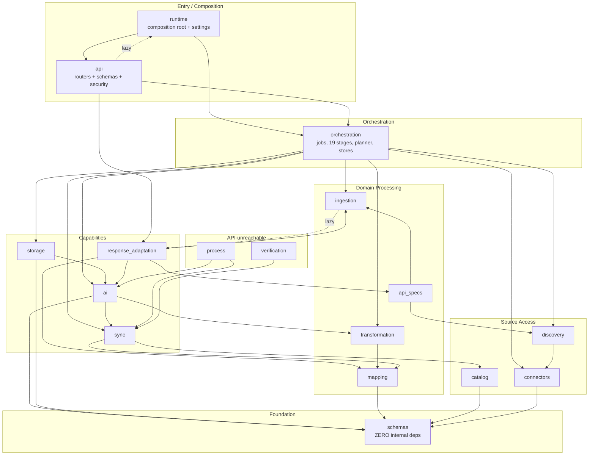
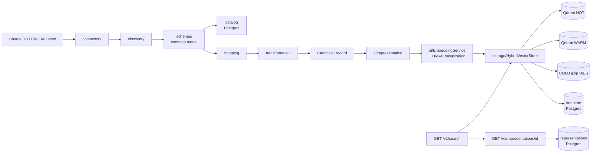

# FULL CODEBASE STRUCTURE AUDIT

**Project:** ERP-Aware Multimodal Data Transformation, Vector Indexing and Retrieval Pipeline
**Public service name:** ERP Data Transformation API
**Repository:** `C:\research\erp-data-transformation-pipeline`
**Audit date:** 2026-08-31
**Audit type:** READ-ONLY. No code was modified, deleted, moved, formatted or generated. Nothing was deployed.
**Source of truth:** the current working tree. Existing documentation was *not* trusted; every statement below was verified against code, generated OpenAPI, or a live probe.

---

## 1. EXECUTIVE SUMMARY

### What this system is

A Python 3.13 / FastAPI service that ingests structured and unstructured ERP data from heterogeneous sources (PostgreSQL, MySQL, SQL Server, MongoDB, CSV, PDF, images, OpenAPI/Postman specs), normalizes it through a common data model, produces AI-ready text representations, embeds them locally with `all-MiniLM-L6-v2` (384-D, **zero LLM calls**), stores vectors in a hybrid HOT/WARM/COLD tiered architecture, and serves identity-aware retrieval through a single `GET /v1/search` endpoint.

### Scale

| Metric | Value |
|---|---|
| Source packages | 18 |
| Source files (`.py`) | 195 |
| Source LOC | ~68,500 |
| Test files | 172 |
| Test LOC | ~61,900 |
| Tests collected | **3,890** |
| Last verified run | **3,851 passed / 39 skipped / 0 failed / 0 errors** |
| API operations | **25** (local spec == deployed spec, verified byte-for-byte) |
| PostgreSQL schemas owned | 5 |
| Qdrant collections | 2 (+ filesystem COLD archive) |

### Overall assessment

The codebase is **unusually disciplined for a research project**. Evidence:

- A near-total absence of dead code. An AST sweep of every module-level definition found exactly **one** genuinely unreferenced function (`_probe`). Every other "unreferenced" symbol is either a FastAPI decorator-registered handler or a nested Pydantic model.
- `schemas/` has **zero outgoing internal dependencies** — a genuine foundation layer, not an aspirational one.
- Store abstractions are consistently paired (`InMemory*` / `Postgres*`) behind Protocols.
- Comments explain *why*, and repeatedly document deliberate limitations rather than hiding them.

However, the audit found **one critical security issue** and **one high-severity correctness gap** that are not reflected in any existing documentation.

### Findings requiring attention

| # | Severity | Finding |
|---|---|---|
| 1 | **CRITICAL** | `.azure-oldkey` — a 46-byte secret-shaped token — is **committed to git** (commit `020debd`). It is the only `.azure-*` file missing from `.gitignore`. |
| 2 | **HIGH** | The document **lifecycle registry is not wired in production**. `run_lifecycle_commit` is a permanent no-op on the deployed service; superseded documents stay searchable. No durable implementation exists. |
| 3 | MEDIUM | `process/` and `verification/` (3,017 LOC) are unreachable from the API — reachable only from tests and one demo script. |
| 4 | MEDIUM | Two package-level import cycles (`api ↔ runtime`, `ingestion ↔ response_adaptation`), both currently survivable only because one leg is a lazy in-function import. |
| 5 | MEDIUM | `response_adaptation/detector.py` imports the **private** `_SIGNATURES` constant across a package boundary. |
| 6 | MEDIUM | No CI/CD and no Infrastructure-as-Code anywhere in the repository. All deployment is manual CLI. |
| 7 | LOW | WARM tier holds 0 points and lacks dynamic-field payload indexes; correctness currently depends on an empty-tier skip added 2026-08-31. |

---

## 2. COMPLETE FOLDER TREE

```
erp-data-transformation-pipeline/
├── src/erp_pipeline/            # THE APPLICATION (195 files, ~68.5k LOC)
│   ├── __init__.py              # package docstring / package map
│   ├── version.py
│   ├── schemas/         (12f, 3942)  ← FOUNDATION: no internal deps
│   ├── connectors/      (11f, 1626)  ← source DB connectivity
│   ├── discovery/       ( 9f, 3753)  ← schema discovery + Mongo inference
│   ├── catalog/         ( 8f, 2458)  ← persisted schema catalog (Postgres)
│   ├── mapping/         (12f, 4359)  ← explainable field mapping engine
│   ├── transformation/  (11f, 5318)  ← canonical + source-native transform
│   ├── ingestion/       (15f, 5308)  ← CSV / PDF / image / BLOB / remote assets
│   ├── api_specs/       (11f, 5283)  ← OpenAPI + Postman parsing (contracts only)
│   ├── ai/              (14f, 3541)  ← representation, chunking, embedding
│   ├── storage/         (18f, 7154)  ← HOT/WARM/COLD, routing, filters, state
│   ├── sync/            (11f, 4387)  ← incremental sync, drift, propagation
│   ├── orchestration/   (20f, 7628)  ← jobs, stages, planner, stores, secrets
│   ├── response_adaptation/(10f,4710) ← Phase 14 ERP response → LLM context
│   ├── runtime/         ( 7f, 1978)  ← COMPOSITION ROOT + settings
│   ├── api/             (11f, 4109)  ← FastAPI routers + schemas + security
│   ├── process/         ( 7f, 1724)  ← ⚠ event-log → process cases (API-unreachable)
│   └── verification/    ( 6f, 1293)  ← ⚠ cross-store integrity (API-unreachable)
│
├── tests/               (172f, ~61.9k LOC, 3890 tests)
│   ├── conftest.py                     # root fixtures
│   └── erp_pipeline/<mirrors src>/     # + integration/ (8f) which src has no peer for
│
├── scripts/             (15 files)     # evaluation harnesses + demos
│   ├── evaluate_phase{3..12}_*.py      # research evaluation, write artifacts/*.json
│   ├── run_phase12_benchmark.py
│   ├── run_phase14_response_adaptation_evaluation.py
│   ├── setup_mongodb_viva_demo.py      # seeds the local Mongo demo
│   ├── verify_mongodb_end_to_end.py    # 14-check live harness
│   └── demos/run_bpi2020_demo.py       # ⚠ only consumer of process/ + verification/
│
├── docs/                (43 files)     # phase design docs + handoff/audit reports
│   ├── architecture/    (3)            # consolidation / stabilization / phase14
│   └── history/         (1)            # archived 2026-08-18 audit
│
├── artifacts/           (14 JSON)      # evaluation evidence + phase13_openapi.json
├── frontend/            (18 files)     # Vite + React + TS; upload-only demo UI
├── examples/bpi2020/    (1 JSON)       # event-log column config (data, not code)
├── data/                              # ⚠ gitignored datasets (bpi2020/, raw/)
├── var/                               # ⚠ gitignored runtime state
├── Dockerfile                         # production container (deployment-only)
├── .dockerignore                      # build-context exclusions
├── requirements.txt                   # dependency source of truth
├── pyproject.toml                     # packaging + pytest config
├── README.md
├── IT22267290_*.md      (4 root docs)  # prior audits/compliance reports
└── .env / .env.azure / .azure-*        # ⚠ SECRETS — see §11
```

**Absent (verified, not assumed):** `.github/`, `.gitlab-ci.yml`, `azure-pipelines.yml`, `Jenkinsfile`, `*.bicep`, `docker-compose*`, `migrations/`. There is **no CI/CD and no IaC** in this repository.

### 2.1 Folder classification

| Path | Purpose | Status |
|---|---|---|
| `src/erp_pipeline/` | The application | **ACTIVE / CORE** |
| `src/erp_pipeline/process/` | Event log → process cases → observed process models | **ACTIVE but API-UNREACHABLE** — only `scripts/demos/run_bpi2020_demo.py` + 4 test files import it |
| `src/erp_pipeline/verification/` | Cross-store integrity (records ↔ tier state ↔ vectors) | **ACTIVE but API-UNREACHABLE** — same consumers |
| `tests/` | 3,890 tests | **ACTIVE / TEST-ONLY** |
| `tests/erp_pipeline/integration/` | Phase 11 four-member contract tests | **ACTIVE / TEST-ONLY** (no `src/` peer package) |
| `scripts/` | Research evaluation harnesses | **ACTIVE / SUPPORTING** — not imported by `src/` |
| `scripts/demos/run_bpi2020_demo.py` | BPI2020 dataset demo | **LEGACY-ADJACENT** — the BPI *prototype* was removed in commits `c27ff04`/`83d9152`/`36d4c81`; this script survives as the sole consumer of `process/` and `verification/` |
| `docs/` | 43 markdown design/handoff docs | **DOCUMENTATION** — partially stale (see §14) |
| `artifacts/` | Evaluation JSON evidence | **GENERATED** — re-includable via `.gitignore` exception |
| `frontend/` | Upload-only React demo UI | **ACTIVE / SUPPORTING** — calls only 2 of 25 endpoints |
| `examples/` | Dataset configuration | **CONFIG** |
| `data/` | BPI2020 + raw datasets | **GENERATED / GITIGNORED** |
| `var/` | uploads, cold-archive, demo dirs | **RUNTIME STATE / GITIGNORED** |
| `var/pytest-readme-verify-20260818-0028` | Permission-locked test debris | **DEAD — blocks `az acr build .`** (see §13) |
| `Dockerfile`, `.dockerignore` | Container build | **DEPLOYMENT** |
| `.claude/settings.local.json` | Local tool config | **CONFIG** |

---

## 3. APPLICATION ENTRY POINTS

There are **four** real entry points. All production paths converge on `runtime/application.py`.

### 3.1 Startup trace (production)

```
python -m erp_pipeline.api                     [Docker CMD]
  └─ api/__main__.py:11        → runtime.application.run()
      └─ runtime/application.py:106  run()
          ├─ RuntimeSettings.from_environment()      # settings.py:401
          │   ├─ _load_project_env()                 # loads .env
          │   ├─ ApiSettings.from_environment()      # api/config.py:52
          │   ├─ DatabaseSettings.from_environment() # PIPELINE_DB_* → AI_DB_* fallback
          │   ├─ QdrantSettings.from_environment()   # + .validate() fail-closed
          │   ├─ ColdSettings.from_environment()
          │   └─ StorageLocationSettings             # inferred from ERP_QDRANT_MODE
          ├─ settings.require_valid()                # refuses to boot on bad config
          └─ create_production_app()                 # application.py:21
              ├─ build_pipeline_engine(db)           # runtime/database.py
              ├─ bootstrap_all(engine)               # runtime/bootstrap.py:78
              │   └─ creates 5 schemas (§7.1)
              ├─ bootstrap_runtime_persistence(engine)
              ├─ build_production_services()         # runtime/services.py
              │   ├─ PostgresSourceRegistry / PostgresUploadStore / PostgresMappingDraftStore
              │   ├─ EnvironmentSecretProvider()     # never NullSecretProvider
              │   ├─ SchemaCatalogService(CatalogRepository(engine))
              │   ├─ _LazyEmbeddingService()         # model NOT loaded here
              │   ├─ build_storage_service()         # Qdrant HOT/WARM + COLD + policy
              │   └─ build_sync_service()
              ├─ OrchestrationService(
              │       job_store=PostgresJobStore,    # durable
              │       executor=JobExecutor(workers)) # thread pool
              └─ create_app()                        # api/main.py:71
                  ├─ FastAPI(lifespan=…)
                  ├─ CORSMiddleware (only if origins configured)
                  ├─ @app.middleware("http") request_context  ← API-KEY ENFORCEMENT
                  ├─ 3 exception handlers (OrchestrationError / Exception / Validation)
                  ├─ include_router × 12
                  └─ _describe_api_key_security()    # OpenAPI scheme, derived from requires_key()
      → lifespan startup: recover_interrupted_jobs()  # dead-process jobs → INTERRUPTED
      → uvicorn.run(host, port)
      → API READY
```

### 3.2 All entry points

| Entry point | File | Purpose | Status |
|---|---|---|---|
| `python -m erp_pipeline.api` | `api/__main__.py` | Container CMD; production | **PRIMARY** |
| `uvicorn erp_pipeline.runtime.application:app` | `runtime/application.py:103` | ASGI target; `_LazyApp` builds on first request | **PRIMARY (alt)** |
| `erp-api` console script | `pyproject.toml` → `runtime.application:run` | Installed CLI | ACTIVE |
| `erp-bootstrap` console script | `pyproject.toml` → `runtime.bootstrap:main` | Schema creation only | ACTIVE |
| `create_app()` | `api/main.py:71` | **Test/dev factory** — services injected, nothing heavy | ACTIVE |
| `build_services()` | `api/main.py:320` | Dev service assembly; **wires `InMemoryLifecycleRegistry`** | ACTIVE |
| `JobExecutor` | `orchestration/executor.py` | Background thread-pool job worker | ACTIVE |
| `SyncScheduler` | `orchestration/scheduler.py` (573 LOC, Postgres lease) | Polling sync worker | ACTIVE, opt-in |
| `scripts/*.py` | 15 scripts | Evaluation / demo | SUPPORTING |

**Migrations:** there is no migration framework (no Alembic, no `migrations/`). Schema creation is idempotent `CREATE SCHEMA IF NOT EXISTS` + SQLAlchemy `create_all` via `bootstrap_all()`, gated by `ERP_BOOTSTRAP_ON_STARTUP`. **There is no schema *evolution* mechanism** — see §15.

---

## 4. API ROUTE AUDIT

**25 operations.** Generated from the current code and diffed against the live deployed `/openapi.json` — **identical, zero drift**.

Auth column = `requires_key(method, path, protect_reads=True)`, the single function that both the middleware and the OpenAPI generator consult.

### health (2) — `api/routers.py`
| Method | Path | Handler | Response | Auth | Postgres | Qdrant | Cold |
|---|---|---|---|---|---|---|---|
| GET | `/v1/health/live` | `health_live` | `HealthResponse` | **No** (public) | – | – | – |
| GET | `/v1/health/ready` | `health_ready` | `ReadinessResponse` | **No** (public) | `SELECT 1` | `.health()` | key presence |

### capabilities (1) — `api/routers.py`
| GET | `/v1/capabilities` | `capabilities` | `CapabilitiesResponse` | Yes | – | – | – |

Reports 13 `integration_capabilities`, each `enabled` derived from actual wiring — never a constant.

### sources (5) — `api/routers.py`
| Method | Path | Handler | Request | Response | Writes |
|---|---|---|---|---|---|
| POST | `/v1/sources` | `create_source` | `SourceCreate` | `SourceResponse` | PG (`erp_runtime`) + secret provider |
| GET | `/v1/sources` | `list_sources` | – | `list[SourceResponse]` | read |
| GET | `/v1/sources/{source_id}` | `get_source` | – | `SourceResponse` | read |
| POST | `/v1/sources/{id}/test` | `test_source` | – | `ConnectionTestResponse` | connects to **source** DB |
| POST | `/v1/sources/{id}/discover` | `discover_source` | – | `DiscoveryResponse` | PG catalog write + **submits schema job → Qdrant** |

### files (2) — `api/routers_data.py`
| POST | `/v1/files/csv` | `upload_csv` | multipart | `CsvUploadResponse` (201) | infers schema → catalog → **indexes SCHEMA only** |
| POST | `/v1/files/documents` | `upload_document` | multipart + 7 optional identity form fields | `DocumentUploadResponse` (201) | **auto-submits `document_pipeline` job** |

### api-specs (2) — `api/routers_data.py`
| POST | `/v1/api-specs/openapi` | `upload_openapi` | multipart | `ApiSpecUploadResponse` (201) |
| POST | `/v1/api-specs/postman` | `upload_postman` | multipart | `ApiSpecUploadResponse` (201) |

Both parse **as contracts**; documented endpoints are never called. `endpoints_called: 0` is in the response so the boundary is visible rather than merely promised.

### schemas (1)
| GET | `/v1/schemas/{schema_id}` | `get_schema` | `SchemaResponse` | reads cache → catalog |

### mappings (3)
| POST | `/v1/mappings/suggest` | `suggest_mapping` | `MappingSuggestRequest` | `MappingResponse` |
| PUT | `/v1/mappings/{mapping_id}` | `update_mapping` | `MappingUpdateRequest` | `MappingResponse` |
| POST | `/v1/mappings/{mapping_id}/validate` | `validate_mapping` | – | `MappingValidationResponse` |

### jobs (4)
| POST | `/v1/jobs` | `create_job` | `JobCreateRequest` | `JobAcceptedResponse` (**202**) |
| GET | `/v1/jobs` | `list_jobs` | – | `list[JobResponse]` |
| GET | `/v1/jobs/{job_id}` | `get_job` | – | `JobResponse` |
| POST | `/v1/jobs/{job_id}/retry` | `retry_job` | – | `JobAcceptedResponse` (202) |

### search (2) — `api/routers_data.py`
| GET | `/v1/search` | `search_get` | query params | **`SearchMetadataResponse \| SearchResponse`** | Qdrant HOT+WARM |
| POST | `/v1/search` | `search_post` | `SearchRequest` | `SearchResponse` | **DEPRECATED** (`deprecated: true`) |

### records / representations (2)
| GET | `/v1/records/{record_id:path}` | `get_record` | `RecordResponse` | business values only |
| GET | `/v1/representations/{representation_id:path}` | `get_representation` | `RepresentationResponse` | **the only endpoint that returns representation TEXT** |

### responses (1) — `api/routers_adaptation.py`
| POST | `/v1/responses/adapt` | `adapt_response` | `ResponseAdaptRequest` | `ResponseAdaptResponse` | **no DB, no Qdrant, no model** |

### 4.1 Route anomalies

| Category | Finding |
|---|---|
| **Deprecated** | `POST /v1/search` — flagged `deprecated: true`, retained deliberately for existing clients; enforces the *same* identity boundary as GET |
| **Duplicate** | None. `GET`/`POST /v1/search` share `_execute_search`; the only divergence is mode selection |
| **Documented but not implemented** | **`GET /v1/search/schema`** appears in `artifacts/phase13_openapi.json` (line 3974) and in `docs/` prose. It was **removed from the code**; the live service returns **404** with a valid key. The artifact is a stale snapshot. |
| **Implemented but missing from docs** | `POST /v1/responses/adapt` is absent from several older handoff docs |
| **Unused by any client** | 23 of 25 — the bundled frontend calls only `/v1/files/csv` and `/v1/files/documents` |
| **Path converters** | `records` and `representations` use `{...:path}` — required, not decorative: representation ids contain `:` and `.` |

---

## 5. MODULE ARCHITECTURE

| Module | Responsibility | Upstream (imports) | Downstream (imported by) |
|---|---|---|---|
| `schemas` | Frozen contracts: canonical/source models, 12 enums, identity, sensitivity, **HMAC filter tokenization** | **NONE** | everything |
| `connectors` | 4 DB connectors + registry + `ConnectionSettings` | schemas | discovery, orchestration, api |
| `discovery` | Relational catalog reflection; MongoDB **bounded observed inference** | connectors, schemas | api_specs, orchestration |
| `catalog` | Persisted schema snapshots, versioning, diffing (Postgres `erp_catalog`) | schemas | sync, runtime |
| `mapping` | Explainable field→canonical mapping, scoring, aliases, coverage | schemas | transformation, sync, response_adaptation |
| `transformation` | Canonical + **source-native** transformation, type conversion, validation | mapping, schemas | ai, orchestration, response_adaptation |
| `ingestion` | CSV/PDF/image/BLOB/remote-asset ingestion, detection, OCR, safety | response_adaptation (lazy), schemas | api_specs, orchestration, response_adaptation |
| `api_specs` | OpenAPI 3 / Swagger 2 / Postman parsing → SourceSchema | discovery, ingestion, schemas | api, response_adaptation, runtime |
| `ai` | Representation building, chunking, **EmbeddingService (token chokepoint)**, vector models | schemas, sync, transformation | storage, orchestration, process |
| `storage` | HOT/WARM/COLD tiers, `HybridVectorStore`, routing policy, filters, payload indexes, tier state | ai, schemas | orchestration, runtime, api |
| `sync` | Watermarks, drift detection, change extraction, propagation | catalog, mapping, schemas, transformation | ai, orchestration, verification, process |
| `orchestration` | **Jobs, 19 stages, planner, executor, stores, secrets, lifecycle, multimodal** | ai, connectors, discovery, ingestion, schemas, storage, sync, transformation | api, runtime |
| `response_adaptation` | Phase 14: ERP API response → LLM-ready context | ai, api_specs, ingestion, mapping, schemas, transformation | api, ingestion (lazy) |
| `runtime` | **Composition root**, settings, bootstrap, Postgres persistence | ai, api, api_specs, catalog, ingestion, mapping, orchestration, schemas, storage, sync, transformation | api (lazy) |
| `api` | FastAPI routers, request/response models, security | 11 packages | runtime |
| `process` | ⚠ Event normalization → case building → process models | ai, schemas, sync | **nothing in `src/`** |
| `verification` | ⚠ Cross-store integrity, record integrity | schemas, sync | **nothing in `src/`** |

---

## 6. DATA FLOW TRACING

### A. PostgreSQL source registration → Qdrant

```
POST /v1/sources
  api/routers.py:351  create_source()
    ├─ orchestration/sources.py:32  normalize_source_id(name)      # lowercase, ≤63 chars
    ├─ secrets.put(credential_ref, password)                       # password dropped immediately
    └─ SourceRegistry.register()                → PG erp_runtime.registered_sources

POST /v1/sources/{id}/test
  api/routers.py  test_source()
    └─ ConnectorRegistry.create(settings)       # connectors/registry.py:58
        └─ PostgreSQLConnector.test_connection()  → capabilities + server_version

POST /v1/sources/{id}/discover
  api/routers.py:466  discover_source()
    ├─ PipelineServices.discover_schema()       # orchestration/service.py:278
    │   ├─ source.connection_settings(secrets)  # resolves ERP_SECRET_<REF>
    │   ├─ ConnectorRegistry.create(settings)   ← relational branch (fixed 2026-08-30)
    │   ├─ RelationalDiscoveryService().discover(connector)   # discovery/service.py:44
    │   │   └─ RelationalSchemaDiscovery.discover()           # discovery/relational.py:74
    │   ├─ connector.close()                    # finally
    │   ├─ schema_cache[schema_id] = schema     # in-process
    │   └─ _publish_discovered_schema()         → PG erp_catalog.*
    └─ OrchestrationService.index_schema()      → SCHEMA_PIPELINE job

POST /v1/jobs {job_type: source_native_pipeline, entity: hr.employees}
  planner.py:180  SOURCE_NATIVE_TAIL
  stages.py:
    DISCOVER              run_discover
    SOURCE_NATIVE_GUARD   run_source_native_guard   # refuses if a canonical entity claims it
    EXTRACT               run_extract → extraction.py extractor_for(source_type)
    TRANSFORM             _run_source_native_transform
                            └─ transformation/source_native.py:331
                                 normalize_filter_attributes(…, excluded_fields=…)
    VALIDATE              run_validate               # reports Phase 9 outcome
    LOAD                  run_load                   → PG erp_runtime.canonical_records
    AI_BUILD              run_ai_build
                            └─ ai/representation.py:180 canonical_record_to_representation()
    MULTIMODAL_EXTRACT    run_multimodal_extract     # no-op when no binary fields
    PERSIST_REPRESENT..   run_persist_representations → PG erp_runtime (AES-GCM if ≥CONFIDENTIAL)
    EMBED                 run_embed
                            └─ ai/service.py:151 embed_one/embed_many
                                 └─ _carried_identity(…, filter_token_secret)  ← HMAC TOKENIZATION
    TIER_ROUTE            run_tier_route
                            └─ storage/service.py store() → HybridVectorStore.store()
                                 ├─ StoragePolicyRouter.route()   # sensitivity + weights
                                 ├─ QdrantHotTier.upsert()        # point id = UUIDv5(representation_id)
                                 └─ TierStateStore.save()         → PG erp_vector_storage
    LIFECYCLE_COMMIT      run_lifecycle_commit       ⚠ NO-OP in production (§14)
```

### B. CSV upload

```
POST /v1/files/csv
  routers_data.py:350  upload_csv()
    ├─ _store_upload()                → UploadStore (streams to disk, then type-checks)
    ├─ _ingest_upload_or_refuse()     → FileIngestionService.ingest()
    │   └─ ingestion/csv_ingestion.py + csv_inference.py  (bounded row sample)
    ├─ _publish_file_schema()         → catalog.register_source_system() + publish_schema()
    ├─ schema_cache[schema_id] = schema
    └─ OrchestrationService.index_schema()   → SCHEMA_PIPELINE job (structure only)
```

**Verified, not assumed:** CSV upload indexes the **schema**, never the rows. Business rows require a separate mapping or source-native job. The `capabilities` endpoint states this explicitly.

### C. PDF upload

```
POST /v1/files/documents
  routers_data.py:463  upload_document()
    ├─ DocumentIdentity.declare(...)         # REFUSES a half-declared business key, BEFORE storing
    ├─ _store_upload(DOCUMENT_SUFFIXES)
    ├─ _ingest_upload_or_refuse()
    │   └─ ingestion/detection.py:155  detect_file_type()   # extension + magic-byte signature
    │       └─ pdf_ingestion.py:69  ingest()
    │           └─ _extract_page()                      # per page
    │               ├─ text layer via PyMuPDF
    │               ├─ if len(stripped) < ocr_min_text_chars:
    │               │     _ocr_page() → ocr.py:145 run_ocr() (pytesseract)
    │               │     accepted only if longer than the text layer
    │               └─ extraction_method ∈ {text_layer, ocr, none}
    └─ _start_document_indexing()            → DOCUMENT_PIPELINE job (AUTOMATIC)
         planner DOCUMENT_STAGES:
           INGEST → AI_BUILD → PERSIST_REPRESENTATIONS → EMBED → TIER_ROUTE → LIFECYCLE_COMMIT
             AI_BUILD: ai/attached_documents.py + ai/chunking.py:chunk_document()
```

**Verified:** documents **are** automatically indexed. Failure to schedule does **not** fail the upload — it is reported in `indexing_error` with manual-recovery instructions.

### D. Image upload

Same route and same job. Divergence is only at extraction: `ingestion/image_ingestion.py:ingest_image_file()` → OCR is the *primary* path (an image has no text layer), `ExtractionStatus.OCR_UNAVAILABLE` when Tesseract is absent.

### E. `GET /v1/search`

```
routers_data.py:1201  search_get()
  meaningful = [p for p in query_params if p not in _MODE_NEUTRAL_PARAMETERS]   # {limit, include_cold}
  │
  ├── METADATA MODE  (no meaningful params)
  │     _search_metadata_response()
  │       ├─ _indexed_search_fields(refresh=True)    # live Qdrant payload_schema, HOT ∩ WARM
  │       ├─ _known_schemas()  = schema_cache ∪ _persisted_catalog_schemas()   ← SURVIVES RESTART
  │       └─ available_search_catalog()              # schemas/search_fields.py
  │            → available_search[] + identity_filters[14] + qdrant_indexes_verified
  │
  └── SEARCH MODE  (any identity/dynamic filter, q optional)
        ├─ parse bare (`department=X`) AND bracketed (`filters[department]=X`) forms
        │    _FILTER_BRACKET_RE; conflicting values → 422
        ├─ employee_id ↔ record_key reconciliation (must match if both supplied)
        ├─ exact_key without source_system_id → 422
        ├─ _allowed_dynamic_fields()  = schema fields ∪ (live Qdrant index − reserved)
        ├─ _tokenize_dynamic_filters()                ← requires source_system_id AND source_entity
        │    └─ EmbeddingService.tokenize_filter_value() → HMAC-SHA256
        ├─ SearchFilters.from_mapping(allowed_fields) # unknown field → 422, never ignored
        │
        ├── q IS None →  _execute_filter_only_search()
        │     └─ HybridVectorStore.fetch()            # Qdrant scroll, index-backed, score=1.0
        │
        └── q present →  _execute_search()
              ├─ embedding.model.encode([q])[0]
              └─ HybridVectorStore.search()           # server-side Filter pushed into ANN
        │
        ├─ _tier_is_empty() skip                      # empty tier lacks indexes → would 400
        ├─ _merge()  → dedupe by vector id, re-check filters vs state, drop is_current=False
        └─ _build_hit_responses() + _display_filters()  ← echoes RAW value, never the token
```

### F. `POST /v1/responses/adapt`

```
routers_adaptation.py:107  adapt_response()
  ├─ _decode_raw()                → base64 strict validation
  ├─ ResponseEnvelope(...)
  └─ ResponseAdaptationService.adapt()     # response_adaptation/service.py:483
       ├─ detector.py       → response type (JSON / XML / binary / text)
       ├─ structured.py     → infer_structure_from_examples() [api_specs.inference]
       ├─ mapping           → optional ERP canonical mapping
       ├─ relevance.py      → field selection against the query
       ├─ assets.py         → declared asset URLs only (never an ERP business API)
       └─ formatter.py      → llm_ready text + provenance + transformation report
  → 200 even when partial; warnings[] + partial flag carry the shortfall
```

---

## 7. STORAGE AUDIT

### 7.1 Internal PostgreSQL — 5 owned schemas

| Schema | Owner module | Contents |
|---|---|---|
| `erp_catalog` | `catalog/` | `source_systems`, `schema_snapshots`, `source_entities`, `source_fields`, `source_relationships`, mapping profiles |
| `erp_sync` | `sync/state.py` | Watermarks, sync state, run history |
| `erp_vector_storage` | `storage/state.py` | `StorageRecordMetadata` — tier, vector_id, sensitivity, `is_current`, `logical_key`, access stats, transitions |
| `erp_orchestration` | `orchestration/job_store.py` | Jobs, stages, idempotency keys |
| `erp_runtime` | `record_store`, `representation_store`, `lifecycle`, `scheduler`, `runtime/persistence` | Canonical records, representations (encrypted ≥CONFIDENTIAL), lifecycle slots, scheduler leases, registered sources, uploads, mapping drafts |

Created idempotently by `bootstrap_all()`. **No migration/versioning mechanism exists.**

### 7.2 Legacy / source databases
Read-only. Never written. Accessed through `connectors/` with `supports_read_only_session`. Current demo source: Azure PostgreSQL database `legacy_erp_pg` (11 schemas, 72 tables, 140 rows).

### 7.3 Qdrant

| Property | Value |
|---|---|
| Collections | `erp_vectors_hot`, `erp_vectors_warm` — **2 total, never per-entity/per-schema** |
| Physical meaning | Collections = **storage tiers**. Logical data kinds are metadata, not collections |
| Point ID | `vector_id_for(representation_id)` = **UUIDv5** (`sync/hashing.py:94`) — deterministic, so content updates reuse the same point |
| Dimension | 384 (`ERP_QDRANT_DIMENSION`, model-derived) |
| HOT config | float32, `on_disk=False`, COSINE, no quantization |
| WARM config | int8 quantization, on-disk |
| COLD | **Not a Qdrant collection** — gzip-9 + AES-256-GCM files on the filesystem |
| Payload indexes | 14 core `keyword` indexes + dynamic fields on demand (`storage/payload_indexes.py`) |
| Live state (2026-08-31) | HOT **166 points**; WARM **0 points** |

**Payload field groups**

| Group | Fields |
|---|---|
| Technical | `representation_id`, `embedding_id`, `content_hash`, `model_id`, `dimension` |
| Identity | `entity_type`, `canonical_record_id`, `source_system_id`, `source_entity`, `record_key` |
| Classification | `sensitivity` (public/internal/confidential/restricted), `content_kind` (structured_record/document_chunk/schema) |
| Document provenance | `parent_record_id`, `source_field`, `business_key_name`, `business_key_value`, `document_id`, `document_type` |
| Schema provenance | `schema_name`, `entity_kind`, `schema_id`, `schema_version`, `entity_id`, `schema_chunk_index` |
| Provenance-only (returned, **not filterable**) | `page_start`, `page_end`, `chunk_index` |
| **Dynamic business fields** | **HMAC-SHA256 tokens only** — e.g. `department_name`, `designation`, `employee_name` |

**Filter contract:** 14 `FILTERABLE_FIELDS` (closed, plaintext) + schema-derived dynamic fields (tokenized). 30 `RESERVED_PAYLOAD_FIELDS` prevent a source column from overwriting a pipeline key.

**HOT/WARM routing** (`storage/vector_router.py`): weighted scoring over recency, access count, criticality, latency, age, dormancy; hysteresis via `promotion_margin=0.10` / `demotion_margin=0.15` and `minimum_residence_days=7`. **RESTRICTED sensitivity is prohibited from any tier whose `StorageLocation` is `external`** — the live cloud deployment has all three tiers `external`, so restricted data is refused (verified: `vectors_stored=0, vectors_failed=1`).

### 7.4 Other stores
- **COLD archive** — `var/cold-archive` locally, Azure Files `/mnt/erp-cold` in production. Serialize → gzip → AES-256-GCM (fresh 96-bit nonce per write).
- **Upload storage** — `UploadStore` (filesystem) + `PostgresUploadStore` metadata.
- **In-memory caches** — `schema_cache`, `mapping_cache`, `mapping_drafts` (unbounded dicts, **lost on restart**); `BoundedExtractionCache` for upload results (bounded, `ERP_UPLOAD_CACHE_MAX_ENTRIES`); `_search_index_field_cache` and `_catalog_schema_cache` (30 s TTL).
- **Local temp** — OCR spills Tesseract temp files (`tess_*`); `binary_assets` extraction is in-memory by design and asserted by test.

---

## 8. SEARCH ARCHITECTURE AUDIT

### 8.1 Modes

| Trigger | Mode | Vector? | Ranking? |
|---|---|---|---|
| No params, or only `limit`/`include_cold` | **Metadata** | no | n/a |
| Any identity/dynamic filter, **no `q`** | **Exact identity/filter-only** | no | no — `score=1.0` sentinel |
| `q` present | **Semantic** | yes | cosine within filtered scope |

### 8.2 Guarantees verified in code

- **Filters are pushed server-side before ranking.** `SearchFilters.to_qdrant_filter()` → Qdrant `Filter` (search) or `scroll_filter` (fetch). Never a full scan followed by client-side trimming.
- **Unknown filters are refused (422), never ignored.** A silently dropped filter returns a plausible-looking unfiltered result — the worst possible answer.
- **Canonical identity** = `source_system_id` + `source_entity` + `record_key`. An exact key without `source_system_id` is refused: `EMP-0001` is not globally unique.
- **Dynamic filters require both `source_system_id` and `source_entity`** — the HMAC token is scoped by both, so there is literally no token to compute otherwise.
- **`filters_applied` echoes the raw human value**, never the token (`_display_filters`).
- **`_merge` re-checks filters against tier state** as a backstop for payload/state disagreement, and drops `is_current=False`.

### 8.3 Edge cases and failure paths

| Case | Behaviour |
|---|---|
| Empty tier + filtered query | **Skipped** (`_tier_is_empty`) — Qdrant Cloud 400s on a filter over an unindexed field |
| Backend without `count()` | Treated as non-empty; queried anyway (fail toward querying) |
| Backend without `fetch()` | Contributes nothing (`_tier_fetch` tolerance) — every legacy in-memory double |
| Empty filter set on `fetch()` | **Refused** — an unscoped fetch is a dump, not identity retrieval |
| No filter-token secret | Dynamic filter → 422 with a clear reason; `filter_attributes` **omitted at write**, never stored in clear |
| Same param supplied twice | 422 |
| Bare + bracketed form conflict | 422 |
| `employee_id ≠ record_key` | 422 |
| Cold search | Off by default; `include_cold=True` **rehydrates** into a temporary index and reports `deep_search_used` + cost note |
| Metadata after restart | Rebuilt from persisted catalog (`_known_schemas`) |
| First query after restart | ~16 s — the embedding model loads lazily on first use |
| `available_search` empty | Legitimate when no schema is discovered/persisted for a system |

### 8.4 Known weaknesses
1. `_tier_is_empty()` calls `count()` on **every filtered query, per tier** — an extra Qdrant round trip that is not cached.
2. Dynamic-field payload indexes are created lazily on **first write** of that field (`hot_tier.upsert`). WARM has never received one, so WARM's dynamic-filter capability is untested in production.
3. `parent_record_id` / `document_type` are filterable and returned, but no endpoint exposes a *reverse* "documents for this employee" traversal — the caller must construct the filter.

---

## 9. MULTIMODAL / DOCUMENT AUDIT

| Aspect | Implementation |
|---|---|
| Formats | PDF; PNG, JPEG, WebP, TIFF, BMP. CSV/TSV/TXT via the CSV route |
| Upload fields | `file` + optional `source_system_id`, `source_entity`, `parent_record_id`, `business_key_name`, `business_key_value`, `document_type`, `sensitivity` |
| Validation | Extension **and** magic-byte signature (`_SIGNATURES`); a mismatch is a **415**, not a 500 |
| Type errors | `MalformedPDFError`/`EncryptedPDFError`/`ImageDecodeError`/`MalformedCSVError` → **422**; `FileTypeMismatchError` → **415** |
| PDF text | PyMuPDF text layer per page |
| OCR fallback | Triggered when page text `< ocr_min_text_chars`; OCR result accepted **only if longer** than the text layer; method recorded as `text_layer` / `ocr` / `none` |
| OCR engine | Tesseract via pytesseract; resolved from options → PATH; absent → `OCR_UNAVAILABLE`, never a silent empty string |
| Images | OCR is the primary path |
| BLOB/binary | `ingestion/binary_assets.py` — **in-memory, never spills to disk** (asserted by test) |
| Chunking | `ai/chunking.py:chunk_document()`; chunk id = f(document content hash, index, config fingerprint) |
| Identity | **Declared, never inferred.** `EMP002_cert.jpg` with no metadata carries no business key. `DocumentIdentity.declare()` refuses a half-declared key *before* storing bytes |
| Sensitivity | **Strictest wins** — `resolve_sensitivity(artifact, job, inherited)`; a field-level `internal` can never downgrade a record-level `restricted` |
| Representation | `ai/attached_documents.py:attached_document_to_representations()` |
| **Auto-indexing** | **YES** — verified in code, not assumed. `upload_document` → `_start_document_indexing` → `DOCUMENT_PIPELINE` job |
| Filter attributes | **Inherited** from the parent record's curated set — never re-derived from raw `normalized_data` (fixed 2026-08-31) |

---

## 10. DATABASE CONNECTOR AUDIT

**Common abstraction:** `BaseSourceConnector` (ABC) + `ConnectionSettings` + `ConnectorRegistry` (lazy loaders, so importing `connectors` never touches `pymysql`/`pyodbc`/`pymongo`). Relational connectors share `SQLAlchemyRelationalConnector`.

| | PostgreSQL | MySQL | SQL Server | MongoDB |
|---|---|---|---|---|
| File | `postgresql.py` (75) | `mysql.py` (93) | `sqlserver.py` (114) | `mongodb.py` (258) |
| Driver | psycopg2 | PyMySQL | pyodbc | pymongo |
| Discovery | `discovery/relational.py` | same | same | `discovery/mongodb.py` + `mongodb_inference.py` |
| Namespaces | ✅ schemas | ❌ | ✅ schemas | ✅ db.collection |
| Foreign keys | ✅ | ✅ | ✅ | ❌ |
| Nested documents | ❌ | ❌ | ❌ | ✅ |
| Snapshot extraction | `RelationalSnapshotExtractor` | same | same | `MongoSnapshotExtractor` |
| Binary handling | BYTEA | BLOB | VARBINARY | `bson.Binary` → multimodal |
| `supports_incremental_key_extraction` | ✅ | ✅ | ✅ | ✅ (declared) |
| SSL | `ssl_enabled` → `sslmode` (default `require`) | ✅ | ✅ | ✅ |
| **Live-verified** | ✅ Azure + local | ✅ Sakila | ❌ **deferred** (surfaced in `capabilities.limitations`) | ✅ local Docker 8.2.4 |

**MongoDB specifics:** bounded *observed* inference (`SchemaOrigin.INFERRED`), BSON alias vocabulary, `nested_path`, `array<…>`, `mixed<a|b>`; `tz_aware=True`. **GridFS is NOT supported** — `fs.files`/`fs.chunks` are discovered as ordinary collections and never assembled; the failure mode is safe (nothing crashes, nothing is invented). **Incremental sync for MongoDB is not supported by design.**

---

## 11. SECURITY AUDIT

### 11.1 Implemented controls

| Control | Implementation | Status |
|---|---|---|
| API key | `X-API-Key`, `hmac.compare_digest` constant-time, never logged/echoed | ✅ |
| Public paths | `/v1/health/live`, `/v1/health/ready`, `/docs`, `/redoc`, `/openapi.json` | ✅ |
| Sensitive reads | `/v1/search` protected even when `protect_reads=false` (`SENSITIVE_READ_PATHS`) | ✅ |
| OpenAPI security | Derived by **calling `requires_key()` itself** — document and middleware cannot drift | ✅ |
| CORS | Closed unless configured; never wildcard-with-credentials; explicit method/header lists | ✅ |
| HTTPS | `httpsOnly=true` on App Service; HTTP → 301 | ✅ (platform) |
| Secrets | `EnvironmentSecretProvider` (`ERP_SECRET_<REF>`), hardcoded in production wiring — *never* `NullSecretProvider` | ✅ |
| **Filter tokens** | `ERP_FILTER_TOKEN_KEY` → HMAC-SHA256 over `system \| entity \| field \| value` | ✅ |
| Representation encryption | AES-256-GCM, `ERP_REPRESENTATION_ENCRYPTION_KEY`, at/above CONFIDENTIAL | ✅ |
| COLD encryption | AES-256-GCM + gzip-9, `ERP_COLD_ARCHIVE_KEY`, fresh 96-bit nonce per write | ✅ |
| Key separation | 4 distinct keys; none reused across cryptographic domains | ✅ |
| Sensitivity | 4 levels, strictest-wins resolution | ✅ |
| Restricted routing | `on_premises_only_sensitivities={RESTRICTED}`; refused when all tiers are `external` | ✅ verified live |
| Redaction | `security.redact`, `connectors.errors.redact_text` (DSNs), `remote_assets.redact_url` | ✅ |
| Password handling | `SecretStr` in, moved to provider, dropped; `RegisteredSource` has nowhere to store it | ✅ |
| Error hygiene | Connection failures report the **exception type only** — a driver error can embed a DSN | ✅ |

### 11.2 FLAGGED ISSUES

> **F-1 — CRITICAL: a secret file is committed to git.**
> `.azure-oldkey` (46 bytes, single-line, URL-safe alphanumeric — secret-shaped) is **tracked** and present in commit `020debd`. `.gitignore` lines 328–331 cover `.env.*`, `.azure-suffix`, `.azure-pgpass`, `.azure-stkey` — **`.azure-oldkey` is the one `.azure-*` file omitted.**
> Even if this is the *rotated/old* API key, it is in version-control history. Remediation requires (a) confirming the value is dead everywhere, (b) `git rm --cached`, (c) adding `.azure-oldkey` (or `.azure-*`) to `.gitignore`, and (d) a decision on history rewrite. **No value was read or printed during this audit.**

> **F-2 — MEDIUM: unprotected secret-shaped files in the repository root.**
> `.env`, `.env.azure`, `.azure-pgpass`, `.azure-stkey`, `.azure-suffix` are correctly *untracked*, but they sit unencrypted in the working tree. They are **not** in the Docker build context (the Dockerfile uses four targeted `COPY`s, not `COPY . .`), so they cannot reach an image layer.

> **F-3 — MEDIUM: `.gitignore` is 331 lines with duplicated blocks.**
> `.env`, `__pycache__`, `.venv`, `.pytest_cache` etc. appear two or three times from concatenated templates. The broad `*.json` / `*.csv` rules with `!` re-includes are fragile — this is exactly the class of complexity that let `.azure-oldkey` slip through.

> **F-4 — LOW: no rate limiting, no request size limit beyond `ERP_API_MAX_UPLOAD_BYTES`, no audit log of authenticated principals.** A single shared service key means requests are not attributable to a caller. Documented as deliberate scope ("a local research API, not an identity platform"), but worth stating.

> **F-5 — INFORMATIONAL: `/docs` and `/openapi.json` are public** (`docs_enabled=True`, and they are in `PUBLIC_PATHS`). The API *shape* is discoverable unauthenticated. No secret is exposed; the key is never rendered into the document.

**No hardcoded credentials were found in `src/`.** No plaintext business values remain in Qdrant payloads (verified across all 50 current employee vectors).

---

## 12. TEST INVENTORY

**3,890 collected · last verified: 3,851 passed / 39 skipped / 0 failed / 0 errors (~9 min).**

| Group | Files | LOC | Type | External deps |
|---|---|---|---|---|
| `api/` | 20 | 8,574 | Unit + contract + E2E | PostgreSQL, Qdrant, PyMuPDF, Tesseract (skip-guarded) |
| `discovery/` | 20 | 6,796 | Unit + live | PostgreSQL, MySQL (Sakila), MongoDB |
| `ingestion/` | 15 | 5,203 | Unit + live | PyMuPDF, Pillow, Tesseract |
| `storage/` | 15 | 5,033 | Unit + live | Qdrant, PostgreSQL |
| `transformation/` | 9 | 4,868 | Unit | – |
| `mapping/` | 10 | 3,777 | Unit + benchmark | – (prints Phase 8 benchmark) |
| `api_specs/` | 9 | 3,076 | Unit | – |
| `ai/` | 7 | 2,930 | Unit + live | sentence-transformers, Qdrant |
| `orchestration/` | 7 | 2,807 | Unit + live | PostgreSQL |
| `sync/` | 7 | 2,792 | Unit + live | PostgreSQL |
| `catalog/` | 7 | 2,706 | Integration | PostgreSQL |
| `integration/` | 8 | 2,626 | **Phase 11 contract** (test-only fakes) | none |
| `runtime/` | 6 | 2,623 | Unit + live | PostgreSQL |
| `connectors/` | 9 | 1,530 | Unit | – |
| `response_adaptation/` | 5 | 1,427 | Unit | – |
| `process/` | 4 | 1,250 | Unit | – |
| `verification/` | 3 | 697 | Unit | – |
| `schemas/` | 1 | 161 | Unit (**new** — HMAC tokenization) | – |
| root `test_*.py` | 7 | – | Contract models | – |

**12 live-service test files** (`test_live_*`) skip cleanly when credentials/services are absent — 39 skips in the current environment.

### Findings

| Finding | Detail |
|---|---|
| **Fragile test** | `ingestion/test_database_blob_pipeline.py::test_extracting_a_blob_writes_nothing_to_disk` — asserts the system temp dir gains no files. **Passes in isolation, fails in a full run** because a *different* test's Tesseract invocation leaves `tess_*` temp files. Order-dependent; the assertion itself is correct and valuable. |
| **Coverage gap** | `tests/erp_pipeline/schemas/` has only 1 file for a 12-file, 3,942-LOC foundation package (root-level `test_*.py` files cover much of it, but the mapping is not obvious). |
| **Coverage gap** | No test asserts the production wiring **omits** the lifecycle registry (finding F-6, §14) — the gap is invisible to the suite. |
| **Coverage gap** | WARM-tier dynamic-filter behaviour is untested against a real two-tier Qdrant (this is precisely how the 2026-08-31 empty-tier 500 escaped). |
| **Duplicate/obsolete** | None found. Test module names map 1:1 to features. |

---

## 13. DEPLOYMENT AUDIT

### Architecture

```
Client ──HTTPS──► Azure App Service (Linux container, B1)
                    erp-data-transformation-api-ju0h8k
                    httpsOnly=true, HTTP→301
                      │
        ┌─────────────┼──────────────┬────────────────────┐
        ▼             ▼              ▼                    ▼
  ACR (Basic)   PostgreSQL      Qdrant Cloud        Azure Files
  crerpdata…    Flexible B1ms   erp_vectors_hot     /mnt/erp-cold
  v1…v8         PG 16.15        erp_vectors_warm    (COLD archive)
                erp_ai_native_db
                legacy_erp_pg (demo source)
```

**Resource group `rg-erp-data-transformation` — 5 resources, unchanged since creation:** ACR, storage account, PostgreSQL flexible server, App Service plan, App Service.

### Container

| Aspect | Value |
|---|---|
| Base | `python:3.13-slim` |
| OS packages | `tesseract-ocr`, `tesseract-ocr-eng`, `libgl1`, `libglib2.0-0`, `unixodbc`, `curl` |
| Why a container | App Service's built-in Python runtime **cannot install Tesseract** — OCR would be silently lost |
| torch | CPU-only wheel index (the default would pull multi-GB CUDA libs onto a B1) |
| Model | `all-MiniLM-L6-v2` **baked into the image** (~90 MB) so cold start does not depend on huggingface.co |
| Port | 8000 (`EXPOSE`, `WEBSITES_PORT`) |
| Healthcheck | `curl /v1/health/live`, 30 s interval, **180 s start period** |
| CMD | `python -m erp_pipeline.api` |
| Image tags | v1 … **v8** (current: `sha256:23c5bad1…`) |

### Build context

`.dockerignore` excludes `.env*`, `*.pem`, `*.key`, `.git`, `.venv`, `tests`, `docs`, `artifacts`, `var`, `frontend/node_modules`. The Dockerfile performs **four targeted `COPY`s** (`requirements.txt`, `pyproject.toml`, `README.md`, `src/`) — not `COPY . .` — so no secret file is reachable even if `.dockerignore` were bypassed.

> **F-7 — MEDIUM: `az acr build .` from the repo root fails.**
> `var/pytest-readme-verify-20260818-0028` is permission-locked (denies even its owner; `takeown`/`icacls`/`Remove-Item` all refused without elevation). `az acr build`'s **local tar-packer does not consult `.dockerignore`** and crashes walking into it. Current workaround: build from an allowlisted copy containing only the four `COPY` targets. This is fragile tribal knowledge and should be documented or the directory removed with elevation.

> **F-8 — MEDIUM: no CI/CD and no IaC.** Every build and deploy is a manual `az acr build` + `az webapp config container set` + `az webapp restart`. There is no pipeline, no automated regression gate before deploy, and no reproducible infrastructure definition.

### Environment variables (names only)

`ERP_API_{HOST,PORT,KEY,PROTECT_READS,CORS_ORIGINS,UPLOAD_DIR,MAX_UPLOAD_BYTES}` · `ERP_QDRANT_{MODE,URL,API_KEY,HOST,PORT,HOT_COLLECTION,WARM_COLLECTION,ENABLED,DIMENSION,TIMEOUT_SECONDS}` · `ERP_COLD_{ENABLED,ARCHIVE_DIR,ARCHIVE_KEY}` · `ERP_REPRESENTATION_ENCRYPTION_KEY` · **`ERP_FILTER_TOKEN_KEY`** · `ERP_STORAGE_{HOT,WARM,COLD}_LOCATION` · `ERP_SECRET_*` · `PIPELINE_DB_*` (→ `AI_DB_*` fallback) · `PGSSLMODE` · `ERP_{BOOTSTRAP_ON_STARTUP,EMBEDDING_ENABLED,EXECUTOR_WORKERS,ALLOW_INSECURE_BIND,UPLOAD_CACHE_MAX_ENTRIES}` · `WEBSITES_*`, `DOCKER_REGISTRY_*`

**35 App Service settings currently configured.** All four secrets present and redacted in every report.

---

## 14. DUPLICATION / LEGACY / DEAD CODE

> **No code was deleted. Every item below is a classification only.**

| # | Finding | Location | Evidence | Classification |
|---|---|---|---|---|
| 1 | **`_probe()` — the only genuinely dead function in `src/`** | `api/routers.py:205` | AST sweep: defined, referenced nowhere in src/tests/scripts | **SAFE TO REMOVE** |
| 2 | **`process/` API-unreachable** (7 files, 1,724 LOC) | `src/erp_pipeline/process/` | No `src/` module imports it; consumers = 4 test files + `run_bpi2020_demo.py` | **NEEDS REVIEW** — genuine research capability, but not part of the deployed service |
| 3 | **`verification/` API-unreachable** (6 files, 1,293 LOC) | `src/erp_pipeline/verification/` | Same; one mention in a docstring at `schemas/identity.py:154` | **NEEDS REVIEW** — cross-store integrity checking is *valuable*; it is simply not wired to anything |
| 4 | **`scripts/demos/run_bpi2020_demo.py`** — sole consumer of #2 and #3 | `scripts/demos/` | The BPI *prototype* was removed in `c27ff04`, `83d9152`, `36d4c81`; this script and `data/bpi2020/` survive | **NEEDS REVIEW** — decide whether BPI2020 remains in scope |
| 5 | **Stale OpenAPI artifact** documents a removed endpoint | `artifacts/phase13_openapi.json:3974` | Contains `/v1/search/schema` + `getSearchSchema`; live service returns **404** | **NEEDS REVIEW** — regenerate or label as historical |
| 6 | **`api ↔ runtime` import cycle** | `runtime/settings.py:8` (module-level) ↔ `api/routers.py:104` (lazy) | Survives only because the `api → runtime` leg is in-function | **NEEDS REVIEW** |
| 7 | **`ingestion ↔ response_adaptation` cycle** | `response_adaptation/assets.py:46-56` (module-level) ↔ `ingestion/remote_assets.py:215` (lazy) | Same pattern | **NEEDS REVIEW** |
| 8 | **Private cross-package import** | `response_adaptation/detector.py:30` imports `_SIGNATURES` from `ingestion.detection` | A leading-underscore constant crossing a package boundary | **NEEDS REVIEW** — promote to a public name |
| 9 | **`.gitignore` duplicated blocks** (331 lines) | `.gitignore` | `.env`, `__pycache__`, `.venv`, `.pytest_cache` each appear 2–3× | **NEEDS REVIEW** |
| 10 | **`var/pytest-readme-verify-20260818-0028`** | `var/` | Permission-locked; breaks `az acr build .` | **NEEDS REVIEW** (needs elevation) |
| 11 | Root-level audit docs (4 × `IT22267290_*.md`) overlap `docs/` equivalents | repo root | Multiple documents describe the same system at different dates | **NEEDS REVIEW** |
| 12 | `docs/` describes `GET /v1/search/schema` and pre-tokenization payloads | `docs/*.md` | Contradicts current code | **NEEDS REVIEW** — stale, not wrong-by-design |
| 13 | `InMemoryLifecycleRegistry` has **no Postgres counterpart** | `orchestration/lifecycle.py:236` | Every other store is paired | **MUST KEEP + EXTEND** (see F-6) |
| 14 | Three `hashing.py` modules | `ai/`, `ingestion/`, `sync/` | **Distinct concerns**: chunk ids / file ids / representation+vector ids | **MUST KEEP** — not duplication |
| 15 | 13 × `models.py`, 13 × `errors.py`, 13 × `service.py` | all packages | Consistent per-package convention | **MUST KEEP** |
| 16 | `InMemory*` / `Postgres*` store pairs | throughout | Deliberate Protocol-backed test/production pairing | **MUST KEEP** |
| 17 | 7 "unreferenced" Pydantic models | `api/schemas.py` | **False positive** — all 7 are nested inside other models; verified | **MUST KEEP** |
| 18 | `POST /v1/search` | `routers_data.py:1325` | `deprecated: true`, shares `_execute_search`, enforces the same identity boundary | **MUST KEEP** (deliberate compatibility) |

> **F-6 — HIGH: the lifecycle registry is not wired in production.**
> `api/main.py:370` (`build_services`, the **dev/test** path) wires `InMemoryLifecycleRegistry` with the comment *"The registry is correctness, not an optional optimisation: without it a replaced document stays searchable alongside its replacement."*
> `runtime/services.py` (`build_production_services`, the **deployed** path) contains **no reference to `lifecycle` at all** (grep-verified).
> Consequently `run_lifecycle_commit` (`stages.py:1023`) returns `{"slots_promoted": 0, "note": "no lifecycle registry configured"}` on every production job — confirmed in the live job output of both re-indexing runs.
> Because `_mark_current()` is only ever called *from* that stage, `StorageRecordMetadata.is_current` is **never set to False in production**. The `is_current` backstop in `HybridVectorStore._merge` is therefore dormant, and **a re-uploaded or replaced document remains searchable alongside its replacement**.
> Compounding this: no `PostgresLifecycleRegistry` exists, so even wiring the in-memory one would lose all slot state on restart. `bootstrap_lifecycle_schema` *does* create the `erp_runtime` lifecycle table — the schema exists, the implementation does not.

---

## 15. DEPENDENCY GRAPH

### 15.1 Layered architecture



### 15.2 Ingestion → retrieval pipeline



### 15.3 Coupling assessment

| Observation | Detail |
|---|---|
| **`schemas` is a true foundation** | Zero outgoing internal dependencies — verified, not aspirational |
| **`orchestration` is the widest hub** | Imports 8 packages; 7,628 LOC. The natural consequence of being the pipeline engine, but the largest single refactor risk |
| **`api/routers_data.py` is the largest file** (1,744 LOC) | Carries uploads, api-specs, schemas, mappings, jobs, **search**, representations, records — 7 concerns in one module |
| **2 cycles, both lazy-broken** | `api ↔ runtime`, `ingestion ↔ response_adaptation`. Neither currently fails, but both would break under a naive import reordering |
| **`response_adaptation` is unusually well-connected** | Imports 6 packages for a Phase-14 add-on; reaches into `ingestion`'s private `_SIGNATURES` |

---

## 16. CURRENT SYSTEM STATUS

| Feature | Implemented | Used | Tested | Deployed | Main files | Known limitations |
|---|---|---|---|---|---|---|
| PostgreSQL connector | ✅ | ✅ | ✅ live | ✅ | `connectors/postgresql.py` | – |
| MySQL connector | ✅ | ✅ | ✅ live (Sakila) | ⚠ available | `connectors/mysql.py` | No namespaces |
| SQL Server connector | ✅ | ⚠ | ⚠ unit only | ⚠ available | `connectors/sqlserver.py` | **Live verification deferred** — declared in `capabilities` |
| MongoDB | ✅ | ✅ | ✅ live | ⚠ **code deployed, unreachable** | `connectors/mongodb.py`, `discovery/mongodb*.py` | Azure cannot reach local Mongo; no GridFS; no incremental sync |
| CSV ingestion | ✅ | ✅ | ✅ | ✅ | `ingestion/csv_*.py` | **Indexes schema only**, never rows |
| PDF + OCR fallback | ✅ | ✅ | ✅ | ✅ | `ingestion/pdf_ingestion.py`, `ocr.py` | Requires Tesseract; baked into image |
| Image + OCR | ✅ | ✅ | ✅ | ✅ | `ingestion/image_ingestion.py` | Same |
| BLOB / binary | ✅ | ✅ | ✅ | ✅ | `ingestion/binary_assets.py` | In-memory only (deliberate) |
| Remote asset fetching | ✅ | ❌ | ✅ | ❌ **ships disabled** | `ingestion/remote_assets.py` | No HTTP client bundled; needs policy + fetcher |
| Schema discovery | ✅ | ✅ | ✅ live | ✅ | `discovery/`, `catalog/` | No schema *migration* mechanism |
| Schema catalog (persisted) | ✅ | ✅ | ✅ | ✅ | `catalog/repository.py` | – |
| Mapping engine | ✅ | ✅ | ✅ + benchmark | ✅ | `mapping/engine.py` | Top-1 1.0, coverage 0.88, unmapped 0.088 |
| Source-native pipeline | ✅ | ✅ | ✅ | ✅ | `transformation/source_native.py` | Guard refuses entities a canonical model claims |
| Representations | ✅ | ✅ | ✅ | ✅ | `ai/representation.py` | Encrypted ≥CONFIDENTIAL |
| Embeddings | ✅ | ✅ | ✅ | ✅ | `ai/service.py`, `embedding.py` | 384-D, lazy load (~16 s first call) |
| Qdrant HOT | ✅ | ✅ | ✅ live | ✅ 166 pts | `storage/hot_tier.py` | – |
| Qdrant WARM | ✅ | ⚠ | ✅ unit | ✅ **0 pts** | `storage/warm_tier.py` | Never populated; dynamic-field indexes absent |
| COLD archive | ✅ | ⚠ | ✅ | ✅ enabled | `storage/cold_tier.py` | Search requires rehydration; off by default |
| Tier routing / policy | ✅ | ✅ | ✅ | ✅ | `storage/vector_router.py`, `storage_policy.py` | – |
| **Restricted-data exclusion** | ✅ | ✅ | ✅ | ✅ **verified live** | `storage_policy.py` | All cloud tiers `external` → restricted refused |
| Metadata mode search | ✅ | ✅ | ✅ | ✅ | `routers_data.py:1154` | Rebuilds from persisted catalog |
| Exact identity search | ✅ | ✅ | ✅ | ✅ verified | `_execute_filter_only_search` | Requires `source_system_id` |
| Semantic search | ✅ | ✅ | ✅ | ✅ verified | `_execute_search` | Filters pushed before ranking |
| **Dynamic filters** | ✅ | ✅ | ✅ | ✅ verified | `_tokenize_dynamic_filters` | Requires **both** system + entity |
| **HMAC tokenization** | ✅ | ✅ | ✅ 6 tests | ✅ | `schemas/search_fields.py`, `ai/service.py` | No secret ⇒ dynamic filtering unavailable (fails closed) |
| Document→employee linking | ✅ | ✅ | ✅ | ✅ | `document_identity.py`, `multimodal.py` | Identity **declared**, never inferred |
| **Document lifecycle / supersession** | ⚠ **partial** | ❌ | ✅ (dev wiring only) | ❌ **NOT WIRED** | `orchestration/lifecycle.py` | **F-6 — see §14** |
| Incremental sync | ✅ | ⚠ | ✅ live | ⚠ available | `sync/` | **Polling, not CDC**; freshness bounded by interval; not for MongoDB |
| Response adaptation | ✅ | ✅ | ✅ | ✅ | `response_adaptation/` | Collection response adapts **first record only**, warns |
| Schema vector retrieval | ✅ | ✅ | ✅ real model | ✅ | `ai/schema_representation.py` | Known rank-1 miss on a datatype query (documented, not tuned away) |
| Process mining | ✅ | ❌ | ✅ | ❌ | `process/` | **API-unreachable** |
| Cross-store verification | ✅ | ❌ | ✅ | ❌ | `verification/` | **API-unreachable** |
| Azure deployment | ✅ | ✅ | manual | ✅ v8 | `Dockerfile` | **No CI/CD, no IaC** |
| Frontend | ✅ | ⚠ demo | ✅ vitest | ❌ not hosted | `frontend/` | Upload-only; 2 of 25 endpoints |

---

## 17. RISKS

| # | Risk | Severity | Impact |
|---|---|---|---|
| R1 | `.azure-oldkey` committed to git | **CRITICAL** | Secret in version-control history |
| R2 | Lifecycle registry unwired in production | **HIGH** | Superseded documents remain searchable → wrong answers |
| R3 | No CI/CD; deploys are manual, ungated | **HIGH** | A regression can reach production without the suite running |
| R4 | No schema migration mechanism | **HIGH** | Any change to the 5 owned schemas requires manual DDL against live data |
| R5 | In-memory `schema_cache` unbounded and restart-volatile | MEDIUM | Mitigated for search metadata by catalog fallback; **not** mitigated for `GET /v1/schemas/{id}` |
| R6 | WARM tier never exercised in production | MEDIUM | Migration HOT→WARM would hit missing dynamic-field indexes |
| R7 | Two lazy-broken import cycles | MEDIUM | An innocuous import reorder can produce a circular-import crash at startup |
| R8 | `routers_data.py` at 1,744 LOC with 7 concerns | MEDIUM | High merge-conflict and regression surface |
| R9 | `az acr build .` blocked by locked `var/` debris | MEDIUM | Deployment depends on undocumented workaround |
| R10 | Single shared API key, no per-caller attribution | MEDIUM | No audit trail of who called what |
| R11 | Order-dependent temp-file test | LOW | Full-suite red herring; erodes trust in the baseline |
| R12 | 43 docs + 4 root audits, partially stale | LOW | A reader can be misled (e.g. `/v1/search/schema`) |
| R13 | SQL Server live-unverified | LOW | Honestly declared in `capabilities.limitations` |
| R14 | First search after restart ~16 s | LOW | Demo/viva risk; mitigate by warming |

---

## 18. RECOMMENDED MODIFICATION ORDER

**Phase 0 — Secret containment (do first, before any other change)**
1. Confirm the `.azure-oldkey` value is dead in every environment.
2. `git rm --cached .azure-oldkey`; add `.azure-*` to `.gitignore`.
3. Decide on history rewrite vs. documented acceptance.
4. Deduplicate `.gitignore`; verify no other secret-shaped file is tracked.

**Phase 1 — Correctness (no new features)**
5. Implement `PostgresLifecycleRegistry` (the `erp_runtime` table already exists) and wire it in `build_production_services`. Add a test asserting production wiring is non-null.
6. Add a WARM-tier dynamic-filter test against a real two-tier Qdrant.
7. Fix the order-dependent temp-file test (isolate the temp dir per test).

**Phase 2 — Deployment safety**
8. Add CI: run the full suite on push; block deploy on red.
9. Script the build/deploy sequence (removing the `az acr build` tribal workaround); resolve or document `var/pytest-readme-verify-*`.
10. Introduce a migration mechanism (Alembic or an explicit versioned-DDL module) before the next schema change.

**Phase 3 — Structural hygiene**
11. Break the two import cycles; promote `_SIGNATURES` to a public name.
12. Split `routers_data.py` by concern (`routers_search.py`, `routers_files.py`, `routers_jobs.py`).
13. Remove `_probe`.

**Phase 4 — Scope decisions (require your input, not mine)**
14. Decide the fate of `process/` + `verification/` + `run_bpi2020_demo.py` + `data/bpi2020/` (3,017 LOC + datasets).
15. Regenerate or archive `artifacts/phase13_openapi.json`; reconcile `docs/` with the current contract.
16. Consolidate the 4 root audit documents.

---

# APPENDIX A — TOP 20 MOST IMPORTANT FILES

| # | File | LOC | Why |
|---|---|---|---|
| 1 | `api/routers_data.py` | 1,744 | Search + uploads + jobs + representations — the widest API surface |
| 2 | `orchestration/stages.py` | 1,128 | All 19 pipeline stage handlers |
| 3 | `orchestration/service.py` | 1,125 | `PipelineServices` — the service container every stage reads |
| 4 | `storage/hybrid_store.py` | 963 | HOT/WARM/COLD facade; `search()`, `fetch()`, `_merge()` |
| 5 | `storage/state.py` | 922 | Authoritative tier state (incl. `is_current`) |
| 6 | `catalog/repository.py` | 882 | Persisted schema catalog — backs restart-safe metadata |
| 7 | `api/schemas.py` | 825 | Every request/response contract |
| 8 | `transformation/models.py` | 1,151 | Transformation domain model |
| 9 | `discovery/mongodb_inference.py` | 785 | Bounded observed MongoDB inference |
| 10 | `discovery/relational.py` | 769 | Relational catalog reflection |
| 11 | `storage/models.py` | 777 | `StorageRecordMetadata`, tiers, routing context |
| 12 | `transformation/transformer.py` | 846 | Canonical transformation engine |
| 13 | `mapping/models.py` | 845 | Mapping domain model |
| 14 | `mapping/engine.py` | 640 | Explainable mapping decisions |
| 15 | `runtime/settings.py` | 537 | All configuration + fail-closed validation |
| 16 | `api/routers.py` | 501 | Health, capabilities, sources |
| 17 | `runtime/services.py` | 357 | **Production composition root** |
| 18 | `ai/service.py` | 440 | Embedding + **HMAC tokenization chokepoint** |
| 19 | `schemas/search_fields.py` | 383 | `render_filter_value`, `filter_value_token`, catalog builder |
| 20 | `storage/filters.py` | 335 | The closed filter contract |

# APPENDIX B — TOP 10 ARCHITECTURAL RISKS

1. **Secret in git history** (`.azure-oldkey`)
2. **Lifecycle supersession non-functional in production** — silent wrong answers
3. **No CI/CD gate before deployment**
4. **No schema migration path** for 5 live PostgreSQL schemas
5. **`orchestration` hub coupling** — 8 packages, 7,628 LOC
6. **`routers_data.py` monolith** — 1,744 LOC, 7 concerns
7. **Two lazy-broken import cycles** — fragile to import reordering
8. **WARM tier untested in production** — indexes absent, migration untried
9. **Restart-volatile in-memory caches** — `schema_cache` still fronts `GET /v1/schemas/{id}`
10. **Single shared API key** — no per-caller attribution or audit trail

# APPENDIX C — TOP 10 CLEANUP CANDIDATES

| Candidate | Classification |
|---|---|
| 1. `_probe()` in `api/routers.py:205` | **SAFE TO REMOVE** |
| 2. `.gitignore` duplicated blocks | SAFE (careful) |
| 3. `artifacts/phase13_openapi.json` (documents a removed route) | NEEDS REVIEW |
| 4. `var/pytest-readme-verify-20260818-0028` | NEEDS REVIEW (elevation) |
| 5. `process/` (1,724 LOC) | NEEDS REVIEW — scope decision |
| 6. `verification/` (1,293 LOC) | NEEDS REVIEW — scope decision |
| 7. `scripts/demos/run_bpi2020_demo.py` + `data/bpi2020/` | NEEDS REVIEW |
| 8. Stale `/v1/search/schema` references in `docs/` | NEEDS REVIEW |
| 9. 4 overlapping root audit documents | NEEDS REVIEW |
| 10. `private _SIGNATURES` cross-package import | NEEDS REVIEW — promote, don't delete |

# APPENDIX D — TOP 10 MISSING / WEAK AREAS

1. **`PostgresLifecycleRegistry`** — table exists, implementation does not
2. **CI/CD pipeline** — none
3. **Schema migrations** — none
4. **WARM-tier production validation** — 0 points, no dynamic indexes
5. **Per-caller auth / audit log** — single shared key
6. **Rate limiting** — none
7. **MongoDB reachable from Azure** — code deployed, no network-reachable source
8. **SQL Server live verification** — deferred
9. **GridFS support** — safe failure mode, but unsupported
10. **Reverse document traversal** ("all documents for employee X") — filterable but no dedicated route

# APPENDIX E — PHASE-BY-PHASE MODIFICATION PLAN

| Phase | Goal | Items | Gate |
|---|---|---|---|
| **0** | Secret containment | Rotate/confirm, untrack `.azure-oldkey`, fix `.gitignore` | No secret-shaped file tracked |
| **1** | Correctness | `PostgresLifecycleRegistry` + production wiring; WARM dynamic-filter test; fix flaky temp test | Full suite green **and** lifecycle asserted in prod wiring |
| **2** | Deployment safety | CI on push; scripted build/deploy; migration mechanism | Deploy blocked on red suite |
| **3** | Structural hygiene | Break cycles; promote `_SIGNATURES`; split `routers_data.py`; remove `_probe` | Suite green, no behaviour change |
| **4** | Scope decisions | `process/`, `verification/`, BPI demo, doc consolidation | Your explicit decision |
| **5** | Capability gaps | Reachable MongoDB, SQL Server live verification, rate limiting, reverse traversal | Per-item acceptance |

---

## AUDIT COMPLETENESS

**Verified by direct inspection:** folder tree; per-package file/LOC counts; all 25 routes (generated from code **and** diffed against the live deployment); all 12 enum vocabularies; the package dependency graph and both cycles; every module-level definition (AST sweep for dead code); all 5 PostgreSQL schemas; live Qdrant collection state, counts and payload shape; all environment variables; `.gitignore` vs. tracked-file reality; test collection count and skip reasons; Dockerfile and deployment configuration.

**Marked UNKNOWN (not guessed):**
- The exact provenance and current validity of `.azure-oldkey` — its value was deliberately **not read**.
- Whether `process/` and `verification/` are intended future API surface or retired research — a scope question only you can answer.
- Runtime behaviour of the MongoDB code paths **on Azure** — unverifiable, as Azure cannot reach the local MongoDB instance.
- WARM-tier migration behaviour in production — the tier has never held a point.

**Working-tree state at audit time:** 2 modified files (`storage/hybrid_store.py`, `tests/erp_pipeline/storage/test_identity_aware_retrieval.py` — the 2026-08-31 empty-tier fix), uncommitted. All other work is committed at `020debd`.
