# IT22267290 — Four-Member Integration and API Contract Audit

**ERP-Aware Data Transformation Pipeline (Member 4)**
Research Project **R26-SE-034** · SLIIT 4th Year Research Component

| | |
|---|---|
| Audited repository | `src/erp_pipeline/` (17 packages, 181 files, 60,276 lines) |
| REST operations | 23 |
| Audit mode | **READ-ONLY.** No source, test, config, schema or contract was modified. |
| Authority order | source code → tests → generated OpenAPI → artifacts → docs → old audits |
| Audit date | 2026-08-22 |

> **Verification method.** Where a contract mattered, it was **executed** rather
> than read. Every response body marked *MEASURED* in this document was produced
> by running the real FastAPI application through `TestClient` during the audit.
> That is how the seven contract defects in Part 31 were found.

---

# PART 1 — EXECUTIVE SUMMARY

## What each member does

| Member | Owns | One-line boundary |
|---|---|---|
| **Member 1** — Finance Policy Gate | Governance, roles, segregation of duty, policy clauses, citations | *"Is this operation allowed?"* — **never executes it** |
| **Member 2** — ERPBridge / MCP | ERP API registration, MCP tool schemas, **runtime ERP execution**, caching, rate limiting, metrics | *"Which ERP operation, and run it."* |
| **Member 3** — Frontend | User interface, orchestration of user-facing calls | *"Show it to a human."* — must not re-implement Member 4's algorithms |
| **Member 4** — this repository | Schema discovery, canonical mapping, transformation, embeddings, tiered storage, retrieval, **response adaptation** | *"Make ERP data and ERP answers usable."* — **never calls an ERP, never calls an LLM** |

## Where Member 4 actually sits

The architecture in the brief:

```
                  USER
                   │
                   ▼
               MEMBER 3
                   │
          ┌────────┼─────────┐
          ▼        ▼         ▼
      MEMBER 1  MEMBER 2  MEMBER 4
```

**This is correct for the *offline/admin* surface and wrong for the *runtime*
surface.** Member 4 is not a third peer that Member 3 calls in parallel during a
business request. It plays **two structurally different roles**:

```
ROLE A — DATA PREPARATION (Member 3 calls Member 4 directly)
  Member 3 ──upload CSV/PDF/image──► Member 4 ──► schema + catalog

ROLE B — RUNTIME RESPONSE ADAPTATION (Member 2 calls Member 4, not Member 3)
  Member 3 ─► Member 1 ─(allow)─► Member 2 ─► ERP ─raw─► Member 4 ─llm_ready─► Member 2/3
```

The corrected runtime architecture:

```
                        USER
                          │
                          ▼
                     MEMBER 3  (frontend)
                          │
                          ▼
                     MEMBER 1  (policy gate)  ── policy Qdrant
                          │
                allow / allow_with_conditions / deny / review / answer
                          │
                          ▼
                     MEMBER 2  (ERPBridge / MCP)
                          │
                          ▼
                     LEGACY ERP
                          │
                    raw response
                          │
                          ▼
                     MEMBER 4  POST /v1/responses/adapt  ── business Qdrant
                          │
                     llm_ready
                          │
                          ▼
                  MEMBER 2 → MEMBER 3 → user
```

**The single most important structural fact:** in a business request, **Member 3
does not call Member 4 at all.** Member 2 does, on the return leg. Member 3
calls Member 4 only for **data preparation** (uploads), which is a separate
admin workflow.

---

# PART 2 — MEMBER 4 CAPABILITY INVENTORY

| Capability | Package | Service / Class | Endpoint | Frontend? | Status |
|---|---|---|---|---|---|
| Source registration | `runtime`, `api` | `create_source`, `PostgresSourceStore` | `POST /v1/sources` | No | **BACKEND ONLY** |
| List / get source | `api` | `list_sources`, `get_source` | `GET /v1/sources`, `/{id}` | No | **BACKEND ONLY** |
| Connection test | `connectors` | `registry` | `POST /v1/sources/{id}/test` | No | **BACKEND ONLY** |
| Database discovery | `discovery` | `DiscoveryService` | `POST /v1/sources/{id}/discover` | No | **BACKEND ONLY** |
| MongoDB observed inference | `discovery` | `mongodb_inference` | via discover | No | **BACKEND ONLY** |
| CSV upload + inference | `ingestion` | `FileIngestionService` | `POST /v1/files/csv` | **YES** | **IMPLEMENTED** |
| PDF upload + extraction | `ingestion` | `PdfFileIngestion` | `POST /v1/files/documents` | **YES** | **IMPLEMENTED** |
| Image upload + OCR | `ingestion` | `ImageFileIngestion`, `probe_ocr` | `POST /v1/files/documents` | **YES** | **IMPLEMENTED** |
| Schema catalog | `catalog` | `publish_schema`, `register_source_system` | (internal) | No | **BACKEND ONLY** |
| Schema retrieval | `api` | `schema_response` | `GET /v1/schemas/{id}` | No | **BACKEND ONLY** |
| Relationship discovery | `discovery`, `catalog` | `SourceRelationship` | in `GET /v1/schemas/{id}` | No | **BACKEND ONLY** |
| API-spec parsing | `api_specs` | `ApiSpecificationService` | `POST /v1/api-specs/openapi`, `/postman` | No | **BACKEND ONLY (CONTRACT ONLY)** |
| Mapping suggestion | `mapping` | `MappingService.generate` | `POST /v1/mappings/suggest` | No | **BACKEND ONLY** |
| Mapping review / override | `mapping` | `MappingOverride` | `PUT /v1/mappings/{id}` | No | **BACKEND ONLY** |
| Mapping validation | `mapping` | `validate` | `POST /v1/mappings/{id}/validate` | No | **BACKEND ONLY** |
| Transformation | `transformation` | `TransformationService` | via `POST /v1/jobs` | No | **BACKEND ONLY** |
| Canonical records | `schemas`, `orchestration` | `CanonicalRecord`, `PostgresRecordStore` | `GET /v1/records/{id}` | No | **BACKEND ONLY** |
| AI representations | `ai` | `canonical_record_to_representation` | via job stage `AI_BUILD` | No | **BACKEND ONLY** |
| Embeddings | `ai` | `SentenceTransformerModel` (384-d, local) | via job stage `EMBED` | No | **BACKEND ONLY** |
| HOT/WARM/COLD storage | `storage` | `StoragePolicyRouter`, `HybridVectorStore` | via stage `TIER_ROUTE` | No | **BACKEND ONLY** |
| Semantic search | `ai`, `storage` | `HybridVectorStore.search` | `POST /v1/search` | No | **BACKEND ONLY** |
| Record resolution | `orchestration` | `PostgresRecordStore.get` | `GET /v1/records/{id}` | No | **BACKEND ONLY** |
| Job orchestration | `orchestration` | `PipelinePlanner`, `PostgresJobStore` | `POST/GET /v1/jobs`, `/retry` | No | **BACKEND ONLY** |
| Incremental sync | `sync` | `SyncCoordinator` | `POST /v1/jobs` (`incremental_sync`) | No | **BACKEND ONLY** |
| Schema drift | `sync` | `detect_drift` | `POST /v1/jobs` (`drift_check`) | No | **BACKEND ONLY** |
| **Response adaptation** | `response_adaptation` | `ResponseAdaptationService` | **`POST /v1/responses/adapt`** | No | **BACKEND ONLY** |
| Process / case modelling | `process` | `ProcessCaseService`, `build_process_model` | **none** | No | **PYTHON/LIBRARY ONLY** |
| Cross-store verification | `verification` | `IntegrityVerificationService` | **none** | No | **PYTHON/LIBRARY ONLY** |
| Storage / tier monitoring | — | — | **none** | No | **NOT IMPLEMENTED** |
| Capabilities / health | `api` | — | `GET /v1/capabilities`, `/v1/health/*` | No | **BACKEND ONLY** |
| BPI 2020 demonstration | `scripts/demos` | `run_bpi2020_demo.py` | — | No | **DEMO ONLY** |

**Frontend coverage: 2 of 28 capabilities.**

---

# PART 3 — COMPLETE MEMBER 4 REST API INVENTORY

All 23 operations, from `artifacts/phase13_openapi.json` (regenerated from the
live app by `tests/erp_pipeline/api/test_document_and_live_http.py`).

Auth rule (`api/security.py:53-60`, **verified by execution**): public paths are
`/v1/health/live`, `/v1/health/ready`, `/docs`, `/redoc`, `/openapi.json`.
Every other **mutating** method requires `X-API-Key` when `ERP_API_KEY` is set;
reads require it only when `ERP_API_PROTECT_READS` is on.

| Method | Endpoint | Purpose | Request | Response | Auth | Likely consumer |
|---|---|---|---|---|---|---|
| GET | `/v1/health/live` | Process alive | — | `HealthResponse` | Public | **Member 4 internal/admin** — deliberately independent of Qdrant |
| GET | `/v1/health/ready` | Dependencies healthy | — | `ReadinessResponse` | Public | **Member 4 internal/admin** |
| GET | `/v1/capabilities` | Self-declared abilities **and limitations** | — | `CapabilitiesResponse` | Key if `protect_reads` | **Multiple members** — the honest handshake; M2/M3 should read it on startup |
| POST | `/v1/sources` | Register a database source | `SourceCreate` | `SourceResponse` | Key | **Member 4 internal/admin** — needs a `credential_ref`, not a UI concern |
| GET | `/v1/sources` | List sources | — | `SourceResponse[]` | Read | **Member 1 governance** (what data exists), **Member 3** (admin screen) |
| GET | `/v1/sources/{id}` | One source | — | `SourceResponse` | Read | Same |
| POST | `/v1/sources/{id}/test` | Test connection | — | `ConnectionTestResponse` | Key | **Member 4 internal/admin** |
| POST | `/v1/sources/{id}/discover` | Discover schema | — | `DiscoveryResponse` | Key | **Member 4 internal/admin** |
| **POST** | **`/v1/files/csv`** | **Upload CSV, infer + publish schema** | multipart `file` | `CsvUploadResponse` | Key | **Member 3 frontend** — already wired |
| **POST** | **`/v1/files/documents`** | **Upload PDF/image, extract + OCR** | multipart `file` | `DocumentUploadResponse` | Key | **Member 3 frontend** — already wired |
| POST | `/v1/api-specs/openapi` | Parse OpenAPI/Swagger **as a contract** | multipart `file` | `ApiSpecUploadResponse` | Key | **Member 2 ERPBridge** — feeds MCP tool generation |
| POST | `/v1/api-specs/postman` | Parse Postman collection | multipart `file` | `ApiSpecUploadResponse` | Key | **Member 2 ERPBridge** |
| GET | `/v1/schemas/{schema_id}` | Entities, fields, **relationships** | — | `SchemaResponse` | Read | **Multiple members** — M2 for tool schemas, M3 for review UI, M1 for what data exists |
| POST | `/v1/mappings/suggest` | Generate an explainable mapping | `MappingSuggestRequest` | `MappingResponse` | Key | **Member 3 frontend** (review UI) — the only member with a human to show it to |
| PUT | `/v1/mappings/{id}` | Apply human decisions | `MappingUpdateRequest` | `MappingResponse` | Key | **Member 3 frontend** |
| POST | `/v1/mappings/{id}/validate` | Validate a mapping | — | `MappingValidationResponse` | Key | **Member 3 frontend** |
| POST | `/v1/jobs` | Run a pipeline job | `JobCreateRequest` | `JobAcceptedResponse` (202) | Key | **Member 3 frontend** (admin) |
| GET | `/v1/jobs` | List jobs | — | `JobResponse[]` | Read | **Member 3 frontend** |
| GET | `/v1/jobs/{id}` | Job + stage history | — | `JobResponse` | Read | **Member 3 frontend** |
| POST | `/v1/jobs/{id}/retry` | Retry a job | — | `JobAcceptedResponse` | Key | **Member 3 frontend** |
| POST | `/v1/search` | Semantic retrieval over ERP vectors | `SearchRequest` | `SearchResponse` | Key | **Multiple members** — M3 (search UI), M1 (record facts), M2 (pre-call context). See Part 10 |
| GET | `/v1/records/{record_id}` | Resolve a canonical record | — | `RecordResponse` | Read | **Multiple members** — resolves a search hit |
| **POST** | **`/v1/responses/adapt`** | **Adapt an already-executed ERP response** | `ResponseAdaptRequest` | `ResponseAdaptResponse` | Key | **Member 2 ERPBridge** — the runtime integration |

## Why those classifications

- **Uploads → Member 3** because they are the only operations with a file and a
  human on the other end, and the only ones the frontend already calls.
- **API-spec parsing → Member 2** because its output is *operations + request/
  response schemas*, which is precisely what an MCP tool definition needs.
  Nothing else in the group consumes it.
- **`/v1/responses/adapt` → Member 2, not Member 3.** Member 2 holds the raw
  response; Member 3 never sees it. Routing the raw ERP body through the browser
  to reach Member 4 would move sensitive payloads through the least trusted hop.
- **Mapping → Member 3** because a mapping review needs a human. Member 1 and 2
  have no reason to approve a field mapping.
- **`/v1/search` and `/v1/records/{id}` → contested.** Part 10 resolves this;
  the answer is that **Member 2 should own ERP context**, not Member 1.
- **Source registration → admin, not any member's UI.** It carries a
  `credential_ref` and is a deployment activity.

---

# PART 4 — MEMBER 3 FRONTEND INTEGRATION

**The two upload endpoints in the brief are correct and already exist.** No
different paths were found.

## 4.1 `POST /v1/files/csv`

| | |
|---|---|
| **Endpoint** | `POST /v1/files/csv` |
| **Content-Type** | `multipart/form-data` (do **not** set it manually in a browser — let the browser write the boundary) |
| **Form field name** | **`file`** — exactly, singular |
| **Allowed extensions** | `.csv`, `.tsv`, `.txt` (`CSV_SUFFIXES`) |
| **Maximum size** | `ERP_API_MAX_UPLOAD_BYTES`, default **64 MiB** (`DEFAULT_MAX_UPLOAD_BYTES = 64 * 1024 * 1024`) |
| **Validation** | (1) client extension pre-check; (2) server suffix check after streaming to disk; (3) **content re-detection** — the filename is never trusted |
| **Auth** | `X-API-Key` required when `ERP_API_KEY` is set (POST is mutating) |
| **Success** | **201 Created** |

**Request (MEASURED):**

```http
POST /v1/files/csv HTTP/1.1
X-API-Key: <key>
Content-Type: multipart/form-data; boundary=----X

------X
Content-Disposition: form-data; name="file"; filename="invoices.csv"
Content-Type: text/csv

inv_no,cust_ref,total_amt,curr,approval_status,row_version
INV-204,CUS-17,45000.00,LKR,A,7
------X--
```

**Response 201 (MEASURED, real application output):**

```json
{
  "upload_id": "upl_7d89f04f262245b79738e2dca970e99f",
  "filename": "invoices.csv",
  "content_hash": "522db5d9aac1ddf5176bedb85cb95cea2182d9ce28d23398208e98eeeb78e50e",
  "size_bytes": 109,
  "source_system_id": "file_source",
  "schema_id": "file_source.invoices.10fd7001478b",
  "columns": 6,
  "rows_observed": 0,
  "published": false,
  "warnings": []
}
```

**Error responses (MEASURED):**

```json
// 415 — wrong extension
{"success": false, "error": {"code": "UNSUPPORTED_UPLOAD",
 "message": ".exe is not accepted by this endpoint",
 "request_id": "4c768932...", "detail": {"accepted": [".csv", ".tsv", ".txt"]}}}

// 422 — no upload store configured
{"success": false, "error": {"code": "INVALID_PIPELINE_REQUEST",
 "message": "this deployment has no upload store", "request_id": "43ba7f4b..."}}
```

Other statuses from `api/responses.py:ERROR_STATUS`: **413** `UploadTooLargeError`,
**400** `UnsafeUploadNameError`, **401** missing/incorrect key, **503**
`DependencyUnavailableError`, **500** unmapped.

**What happens internally:** stream to `PostgresUploadStore`/`UploadStore` →
SHA-256 → suffix check → `FileIngestionService.ingest` (content detection,
delimiter/encoding/BOM handling, conservative type inference, entity name from
the filename) → `register_source_system` → `publish_schema` → in-process
`schema_cache`.

**What gets persisted:** `erp_runtime.uploads`; and if a catalog is configured,
`erp_catalog.source_systems`, `schema_snapshots`, `source_entities`,
`source_fields`.

**What Member 3 should display:** filename, size, `columns`, `schema_id`,
`published`, and `warnings`.

**What Member 3 must NOT assume:**

- ❌ that `rows_observed` is the row count — **it is always `0`** (Part 31, D1).
- ❌ that `published: true` — it is `false` whenever no catalog is configured,
  **silently and with no warning**.
- ❌ that any row data comes back. It never does, by design.
- ❌ that mapping/embedding happened. See Part 5.

## 4.2 `POST /v1/files/documents`

| | |
|---|---|
| **Endpoint** | `POST /v1/files/documents` |
| **Content-Type** | `multipart/form-data` |
| **Form field name** | **`file`** |
| **Allowed extensions** | `.pdf`, `.png`, `.jpg`, `.jpeg`, `.tif`, `.tiff`, `.bmp` (server). The **frontend client only offers** `.pdf`, `.png`, `.jpg`, `.jpeg` |
| **Maximum size** | 64 MiB default |
| **Validation** | Extension → magic bytes → decode. Pillow parses the header **before** any pixel decode (decompression-bomb defence, `max_pixels`) |
| **Auth** | `X-API-Key` when configured |
| **Success** | **201 Created** |

Covered in Parts 6 and 7 with measured responses.

---

# PART 5 — MEMBER 3: SCHEMA UPLOAD / CSV WORKFLOW

Every step verified in `api/routers_data.py:134-173` and executed.

| # | Step | Implementation | Verified result |
|---|---|---|---|
| 1 | Frontend | `DropBox(kind="csv")` → `classifyUpload()` → `"csv"` | — |
| 2 | Transport | `FormData` field `file`; `Content-Type` deliberately unset | — |
| 3 | Store | `uploads.store_stream(file, filename, content_type)` | `upload_id: upl_7d89f0…` |
| 4 | Hash | SHA-256 over bytes | `522db5d9…` |
| 5 | Suffix check | `stored.suffix in CSV_SUFFIXES` else **415** | measured |
| 6 | Ingest | `FileIngestionService.ingest(path)` — content detection, not filename | `TabularFileResult` |
| 7 | Parse + infer | header, `rows_sampled = 2`, per-field type inference | `date_of_birth → date`, `total_amt → decimal` |
| 8 | Schema | `SourceSchema(origin=INFERRED)`; entity name from filename | `schema_id: file_source.invoices.10fd7001478b` |
| 9 | Register source | `catalog.register_source_system(...)` **before** publish (FK on `schema_snapshots.source_system_id`; fixed in commit `7d5504a`) | `source_system_id: file_source` |
| 10 | Publish | `catalog.publish_schema(schema)`; failure is **logged and returned as a warning**, never discarded | `published: false` (no catalog wired) |
| 11 | Cache | `services.schema_cache[schema_id] = schema` (**in-process only**) | — |
| 12 | Respond | `CsvUploadResponse`, **201** | measured above |

# THE STOP POINT

```
Upload → hash → detect → parse → infer schema → register source
       → publish to catalog → STOP
```

## NO — upload terminates at **schema inference and catalog publication**.

Verified by reading the entire route body: it contains **no call** to `mapping`,
`transformation`, `ai`, or `storage`.

| Does upload automatically…? | Answer |
|---|---|
| perform mapping? | **NO** |
| perform transformation? | **NO** |
| generate embeddings? | **NO** |
| write vectors to storage? | **NO** |
| read the CSV rows into the pipeline? | **NO** — only sampled for type inference |

**Why it stops.** A mapping is a claim about *meaning*. Executing one without a
human seeing the ambiguities would turn a proposal into production data — which
the engine explicitly refuses (`DEFAULT_EXECUTABLE_STATUSES` excludes
`SUGGESTED` and `REVIEW_REQUIRED`).

**Consequence for Member 3:** after upload, the UI must offer the user a
**separate, explicit** next action (`POST /v1/mappings/suggest`). Presenting
upload as "the data is now in the system" would be false.

---

# PART 6 — MEMBER 3: IMAGE UPLOAD WORKFLOW

| Stage | Implementation |
|---|---|
| Endpoint / field | `POST /v1/files/documents`, field `file` |
| Extension gate | `.png .jpg .jpeg .tif .tiff .bmp` |
| Magic bytes | `_SIGNATURES` — PNG `\x89PNG\r\n\x1a\n`, JPEG `\xff\xd8\xff`, TIFF `II*\x00`/`MM\x00*`, WEBP `RIFF????WEBP` |
| MIME check | Declared type is a *claim*; **bytes decide** |
| Pillow inspection | `Image.open` lazy header parse → `width`, `height`, `mode`, `format`, `frame_count` |
| Pixel limit | `ImageOptions.max_pixels` — enforced **before** decode |
| OCR | `ImageOptions(ocr_enabled=True, ocr_language="eng")`; `probe_ocr` resolves Tesseract via `TESSERACT_CMD` / `TESSERACT_PATH` / PATH |
| Tesseract dependency | **Optional.** Absent ⇒ `extraction_status: "ocr_unavailable"` and a warning; the upload still returns **201** |
| Content hash | SHA-256 → `file_id` |
| Metadata | `ExtractedDocument.document_metadata` |
| Storage | `erp_runtime.uploads` + the file on disk |

**Response 201 (MEASURED, real PNG, Tesseract absent in this environment):**

```json
{
  "upload_id": "upl_53868f3eaaae4326b75c4c40dc4d4b6c",
  "filename": "scan.png",
  "content_hash": "833a48dec88c9c1d4898c16c7d7eab32a9959ed6dd1ce3d5a05c266b197913d5",
  "size_bytes": 288,
  "document_id": null,
  "file_type": "image",
  "page_count": 1,
  "extraction_status": "ocr_unavailable",
  "ocr_used": false,
  "warnings": [
    "ExtractionWarning(category='ocr_unavailable', message='OCR is unavailable: The Tesseract executable was not found. Install Tesseract and set TESSERACT_CMD, or put it on PATH.', row_number=None, page_number=1, column_index=None)"
  ]
}
```

## What Member 3 receives — and does not

| Question | Answer |
|---|---|
| **Is OCR text returned?** | **NO.** `DocumentUploadResponse` has **no text field**. Text is extracted and held in the in-process `upload_results`; it is never returned by this endpoint. |
| **Are image dimensions returned?** | **NO.** `width`/`height` exist on `document_metadata` but are not in the response model. |
| **Are raw image bytes ever echoed?** | **NO.** The response is metadata only — *"never the extracted text, which is the document's entire content."* |
| **Is `ocr_used` reliable?** | **NO — always `false`.** See Part 31, D3. |
| **Is `document_id` populated?** | **NO — always `null`.** See Part 31, D2. |
| **Is `warnings` display-safe?** | **NO** — it leaks a Python dataclass `repr`. See Part 31, D5. |

**Member 3 should display:** filename, size, `page_count`, `extraction_status`,
and a *sanitised* warning summary. **Member 3 should not** promise the user OCR
text from this endpoint.

---

# PART 7 — MEMBER 3: DOCUMENT / PDF UPLOAD WORKFLOW

Same endpoint and field. `PdfFileIngestion` (PyMuPDF) with per-page OCR
fallback.

**Response 201 (MEASURED, real single-page text PDF):**

```json
{
  "upload_id": "upl_21bdcfbda38b4fc9a7248dec62ae0a78",
  "filename": "cert.pdf",
  "content_hash": "eb149fd27c3e30f95b5ccdab5a85599c0508f8a6c78ae9434f50136e3881d985",
  "size_bytes": 890,
  "document_id": null,
  "file_type": "pdf",
  "page_count": 1,
  "extraction_status": "extracted",
  "ocr_used": false,
  "warnings": []
}
```

## Behaviour per PDF condition

| Condition | HTTP | `extraction_status` | Notes |
|---|---|---|---|
| **Text PDF** | 201 | `extracted` | Text held internally, not returned |
| **Scanned PDF** (Tesseract present) | 201 | `extracted` | OCR ran — **but `ocr_used` still reports `false`** (D3) |
| **Scanned PDF** (Tesseract absent) | 201 | `ocr_unavailable` | Warning emitted; still 201 |
| **Encrypted PDF** | 4xx/5xx | — | `EncryptedPDFError` (an `IngestionError`); **not in `ERROR_STATUS`**, so it maps to **500** with `{"exception_type": "EncryptedPDFError"}` |
| **Corrupt PDF** | 4xx/5xx | — | `MalformedPDFError` → same **500** path |
| **Oversized PDF** | **413** | — | `UploadTooLargeError`, before extraction |

> **Contract note for Member 3 (D6).** A corrupt or encrypted PDF is a *client*
> problem but surfaces as **HTTP 500 `INTERNAL_ERROR`**, because
> `MalformedPDFError` and `EncryptedPDFError` are not in `ERROR_STATUS`
> (`api/responses.py:41-59`). Member 3 must therefore branch on
> `error.detail.exception_type`, not on the status code alone, to tell "your file
> is broken" from "our server is broken". *(Note the contrast: the **response
> adaptation** path handles the same conditions gracefully — see Part 14.)*

---

# PART 8 — SHOULD MEMBER 3 RECEIVE MORE APIS?

| Endpoint | Classification | Why |
|---|---|---|
| `GET /v1/schemas/{schema_id}` | **RECOMMENDED** | Upload returns only a `schema_id` and a column count. Without this the user never sees what was inferred, and cannot judge whether to proceed to mapping. |
| `POST /v1/mappings/suggest` | **RECOMMENDED** | The mapping engine deliberately refuses ambiguous fields and needs a human. Member 3 is the only member with a human. **This is the single highest-value addition to the frontend.** |
| `PUT /v1/mappings/{mapping_id}` | **RECOMMENDED** | The other half of the review loop. Without it, ambiguities can never be resolved and no executable profile is ever produced. |
| `POST /v1/mappings/{id}/validate` | **OPTIONAL** | Useful confirmation before running a job; not required for the loop to work. |
| `POST /v1/jobs` | **OPTIONAL** | Turns an approved mapping into canonical records + vectors. Valuable for a full demo, but it is an admin action and needs live infrastructure. |
| `GET /v1/jobs/{job_id}` | **OPTIONAL** | Only meaningful if `POST /v1/jobs` is exposed; jobs are asynchronous (202) and need polling. |
| `POST /v1/search` | **OPTIONAL** | A genuine user-facing feature, but requires Qdrant + a populated corpus. Do not expose it until the pipeline has actually been run. |
| `GET /v1/records/{record_id}` | **OPTIONAL** | Only meaningful alongside search — it resolves a hit. Pair them or expose neither. |
| `POST /v1/responses/adapt` | **INTERNAL — DO NOT EXPOSE DIRECTLY** | Member 3 never holds a raw ERP response. Routing one through the browser would move ERP payloads (and possibly response headers) through the least trusted hop, and would invert the ownership boundary. **Member 2 calls this.** |
| `POST /v1/sources`, `/test`, `/discover` | **NOT RELEVANT** (admin) | Carries a `credential_ref`; a deployment activity, not a user workflow. |
| `GET /v1/capabilities` | **RECOMMENDED** | Cheap, public-ish, and lets the UI disable features the deployment cannot support (no embedding model ⇒ hide search) instead of failing at click time. |
| `GET /v1/health/ready` | **OPTIONAL** | Useful for a connection banner. |

---

# PART 9 — MEMBER 1 ↔ MEMBER 4 INTEGRATION

## Is a direct integration actually necessary?

**Largely no — and that is the cleaner architecture.**

Member 1 answers *"is this operation allowed?"* It needs **facts about the
operation** (actor, action, amount, entity). It does **not** need Member 4's
transformation machinery.

| Member 1 need | Can Member 4 supply it today? | Should Member 1 call Member 4? |
|---|---|---|
| Policy evaluation context (prompt, actor) | **No** — Member 4 has no user/actor model | No |
| Source metadata (what systems exist) | **Yes** — `GET /v1/sources` | **Optional**, at design time |
| Schema/entity metadata | **Yes** — `GET /v1/schemas/{id}` | **Optional**, at design time |
| **Canonical identifiers** | **Yes** — `canonical_record_id` on search hits and adaptation provenance | **No** — should arrive via Member 2 |
| **ERP record facts (e.g. amount)** | **Partially** — `POST /v1/search` + `GET /v1/records/{id}` return *historical, embedded* data | **No** — see Part 10 |
| **Sensitivity** | **Yes** — on search hit metadata and `AdaptationProvenance` | **No** — should arrive via Member 2 |
| **Provenance** | **Yes** — source system, entity, content hash, config fingerprint, `adapted_at` | **No** — via Member 2 |

## Per-interface verdict

| Interface | Should M1 call directly? | Better route |
|---|---|---|
| `POST /v1/search` | **No** | **Member 2 supplies live ERP context.** Search returns *historical* vectors that may be stale, and semantic similarity is the wrong retrieval mode for "the amount on invoice 8842". |
| `GET /v1/records/{id}` | **No** | Same. Only correct if the policy explicitly concerns the *stored canonical* record rather than the live ERP state. |
| `GET /v1/schemas/{id}` | **Optional, design-time only** | Useful for authoring policies against real entity/field names. Not a per-request call. |
| `GET /v1/sources` | **Optional, design-time only** | Same. |
| `POST /v1/responses/adapt` | **No** | Member 1 evaluates *before* execution; there is no response yet. |

## Recommended boundary

```
Member 1  ⇄  Member 4      NO RUNTIME COUPLING
Member 1  →  Member 4      design-time only: read schemas/sources when authoring policy
Member 2  →  Member 1      supplies ERP context (fresh, authoritative)
Member 2  →  Member 4      supplies raw responses for adaptation
```

**Creating a runtime Member 1 → Member 4 call would add a network hop, a staleness
risk, and a second source of truth for a fact Member 2 already holds.** Do not
build it merely because four members exist.

---

# PART 10 — MEMBER 1 POLICY EVALUATION WORKFLOW

Scenario: **"Release payment for invoice 8842"**, threshold policy needs
`amount = 1,450,000`.

## The two candidate architectures

**A — Member 1 → Member 4 semantic search → record**

```
Member 1 ──POST /v1/search {"query":"invoice 8842"}──► Member 4 ──► hit
         ──GET /v1/records/{canonical_record_id}────► Member 4 ──► amount
```

**B — Member 2 → read ERP context → Member 1**

```
Member 2 ──GET /api/invoices/8842──► ERP ──► amount
         ──POST /api/policy/evaluate {context:{amount}}──► Member 1
```

## Analysis on five axes

| Axis | A (M1 → M4) | B (M2 → M1) | Winner |
|---|---|---|---|
| **Ownership** | Member 4 owns *historical, transformed* data; it does not own live ERP truth | Member 2 owns ERP execution and therefore live truth | **B** |
| **Latency** | Embed query (~10 ms) + ANN search + record fetch, and Member 2 will call the ERP anyway | One ERP read Member 2 is already positioned to make | **B** |
| **Freshness** | **Stale by construction.** Vectors reflect the last sync; `sync_state.watermark` may lag arbitrarily | Live | **B — decisively** |
| **Security** | Member 1 gains read access to the whole ERP corpus to fetch one number | Member 2 reads exactly what it needs, under its own ERP credentials | **B** |
| **Traceability** | `canonical_record_id` + `content_hash` — genuinely strong | ERP response id/timestamp; Member 4 can *later* attach canonical identity via adaptation | **A** on paper, but see below |
| **Correctness of retrieval mode** | Semantic similarity is **the wrong tool** for an exact key lookup | Exact key lookup | **B** |

## Verdict

# **Architecture B. Member 2 supplies ERP context to Member 1.**

A financial authorization decision must not be made on data that "may be up to
one sync cycle old". Member 4's search path returns embedded historical
representations, and the canonical corpus is refreshed by
`INCREMENTAL_SYNC` jobs whose watermark deliberately does **not** advance past a
failure — meaning lag is a designed, expected state.

## Where Member 4 participates

| Point | Participates? | Why |
|---|---|---|
| **Before the policy decision** | **NO** (default) | Member 2 has fresher, authoritative context |
| **After the policy decision, before execution** | **NO** | Nothing to adapt yet |
| **After the ERP response** | **YES — this is Member 4's role** | `POST /v1/responses/adapt` turns the execution result into traceable, compact context |
| **Design time** | **OPTIONAL** | Member 1 may read `GET /v1/schemas/{id}` when authoring policies |

**One legitimate exception.** If a policy is explicitly about *historical
pattern* — "has this vendor been paid three times this month?" — then semantic/
canonical history is the right source and Member 1 **may** call
`POST /v1/search`. That is a different question from "what is this invoice's
amount", and should be recognised as such.

---

# PART 11 — MEMBER 1 DATA CONTRACT

## AVAILABLE NOW (existing Member 4 fields, no new code)

| Field | Where it already exists | Reachable via |
|---|---|---|
| `canonical_record_id` | `SearchHitResponse`, `RecordResponse.record_id`, `AdaptationProvenance` | search / records / adapt |
| `source_system_id` | all three | same |
| `source_entity` | `SearchHitResponse.metadata`, `AdaptationProvenance` | search / adapt |
| `entity_type` | `SearchHitResponse`, `RecordResponse` | search / records |
| `sensitivity` | `SearchHitResponse.metadata`, `AdaptationProvenance.sensitivity` | search / adapt |
| `content_hash` | `SearchHitResponse.metadata`, `RecordResponse` | search / records |
| `normalized_data` | `RecordResponse.data` (business values only) | records |
| Schema metadata | `SchemaResponse` — entities, fields, **`source_data_type` + `normalized_data_type`**, relationships | schemas |
| Provenance (adapt) | endpoint, `http_status`, `content_type`, `adapted_at`, `engine_version`, `config_fingerprint`, allow-listed headers | adapt |
| Per-field decision trail | `AdaptationReport.field_decisions` with four signals + reason | adapt |
| Declared limitations | `CapabilitiesResponse.limitations` | capabilities |

## WOULD REQUIRE NEW INTEGRATION (do not build now)

| Need | Gap |
|---|---|
| Per-request policy override (blocked sensitivities/fields for *this caller*) | `AdaptationPolicy` exists but is **deployment configuration**, not per-request |
| An authorization hook before adaptation | No hook exists |
| Actor/user identity | Member 4 has **no user model**; it authenticates a *caller*, not a *person* |
| Sensitivity **classification ingestion** | The field is consumed; there is no API to *set* a classification |
| Field-level sensitivity | Sensitivity is **record-level** only |
| Push/subscribe on record change | No webhook or event stream |

---

# PART 12 — MEMBER 2 ↔ MEMBER 4: DESIGN-TIME INTEGRATION

## Workflow

```
ERP OpenAPI / Swagger / Postman
        │
        ▼
POST /v1/api-specs/openapi | /postman        ← Member 4 PARSES, never calls
        │
        ▼
ApiSpecUploadResponse { spec_id, spec_format, schema_id,
                        operations_count, entities_count,
                        endpoints_called: 0 }
        │
        ▼
GET /v1/schemas/{schema_id}                  ← entities, fields, relationships
        │
        ▼
(optional) POST /v1/mappings/suggest         ← canonical target vocabulary
        │
        ▼
Member 2 builds the ERPBridge MCP tool schema
```

## What Member 2 gets, field by field (MEASURED shape)

`SchemaResponse` → `SchemaEntityResponse` → `SchemaFieldResponse`:

```
SchemaResponse:      schema_id · source_system_id · schema_name · schema_version
                     schema_hash · entities[] · relationships[] · relationship_count
SchemaEntityResponse: entity_id · source_name · normalized_name · entity_kind
                     field_count · primary_key_fields[] · fields[]
SchemaFieldResponse: source_name · normalized_name · source_data_type
                     normalized_data_type · nullable · required · is_primary_key
                     is_unique · is_array · nested_path[] · semantic_type
                     description · ordinal
SchemaRelationshipResponse: relationship_id · relationship_type
                     from_entity · from_fields[] · to_entity · to_fields[] · confidence
```

**`normalized_data_type` is the field that matters most to Member 2.** It is the
already-normalised type across four database dialects and three spec formats —
exactly what an MCP tool's JSON-Schema parameter type needs, without Member 2
re-implementing dialect normalisation.

**`SourceRelationship` uses `from_entity`/`to_entity`/`from_fields`/`to_fields`/
`confidence`.** *(An earlier draft of this API used `source_entity`/
`target_entity`; that was corrected during integration stabilization. Member 2
must code against `artifacts/phase13_openapi.json`, which a contract test
regenerates from the live app.)*

# DOES MEMBER 4 EXECUTE APIs?

# **NO. MEMBER 4 ONLY PARSES AND DESCRIBES APIs.**

Four independent proofs:

1. `api_specs/service.py:16` — *"It does not call the API it just read. No
   endpoint is contacted, no token is…"*
2. `api_specs/schema_conversion.py:298` — *"…fetched; Phase 7 performs no
   network access."*
3. `ApiSpecUploadResponse.endpoints_called` is **hard-coded to `0`** in the route.
4. `GET /v1/capabilities` self-declares it as the first limitation: *"This
   component parses API specifications but never calls the documented endpoints;
   runtime REST and SOAP ERP execution is out of scope."*

A search for `requests`, `httpx` or `urlopen` in `api_specs/` finds only the
word "requests" inside an error message about the Postman *operation* limit.

**The division is clean:** Member 4 *describes* an API it will never call;
Member 2 *calls* it. Member 4 then adapts what comes back — a package that never
requested it.

---

# PART 13 — MEMBER 2 ↔ MEMBER 4: RUNTIME INTEGRATION

**The most important integration in the project.**

```
Agent / User → Member 2 ERPBridge → MCP tool → legacy ERP API
             → RAW ERP RESPONSE
             → POST /v1/responses/adapt          ← Member 4
             → llm_ready
```

## Endpoint

```
POST /v1/responses/adapt
Content-Type: application/json
X-API-Key: <key>          (required — POST is mutating)
```

## Complete request contract — `ResponseAdaptRequest` (verified from source)

| Field | Type | Default | Constraint | Meaning |
|---|---|---|---|---|
| `query` | `str \| None` | `null` | ≤ 2000 chars | The user's question. **Omitted ⇒ no field is dropped for irrelevance** |
| `source_system_id` | `str` | `"unknown_erp"` | ≤ 200 | Which ERP; used to build the canonical record id |
| `endpoint` | `str \| None` | `null` | ≤ 2048 | Entity hint + provenance |
| `http_status` | `int \| None` | `null` | 100–599 | Recorded |
| `content_type` | `str \| None` | `null` | ≤ 200 | The server's claim — **bytes still outrank it** |
| `body` | `Any` | `null` | — | Decoded JSON body |
| `body_base64` | `str \| None` | `null` | ≤ 20,000,000 chars | Bytes for image/PDF/binary |
| `headers` | `Mapping[str,str]` | `{}` | — | **Allow-listed before storage; secrets dropped** |
| `asset_urls` | `ResponseAssetReference[]` | `[]` | `url` ≤ 2048 | **Never fetched unless the deployment enables it** |
| `entity_hint` | `str \| None` | `null` | ≤ 200 | Overrides the endpoint-derived entity name |
| `sensitivity` | `SensitivityLevel` | `internal` | enum | **Consumed, never inferred** |
| `options` | `ResponseAdaptOptions` | defaults | — | Per-request budgets |

`ResponseAdaptOptions`: `minimum_relevance_score` (0–1), `max_fields` (1–200),
`max_output_characters` (100–200000), `max_value_characters` (10–50000),
`enable_relevance_selection` (default `true`), `enable_erp_mapping` (default `true`).
**Omitted numeric options keep the deployment's configured value** — they do not
reset to a library default.

`ResponseAssetReference`: `url` (required), `declared_content_type`, `label`.

## Complete response contract — `ResponseAdaptResponse`

| Field | Type | Meaning |
|---|---|---|
| `response_type` | `str` | `structured` / `image` / `document` / `binary` / `unknown` |
| `entity_type` | `str \| null` | Canonical entity, **or `null` when the canonical model has no vocabulary for it** |
| `llm_ready` | object | **The payload to give the model** |
| `assets` | object[] | Text + metadata, **never bytes** |
| `provenance` | object \| null | source, endpoint, status, `adapted_at`, `engine_version`, `config_fingerprint`, sensitivity, **allow-listed headers**, `canonical_record_id`, `source_entity` |
| `transformation` | object | `input_bytes`, `output_bytes`, `input_fields`, `selected_fields`, `field_reduction_ratio`, `size_reduction_ratio`, `processing_ms`, `truncated` |
| `report` | object \| null | detection, `detected_entity`, `entity_confidence`, **`field_decisions[]` with four signals + reason**, `removed_by_reason`, `wrapper_path`, `decisions_truncated` |
| `warnings` | string[] | Everything that went partly wrong |
| `success` | bool | **False only when nothing usable could be produced** |
| `partial` | bool | **Succeeded, but something inside it did not** |

## Status codes

| Status | Meaning |
|---|---|
| **200** | Adaptation ran — **including partial success**. Check `partial` and `warnings` |
| **422** | Request could not be interpreted (`body` and `body_base64` both absent; malformed base64; typed adaptation error) |
| **401** | Missing/incorrect `X-API-Key` |
| **500** | Unexpected — body carries only `{"exception_type": …}` |

---

# PART 14 — MEMBER 2 RESPONSE TYPES

## 14.1 JSON

**Request:**

```json
POST /v1/responses/adapt
{
  "query": "How much is invoice INV-204 for and in what currency?",
  "source_system_id": "finance_erp",
  "endpoint": "/api/invoices/INV-204",
  "http_status": 200,
  "content_type": "application/json",
  "headers": {"Content-Type": "application/json", "Authorization": "Bearer SECRET"},
  "body": {"result": {"inv_no": "INV-204", "cust_ref": "CUS-17",
                      "total_amt": "45000.00", "curr": "LKR",
                      "approval_status": "A", "row_version": 7},
           "success": true}
}
```

**Response 200 (MEASURED):**

```json
{
  "response_type": "structured",
  "entity_type": "invoice",
  "llm_ready": {"invoice_id": "INV-204", "amount": "45000.00", "currency": "LKR"},
  "assets": [],
  "provenance": {
    "source_system_id": "finance_erp", "endpoint": "/api/invoices/INV-204",
    "http_status": 200, "content_type": "application/json",
    "engine_version": "1.0", "sensitivity": "internal",
    "headers": {"Content-Type": "application/json"},
    "canonical_record_id": "erp:finance_erp:invoice:inv-204",
    "source_entity": "invoice"
  },
  "transformation": {"input_bytes": 140, "output_bytes": 44,
                     "input_fields": 7, "selected_fields": 2,
                     "field_reduction_ratio": 0.714286,
                     "size_reduction_ratio": 0.685714,
                     "processing_ms": 35.73, "truncated": false},
  "report": {"wrapper_path": ["result"],
             "removed_by_reason": {"score_below_threshold": 4}},
  "warnings": [], "success": true, "partial": false
}
```

**Note the `Authorization: Bearer SECRET` header is gone** — allow-listed out.
Asserted by `test_the_endpoint_never_echoes_an_authorization_header`.

## 14.2 PDF

```json
POST /v1/responses/adapt
{"query": "What is the date of birth on this certificate?",
 "source_system_id": "hr_erp", "endpoint": "/api/employees/E002/certificate",
 "content_type": "application/pdf",
 "body_base64": "JVBERi0xLjcK..." }
```

```json
{
  "response_type": "document",
  "entity_type": null,
  "llm_ready": {},
  "assets": [{"type": "document", "mime_type": "application/pdf",
              "size_bytes": 890, "content_hash": "eb149fd2...",
              "llm_directly_readable": false,
              "page_count": 1, "page_start": 1, "page_end": 1,
              "extraction_status": "extracted",
              "text": "BIRTH CERTIFICATE\nName: Nimal Silva\nDOB: 1997-03-20"}],
  "warnings": [], "success": true, "partial": false
}
```

**The extracted text is in `assets[0].text`, not in `llm_ready`.**

## 14.3 Image

```json
{"content_type": "image/png", "body_base64": "iVBORw0KGgo..."}
```

```json
{
  "response_type": "image",
  "llm_ready": {},
  "assets": [{"type": "image", "mime_type": "image/png",
              "size_bytes": 288, "content_hash": "833a48de...",
              "llm_directly_readable": true,
              "width": 200, "height": 80,
              "extraction_status": "ocr_unavailable",
              "warnings": ["ocr_unavailable: OCR is unavailable: ..."]}],
  "success": true, "partial": true
}
```

`llm_directly_readable: true` — a vision model may take the image as-is; OCR
text (when Tesseract is present) rides **alongside** it.

## 14.4 URL

```json
{"query": "show the certificate",
 "content_type": "application/json",
 "body": {"result": {"emp_no": "E002"}},
 "asset_urls": [{"url": "https://erp.example/doc/BC-928821.pdf", "label": "cert"}]}
```

**Default deployment (fetching disabled) — 200, partial:**

```json
{"response_type": "structured",
 "llm_ready": {"emp_no": "E002"},
 "assets": [{"type": "refused", "source_url": "https://erp.example/doc/BC-928821.pdf",
             "label": "cert", "llm_directly_readable": false,
             "extraction_status": "refused",
             "warnings": ["AssetFetchRefusedError: no asset fetcher is configured, so no URL can be retrieved"]}],
 "warnings": ["AssetFetchRefusedError: ..."],
 "success": true, "partial": true}
```

**The JSON that adapted correctly is kept.** Refusal rules Member 2 may see:
`url_fetching_disabled`, `scheme_not_allowed`, `port_not_allowed`,
`host_not_in_allow_list`, `credentials_in_url`, `no_host`, `host_unresolvable`,
`private_or_reserved_address`, `too_many_redirects`.

## 14.5 Unsupported binary

```json
{"content_type": "application/zip", "body_base64": "UEsDBAAA..."}
```

```json
{"response_type": "binary",
 "llm_ready": {},
 "assets": [{"type": "unsupported_binary", "mime_type": "application/zip",
             "size_bytes": 204, "content_hash": "...",
             "llm_directly_readable": false, "extraction_status": "unsupported",
             "warnings": ["the payload is not a supported image or PDF; only its metadata was adapted"]}],
 "success": true, "partial": true}
```

**`success: true`** — a truthful "this content is unavailable" beats a
hallucination-inviting silence. **No raw bytes appear anywhere**
(`test_no_asset_ever_carries_raw_bytes`).

---

# PART 15 — MEMBER 2 MUST / MUST NOT CONTRACT

## Member 2 MUST

1. **Execute the ERP API itself.** Member 4 never will.
2. **Send the response exactly as received, including the envelope.** Unwrapping
   is Member 4's job; doing it early loses `report.wrapper_path` and the
   provenance of where the record was found.
3. **Send the original user query** when relevance filtering is wanted. Omitting
   it is valid and means "keep everything".
4. **Send the accurate `content_type`** — though bytes still win, and a mismatch
   is *reported* as a warning that tells Member 2 its ERP is mislabelling.
5. **Use `body_base64` for binary** (image/PDF/unknown) and `body` for decoded JSON.
6. **Check `partial` and `warnings`, not just `success`.**
7. **Send `sensitivity`** when the data carries a classification.
8. **Send `source_system_id` and `endpoint`** — without them the canonical record
   id degrades to `unknown_erp` and the entity hint is lost.
9. **Treat 200 + `partial: true` as a successful, incomplete result** — not an error.

## Member 2 MUST NOT

1. **Expect Member 4 to execute an ERP API.** It has no HTTP client for that.
2. **Pre-strip fields before adaptation.** Removing "noise" first destroys the
   measurement (`input_fields`, reduction ratios) and may remove the identity
   field Member 4 would have preserved.
3. **Reconstruct canonical IDs by parsing a representation id.**
   `normalize_identifier` replaces `:` with `_`, so
   `erp:finance_erp:invoice:inv-204` → `erp_finance_erp_invoice_inv-204` is
   **irreversible**. Use the `canonical_record_id` that is carried forward.
4. **Assume every response maps to a canonical entity.** `entity_type` is `null`
   whenever the canonical model lacks vocabulary (three entities only —
   invoice, customer, purchase_order). **The E002 employee case returns `null`.**
5. **Treat `success: true` as "no warnings".** Use `partial`.
6. **Send credentials in `headers` expecting them to be used.** They are dropped
   by the allow-list. Member 4 makes no outbound ERP call, so they have no purpose.
7. **Expect an asset URL to be fetched** unless the deployment has enabled
   fetching *and* injected a fetcher. The default is refusal.
8. **Assume the whole collection is adapted.** Only the **first record** of a
   list response is adapted; a warning names how many were left behind.

---

# PART 16 — MEMBER 4 → MEMBER 2 MCP METADATA

| Information | Existing API | Useful to ERPBridge? | Why |
|---|---|---|---|
| Entity list + names | `GET /v1/schemas/{id}` → `entities[].source_name` / `normalized_name` | **YES — high** | One MCP tool per ERP entity/operation needs a stable name |
| Field names | `entities[].fields[].source_name` / `normalized_name` | **YES — high** | MCP tool parameter names |
| **Normalized field types** | `fields[].normalized_data_type` | **YES — highest value** | Already normalised across 4 dialects + 3 spec formats → maps straight to JSON-Schema types. Member 2 avoids re-implementing dialect normalisation |
| Raw source types | `fields[].source_data_type` | **YES — medium** | Useful for round-tripping to the ERP's own expectations |
| Nullability / required / PK | `nullable`, `required`, `is_primary_key`, `is_unique` | **YES — high** | JSON-Schema `required[]` and identifying parameters |
| Arrays and nesting | `is_array`, `nested_path[]` | **YES — medium** | Needed for nested request bodies |
| **Relationships** | `relationships[]` with `from_entity`/`to_entity`/`from_fields`/`to_fields`/`confidence` | **YES — high** | Lets ERPBridge expose "get the customer for this invoice" as a tool, and to warn when `confidence < 1.0` (inferred, not declared) |
| API operation metadata | `POST /v1/api-specs/*` → `operations_count`, derived schema | **YES — high** | The direct input to MCP tool generation |
| **Canonical mappings** | `POST /v1/mappings/suggest` → `decisions[]`, `ambiguities[]` | **PARTIAL** | Valuable in principle for canonical tool naming, **but `decisions[].target_path` is always `null`** (Part 31, D4). Only `ambiguities[]` currently carries targets |
| Sensitivity metadata | `SearchHitResponse.metadata.sensitivity`, `AdaptationProvenance.sensitivity` | **YES — medium** | Lets ERPBridge mark a tool's output as restricted. **Record-level only, never inferred** |
| Semantic type | `fields[].semantic_type` | **OPTIONAL** | Present in the contract; populated only where discovery/profiling infers one |
| Declared limitations | `GET /v1/capabilities` | **YES** | Prevents Member 2 building a tool on a capability the deployment lacks |

---

# PART 17 — COMPLETE FOUR-MEMBER WORKFLOW

The brief's ordering is **correct for a governed action**, with one refinement:
the return leg goes **ERP → Member 4 → Member 2 → Member 3**, not ERP → Member 4
→ Member 3 directly, because Member 2 owns the tool-call lifecycle and must
return the result to whoever invoked the tool.

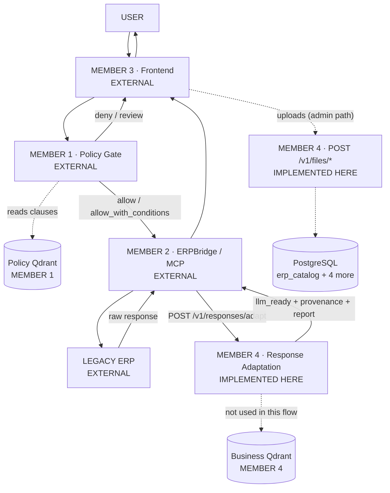

**Member 4 is deliberately absent from the outbound leg.** Forcing it into every
request would add latency and a hop with nothing to contribute — there is no
response to adapt until the ERP has answered.

---

# PART 18 — READ-ONLY QUERY WORKFLOW

Scenario: **"Find invoice INV-204 amount and status."**

## Questions answered

| Question | Answer |
|---|---|
| **Does Member 1 need to authorize reads?** | **Yes, but lightly.** Reading an invoice is still a data-access decision (role, department, sensitivity). Member 1's `answer` and `allow` decisions exist for exactly this. A read of a `RESTRICTED` record must still be refusable. |
| **Does Member 2 use an ERP API?** | **Yes**, for authoritative current state. |
| **Could Member 4 answer from semantic storage instead?** | **Technically yes** (`POST /v1/search` → `GET /v1/records/{id}`), **but it would be stale.** |
| **Which source is freshest?** | **The live ERP, via Member 2.** Member 4's corpus lags by the sync interval and, by design, does not advance its watermark past a failure. |
| **What if both historical vectors and live ERP data exist?** | **Live wins for facts; historical wins for discovery.** They answer different questions. |

## Recommended architecture

```
User → Member 3 → Member 1 (authorize read)
                → Member 2 (GET /api/invoices/INV-204)
                → ERP → raw JSON
                → Member 4 POST /v1/responses/adapt  ← relevance selection here
                → llm_ready {"invoice_id","amount","status"}
                → Member 2 → Member 3 → user
```

**Member 4's semantic search is the right tool for a *different* class of
question** — "which unpaid supplier invoices are in euros?" — where no single
key exists and similarity is the point. Use `POST /v1/search` there, and the
live ERP for exact lookups.

**Design rule for the group:**

```
Exact key known    → Member 2 → live ERP → Member 4 adapt
No key, semantic   → Member 4 search → canonical_record_id → (optionally) Member 2 refresh
```

---

# PART 19 — WRITE / ACTION WORKFLOW

Scenario: **"Release payment for invoice INV-204."**

The four concerns must stay separate:

| Concern | Owner |
|---|---|
| Retrieval (what is the amount?) | **Member 2** (live ERP) — see Part 10 |
| Governance (is it allowed?) | **Member 1** |
| Action execution | **Member 2** |
| Response transformation | **Member 4** |

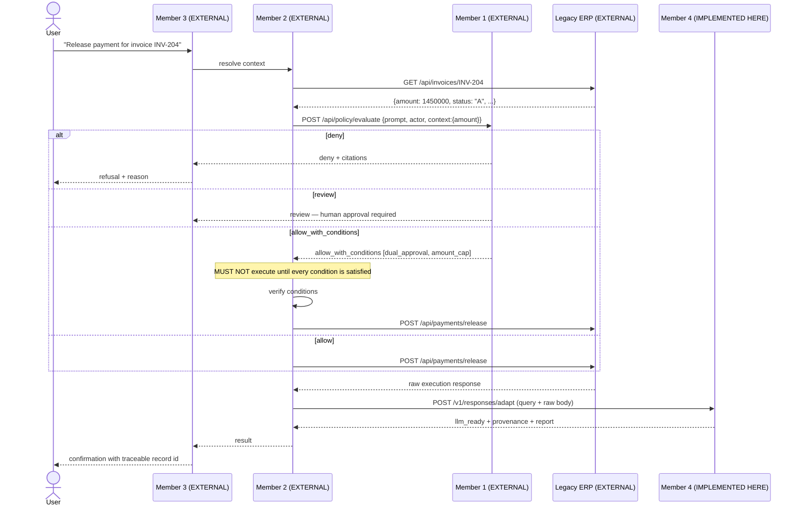

## `allow_with_conditions` — the critical case

**Member 2 must not execute until conditions are satisfied.** Condition
enforcement belongs to Member 2 because it is the party holding the execution
capability; Member 1 states the conditions but cannot enforce them without
becoming an executor, which its own boundary forbids.

**Member 4 has no role in condition enforcement** and must not be presented as a
control point — it never sees a request before execution.

## Where Member 4 participates

| Phase | Participates? |
|---|---|
| Before execution (retrieval for policy) | **NO** — Member 2 supplies live context (Part 10) |
| During policy evaluation | **NO** |
| During condition enforcement | **NO** |
| **After execution** | **YES** — adapts the execution response into traceable, compact context |

**Answer: Member 4 participates AFTER execution only, in the default architecture.**

---

# PART 20 — E002 BIRTH CERTIFICATE WORKFLOW

Scenario: **"What is E002's date of birth?"**

```
Member 3 → Member 1 (authorize — personal data, likely CONFIDENTIAL/RESTRICTED)
         → Member 2 (choose + call the employee-document ERP API)
         → ERP returns JSON / PDF / image
         → Member 4 POST /v1/responses/adapt
         → llm_ready
         → Member 2 → Member 3 → user
```

# PASSTHROUGH PATH

**Inspected `mapping/canonical_model.py`. `DEFAULT_CANONICAL_MODEL` contains
exactly three entities and fourteen fields:**

| Entity | Fields |
|---|---|
| `invoice` | `invoice_id`, `customer_id`, `amount`, `currency`, `status`, `issued_on` |
| `customer` | `customer_id`, `name`, `email`, `phone` |
| `purchase_order` | `purchase_order_id`, `supplier_id`, `amount`, `status` |

**There is no `employee` entity and no `document`/`birth_certificate` entity.**

Therefore the E002 scenario runs the **PASSTHROUGH PATH**:

- `entity_type` is **`null`**
- fields keep their **source names** (`emp_no`, `date_of_birth`, …) — there is
  **no canonical renaming**
- relevance selection still runs, on the `name` signal alone
- the identity field is **inferred** by name suffix, not by the canonical model

**MEASURED (real execution against the live service):**

```
query "What is E002's date of birth?"
  entity_type : null          wrapper_path: ["result"]
  llm_ready   : {"certificate_no": "BC-928821", "date_of_birth": "1997-03-20"}
  metrics     : 9 input leaves → 2 selected | context reduction 0.777358
  removed     : {"score_below_threshold": 6}
```

**Do NOT claim canonical employee mapping. It does not exist.**

Two further measured facts the group must know:

- **"Find E002 birth certificate details"** contains `details`, a
  `BROAD_QUERY_TERM`, so selection **steps aside** and all 8 fields are kept —
  context reduction only **0.113**. Use the date-of-birth phrasing for a demo.
- **`E002` tokenises to `("email","002")`** because the pipeline's synonym table
  maps the letter `e` → `email`. See Part 31, D7.

---

# PART 21 — MEMBER 4 FRONTEND API HANDOVER (FOR MEMBER 3)

## Common

| | |
|---|---|
| Base URL | `http://127.0.0.1:8000` (default; `ERP_API_HOST`/`ERP_API_PORT`) |
| Auth | `X-API-Key: <key>` on every **POST/PUT/PATCH/DELETE** when `ERP_API_KEY` is set. Reads need it only if `ERP_API_PROTECT_READS=true` |
| Public paths | `/v1/health/live`, `/v1/health/ready`, `/docs`, `/redoc`, `/openapi.json` |
| CORS | **Empty by default = no cross-origin browser access.** Set `ERP_API_CORS_ORIGINS=http://localhost:5173` (comma-separated). Credentials are off unless enabled, and `"*"` is never used with credentials |
| Max upload | **64 MiB** default (`ERP_API_MAX_UPLOAD_BYTES`) |
| Request id | `X-Request-ID` on every response and inside every error body |
| Error envelope | `{"success": false, "error": {"code","message","request_id","detail"?}}` |

## 21.1 CSV / schema upload

```http
POST /v1/files/csv HTTP/1.1
Host: 127.0.0.1:8000
X-API-Key: <key>
Content-Type: multipart/form-data; boundary=----X
```

```
file = <invoices.csv>          ← field name is exactly "file"
```

Supported extensions: `.csv`, `.tsv`, `.txt`
Supported MIME: any — **the server re-detects from content**

**201:**

```json
{"upload_id":"upl_7d89f04f262245b79738e2dca970e99f","filename":"invoices.csv",
 "content_hash":"522db5d9...","size_bytes":109,"source_system_id":"file_source",
 "schema_id":"file_source.invoices.10fd7001478b","columns":6,
 "rows_observed":0,"published":false,"warnings":[]}
```

**Errors:** 415 wrong extension (`detail.accepted`) · 413 too large ·
422 no upload store / malformed · 401 bad key · 500 internal.

## 21.2 Image upload

```http
POST /v1/files/documents
X-API-Key: <key>
Content-Type: multipart/form-data
file = <scan.png>
```

Extensions: `.png .jpg .jpeg .tif .tiff .bmp` (frontend currently offers the
first four).

**201:** see Part 6 (measured). **No OCR text, no dimensions, no bytes.**

## 21.3 PDF upload

```http
POST /v1/files/documents
X-API-Key: <key>
Content-Type: multipart/form-data
file = <cert.pdf>
```

**201:** see Part 7 (measured).

## JavaScript reference (matches `frontend/src/api/client.ts`)

```js
const form = new FormData();
form.append("file", file);          // field name must be "file"

const res = await fetch(`${BASE}/v1/files/csv`, {
  method: "POST",
  headers: { "X-API-Key": KEY },    // do NOT set Content-Type — the browser
  body: form,                       // must write the multipart boundary
});

const payload = await res.json();
if (!res.ok) throw new Error(payload?.error?.message ?? `HTTP ${res.status}`);
```

> **Known gap:** the current frontend client sends **no** `X-API-Key`
> (`client.ts` sets only the body). It therefore only works against a deployment
> with `ERP_API_KEY` unset. See Part 31, G1.

---

# PART 22 — MEMBER 4 → MEMBER 2 HANDOVER

## 22.1 Schema metadata

```http
GET /v1/schemas/{schema_id}
X-API-Key: <key>            # only if ERP_API_PROTECT_READS=true
```

**200** → `SchemaResponse` (full field list in Part 12). Errors: **404**
`SCHEMA_NOT_FOUND`.

## 22.2 API-spec parsing

```http
POST /v1/api-specs/openapi
X-API-Key: <key>
Content-Type: multipart/form-data
file = <erp-openapi.yaml>       # .json | .yaml | .yml
```

```json
{"upload_id":"upl_...","filename":"erp-openapi.yaml","content_hash":"...",
 "spec_id":"...","spec_format":"openapi_3","schema_id":"...",
 "operations_count":37,"entities_count":12,
 "endpoints_called":0,          // ALWAYS 0 — Member 4 never calls an API
 "warnings":[]}
```

Then `GET /v1/schemas/{schema_id}` for the entities/fields/relationships.
`POST /v1/api-specs/postman` is identical for Postman collections.

## 22.3 Response adaptation — **the runtime contract**

```http
POST /v1/responses/adapt
X-API-Key: <key>
Content-Type: application/json
```

Request/response contracts: **Part 13**. Worked examples for all five response
types: **Part 14**. Must/must-not: **Part 15**.

**Required headers:** `X-API-Key` (POST is mutating), `Content-Type: application/json`.

**Error conditions:** 422 when neither `body` nor `body_base64` is present, when
`body_base64` is not valid base64, or when a typed adaptation error occurs;
401 on a bad key; 500 unexpected.

## 22.4 Search / records — optional

```http
POST /v1/search      {"query": "...", "top_k": 10, "include_cold": false,
                      "filters": {"entity_type": "invoice"}}
GET  /v1/records/{canonical_record_id}
```

Filterable fields (**closed set — unknown names are refused with 422, never
ignored**): `entity_type`, `source_system_id`, `source_entity`, `sensitivity`,
`document_id`.

**Use only for historical/semantic discovery.** For current ERP state, Member 2
should read the ERP (Part 18).

---

# PART 23 — MEMBER 4 → MEMBER 1 HANDOVER

## Currently available interfaces

| Interface | Purpose for Member 1 | When |
|---|---|---|
| `GET /v1/capabilities` | What this deployment can and cannot do, plus declared limitations | Startup |
| `GET /v1/sources` | Which source systems exist | Design time |
| `GET /v1/schemas/{schema_id}` | Entity/field names and normalized types, for authoring policies against real vocabulary | Design time |

## Optional interfaces

| Interface | When it is genuinely appropriate |
|---|---|
| `POST /v1/search` | Only for **historical-pattern** policies ("has this vendor been paid three times this month?"). Never for current-state facts |
| `GET /v1/records/{record_id}` | Only when the policy explicitly concerns the **stored canonical** record |

## NOT recommended as direct integrations

| Interface | Why not |
|---|---|
| `POST /v1/search` for current facts | **Stale by construction** — see Part 10 |
| `POST /v1/responses/adapt` | Member 1 evaluates *before* execution; there is no response yet |
| `POST /v1/files/*`, `/v1/jobs`, `/v1/mappings/*` | Data-preparation concerns, unrelated to governance |

## Missing contract fields (if the group later wants tighter coupling)

| Missing | Impact |
|---|---|
| Per-request policy override (`blocked_sensitivities`, `blocked_fields` for *this caller*) | Today these are deployment configuration, not per-request |
| Field-level sensitivity | Sensitivity is **record-level** only |
| Actor/user identity | Member 4 authenticates a *caller*, not a *person* |
| Sensitivity **write** API | The value is consumed; nothing can set a classification |

**Recommended posture: no runtime coupling between Member 1 and Member 4.**

---

# PART 24 — INTEGRATION MATRIX

| Interaction | Producer | Consumer | Data | Existing interface | Status |
|---|---|---|---|---|---|
| Upload CSV | M3 | M4 | CSV file | `POST /v1/files/csv` | **READY** (frontend wired) |
| Upload image | M3 | M4 | PNG/JPEG/TIFF | `POST /v1/files/documents` | **READY** (frontend wired) |
| Upload PDF | M3 | M4 | PDF | `POST /v1/files/documents` | **READY** (frontend wired) |
| Retrieve schema | M4 | M3 | `SourceSchema` | `GET /v1/schemas/{id}` | **READY — no UI yet** |
| Suggest mapping | M4 | M3 | decisions + ambiguities | `POST /v1/mappings/suggest` | **PARTIAL** — `target_path` always null (D4) |
| Resolve mapping | M3 | M4 | overrides | `PUT /v1/mappings/{id}` | **READY — no UI yet** |
| Run pipeline job | M3 | M4 | `JobCreateRequest` | `POST /v1/jobs` | **READY — no UI yet** |
| Semantic search | M4 | M3 | hits + canonical ids | `POST /v1/search` | **READY — needs Qdrant** |
| Resolve record | M4 | M3/M1 | canonical record | `GET /v1/records/{id}` | **READY** |
| Policy evaluation | M3 / M2 | M1 | prompt + actor + context | **external** (`POST /api/policy/evaluate`) | **EXTERNAL** |
| ERP context for policy | M2 | M1 | live ERP facts | **external** | **EXTERNAL — recommended** |
| ERP tool metadata | M4 | M2 | schema, types, relationships | `GET /v1/schemas/{id}` | **READY** |
| API-spec metadata | M4 | M2 | operations + schemas | `POST /v1/api-specs/*` | **READY** |
| Execute ERP API | M2 | ERP | request | **ERPBridge (external)** | **EXTERNAL** |
| Adapt JSON response | M2 | M4 | raw JSON | `POST /v1/responses/adapt` | **READY** |
| Adapt PDF/image | M2 | M4 | `body_base64` | `POST /v1/responses/adapt` | **READY** |
| Adapt asset URL | M2 | M4 | `asset_urls[]` | `POST /v1/responses/adapt` | **READY — refused by default** |
| LLM-ready response | M4 | M2 → M3 | `llm_ready` + report | `POST /v1/responses/adapt` | **READY** |
| Sensitivity / provenance | M4 | M1 | metadata | search hits / adapt provenance | **READY — record-level only** |
| Capability handshake | M4 | M1/M2/M3 | limits + limitations | `GET /v1/capabilities` | **READY** |
| Process state | M4 | M3 | `current_state`, `allowed_next_states` | **none** | **NOT IMPLEMENTED** |
| Integrity status | M4 | M4 admin | `IntegrityReport` | **none** | **NOT IMPLEMENTED** |
| Tier monitoring | M4 | M3 admin | tier counts | **none** | **NOT IMPLEMENTED** |

---

# PART 25 — DUPLICATED RESPONSIBILITIES

## Qdrant — used twice, for different things

| | Member 1 Qdrant | Member 4 Qdrant |
|---|---|---|
| Contents | Policy clauses / regulation text | **ERP business record embeddings** |
| Purpose | Retrieve the clauses that justify a decision | Retrieve ERP records by meaning |
| Written by | Member 1 policy ingestion | Member 4 `EMBED` + `TIER_ROUTE` stages |
| Read by | Member 1 policy gate | `POST /v1/search` |
| Model | Member 1's choice (external) | `all-MiniLM-L6-v2`, 384-d, **local** |
| Collections | Member 1's own | HOT / WARM (+ temporary cold-rehydration) |

**Classification: GOOD SEPARATION.**

They must **not** share a collection. The corpora are semantically unrelated,
mixing them would pollute both retrievals, and Member 4's tier state
(`erp_vector_storage`) is authoritative for its own vectors only.

**One caution — POTENTIAL DUPLICATION at the infrastructure level:** if both
members point at the **same Qdrant instance**, collection names must be
namespaced. Member 4 already prefixes benchmark collections
(`erp_phase12_bench_*`) and drives collection names from configuration, so this
is a deployment convention to agree, not a code change.

## API schemas — Member 2 vs Member 4

| | Member 2 (ERPBridge) | Member 4 (`api_specs/`) |
|---|---|---|
| Input | ERP API registration | OpenAPI / Swagger / Postman files |
| Output | **MCP tool schemas** | `SourceSchema` — entities, fields, normalized types, relationships |
| Purpose | Let an agent *call* the API | Describe the API's *data shape* |
| Executes? | **YES** | **NO — never** |

**Classification: INTEGRATION OPPORTUNITY, not duplication.**

Member 2 must generate MCP tool schemas regardless. Member 4 supplies the
**normalized type layer** underneath — `normalized_data_type` across four
dialects and three spec formats. Without it, Member 2 re-implements dialect
normalisation. **Recommendation: Member 2 consumes `GET /v1/schemas/{id}` rather
than parsing specs a second time.**

## Other overlaps

| Overlap | Classification | Note |
|---|---|---|
| Member 3 frontend vs Member 4's `frontend/` | **POTENTIAL DUPLICATION** | Member 4 ships a minimal 1-page upload UI. If Member 3 builds the real UI, Member 4's should be declared a **developer utility**, not a product surface, to avoid two UIs drifting |
| Member 1 sensitivity vs Member 4 sensitivity | **INTEGRATION OPPORTUNITY** | Member 4 **consumes, never infers**. Member 1 is the natural producer, but **no write API exists** |
| Member 2 caching vs Member 4 skip-if-unchanged | **GOOD SEPARATION** | M2 caches ERP responses; M4 skips re-embedding unchanged content. Different layers |
| Member 2 raw response vs Member 4 provenance | **GOOD SEPARATION** | M2 owns the raw bytes; M4 owns the derived, allow-listed provenance |

**No ACTUAL CONFLICT was found.**

---

# PART 26 — DATA OWNERSHIP

| Data | Owner | Stored where | Consumers |
|---|---|---|---|
| **ERP business records (live)** | **Legacy ERP** | The ERP itself | Member 2 (reads/writes), Member 4 (reads copies at sync) |
| **Canonical records** | **Member 4** | `erp_runtime.canonical_records` | M3 (`GET /v1/records/{id}`), M1 (optional) |
| **ERP vectors** | **Member 4** | Qdrant HOT/WARM + encrypted COLD files; **tier state authoritative in `erp_vector_storage`** | `POST /v1/search` |
| **Policy documents** | **Member 1** | Member 1's store | Member 1 |
| **Policy vectors** | **Member 1** | **Member 1's Qdrant** — separate corpus | Member 1 |
| **API specifications (files)** | **Member 2** (registers them) / Member 4 (parses copies) | `erp_runtime.uploads` + `erp_catalog` | M2 via `GET /v1/schemas/{id}` |
| **MCP tool definitions** | **Member 2** | ERPBridge registry | AI/MCP clients |
| **Mapping profiles** | **Member 4** | `erp_catalog.mapping_profiles` + `field_mappings`; drafts in `erp_runtime.mapping_drafts` | M4 transformation, M3 review UI |
| **Raw API responses** | **Member 2** | Member 2's cache/logs. **Member 4 does NOT persist them** | Member 4 (transiently, during adaptation) |
| **LLM-ready responses** | **Member 4** (produces) / **Member 2** (holds) | **Not persisted by Member 4** — returned and forgotten | M2 → M3 → model |
| **User / actor context** | **Member 1** (+ Member 3 session) | Member 1 / Member 3 | Member 1. **Member 4 has no user model** |
| **Schemas + relationships** | **Member 4** | `erp_catalog.*` (7 tables) | M2, M3, M1 |
| **Job history** | **Member 4** | `erp_orchestration.jobs`, `job_stages` | M3 admin |
| **Sync watermarks** | **Member 4** | `erp_sync.sync_state` | M4 only |
| **Uploaded files** | **Member 4** | `erp_runtime.uploads` + disk | M4 only |
| **ERP credentials** | **Member 2** (runtime) / **Member 4** (its own sources, via `credential_ref`) | Secret provider — **never in a table, never in a response** | Never forwarded |

**Critical group rule:** Member 4 **never persists a raw ERP response** and never
persists an adapted one. Adaptation is stateless. If the group needs an audit
trail of what an agent was shown, **Member 2 must store it.**

---

# PART 27 — AUTHENTICATION / AUTHORIZATION BOUNDARY

## The four distinct concerns

| Concern | Owner | Mechanism |
|---|---|---|
| **Authentication (service-to-service)** | Member 4 | `X-API-Key` header, constant-time comparison |
| **Authorization (may this user do this?)** | **Member 1** | Roles, segregation of duty, policy clauses |
| **Governance (should this be allowed at all?)** | **Member 1** | Policy evaluation |
| **ERP credentials** | **Member 2** | ERPBridge connection config |
| **User session / identity** | **Member 3** + Member 1 | Frontend session |

## Member 4 API authentication — precisely

- `ERP_API_KEY` set ⇒ every **mutating** method requires `X-API-Key`.
- Reads require it only when `ERP_API_PROTECT_READS=true`.
- Public: `/v1/health/live`, `/v1/health/ready`, `/docs`, `/redoc`, `/openapi.json`.
- **Verified:** `requires_key("POST", "/v1/responses/adapt", False) → True`.
- The key is *"read but never echoed anywhere: not into logs, not into
  /v1/capabilities, not into the OpenAPI document"*, and `ApiSettings.__repr__`
  is overridden so it cannot leak into a debug log.

**Member 4 authenticates a *caller*, not a *person*. It makes no authorization
decision. Do not treat an accepted API key as user authorization.**

## Which token travels where

```
Member 3 ──(user session cookie/JWT)──► Member 1        user identity
Member 3 ──(X-API-Key: M4 key)───────► Member 4        uploads only
Member 2 ──(X-API-Key: M4 key)───────► Member 4        adapt / schemas
Member 2 ──(ERP credentials)─────────► Legacy ERP      never leaves Member 2
Member 1 ──(its own auth)────────────► its Qdrant
```

## MUST NOT be forwarded

| Never forward | Why |
|---|---|
| **ERP credentials / `Authorization` headers** to Member 4 | Member 4 makes no ERP call. It **drops them** via the provenance allow-list (`content-type`, `content-length`, `date`, `etag`, `last-modified`) |
| **Member 4's API key** to the browser | It would be visible to every user. *(The current frontend sends none — Part 31, G1)* |
| **Qdrant API keys** | Server-side only, in Member 4's environment |
| **Database passwords** | Server-side only; sources use `credential_ref`, never inline passwords in production |
| **User session tokens** to Member 4 | It has no user model and would silently ignore them |
| **Member 1's policy decision** as an auth token to Member 4 | Member 4 does not verify policy decisions |

No secret values appear anywhere in this document — only variable names.

---

# PART 28 — ERROR PROPAGATION

| Failure | Owner | Who receives it | Retry? | User sees? | Stop? |
|---|---|---|---|---|---|
| **Member 1 denies** | M1 | M3 (via M2/M3) | **No** | **Yes** — with policy citations | **YES — hard stop** |
| **Member 1 `allow_with_conditions`** | M1 | M2 | No | Yes — the conditions | **Pause** until satisfied |
| **Member 1 `review`** | M1 | M3 | No | Yes — pending approval | **Pause** |
| **Member 2 ERP timeout** | M2 | M2, then M3 | **Yes** — M2 owns retry/backoff | Yes, after retries | Stop after budget |
| **Member 2 ERP HTTP 500** | ERP/M2 | M2 | Cautiously — **never for a write** | Yes | Stop |
| **Member 4 cannot adapt JSON** (`success:false`) | M4 | M2 | **No** — deterministic; a retry yields the same result | Yes — degraded | **No** — M2 may fall back to the raw response |
| **Member 4 refuses an asset URL** | M4 (policy) | M2 | **No** | Optional — "attachment unavailable" | **No** — 200 + `partial:true` |
| **Member 4 `partial:true`** | M4 | M2 | No | **Yes** — the answer may be incomplete | **No** |
| **Member 4 cannot OCR** (no Tesseract) | Environment | M2/M3 | **No** | Yes — "text could not be read" | **No** — 201/200 with a warning |
| **Member 4 search: Qdrant down** | Infrastructure | Caller | **Yes** — transient | Yes | Search stops; **adapt and uploads are unaffected** |
| **Member 4 catalog publish fails** | Infrastructure | M3 | Manual | Yes — in `warnings` | **No** — 201 with `published:false` |
| **Member 4 corrupt/encrypted PDF upload** | Client | M3 | **No** | Yes | **No** — but arrives as **HTTP 500** (Part 31, D6) |
| **Member 4 401 (bad key)** | Config | Caller | No | No — an operator issue | Yes |
| **Member 4 413 (too large)** | Client | M3 | No | **Yes** — with the limit | Yes |

## Two rules the group should adopt

1. **A `partial: true` response must never be silently presented as complete.**
   If an attachment was refused or a budget truncated the payload, the user
   should be told the answer may be incomplete.
2. **Never retry a write after an ambiguous ERP failure.** Member 2 owns this;
   Member 4 has no idempotency mechanism for ERP actions and cannot help.

---

# PART 29 — END-TO-END SEQUENCE DIAGRAMS

## 1. CSV upload — Member 3 → Member 4

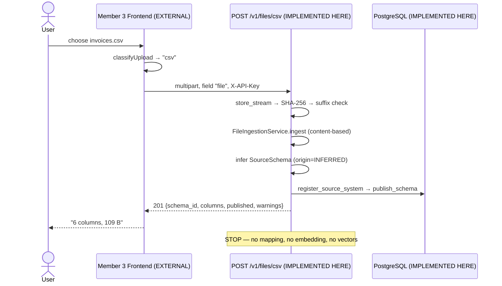

## 2. PDF / image upload — Member 3 → Member 4

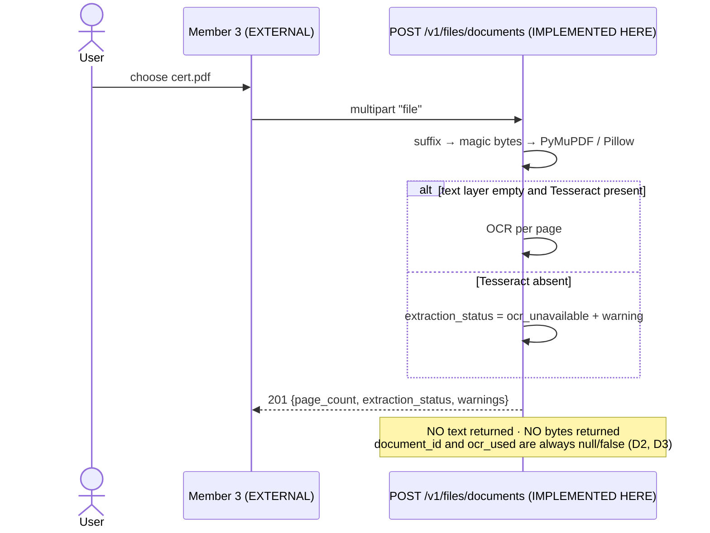

## 3. Read-only ERP query

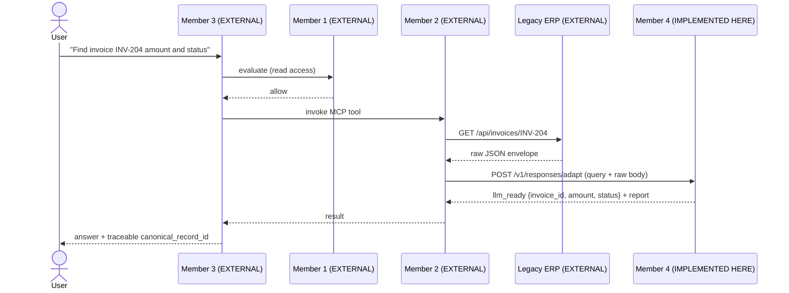

## 4. Governed ERP write / action

*(See the full sequence in Part 19 — reproduced there with all four branches.)*

## 5. Member 1 policy evaluation

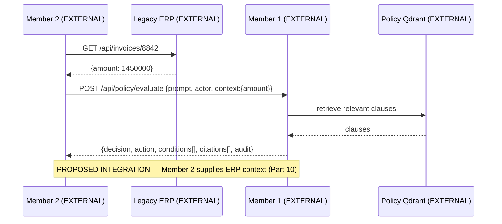

## 6. Member 2 ERPBridge execution

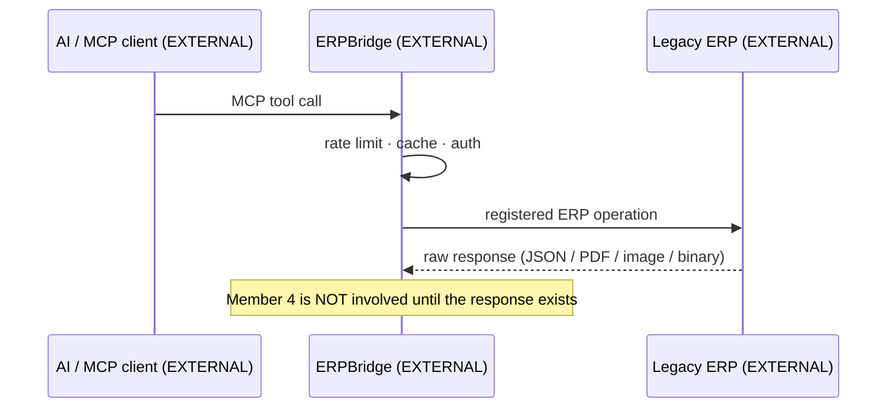

## 7. Member 2 → Member 4 JSON adaptation

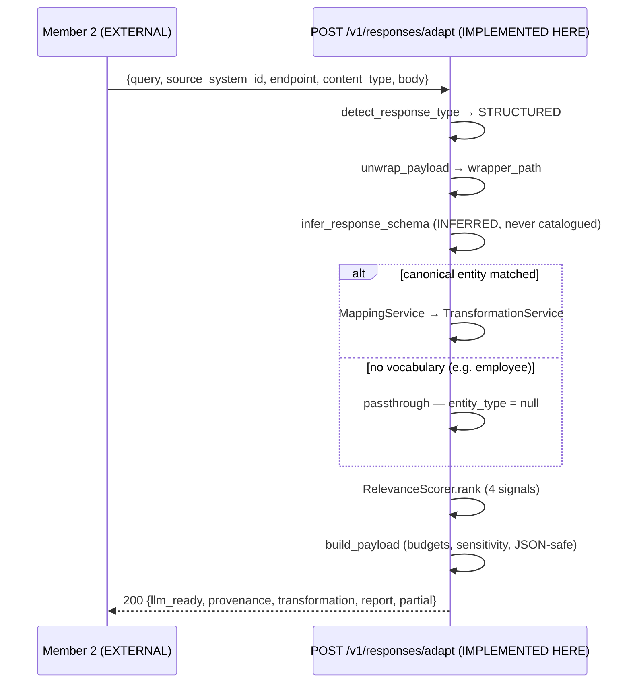

## 8. Member 2 → Member 4 PDF / image adaptation

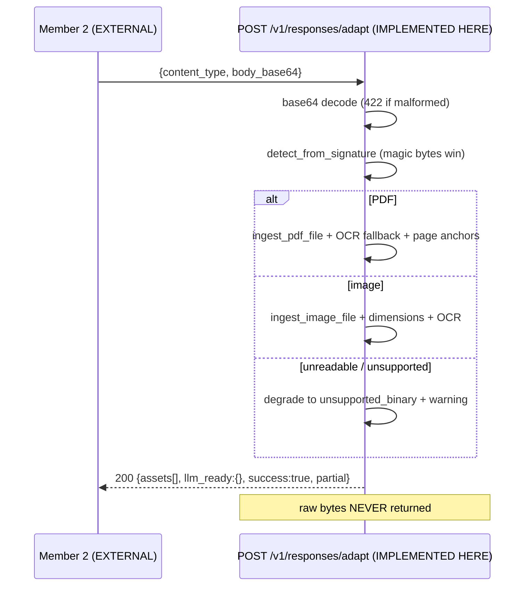

## 9. E002 birth-certificate scenario

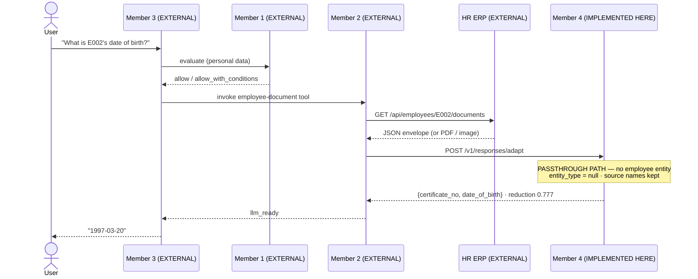

## 10. Invoice payment release

*(See Part 19 — the full four-branch sequence including `allow_with_conditions`.)*

---

# PART 30 — DOES MEMBER 4 BLOCK GROUP INTEGRATION?

## Can Member 3 integrate today? — **PARTIAL**

**Working now:** both upload endpoints exist, are tested, return typed
responses, and the shipped frontend already calls them.

**Why not full:**

| Reason | Severity |
|---|---|
| The frontend client sends **no `X-API-Key`**, so it only works against an unauthenticated deployment | **BLOCKER for a secured deployment** |
| CORS is **empty by default** — no browser origin is allowed until `ERP_API_CORS_ORIGINS` is set | Configuration, not code |
| `rows_observed` always `0`; `document_id` always `null`; `ocr_used` always `false` — Member 3 would display wrong information | **SHOULD FIX** |
| `warnings[]` leaks a Python `repr` — not display-safe | **SHOULD FIX** |
| Corrupt/encrypted PDF surfaces as **HTTP 500** instead of 4xx | **SHOULD FIX** |
| `decisions[].target_path` always `null` — a mapping-review UI cannot show auto-selected targets | **SHOULD FIX** (only if mapping UI is in scope) |

**Minimum contract changes eventually needed (DO NOT IMPLEMENT NOW):**
1. Frontend client to send `X-API-Key`.
2. Populate or remove `rows_observed`, `document_id`, `ocr_used`.
3. Serialize `warnings[]` as structured, display-safe strings.
4. Map `MalformedPDFError` / `EncryptedPDFError` into `ERROR_STATUS` as 4xx.
5. Populate `decisions[].target_path` from `decision.selected.qualified_target`.

## Can Member 1 integrate today? — **YES (as recommended: no runtime coupling)**

Member 1 needs **nothing at runtime** from Member 4 in the recommended
architecture, and everything it might want at design time already exists
(`/v1/sources`, `/v1/schemas/{id}`, `/v1/capabilities`).

**If** the group insists on runtime coupling, it becomes **PARTIAL**: no
per-request policy override, no field-level sensitivity, no actor model, and no
way to *write* a sensitivity classification.

## Can Member 2 integrate today? — **YES**

| Need | Status |
|---|---|
| Design-time schema/type/relationship metadata | **READY** — `GET /v1/schemas/{id}` |
| API-spec parsing for MCP tool generation | **READY** — `POST /v1/api-specs/*` |
| **Runtime response adaptation** | **READY** — `POST /v1/responses/adapt`, 106 tests, measured evaluation artifact |
| JSON / PDF / image / URL / binary handling | **READY** — all five paths verified |
| Auth | **READY** — `X-API-Key` |
| Requires infrastructure? | **NO** — adaptation needs no database, no Qdrant, no model |

**Member 2 is the least blocked and should be integrated first.**

One caveat, not a blocker: `decisions[].target_path` is null, so canonical
mapping metadata is only partially usable (`ambiguities[]` still carries
targets).

---

# PART 31 — CURRENT MEMBER 4 ISSUES THAT AFFECT INTEGRATION

## Contract defects found by execution during this audit

| # | Defect | Evidence | Affects | Classification |
|---|---|---|---|---|
| **D1** | **`CsvUploadResponse.rows_observed` is always `0`.** The route reads `result.data_row_count`, which CSV inference never populates (`None`); the real value is in `rows_sampled` | MEASURED: 2-row CSV → `"rows_observed": 0`; `data_row_count is None`, `rows_sampled == 2` | **Member 3** | **SHOULD FIX** |
| **D2** | **`DocumentUploadResponse.document_id` is always `null`.** `ExtractedDocument` has no `document_id` attribute; `getattr(..., None)` always returns `None` | MEASURED on a real text PDF and a real PNG | **Member 3** | **SHOULD FIX** |
| **D3** | **`DocumentUploadResponse.ocr_used` is always `false`.** `ExtractedDocument` has no `ocr_used`; OCR state lives on `ExtractedPage.extraction_method` | MEASURED; `ExtractedDocument` fields verified | **Member 3** | **SHOULD FIX** |
| **D4** | **`MappingResponse.decisions[].target_path` is always `null`**, even for `auto_selected` / `confidence: "high"`. `FieldDecision` has no `target_path`; the target is `decision.selected.qualified_target` | MEASURED: `{"source_field":"inv_no","outcome":"auto_selected","target_path":null,"confidence":"high"}` | **Member 3** (mapping UI), Member 2 (canonical naming) | **SHOULD FIX** |
| **D5** | **`warnings[]` leaks a Python dataclass `repr`** — `"ExtractionWarning(category='ocr_unavailable', message='…', row_number=None, …)"` | MEASURED on image upload | **Member 3** | **SHOULD FIX** |
| **D6** | **Corrupt/encrypted PDF returns HTTP 500.** `MalformedPDFError` and `EncryptedPDFError` are absent from `ERROR_STATUS`, so a client-side problem is reported as a server fault | Verified in `api/responses.py:41-59` | **Member 3** | **SHOULD FIX** |
| **D7** | **`E002` tokenises to `("email","002")`.** `DEFAULT_SYNONYMS["e"] == "email"` (intended for `e_mail`) makes any letter+digit identifier inject a spurious `email` token | MEASURED: `"Who is customer E002?"` → `llm_ready` includes `email` at score 0.75 | **Member 2** (false-positive field) | **SAFE TO DOCUMENT** — costs precision, not recall |

Additionally observed: **CSV entity names retain the file extension**
(`entity.source_name == "invoices.csv"` while `schema_name == "invoices"`),
which weakens the mapping engine's entity signal. MEASURED consequence on a
6-column invoice CSV: **2 auto-selected, 3 ambiguous, 1 unmapped** — noticeably
worse than the benchmark's 88% automatic coverage on clean entity names.
Classification: **SHOULD FIX** (affects Member 3's mapping UX).

## Known limitations reviewed for integration impact

| Limitation | Classification | Reason |
|---|---|---|
| Frontend has no API-key support | **BLOCKER** (for a secured deployment) | Member 3 cannot authenticate |
| CORS empty by default | **SAFE TO DOCUMENT** | Deployment configuration |
| **Canonical model covers 3 entities only** | **SAFE TO DOCUMENT** | Member 2 must handle `entity_type: null`; contract already permits it |
| **Employee / birth certificate is passthrough** | **SAFE TO DOCUMENT** | Documented in Part 20; not a defect |
| **Sensitivity consumed, never inferred** | **SHOULD FIX at group level** | Member 1 is the natural producer, but **no write API exists**. Until then, everything defaults to `INTERNAL` |
| **Only the first record of a collection is adapted** | **SHOULD FIX** if Member 2 exposes list-returning tools | Warned, but a list tool would silently return one row |
| Process/case has no endpoint | **SAFE TO DOCUMENT** | Only matters if Member 3 wants workflow state |
| Verification has no endpoint | **IRRELEVANT TO INTEGRATION** | Operational concern |
| Storage monitoring has no endpoint | **IRRELEVANT TO INTEGRATION** | Nice-to-have admin view |
| SQL Server live verification deferred | **IRRELEVANT TO INTEGRATION** | Self-declared in `/v1/capabilities` |
| Mapping profiles cached in-process | **SAFE TO DOCUMENT** | Drafts persist in `erp_runtime.mapping_drafts`; a restart loses the cache |
| No retry inside a stage | **SAFE TO DOCUMENT** | Job-level retry exists |

**None of these were fixed. This is an analysis-only audit.**

---

# PART 32 — MEMBER 3 MINIMUM API LIST

# MEMBER 3 SHOULD INTEGRATE THESE MEMBER 4 ENDPOINTS

| Priority | Endpoint | Used for | Required now? |
|---|---|---|---|
| **1** | `POST /v1/files/csv` | Upload tabular ERP data; get `schema_id` | **YES** — already wired |
| **1** | `POST /v1/files/documents` | Upload PDF / image; extraction + OCR | **YES** — already wired |
| **2** | `GET /v1/capabilities` | Feature-detect so the UI hides what the deployment cannot do | **YES** — cheap and prevents click-time failures |
| **3** | `GET /v1/schemas/{schema_id}` | Show the user what was inferred after upload | **YES** — upload is meaningless without it |
| **4** | `POST /v1/mappings/suggest` | Mapping review screen — the engine *needs* a human | Recommended |
| **4** | `PUT /v1/mappings/{mapping_id}` | Resolve ambiguities; produce an executable profile | Recommended (pairs with the above) |
| **5** | `POST /v1/mappings/{id}/validate` | Confirm before running a job | Optional |
| **6** | `POST /v1/jobs` + `GET /v1/jobs/{id}` | Run and monitor the pipeline (async, 202 + polling) | Optional — needs infrastructure |
| **7** | `POST /v1/search` + `GET /v1/records/{id}` | Semantic search UI; expose **together or not at all** | Optional — needs Qdrant + a populated corpus |
| **8** | `GET /v1/health/ready` | Connection banner | Optional |
| — | `POST /v1/responses/adapt` | — | **NO — Member 2 calls this** |
| — | `POST /v1/sources`, `/test`, `/discover` | — | **NO — admin, carries `credential_ref`** |

**Minimum viable set: priorities 1–3 (four endpoints).**

---

# PART 33 — MEMBER 2 MINIMUM API LIST

# MEMBER 2 SHOULD INTEGRATE THESE MEMBER 4 ENDPOINTS

| Priority | Endpoint | Used for | Required now? |
|---|---|---|---|
| **1** | **`POST /v1/responses/adapt`** | **The runtime integration.** Raw ERP response → LLM-ready context | **YES — the core contract** |
| **2** | `GET /v1/schemas/{schema_id}` | Entities, fields, **`normalized_data_type`**, relationships → MCP tool parameter schemas | **YES** |
| **3** | `POST /v1/api-specs/openapi` \| `/postman` | Parse an ERP contract into a `SourceSchema` for tool generation | **YES** if Member 2 registers APIs from spec files |
| **4** | `GET /v1/capabilities` | Confirm the deployment supports what ERPBridge intends to expose | Recommended |
| **5** | `POST /v1/mappings/suggest` | Canonical target vocabulary for tool naming | Optional — **degraded: `target_path` is null (D4)**; use `ambiguities[]` |
| **6** | `POST /v1/search` + `GET /v1/records/{id}` | Historical/semantic lookup when no ERP key is known | Optional — **never for current-state facts** |
| — | `POST /v1/files/*` | — | **NO — Member 3's surface** |
| — | `POST /v1/jobs` | — | **NO — admin** |

**Minimum viable set: priorities 1–2 (two endpoints).**

---

# PART 34 — MEMBER 1 MINIMUM API LIST

# MEMBER 1 SHOULD INTEGRATE THESE MEMBER 4 ENDPOINTS

## Runtime: **NONE.**

**This is the recommended architecture, not a gap.**

Member 1's job is *"is this operation allowed?"*. It needs the **operation** and
its **context**. Member 2 already holds both, freshly and authoritatively.
Adding a runtime Member 1 → Member 4 call would introduce:

- a second source of truth for a fact Member 2 already has,
- **staleness** (Member 4's corpus lags by the sync interval, by design),
- an extra network hop in a latency-sensitive authorization path,
- a broader read surface (Member 1 gaining access to the whole ERP corpus),
- **semantic similarity used for an exact-key lookup** — the wrong retrieval mode.

## Design-time: three optional, read-only endpoints

| Endpoint | Used for | Required? |
|---|---|---|
| `GET /v1/capabilities` | Understand what Member 4 does and does not do | Optional |
| `GET /v1/sources` | Which source systems exist | Optional |
| `GET /v1/schemas/{schema_id}` | Author policies against real entity/field names and normalized types | **Recommended** |

## The one legitimate runtime exception

If a policy concerns **historical pattern** rather than current state — "has
this vendor been paid three times this month?" — then `POST /v1/search` +
`GET /v1/records/{id}` is the *correct* source, because Member 4 owns the
historical canonical corpus and Member 2 does not.

**Recognise this as a different question from a current-state fact, and route it
differently.**

## What Member 1 receives indirectly (no coupling needed)

Every governance-relevant fact Member 4 produces already flows to Member 1
**through Member 2**, inside `AdaptationProvenance`: `canonical_record_id`,
`source_system_id`, `source_entity`, `sensitivity`, `content_type`,
`http_status`, `adapted_at`, `engine_version`, `config_fingerprint` — plus the
full per-field decision trail in `AdaptationReport`. That is sufficient for an
audit record **after** execution.

**Do not create direct coupling merely because four members exist.**

---

# PART 35 — FINAL GROUP ARCHITECTURE

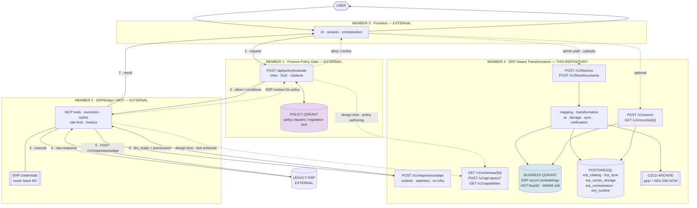

## The two Qdrant instances — never merge them

| | **Policy Qdrant** (Member 1) | **Business Qdrant** (Member 4) |
|---|---|---|
| Contents | Policy clauses, regulations | ERP record embeddings |
| Written by | Member 1 policy ingestion | Member 4 `EMBED` → `TIER_ROUTE` |
| Read by | Member 1 policy gate | `POST /v1/search` |
| Model | Member 1's choice | `all-MiniLM-L6-v2`, 384-d, **local** |
| Tiering | Member 1's concern | **HOT float32 / WARM int8 / COLD encrypted** |
| Authoritative metadata | Member 1's store | **PostgreSQL `erp_vector_storage`**, not Qdrant |

If they share a server, **namespace the collections**. Their corpora are
semantically unrelated and mixing them would degrade both retrievals.

---

# PART 36 — FINAL WORKFLOW IN SIMPLE ENGLISH

## READ request — *"What is the amount on invoice INV-204?"*

1. The user types the question into **Member 3's** frontend.
2. **Member 3** sends the question, plus who the user is, to **Member 1's**
   Policy Gate.
3. **Member 1** checks the user's role and department against the finance
   policies and answers **allow**, **deny**, **review**, or **allow with
   conditions**. It never touches the ERP itself.
4. If allowed, **Member 3** asks **Member 2 (ERPBridge)** to run the right ERP
   operation.
5. **Member 2** picks the registered MCP tool and calls the legacy ERP API using
   its own ERP credentials. Those credentials never leave Member 2.
6. The ERP returns a raw response — a wrapped JSON envelope, or a PDF, or a
   scanned image.
7. **Member 2** posts that raw response, together with the user's original
   question, to **Member 4** at `POST /v1/responses/adapt`.
8. **Member 4** works out what the response actually is by looking at the bytes,
   finds the business record inside the envelope, translates vendor field names
   into shared business names where it can, and keeps only the fields the
   question needs — always keeping the record's identifier so the answer can be
   traced. It explains, field by field, what it dropped and why.
9. **Member 4** returns a small, clean payload to **Member 2**.
10. **Member 2** passes it to **Member 3**, which shows the answer to the user.

**Member 4 never calls the ERP. Member 1 never calls the ERP. Member 2 never
transforms the response.**

## WRITE / ACTION request — *"Release payment for invoice INV-204."*

1. The user types the instruction into **Member 3's** frontend.
2. **Member 3** asks **Member 2** for the facts the policy needs — for example
   the invoice amount. **Member 2 reads them live from the ERP**, because that is
   the freshest and most authoritative source.
3. **Member 2** sends the instruction, the user's identity, and those facts to
   **Member 1's** Policy Gate.
4. **Member 1** evaluates roles, separation-of-duty rules and amount thresholds,
   retrieves the relevant policy clauses, and returns a decision with citations.
5. If **deny** — the flow stops and the user is shown the reason and the policy
   citations. Nothing is executed.
6. If **review** — the flow pauses for human approval.
7. If **allow with conditions** — **Member 2 must not execute until every
   condition is satisfied.** Member 2 checks them, because Member 2 is the only
   party that can actually execute.
8. If **allow** (or once conditions are met) — **Member 2** calls the ERP
   payment-release API.
9. The ERP returns the execution result.
10. **Member 2** sends that result to **Member 4** at
    `POST /v1/responses/adapt`.
11. **Member 4** turns it into a compact, traceable confirmation carrying the
    canonical record identifier.
12. **Member 3** shows the user the confirmation, and the whole chain can be
    audited afterwards.

**Member 4 takes part only after the action has been executed. It is not a
control point and must never be presented as one.**

---

# PART 37 — FINAL WORKFLOW IN SIMPLE SINHALA
## (අවසාන ක්‍රියාවලිය සරල සිංහලෙන්)

> තාක්ෂණික වචන — API, MCP, ERP, schema, JSON, PDF, Qdrant, LLM — ඉංග්‍රීසියෙන්ම
> තබා ඇත, එය පැහැදිලි නිසා.

## READ ඉල්ලීම — *"INV-204 invoice එකේ මුදල කීයද?"*

1. පරිශීලකයා (user) ප්‍රශ්නය **Member 3**ගේ frontend එකට type කරයි.
2. **Member 3** එම ප්‍රශ්නය සහ පරිශීලකයා කවුද යන තොරතුරු **Member 1**ගේ Policy
   Gate එකට යවයි.
3. **Member 1** පරිශීලකයාගේ role එක සහ department එක finance policies සමඟ
   පරීක්ෂා කර **allow**, **deny**, **review** හෝ **allow with conditions** කියා
   පිළිතුරු දෙයි. **Member 1 කිසිවිටෙක ERP එකට කතා නොකරයි.**
4. අවසර ලැබුණොත්, **Member 3** නිවැරදි ERP operation එක ක්‍රියාත්මක කරන ලෙස
   **Member 2 (ERPBridge)**ගෙන් ඉල්ලයි.
5. **Member 2** ලියාපදිංචි කර ඇති MCP tool එක තෝරාගෙන, තමන්ගේම ERP credentials
   භාවිතයෙන් legacy ERP API එකට කතා කරයි. **එම credentials කිසිවිටෙක Member 2
   එකෙන් පිටතට නොයයි.**
6. ERP එක raw response එකක් ආපසු දෙයි — එය JSON envelope එකක්, PDF එකක්, හෝ scan
   කරන ලද image එකක් විය හැක.
7. **Member 2** එම raw response එක සහ පරිශීලකයාගේ මුල් ප්‍රශ්නය එකට
   **Member 4**ට `POST /v1/responses/adapt` හරහා යවයි.
8. **Member 4** එම response එකේ **bytes** දෙස බලා එය ඇත්තටම මොකක්ද කියා තීරණය
   කරයි; envelope එක ඇතුළේ ඇති සැබෑ business record එක සොයාගනී; හැකි විට vendor
   field නම් පොදු business නම් බවට පරිවර්තනය කරයි; සහ ප්‍රශ්නයට අවශ්‍ය fields
   පමණක් තබාගනී — **නමුත් record එකේ identifier එක සැමවිටම තබාගනී**, එවිට පිළිතුර
   ආපසු trace කළ හැක. **කුමන field එකක් ඉවත් කළාද, ඇයි කියාද field එකින් එක
   පැහැදිලි කරයි.**
9. **Member 4** කුඩා, පිරිසිදු payload එකක් **Member 2**ට ආපසු දෙයි.
10. **Member 2** එය **Member 3**ට දෙයි, **Member 3** පිළිතුර පරිශීලකයාට පෙන්වයි.

> **Member 4 කිසිවිටෙක ERP එකට කතා නොකරයි. Member 1 කිසිවිටෙක ERP එකට කතා නොකරයි.
> Member 2 කිසිවිටෙක response එක transform නොකරයි.**

## WRITE / ACTION ඉල්ලීම — *"INV-204 invoice එකට payment එක release කරන්න."*

1. පරිශීලකයා එම විධානය **Member 3**ගේ frontend එකට type කරයි.
2. **Member 3**, policy එකට අවශ්‍ය කරුණු — උදාහරණයක් ලෙස invoice එකේ මුදල —
   **Member 2**ගෙන් ඉල්ලයි. **Member 2 එය ERP එකෙන් live ලෙස කියවයි**, මන්ද එයයි
   වඩාත්ම නැවුම් සහ නිවැරදි මූලාශ්‍රය.
3. **Member 2** එම විධානය, පරිශීලකයාගේ අනන්‍යතාවය, සහ එම කරුණු **Member 1**ගේ
   Policy Gate එකට යවයි.
4. **Member 1** roles, segregation-of-duty නීති සහ මුදල් threshold පරීක්ෂා කර,
   අදාළ policy clauses ලබාගෙන, citations සමඟ තීරණයක් දෙයි.
5. **deny** නම් — ක්‍රියාවලිය එතැනින් **නවතී**. පරිශීලකයාට හේතුව සහ policy
   citations පෙන්වයි. කිසිවක් ක්‍රියාත්මක නොවේ.
6. **review** නම් — මිනිස් අනුමැතියක් ලැබෙන තුරු ක්‍රියාවලිය **නතර කර තබයි**.
7. **allow with conditions** නම් — **සියලුම conditions සම්පූර්ණ වන තුරු Member 2
   ක්‍රියාත්මක නොකළ යුතුය.** Member 2 එම conditions පරීක්ෂා කරයි, මන්ද ඇත්තටම
   ක්‍රියාත්මක කළ හැක්කේ Member 2ට පමණි.
8. **allow** නම් (හෝ conditions සම්පූර්ණ වූ පසු) — **Member 2** ERP එකේ payment
   release API එකට කතා කරයි.
9. ERP එක ක්‍රියාත්මක කිරීමේ ප්‍රතිඵලය ආපසු දෙයි.
10. **Member 2** එම ප්‍රතිඵලය **Member 4**ට `POST /v1/responses/adapt` හරහා යවයි.
11. **Member 4** එය කුඩා, trace කළ හැකි confirmation එකක් බවට පත් කරයි — canonical
    record identifier එක සමඟ.
12. **Member 3** එම confirmation එක පරිශීලකයාට පෙන්වයි, සහ මුළු ක්‍රියාවලියම පසුව
    audit කළ හැක.

> **Member 4 සහභාගී වන්නේ ක්‍රියාව ක්‍රියාත්මක වූ පසුව පමණි. එය control point එකක්
> නොවේ, එසේ ඉදිරිපත් නොකළ යුතුය.**

---

# PART 38 — FINAL API HANDOVER SUMMARY

## FOR MEMBER 1

```
Runtime integration:  NONE (recommended)

Design-time, read-only:
  GET /v1/capabilities            what M4 does and does not do
  GET /v1/sources                 which source systems exist
  GET /v1/schemas/{schema_id}     entity/field names + normalized types

Exception — historical-pattern policies only:
  POST /v1/search                 {"query","top_k","filters"}
  GET  /v1/records/{record_id}    canonical record

Everything governance-relevant reaches you THROUGH MEMBER 2 inside
AdaptationProvenance: canonical_record_id, source_system_id, source_entity,
sensitivity, content_type, http_status, adapted_at, engine_version,
config_fingerprint — plus AdaptationReport.field_decisions.

Auth: X-API-Key on POST; reads need it only if ERP_API_PROTECT_READS=true.
```

## FOR MEMBER 2

```
RUNTIME — the core contract:
  POST /v1/responses/adapt
  Headers: X-API-Key, Content-Type: application/json
  Body:  query, source_system_id, endpoint, http_status, content_type,
         body | body_base64, headers, asset_urls[], entity_hint,
         sensitivity, options{minimum_relevance_score, max_fields,
         max_output_characters, max_value_characters,
         enable_relevance_selection, enable_erp_mapping}
  Returns 200: response_type, entity_type (MAY BE null), llm_ready, assets[],
         provenance, transformation, report, warnings[], success, partial
  Returns 422: no body/body_base64 · bad base64 · uninterpretable

DESIGN TIME:
  GET  /v1/schemas/{schema_id}    entities · fields · normalized_data_type
                                  relationships (from_entity/to_entity/
                                  from_fields/to_fields/confidence)
  POST /v1/api-specs/openapi      multipart "file" (.json/.yaml/.yml)
  POST /v1/api-specs/postman      multipart "file"
       → endpoints_called is ALWAYS 0 — Member 4 never calls an API
  GET  /v1/capabilities           limits and declared limitations

OPTIONAL (historical only, never for current state):
  POST /v1/search · GET /v1/records/{record_id}

REMEMBER:
  · Member 4 NEVER executes an ERP API.
  · Send the response WITH its envelope.
  · entity_type is null when no canonical vocabulary exists (e.g. employee).
  · Check `partial`, not just `success`.
  · Authorization headers you send are DROPPED.
  · Asset URLs are REFUSED unless the deployment enables fetching.
  · Only the FIRST record of a list response is adapted.
```

## FOR MEMBER 3

```
REQUIRED NOW:
  POST /v1/files/csv          multipart/form-data · field "file"
                              .csv .tsv .txt · max 64 MiB · 201
  POST /v1/files/documents    multipart/form-data · field "file"
                              .pdf .png .jpg .jpeg .tif .tiff .bmp · 201
  GET  /v1/capabilities       feature-detect before rendering

STRONGLY RECOMMENDED:
  GET  /v1/schemas/{schema_id}   show what was inferred after upload

RECOMMENDED (mapping review — the engine needs a human):
  POST /v1/mappings/suggest
  PUT  /v1/mappings/{mapping_id}

OPTIONAL (needs infrastructure):
  POST /v1/jobs · GET /v1/jobs/{job_id}
  POST /v1/search · GET /v1/records/{record_id}   (expose together or not at all)

DO NOT CALL:
  POST /v1/responses/adapt    ← Member 2 owns this
  POST /v1/sources, /test, /discover   ← admin, carries credential_ref

CONFIGURATION:
  ERP_API_CORS_ORIGINS=http://localhost:5173   (empty = no browser access)
  X-API-Key required on POST/PUT when ERP_API_KEY is set
  Do NOT set Content-Type manually — let the browser write the boundary

KNOWN CONTRACT DEFECTS — do not display these fields as truth:
  rows_observed  → always 0
  document_id    → always null
  ocr_used       → always false
  decisions[].target_path → always null
  warnings[]     → leaks a Python repr; sanitise before display
  corrupt/encrypted PDF → arrives as HTTP 500, not 4xx
```

---

# PART 39 — FINAL FINDINGS

## A. What Member 4 already provides

23 REST operations covering ingestion, discovery, catalog, mapping,
transformation, embedding, tiered storage, retrieval, sync, drift, and
**runtime response adaptation** — with API-key auth, request ids, a typed error
envelope, and a generated OpenAPI contract that a test regenerates from the live
app. Backed by 2,943 passing tests and three measured research artifacts.

## B. What Member 1 can use immediately

`GET /v1/capabilities`, `GET /v1/sources`, `GET /v1/schemas/{id}` — all
design-time and read-only. **Runtime coupling is neither needed nor
recommended**; governance-relevant metadata arrives through Member 2 inside
`AdaptationProvenance`.

## C. What Member 2 can use immediately

`POST /v1/responses/adapt` (all five response types verified),
`GET /v1/schemas/{id}`, `POST /v1/api-specs/*`, `GET /v1/capabilities`.
**Adaptation needs no database, no Qdrant and no model** — Member 2 can
integrate against a bare checkout.

## D. What Member 3 can use immediately

`POST /v1/files/csv` and `POST /v1/files/documents` — already wired in the
shipped frontend — plus `GET /v1/capabilities` and `GET /v1/schemas/{id}`.
**Subject to setting `ERP_API_CORS_ORIGINS` and adding an API-key header.**

## E. What requires integration work outside Member 4

Member 1's policy gate and policy Qdrant; Member 2's ERPBridge, MCP tools and
ERP credentials; Member 3's real UI; the ERP itself. **None of this exists in
this repository**, and no claim in this document assumes otherwise.

## F. What is duplicated across components

- **Qdrant, twice** — policy clauses (M1) vs ERP embeddings (M4). **GOOD
  SEPARATION**; namespace the collections if they share a server.
- **API schema handling** — MCP tool schemas (M2) vs `SourceSchema` (M4).
  **INTEGRATION OPPORTUNITY**: M2 should consume `normalized_data_type` rather
  than re-implement dialect normalisation.
- **Frontends, twice** — Member 4 ships a 1-page upload UI; Member 3 is building
  the real one. **POTENTIAL DUPLICATION**: declare Member 4's a developer
  utility.

## G. What is cleanly separated

Policy decision (M1) ↔ execution (M2) ↔ transformation (M4) ↔ presentation (M3).
Each boundary is enforced in Member 4's code, not merely asserted: no HTTP client
for ERP calls, `endpoints_called = 0`, no LLM anywhere, and the limitations
self-declared through `/v1/capabilities`.

## H. What could cause integration failure

1. **CORS not configured** — the browser is blocked by default.
2. **Frontend sends no API key** — fails against any secured deployment.
3. **Member 2 assuming `entity_type` is always non-null** — it is `null` for
   every entity outside invoice/customer/purchase_order.
4. **Member 2 pre-stripping fields** — destroys the measurement and may remove
   the identity field.
5. **Member 2 unwrapping the envelope early** — loses `wrapper_path`.
6. **Treating `success: true` as "no warnings"** — use `partial`.
7. **Member 1 calling `/v1/search` for current-state facts** — stale by design.
8. **Member 3 displaying the dead fields** (`rows_observed`, `document_id`,
   `ocr_used`, `target_path`) as truth.
9. **Corrupt PDFs surfacing as HTTP 500** — misread as a Member 4 outage.
10. **A list-returning MCP tool** — only the first record is adapted.

## I. What should be tested together first

**Member 2 → Member 4 JSON adaptation.** It is the core research contribution,
the most valuable integration, and the only one that needs **no infrastructure
whatsoever** — so it cannot be blocked by an unavailable database.

---

# PART 40 — RECOMMENDED INTEGRATION TEST ORDER

Ordered by **dependency and risk**, not by the brief's ordering. Member 2's
runtime path is moved first because it has zero infrastructure dependencies and
is the highest-value contract.

| # | Test | Input | Expected output | Owner | Dependency | Pass condition |
|---|---|---|---|---|---|---|
| **1** | **M2 → M4 JSON adaptation** | `POST /v1/responses/adapt` with a recorded ERP JSON envelope + a user query | 200, `llm_ready` with canonical keys, `report.wrapper_path`, `transformation` ratios | M2 + M4 | **None** — no DB, no Qdrant, no model | 200; `entity_type` correct or explicitly `null`; `size_reduction_ratio > 0`; no `Authorization` header in `provenance` |
| **2** | **M2 → M4 PDF / image adaptation** | `body_base64` of a real PDF and a real PNG | 200, `assets[0].text` (PDF) / `llm_directly_readable: true` (image); **no bytes anywhere** | M2 + M4 | Tesseract only for scanned OCR | 200; correct `response_type`; `success: true` even when OCR is unavailable |
| **3** | **M2 → M4 refusal and partial success** | A response with `asset_urls: ["https://169.254.169.254/x"]` plus valid JSON | 200, `partial: true`, refused asset, **JSON preserved** | M2 + M4 | None | `llm_ready` still populated; asset `type: "refused"` with a named rule |
| **4** | **M3 → M4 CSV upload** | `multipart` field `file`, `invoices.csv`, with `X-API-Key` | 201 with `schema_id`, `columns`, `published` | M3 + M4 | CORS + API key configured; PostgreSQL for `published: true` | 201; `schema_id` non-null; CORS preflight passes |
| **5** | **M3 → M4 PDF / image upload** | `multipart` field `file` | 201 with `page_count`, `extraction_status` | M3 + M4 | PyMuPDF/Pillow; Tesseract optional | 201; **M3 does not display `document_id`/`ocr_used`** |
| **6** | **M3 → M4 schema retrieval** | `GET /v1/schemas/{schema_id}` from test 4 | 200 with entities, fields, `normalized_data_type` | M3 + M4 | Test 4 | Field list matches the CSV header |
| **7** | **M2 → M4 schema/spec metadata** | `POST /v1/api-specs/openapi`, then `GET /v1/schemas/{id}` | Operations parsed; **`endpoints_called: 0`** | M2 + M4 | None | M2 can build an MCP tool schema from `normalized_data_type` and `relationships` |
| **8** | **M3 → M1 policy decision** | prompt + actor + context | `allow` / `deny` / `conditions` + citations | M3 + M1 | M1 policy corpus | Decision returned with citations; **no ERP call made** |
| **9** | **M2 → M1 ERP context for policy** | M2 reads the live ERP, posts `context.amount` to M1 | Threshold evaluated on **live** data | M1 + M2 | ERP reachable | M1 decides on fresh data; **M4 is not involved** |
| **10** | **M1 allowed → M2 ERP execution** | `allow` / `allow_with_conditions` | ERP operation executed **only after conditions are met** | M1 + M2 | Tests 8–9 | Nothing executes on `deny`/`review`; conditions enforced by M2 |
| **11** | **Complete READ workflow** | "Find invoice INV-204 amount and status" | Answer + `canonical_record_id` | All four | Tests 1, 8 | End-to-end; user sees a traceable answer |
| **12** | **Complete governed WRITE workflow** | "Release payment for invoice INV-204" | Confirmation, or a denial with citations | All four | Tests 9, 10, 1 | `deny` blocks execution; `allow_with_conditions` blocks until satisfied; the executed result is adapted by M4 |
| **13** | *(optional)* **M3 mapping review loop** | `POST /v1/mappings/suggest` → `PUT /v1/mappings/{id}` | Ambiguities resolved; executable profile produced | M3 + M4 | Test 4 | **Expect `target_path: null` (D4)** — resolve from `ambiguities[]` |
| **14** | *(optional)* **Search + record resolution** | `POST /v1/search` → `GET /v1/records/{id}` | Hits with resolvable `canonical_record_id` | M3 + M4 | **Qdrant + a populated corpus** | Every hit's canonical id resolves to a record |

**Start with tests 1–3.** They validate the project's core research contribution,
require nothing but a Python checkout, and will surface any contract
misunderstanding between Member 2 and Member 4 before infrastructure becomes a
variable.

---

# FINAL VERDICT

```
MEMBER 4 INTEGRATION READINESS

Member 1 integration:
READY
  — as recommended: no runtime coupling. All three design-time endpoints
    (/v1/capabilities, /v1/sources, /v1/schemas/{id}) exist and work.
    If the group insists on runtime coupling, it becomes PARTIAL:
    no per-request policy override, no field-level sensitivity, no actor model.

Member 2 integration:
READY
  — POST /v1/responses/adapt is complete, tested (106 tests), measured
    (artifacts/phase14_response_adaptation_evaluation.json) and needs NO
    infrastructure. Schema and API-spec metadata endpoints work.
    One degraded field: decisions[].target_path is always null.

Member 3 integration:
PARTIAL
  — Both upload endpoints exist and the shipped frontend already calls them,
    but: the frontend sends no X-API-Key; CORS is empty by default; and four
    response fields are dead (rows_observed, document_id, ocr_used,
    decisions[].target_path). Corrupt PDFs surface as HTTP 500 instead of 4xx.

Existing Member 4 APIs sufficient:
PARTIALLY
  — Sufficient for Member 1 and Member 2 today.
    For Member 3, sufficient to integrate but not to display accurately.

Code changes required immediately:
YES
  1. Frontend client (frontend/src/api/client.ts) must send X-API-Key.
  2. CsvUploadResponse.rows_observed — populate from rows_sampled, or remove.
  3. DocumentUploadResponse.document_id — populate, or remove.
  4. DocumentUploadResponse.ocr_used — derive from page.extraction_method,
     or remove.
  5. MappingResponse.decisions[].target_path — populate from
     decision.selected.qualified_target, or remove.
  6. warnings[] — serialize as display-safe strings, not Python reprs.
  7. Map MalformedPDFError / EncryptedPDFError into ERROR_STATUS as 4xx.
  (NOT IMPLEMENTED — this is an analysis-only audit.)

Recommended first team integration test:
Member 2 → Member 4 JSON response adaptation (POST /v1/responses/adapt)
with a recorded ERP response and a real user query. It validates the core
research contribution, requires no database, no Qdrant and no model, and
therefore cannot be blocked by infrastructure availability.

Overall four-member architecture:
SOUND
  — Responsibilities are cleanly separated and the boundaries are enforced in
    code, not merely asserted: Member 4 has no ERP HTTP client, endpoints_called
    is hard-coded to 0, no LLM appears anywhere, and the limitations are
    self-declared through /v1/capabilities. The two Qdrant instances serve
    genuinely different corpora. No responsibility conflict was found.
    The listed changes are contract-quality defects, not architectural faults.
```
