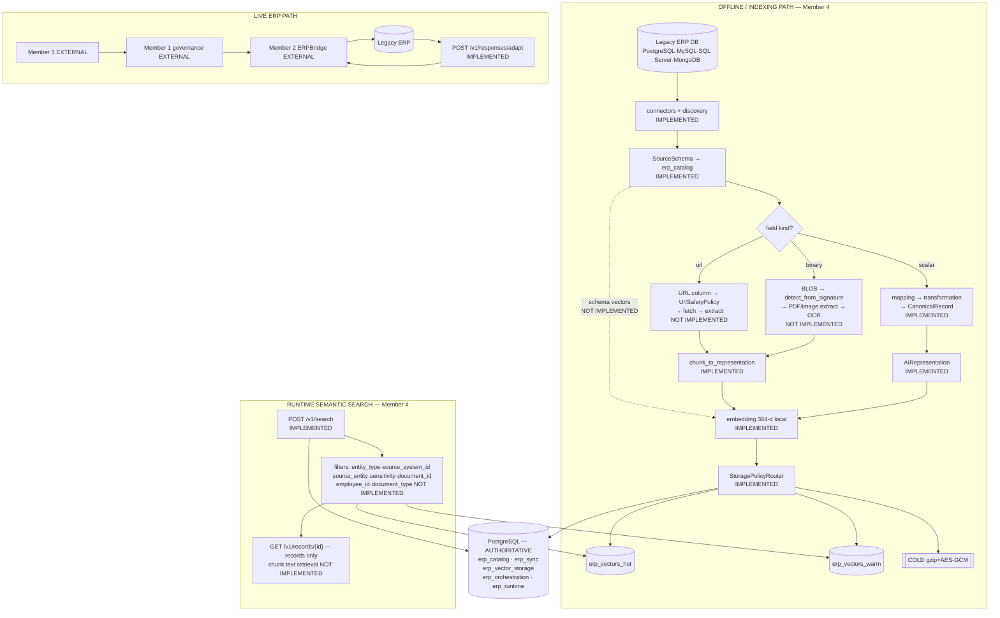

# IT22267290 — Revised Component Requirement Compliance Audit

**ERP-Aware Multimodal Data Preparation, Vector Indexing and Retrieval Pipeline for Legacy ERP Systems**
Member 4 · Project **R26-SE-034** · SLIIT 4th Year Research Component

| | |
|---|---|
| Repository | `src/erp_pipeline/` — 17 packages, 181 files, 60,276 lines |
| Audit mode | **READ-ONLY.** One file created. Nothing edited, fixed, refactored or committed. |
| Authority order | source → tests → **executed runtime** → OpenAPI → schemas → artifacts → docs |
| Qdrant at audit time | **NOT REACHABLE** (`localhost:6333`) — collections derived from configuration and tests |
| Audit date | 2026-08-22 |

> **Method.** Every claim below marked **MEASURED** was produced by executing the
> real code during this audit. Claims marked **VERIFIED** come from reading the
> current source. Nothing is asserted from documentation alone.

---

## THE HEADLINE, BEFORE ANYTHING ELSE

Your revised scope adds four capabilities that the existing codebase was never
built for. Three of them **do not exist**:

| Revised capability | Reality |
|---|---|
| Schema information indexed in Qdrant | **NOT IMPLEMENTED** — `ai/` contains zero references to `SourceSchema`/`SourceEntity`/`SourceField` |
| Database BLOB → OCR → Qdrant | **NOT IMPLEMENTED** — a BLOB becomes a **base64 string** and is embedded as literal base64 text |
| Database URL field → fetch → extract → index | **NOT IMPLEMENTED** — no URL detection exists anywhere in discovery, transformation or sync |
| Upload → automatically searchable | **NOT IMPLEMENTED** — uploads stop at extraction/catalog; a separate job is required |

The pipeline that *does* exist is excellent and should not be rewritten. But the
revised component definition, as written, is **not true of the current code**.

---

# PART 1 — THE REVISED COMPONENT, STATED PRECISELY

## Research problem

Legacy ERP systems hold business knowledge in forms that are structurally
heterogeneous and semantically opaque: vendor-abbreviated columns across four
database dialects, plus binary columns holding scanned documents, plus URL
columns pointing at external files, plus the schema itself — which carries
meaning ("the `employees` table has a `birth_certificate` column") that no
current retrieval system can reach. None of this is directly usable by an AI
retrieval system.

## Main objective

Convert heterogeneous legacy ERP content — structural, structured, and
multimodal — into retrievable AI-ready representations, index them in a vector
store with sufficient metadata to support both exact-identity and semantic
retrieval, preserve provenance back to the originating ERP artifact, and keep
the index synchronised as the source changes.

## Sub-objectives

| # | Sub-objective |
|---|---|
| SO1 | Connect to legacy ERP databases and discover their structure |
| SO2 | Classify field content — text, numeric, temporal, **binary, document reference** |
| SO3 | Extract meaning from non-text content (OCR, PDF parsing) **wherever it originates** |
| SO4 | Produce AI-ready representations for structural, structured and document content |
| SO5 | Embed and index those representations with retrievable metadata |
| SO6 | Support exact-identity retrieval **and** semantic retrieval |
| SO7 | Preserve provenance from vector back to source artifact |
| SO8 | Keep the index synchronised with source change |
| SO9 | Expose retrieval to downstream AI systems |

## Inputs

Legacy databases (PostgreSQL, MySQL, SQL Server, MongoDB) · uploaded CSV / PDF /
image files · API specifications · **binary column values** · **document
reference URLs** · already-executed ERP API responses.

## Processing stages

```
discovery → classification → extraction (text · OCR · PDF) → normalization
→ chunking → representation → embedding → vector indexing → retrieval
                                                    ↑
                                    incremental synchronisation
```

## Outputs

`SourceSchema` · `MappingProfile` · `CanonicalRecord` · `AIRepresentation` ·
`EmbeddingRecord` · Qdrant vectors + payload · `SearchResponse` ·
`AdaptedResponse` · `IntegrityReport`.

## Research mechanisms

M1 explainable canonical mapping · M2 policy-driven tier routing ·
M3 deterministic query-relevance response adaptation · **M4 (new) schema-aware
vector knowledge representation** · **M5 (new) multimodal DB content indexing**.

## Integration boundaries

Member 1 governance (external) · Member 2 ERP execution (external) ·
Member 3 UI (external) · **Member 4 never calls an ERP API and never calls an
LLM** — enforced in code, not merely stated.

---

# PART 2 — REQUIREMENTS LIST

R1 legacy DB connectivity · R2 schema/table/column discovery · R3 relationship
discovery · R4 structured-record extraction · R5 binary/BLOB field detection ·
R6 image-byte handling · R7 image URL/reference handling · R8 PDF/document
handling · R9 OCR · R10 normalization · R11 chunking · R12 AI-ready
representation · R13 embedding · R14 Qdrant indexing · R15 multiple/appropriate
collections · R16 metadata with vectors · R17 schema knowledge indexed ·
R18 document representations indexed · R19 structured records indexed ·
R20 exact record retrieval · R21 semantic retrieval · R22 metadata-filtered
retrieval · R23 retrieval by employee/document identity · R24 incremental sync ·
R25 schema drift · R26 source-to-vector provenance · R27 update/delete
consistency · R28 retrieval API · R29 frontend upload integration ·
R30 Member 2 runtime integration · R31 real-time behaviour · R32
security/sensitivity · R33 failure/recovery · R34 evaluation evidence.

**Added by this audit** (the revised scope implies them):

| ID | Requirement |
|---|---|
| **R35** | **Database BLOB → document-extraction routing** (distinct from R5 detection and R8 upload handling) |
| **R36** | **Automatic upload → searchable** (upload alone produces a queryable vector) |
| **R37** | **Chunk-level retrieval payload** (page/chunk identity returned by search) |
| **R38** | **Retrieval of extracted text content** (an API that returns the text a vector represents) |

---

# PART 3 — REQUIREMENT COMPLIANCE MATRIX

| ID | Requirement | Status | Evidence | Current behaviour | Gap |
|---|---|---|---|---|---|
| R1 | Legacy DB connectivity | **FULLY SATISFIED** | `connectors/postgresql.py`, `mysql.py`, `sqlserver.py`, `mongodb.py`, `registry.py` | 4 dialects behind one abstraction | SQL Server live verification deferred |
| R2 | Schema/table/column discovery | **FULLY SATISFIED** | `discovery/relational.py::DiscoveryService`, `discovery/mongodb_inference.py`; `POST /v1/sources/{id}/discover` | Declared (SQL) + observed (Mongo) | — |
| R3 | Relationship discovery | **FULLY SATISFIED** | `SourceRelationship`; `SchemaRelationshipResponse` in `GET /v1/schemas/{id}` | `from_entity`/`to_entity`/`from_fields`/`to_fields`/`confidence` | — |
| R4 | Structured-record extraction | **FULLY SATISFIED** | `orchestration/stages.py::run_extract`; `PipelineStage.EXTRACT` | Streams source rows | — |
| R5 | Binary/BLOB **detection** | **FULLY SATISFIED** | `discovery/type_mapping.py:41-49` — VARBINARY, BYTEA, LONGBLOB, MEDIUMBLOB, TINYBLOB, BLOB, BINARY, IMAGE; `:172` `sqltypes.LargeBinary`; `mongodb_inference.py:116` `binData` → `FieldDataType.BINARY` | Discovery reports `normalized_data_type: "binary"` | **Detection only — nothing acts on it** |
| **R6** | Image-byte handling | **PARTIALLY SATISFIED** | `ingestion/image_ingestion.py` (upload); `response_adaptation/assets.py` (Phase 14) | Works for **uploads** and **Member 2 responses** | **NOT from a DB BLOB** |
| **R7** | Image/document URL handling | **PARTIALLY SATISFIED** | `response_adaptation/assets.py::validate_asset_url` | Works **only** for explicit `asset_urls[]` in a Phase 14 request | **No URL detection in DB ingestion. MEASURED: a URL inside a body is passed through as plain text** |
| R8 | PDF/document handling | **FULLY SATISFIED** | `ingestion/pdf_ingestion.py::PdfFileIngestion`; `POST /v1/files/documents` | PyMuPDF + page provenance | — |
| R9 | OCR | **FULLY SATISFIED** | `ingestion/ocr.py::probe_ocr`, `run_ocr` | Tesseract, optional; degrades to `ocr_unavailable` | Requires Tesseract |
| R10 | Content normalization | **FULLY SATISFIED** | `transformation/type_converter.py`, `mapping/normalization.py` | Exact `Decimal` money, stable `IssueCode`s | — |
| R11 | Chunking | **FULLY SATISFIED** | `ai/chunking.py::chunk_document`, `chunk_text` | Page-anchored chunks | — |
| R12 | AI-ready representation | **FULLY SATISFIED** | `ai/representation.py::canonical_record_to_representation`; `ai/chunking.py::chunk_to_representation` | Deterministic labelled text | — |
| R13 | Embedding | **FULLY SATISFIED** | `ai/embedding.py::SentenceTransformerModel`, 384-d, local | Dimension **measured**, not assumed | — |
| R14 | Qdrant indexing | **FULLY SATISFIED** | `storage/hot_tier.py`, `warm_tier.py`, `hybrid_store.py` | float32 HOT / int8 WARM | — |
| **R15** | Multiple/appropriate collections | **NOT REQUIRED / BAD REQUIREMENT** | `runtime/settings.py:144-145` — `erp_vectors_hot`, `erp_vectors_warm` | **Tier-separated, filter-partitioned** | See Part 15 — the current design is *better* than one-per-modality |
| R16 | Metadata stored with vectors | **PARTIALLY SATISFIED** | `storage/migration.py:438-465 _payload_for` | 11 payload keys (Part 13) | **No page/chunk, no text, no business identifiers** |
| **R17** | **Schema knowledge indexed** | **NOT SATISFIED** | `grep SourceSchema\|SourceEntity\|SourceField src/erp_pipeline/ai/` → **zero hits** | Schema lives **only** in `erp_catalog` (PostgreSQL) | **Entire capability absent** |
| R18 | Document representations indexed | **PARTIALLY SATISFIED** | `orchestration/stages.py:274-282 run_ai_build`; `PipelineServices.build_document_representations`; `DOCUMENT_STAGES` = INGEST→AI_BUILD→EMBED→TIER_ROUTE | Works **via `POST /v1/jobs`** | **Not via upload** (R36) |
| R19 | Structured records indexed | **FULLY SATISFIED** | `STRUCTURED_TAIL` in `orchestration/planner.py:52-60` | EXTRACT→TRANSFORM→VALIDATE→LOAD→AI_BUILD→EMBED→TIER_ROUTE | Requires an approved mapping |
| R20 | Exact record retrieval | **FULLY SATISFIED** | `GET /v1/records/{record_id:path}`; `orchestration/record_store.py` | By `canonical_record_id` | Canonical records only — **not document chunks** |
| R21 | Semantic retrieval | **FULLY SATISFIED** | `POST /v1/search`; `storage/hybrid_store.py::search` | HOT+WARM, optional COLD rehydration | — |
| R22 | Metadata-filtered retrieval | **PARTIALLY SATISFIED** | `storage/filters.py:38-45 FILTERABLE_FIELDS` | 5 fields, server-side in Qdrant, unknown names **refused** with 422 | **Closed set — no business identifiers** |
| **R23** | Retrieval by employee/document identity | **NOT SATISFIED** | **MEASURED**: `employee_id` → `UnknownFilterFieldError`; `document_type` → refused | Only `document_id` (a content hash) can be filtered | **Cannot filter by `EMP002`** |
| R24 | Incremental sync | **FULLY SATISFIED** | `sync/coordinator.py::SyncCoordinator.run`; `erp_sync.sync_state` | Watermark never passes a failure | Job-triggered only |
| R25 | Schema drift | **FULLY SATISFIED** | `sync/drift.py::detect_drift`, `findings_from_diff`; `JobType.DRIFT_CHECK` | Classified by type + severity | — |
| R26 | Source-to-vector provenance | **PARTIALLY SATISFIED** | `AIRepresentation.metadata`; `erp_vector_storage.vector_storage_state` | Strong for structured; see Part 31 | **No DB/schema/field/page granularity** |
| R27 | Update/delete consistency | **FULLY SATISFIED** | `sync/propagation.py:118,218 delete()`; deterministic UUIDv5 upsert | Same id → update in place | Delete depends on the source reporting it |
| R28 | Retrieval API | **PARTIALLY SATISFIED** | `POST /v1/search`, `GET /v1/records/{id}` | Returns ids + metadata | **Returns no text** (R38) |
| R29 | Frontend upload integration | **PARTIALLY SATISFIED** | `frontend/src/pages/Upload.tsx`; `POST /v1/files/csv`, `/documents` | 2 endpoints wired | No API key; CORS closed by default |
| R30 | Member 2 runtime integration | **FULLY SATISFIED** | `POST /v1/responses/adapt`; 106 tests | All 5 response types | — |
| **R31** | Real-time behaviour | **PARTIALLY SATISFIED** | See Part 25 | Request/response **is** real-time; **synchronisation is MANUAL/BATCH** | No scheduler exists |
| R32 | Security / sensitivity | **PARTIALLY SATISFIED** | `SensitivityLevel`; `storage/vector_router.py:113 prohibited_tiers`; SSRF controls | Propagated + enforced | **Never inferred; record-level only** |
| R33 | Failure / recovery | **FULLY SATISFIED** | `sync/coordinator.py:195-198`; `verification/` 18 codes | Checkpoint never passes a failure | — |
| R34 | Evaluation evidence | **PARTIALLY SATISFIED** | `artifacts/phase12_*`, `phase14_*`; mapping benchmark | 3 measured artifacts | **None covers the revised claims** |
| **R35** | **DB BLOB → document pipeline** | **NOT SATISFIED** | `type_converter.py:528 _to_binary` → base64 string. **No caller of `ingest_pdf_file`/`ingest_image_file`/`AssetAdapter` outside `ingestion/` and `response_adaptation/`** | A BLOB becomes base64 text | **Entire capability absent — see Part 9** |
| **R36** | **Upload → automatically searchable** | **NOT SATISFIED** | `api/routers_data.py:137,182` — neither route calls `mapping`, `ai` or `storage` | Upload stops at extraction/catalog | **Requires a separate job** |
| **R37** | Chunk-level retrieval payload | **NOT SATISFIED** | `migration.py:447-462 _payload_for` — no `page_start`/`chunk_index` | Chunk metadata exists on `AIRepresentation` but **is not propagated to Qdrant** | Search cannot say which page |
| **R38** | Retrieval of extracted text | **NOT SATISFIED** | `hot_tier.py:195` / `warm_tier.py:242` `with_payload=False`; **no API references `text_for_ai`** | Search returns ids + metadata only | **No way to read a chunk's text** |

**Totals: 20 FULLY SATISFIED · 11 PARTIALLY SATISFIED · 6 NOT SATISFIED · 1 NOT REQUIRED / BAD REQUIREMENT. (38 requirements.)**

---

# PART 4 — LEGACY DATABASE CONNECTION

| Database | Connection | Schema discovery | Data extraction | Relationships | Incremental sync | Runtime maturity | Live test coverage |
|---|---|---|---|---|---|---|---|
| **PostgreSQL** | ✅ `connectors/postgresql.py` | ✅ declared | ✅ | ✅ FK | ✅ in `INCREMENTAL_SOURCES` | **Production** | ✅ live tests |
| **MySQL** | ✅ `connectors/mysql.py` | ✅ declared | ✅ | ✅ FK | ✅ | **Production** | ✅ live tests ran this session |
| **SQL Server** | ✅ `connectors/sqlserver.py` | ✅ declared | ✅ | ✅ FK | ✅ | **Implemented, live-unverified** | ❌ — self-declared in `/v1/capabilities` |
| **MongoDB** | ✅ `connectors/mongodb.py` | ✅ **observed**, bounded sample | ✅ | ⚠️ inferred/embedded only | ✅ | **Production** | ⏭️ skipped (`localhost:27018` unreachable) |

**Catalog/schema/table preservation: YES.** `SourceSchema.source_system_id`,
`SourceEntity.entity_id` / `source_name` / `normalized_name` / `entity_kind`,
`SourceField.source_name` / `normalized_name` / `ordinal` / `nested_path` —
persisted across `erp_catalog.source_systems`, `schema_snapshots`,
`source_entities`, `source_fields`, `source_relationships`.

**Nuance worth knowing:** `SourceField.source_data_type` preserves the vendor
type **verbatim** (`VARCHAR(100)`, `NVARCHAR`, `BYTEA`), while
`normalized_data_type` is the coarse cross-dialect lattice. Both survive to the
API, which is what makes Member 2's tool generation possible.

---

# PART 5 — DATABASE STRUCTURE DISCOVERY

```
Legacy DB → catalog/schema → table/collection → column/field → type
          → PK/unique → relationships → SourceSchema
```

**Verified model names** (`schemas/source_models.py`, `schemas/enums.py`):

| Model | Key attributes |
|---|---|
| `SourceSchema` | `schema_id`, `source_system_id`, `schema_name`, `schema_version`, `schema_hash`, `origin` (`SchemaOrigin`), `entities`, `relationships` |
| `SourceEntity` | `entity_id`, `source_name`, `normalized_name`, `entity_kind` (`EntityKind`: TABLE · VIEW · COLLECTION · DATASET · API_SCHEMA · DOCUMENT_SET · OTHER), `fields`, `primary_key_fields` |
| `SourceField` | `source_name`, `normalized_name`, **`source_data_type`**, **`normalized_data_type`** (`FieldDataType`), `nullable`, `required`, `is_primary_key`, `is_unique`, `is_array`, `nested_path`, `semantic_type`, `ordinal` |
| `SourceRelationship` | `relationship_id`, `relationship_type`, `from_entity`, `from_fields`, `to_entity`, `to_fields`, `confidence` |

**Where it is stored:**

| Store | Contents |
|---|---|
| **PostgreSQL `erp_catalog`** (7 tables) | The **entire** schema — systems, versioned snapshots, entities, fields, relationships, mapping profiles, field mappings |
| **In-process `schema_cache`** | Ephemeral; lost on restart |
| **Qdrant** | **NOTHING. No schema information reaches Qdrant.** |

---

# PART 6 — CRITICAL: IS SCHEMA INFORMATION IN QDRANT?

```
Is schema information embedded?              NO
Is schema information stored in Qdrant?      NO
Can I semantically search
  "Which table contains employee birth certificates?"   NO
Can I retrieve employee table → birth_certificate column
  from Qdrant today?                                    NO
```

## Evidence

```
$ grep -rn "SourceSchema|SourceField|SourceEntity" src/erp_pipeline/ai/
(no matches)
```

The `ai/` package — the **only** package that constructs `AIRepresentation` and
`EmbeddingRecord` — has **zero references** to any schema model. Its two
representation builders are:

| Builder | Input | Not schema |
|---|---|---|
| `canonical_record_to_representation(record, config)` | `CanonicalRecord` | a business **row** |
| `chunk_to_representation(chunk, entity_type, metadata)` | `DocumentChunk` | a document **chunk** |

There is no third builder. Nothing embeds a table name, a column name, a type,
a description or a relationship.

## The distinction that matters

| | Schema **in PostgreSQL** | Schema **in Qdrant** |
|---|---|---|
| Present today | ✅ `erp_catalog` — complete and versioned | ❌ **absent** |
| Retrieval mode | Exact lookup by `schema_id` via `GET /v1/schemas/{id}` | Would be semantic search |
| Answers "which table holds birth certificates?" | ❌ only if you already know the schema_id and read it yourself | ✅ — **but this does not exist** |

**Your revised requirement R17 is entirely unmet.** This is not a partial
implementation or a configuration gap — the capability was never built, because
the original component scope never called for it.

**What it would take** (stated for planning only — *not implemented*): a third
representation builder that renders a `SourceEntity` + its `SourceField`s into
descriptive text, plus a `JobType` to index it, plus payload keys to filter it.
Roughly the same shape as `chunk_to_representation`.

---

# PART 7 — STRUCTURED ERP RECORD INDEXING

Every transition **VERIFIED**:

| # | Transition | Implementation |
|---|---|---|
| 1 | ERP row → `SourceRecord` | `transformation/models.py::SourceRecord.from_mapping` |
| 2 | → mapping | `mapping/service.py::MappingService.generate` → `MappingProfile` |
| 3 | → transformation | `transformation/service.py::TransformationService.transform_record` |
| 4 | → `CanonicalRecord` | `record_id = erp:{sys}:{entity}:{business key}` |
| 5 | → `AIRepresentation` | `ai/representation.py:173 canonical_record_to_representation` |
| 6 | → `EmbeddingRecord` | `ai/embedding.py::SentenceTransformerModel.encode` |
| 7 | → Qdrant | `storage/hybrid_store.py` → `QdrantHotTier` / `QdrantWarmTier` |

**Representative example (MEASURED earlier this session):**

```
{"inv_no":"INV-204","cust_ref":"CUS-17","total_amt":"45000.00","curr":"LKR",
 "approval_status":"A","row_version":7}
        ↓
CanonicalRecord  record_id = erp:finance_erp:invoice:inv-204
  normalized_data = {"invoice_id":"INV-204","customer_id":"CUS-17",
                     "amount":Decimal("45000.00"),"currency":"LKR","status":"A"}
        ↓
AIRepresentation representation_id = ai:invoice:erp_finance_erp_invoice_inv-204
  text_for_ai = "Entity: Invoice\nAmount: 45000.00\nCurrency: LKR\n..."
        ↓
EmbeddingRecord  384-d, model all-MiniLM-L6-v2
        ↓
Qdrant point     vector_id = UUIDv5(erp-vector/erp:finance_erp:invoice:inv-204)
```

## Canonical entity coverage — VERIFIED

`mapping/canonical_model.py::DEFAULT_CANONICAL_MODEL` — **3 entities, 14 fields**:

| Entity | Fields | Exists? |
|---|---|---|
| `invoice` | invoice_id, customer_id, amount, currency, status, issued_on | ✅ |
| `customer` | customer_id, name, email, phone | ✅ |
| `purchase_order` | purchase_order_id, supplier_id, amount, status | ✅ |
| **`employee`** | — | ❌ **DOES NOT EXIST** |

## Impact on the revised EMP002 scenario

Because there is no `employee` canonical entity:

- `MappingService` produces **no profile** for an employee table.
- Without a profile, `POST /v1/jobs` with `STRUCTURED_PIPELINE` **cannot run**
  — `MappingNotExecutableError` → HTTP 409.
- **Employee rows therefore never become `CanonicalRecord`s, never become
  representations, and never reach Qdrant** through the structured path.
- In the Phase 14 runtime path, employee data runs the **passthrough** path with
  `entity_type: null` (MEASURED, Part 22).

**This is the single largest structural blocker to the revised EMP002 scenario.**

---

# PART 8 — NON-TEXT DATABASE FIELD DISCOVERY

**Discovery genuinely detects binary fields.** `discovery/type_mapping.py:41-49`:

```python
# --- binary (before anything that could prefix-collide) ---
("VARBINARY", FieldDataType.BINARY),
("BYTEA",     FieldDataType.BINARY),
("LONGBLOB",  FieldDataType.BINARY),
("MEDIUMBLOB",FieldDataType.BINARY),
("TINYBLOB",  FieldDataType.BINARY),
("BLOB",      FieldDataType.BINARY),
("BINARY",    FieldDataType.BINARY),
("IMAGE",     FieldDataType.BINARY),
```
plus `:172` `(sqltypes.LargeBinary, FieldDataType.BINARY)` and
`mongodb_inference.py:116` `"binData": FieldDataType.BINARY`.

| Dialect | Source type preserved | Normalized | Binary detected | Semantic type |
|---|---|---|---|---|
| PostgreSQL | `BYTEA` verbatim | `binary` | ✅ | ❌ not populated for binary |
| MySQL | `LONGBLOB`/`BLOB` verbatim | `binary` | ✅ | ❌ |
| SQL Server | `VARBINARY`/`IMAGE` verbatim | `binary` | ✅ | ❌ |
| MongoDB | `binData` | `binary` | ✅ | ❌ |

## Can discovery say `employees.birth_certificate = binary`?

# **YES — but only "binary".**

It **cannot** say *image*, *PDF*, *document*, or *birth certificate*. The
`FieldDataType` lattice has exactly one binary member; there is no
`IMAGE`/`DOCUMENT` distinction, and `semantic_type` is not populated for binary
columns.

**What is missing:** content-level classification of a binary column. Discovery
knows the column *is* bytes; nothing samples those bytes to determine whether
they are a JPEG, a PDF, or an encrypted archive — even though
`ingestion/detection.py::detect_from_signature` could do exactly that and is
already used elsewhere.

---

# PART 9 — CRITICAL: DATABASE BLOB → DOCUMENT PIPELINE

# **NOT IMPLEMENTED.**

## What actually happens to a BLOB

`transformation/type_converter.py:528`:

```python
def _to_binary(value, options):
    if isinstance(value, (bytes, bytearray)):
        return ConversionResult.success(
            base64.b64encode(bytes(value)).decode("ascii")
        )
```

A BLOB is **base64-encoded into an ASCII string** and stored in
`CanonicalRecord.normalized_data`. The module docstring explains why — the frozen
Phase 1 contract validates `normalized_data` with `require_json_object` and the
serializer rejects `bytes` outright — which is a sound decision *for the original
scope*.

## The routing that does not exist

```
$ grep -rn "ingest_pdf_file|ingest_image_file|AssetAdapter|detect_from_signature" \
       src/erp_pipeline/ --include=*.py | grep -v "^src/erp_pipeline/(ingestion|response_adaptation)/"
(no matches)
```

**No code outside `ingestion/` and `response_adaptation/` ever calls a document
extractor.** The structured extraction path has no branch that inspects a binary
value, no magic-byte check, no OCR call, no chunking.

## The consequence nobody would expect

`ai/representation.py::flatten` excludes only `config.operational_keys`. It does
**not** exclude binary or base64. So if `employees.birth_certificate` were mapped
to a canonical BINARY target, its base64 string would be rendered into
`text_for_ai` as a literal line:

```
Birth Certificate: /9j/4AAQSkZJRgABAQEAYABgAAD/2wBDAAgGBgcGBQgHBwcJ...
```

and then **embedded as if it were meaningful text**, truncated at
`RepresentationConfig.max_characters` with a `[content truncated]` marker.

**This would actively pollute the vector**, not merely fail to help. It is a
latent correctness problem the revised scope would walk straight into.

## Verdict

```
DATABASE BLOB → DOCUMENT PIPELINE:  NOT IMPLEMENTED
```

**Do not confuse this with the upload path.** `POST /v1/files/documents` handles
PDFs and images correctly and completely. That is a *different entry point*. A
BLOB sitting in `employees.birth_certificate` has no route to it.

---

# PART 10 — IMAGE / DOCUMENT URLS

The two paths must not be merged, because they behave completely differently.

## A. DATABASE INGESTION URL HANDLING — **NOT IMPLEMENTED**

```
$ grep -rniE "https?://|is_url|looks_like_url|url_field|semantic_type.*url" \
       src/erp_pipeline/discovery/ src/erp_pipeline/transformation/ src/erp_pipeline/sync/
(no matches)
```

For a row `{"employee_id":"EMP002","birth_certificate_url":"https://.../EMP002-birth.pdf"}`:

| Step | Behaviour |
|---|---|
| detect URL | ❌ — no detection exists |
| classify as asset | ❌ |
| validate URL | ❌ |
| fetch URL | ❌ |
| inspect MIME/magic bytes | ❌ |
| extract document | ❌ |
| OCR | ❌ |
| embed | ⚠️ **the URL string itself is embedded as text** |
| store vector | ⚠️ vector of the literal URL, not of its content |

**The URL is treated as an ordinary `STRING` column.** Its *characters* get
embedded; the document it points to is never seen.

## B. REAL-TIME RESPONSE ADAPTATION URL HANDLING — **IMPLEMENTED, opt-in**

`response_adaptation/assets.py` — 14 SSRF controls, fetching **disabled by
default**, no HTTP client shipped, every refusal carries a named rule.

**But note the boundary precisely (MEASURED):** a URL appearing *inside the
response body* is **not** auto-detected as an asset. Member 2 must place it in
the explicit `asset_urls[]` array.

```
MEASURED — body contains "birth_certificate_url": "https://legacy-erp.example/..."
  llm_ready includes: "birth_certificate_url": "https://legacy-erp.example/..."
  URL treated as: plain text field
  assets: (none — URL in body is NOT auto-detected as an asset)
```

| | DB ingestion | Phase 14 adaptation |
|---|---|---|
| URL in a column/body field | ❌ plain text | ❌ plain text |
| URL in explicit `asset_urls[]` | n/a | ✅ full SSRF + fetch + extract |

---

# PART 11 — PDF / DOCUMENT PIPELINE

## A. Uploaded PDF — `POST /v1/files/documents`

| Stage | Status |
|---|---|
| Magic bytes | ✅ `ingestion/detection.py::_SIGNATURES` |
| PyMuPDF | ✅ `PdfFileIngestion` |
| Text extraction | ✅ |
| OCR fallback | ✅ `PdfOptions.ocr_fallback` |
| Page provenance | ✅ `ExtractedPage.page_number` |
| Hashing | ✅ SHA-256 |
| Chunking | ❌ **not in this route** |
| `AIRepresentation` | ❌ **not in this route** |
| Embedding | ❌ **not in this route** |
| Qdrant | ❌ **not in this route** |

# **Answer: `POST /v1/files/documents` ONLY extracts and stores metadata. It does NOT continue to chunk → embed → Qdrant.**

**Verified:** the route body (`api/routers_data.py:182-206`) calls
`_store_upload` then `service.services.ingest_upload(...)` and returns. It
contains **no** call to `ai`, `mapping`, `transformation` or `storage`.

The extracted text is held in the in-process `upload_results` dict and is
**never returned and never persisted as a vector**.

## B. PDF from ERP/database

**This route does not exist.** See Part 9 — no BLOB→document routing.

The only way a PDF reaches Qdrant is:

```
POST /v1/files/documents          (upload — metadata only)
        ↓  MANUAL SEPARATE CALL
POST /v1/jobs {job_type: "document_pipeline", ...}
        ↓
INGEST → AI_BUILD (chunk_to_representation) → EMBED → TIER_ROUTE → Qdrant
```

**Verified:** `orchestration/planner.py:62-67 DOCUMENT_STAGES`;
`orchestration/stages.py:274-282 run_ai_build` →
`PipelineServices.build_document_representations` → `document_to_representations`.

---

# PART 12 — IMAGE PIPELINE

| Origin | Detection | Extraction/OCR | Representation | Embedding | Qdrant | Status |
|---|---|---|---|---|---|---|
| **Uploaded image** (`POST /v1/files/documents`) | ✅ magic bytes | ✅ Pillow + OCR | ❌ | ❌ | ❌ | **Extraction only** |
| Uploaded image **+ `POST /v1/jobs` document_pipeline** | ✅ | ✅ | ✅ | ✅ | ✅ | **Complete — 2 steps** |
| **Database BLOB image** | ❌ | ❌ | ❌ | ❌ | ❌ | **NOT IMPLEMENTED** |
| **Real-time ERP image response** (Phase 14) | ✅ | ✅ | ❌ | ❌ | ❌ | **Adapted, never indexed** |
| **Image URL** (Phase 14, `asset_urls[]`) | ✅ SSRF + magic bytes | ✅ | ❌ | ❌ | ❌ | **Adapted, never indexed** |

**Is OCR output persisted/indexed?** Only through the document-pipeline **job**.
Upload alone does not persist it retrievably; Phase 14 returns it in the response
and forgets it (adaptation is stateless).

**Is image metadata indexed?** Dimensions live on
`ExtractedDocument.document_metadata`. They are **not** in the Qdrant payload and
**not** in `DocumentUploadResponse`.

**Are raw image bytes in Qdrant?** **No — and correctly so.**

## What IS stored, and why that is right

| Artifact | Where | Why |
|---|---|---|
| Raw bytes | Upload store on disk (`erp_runtime.uploads`) | Qdrant is a vector index, not a blob store |
| Derived text (OCR/PDF) | `text_for_ai` on the representation → **embedded**, then discarded | The text's *meaning* is what retrieval needs |
| Embedding vector | Qdrant HOT/WARM | The searchable artifact |
| Metadata | Qdrant payload + PostgreSQL tier state | Filtering + provenance |
| External reference | `document_id`, `content_hash` | Resolves back to the artifact |

**Storing raw bytes in Qdrant would be an architectural error** — it would bloat
the index, defeat quantization, and duplicate a store that already exists.

---

# PART 13 — WHAT QDRANT ACTUALLY STORES

**Exact payload keys** — `storage/migration.py:438-465 _payload_for`:

```python
payload = {
    "representation_id": ..., "embedding_id": ..., "content_hash": ...,
    "model_id": ..., "dimension": ..., "entity_type": ..., "sensitivity": ...,
}
optional = {                      # omitted when None
    "canonical_record_id": ..., "source_system_id": ...,
    "source_entity": ..., "document_id": ...,
}
```

| Field | In Qdrant payload? |
|---|---|
| vector | ✅ (the point itself) |
| `canonical_record_id` | ✅ optional |
| `source_system_id` | ✅ optional |
| `source_entity` | ✅ optional |
| `document_id` | ✅ optional |
| `sensitivity` | ✅ |
| `content_hash` | ✅ |
| `entity_type` · `model_id` · `dimension` · `embedding_id` · `representation_id` | ✅ |
| **document chunk metadata** (`page_start`, `page_end`, `chunk_index`) | ❌ **NO** |
| **schema metadata** | ❌ **NO** |
| **text representation** | ❌ **NO** |

The docstring states the design intent explicitly: *"The safe payload stored
beside a vector. **Identities only, no content.**"*

## The technically correct storage model — and the current gap

| Layer | Correct home | Current state |
|---|---|---|
| Raw artifact | Object/file store | ✅ upload store on disk |
| Derived text | A retrievable text store | ❌ **MISSING — embedded then discarded** |
| Embedding vector | Qdrant | ✅ |
| Filterable metadata | Qdrant payload | ⚠️ **too narrow — no chunk/business identity** |
| Authoritative metadata | PostgreSQL | ✅ `erp_vector_storage` |

**The missing derived-text store is the reason R38 fails**, and it is what makes
the EMP002 scenario unanswerable even after a vector is found.

---

# PART 14 — QDRANT COLLECTION INVENTORY

Qdrant was **not reachable** during this audit, so this is derived from
`runtime/settings.py:144-159` and the tier implementations.

| Collection | Purpose | Dim | Distance | Quantization | Payload | Tier | Producer | Consumer |
|---|---|---|---|---|---|---|---|---|
| **`erp_vectors_hot`** (`ERP_QDRANT_HOT_COLLECTION`) | Low-latency search | 384 | Cosine | **none**, in RAM, not on disk | 11 keys | HOT | `TIER_ROUTE` / migration | `POST /v1/search` |
| **`erp_vectors_warm`** (`ERP_QDRANT_WARM_COLLECTION`) | Lower footprint | 384 | Cosine | **int8 scalar, `on_disk=True`**, server-verified | 11 keys | WARM | same | same |
| *temporary rehydration* | COLD search | 384 | Cosine | none | same | COLD | `include_cold=true` | same request only |
| `erp_phase12_bench_*` | Benchmark isolation | 384 | Cosine | per-tier | — | — | `scripts/benchmark_tiered_storage.py` | benchmark |

**Two production collections. Both are tier-separated, not modality-separated.**

---

# PART 15 — CRITICAL: MULTIPLE SUITABLE COLLECTIONS

## The three candidate designs

**Design A — one collection per modality** (structured / documents / schema /
images). Requires fan-out queries and result merging; blocks a single ranked
result set; multiplies operational surface; and forces a caller to know *where*
an answer lives before asking.

**Design B — one shared collection, payload metadata + server-side filters.**
One ANN search, one ranking, filters pushed into Qdrant.

**Design C — tier-based collections + modality/entity metadata in the payload.**
Collections separate on the axis that has genuinely different *physical*
requirements (RAM vs disk vs archive); logical separation is a filter.

## Which does the current code implement?

# **Design C.**

Collections split on **storage physics** (float32/RAM vs int8/disk vs
encrypted archive). Logical partitioning is by payload: `entity_type`,
`source_system_id`, `source_entity`, `document_id`, `sensitivity` — pushed into
Qdrant as a server-side `Filter` (`storage/filters.py:152 to_qdrant_filter`).

## Does this satisfy the revised requirement in a technically defensible way?

# **YES — the architecture is right. The metadata is too narrow.**

**Design C is the correct choice**, and Design A would be a mistake:

- HOT/WARM/COLD have genuinely different *physical* configurations. That is a
  real reason to separate collections.
- Modality does **not** have different physical requirements — a document-chunk
  vector and an invoice vector are both 384 float32 values from the same model.
- Splitting by modality would force fan-out + client-side merge, and would make
  "search everything about EMP002" require N queries instead of one filtered one.

**Therefore:**

```
R15 "multiple/appropriate Qdrant collections"
    NOT REQUIRED / BAD REQUIREMENT
```

**The better design — which the code already implements — is one collection per
storage tier, with modality and identity expressed as filterable payload
metadata.**

**But the requirement behind R15 is real and unmet.** What you actually need is
not more collections; it is **more payload keys**: `content_kind`
(`record`/`document_chunk`/`schema`), `page_start`, `chunk_index`, and business
identity such as `employee_id`. Those belong in the payload and the filter
allow-list, not in separate collections.

---

# PART 16 — HOT / WARM / COLD RELATIONSHIP

# **These are STORAGE-TIER separation, NOT modality separation.**

| | What it separates | Evidence |
|---|---|---|
| HOT | float32, RAM-resident, no quantization | `hot_tier.py:52-76` — *"Create the HOT collection with NO quantization and NO on-disk"* |
| WARM | int8 scalar quantization, `on_disk=True` | `warm_tier.py:1-23`; `quantization_verified()` trusts only the server's own report |
| COLD | gzip + AES-256-GCM files, **not searchable in place** | `cold_tier.py` |

Placement is decided by `StoragePolicyRouter` on **access patterns, age,
dormancy, criticality, latency requirement and sensitivity** — never on whether
the content is a document or a record.

> **A document chunk and an invoice record can sit in the same HOT collection,
> and routinely will.** Nothing about HOT/WARM/COLD distinguishes them.

**Do not claim that HOT/WARM/COLD satisfies a requirement for separate
document/schema/structured collections. It does not, and it was never intended
to.** The correct discriminator is `entity_type` in the payload — which exists,
but has no `content_kind` companion.

---

# PART 17 — DOCUMENT VECTOR INDEXING

```
document → extracted text → chunk → embedding → vector store
```

| Stage | File / function |
|---|---|
| Extract | `ingestion/pdf_ingestion.py::PdfFileIngestion.ingest` |
| Chunk | `ai/chunking.py::chunk_document` → `DocumentChunk` |
| Represent | `ai/chunking.py:263 chunk_to_representation` |
| Batch | `ai/chunking.py:300 document_to_representations` |
| Orchestrate | `orchestration/stages.py:274 run_ai_build` (`if context.document is not None`) |
| Embed | `PipelineServices.embed` → `EmbeddingService.embed_many` |
| Store | `PipelineServices.store_vector` → `HybridVectorStore` |

# **Can `POST /v1/search` retrieve a previously indexed PDF chunk? PARTIAL.**

| | |
|---|---|
| Can it **find** the chunk vector? | ✅ **YES** — if a `document_pipeline` job indexed it |
| Can it tell you the **document**? | ✅ `document_id` is in the payload and in tier state |
| Can it tell you the **page**? | ❌ **NO** — `page_start`/`page_end` are on `AIRepresentation.metadata` but **never copied into `_payload_for`** |
| Can it tell you the **chunk index**? | ❌ **NO** — same reason |
| Can it return the chunk **text**? | ❌ **NO** — `with_payload=False`; no API exposes `text_for_ai` |

**So a search hit on a PDF chunk gives you: a `representation_id`
(= `chunk_id`), a `document_id`, a score, and a tier. You cannot learn which
page it came from, and you cannot read what it says.**

That is the gap that makes R37 and R38 fail, and it is the practical reason the
EMP002 scenario cannot complete.

---

# PART 18 — FRONTEND UPLOAD → QDRANT

# **The current automatic workflow is `upload → extraction/schema inference → STOP`.**

**Neither upload route reaches Qdrant.** Verified by reading both route bodies —
neither contains a call to `mapping`, `transformation`, `ai`, or `storage`.

| Upload | What happens automatically | Reaches Qdrant? | To become searchable |
|---|---|---|---|
| **CSV** | store → hash → detect → parse → infer `SourceSchema` → register source → publish to `erp_catalog` → **STOP** | ❌ **NO** | `POST /v1/mappings/suggest` → resolve ambiguities → `PUT /v1/mappings/{id}` → `POST /v1/jobs {structured_pipeline}` — **and only for canonical entities** |
| **PDF** | store → hash → magic bytes → PyMuPDF → text + OCR fallback → page provenance → **STOP** | ❌ **NO** | `POST /v1/jobs {document_pipeline}` |
| **Image** | store → hash → magic bytes → Pillow → dimensions → OCR → **STOP** | ❌ **NO** | `POST /v1/jobs {document_pipeline}` |

**MEASURED** — a real CSV upload returned `published: false` and no vector
activity; a real PDF and PNG upload returned extraction metadata only.

## Against the revised requirement

Your revised scope expects uploaded material to **become searchable after
ingestion**. It does not. The stop point is deliberate in the original design —
a mapping is a claim about meaning and the engine refuses to execute an
unapproved one (`DEFAULT_EXECUTABLE_STATUSES` excludes `SUGGESTED` and
`REVIEW_REQUIRED`) — but that rationale applies to **CSV**, not to **PDF and
image**, which need no mapping at all.

**R36: NOT SATISFIED.** For documents and images specifically, the extra job
step is a gap rather than a safeguard.

---

# PART 19 — SCENARIO A: FRONTEND UPLOADS A PDF

`employee_birth_certificates.pdf`

| Stage | Required | Actual |
|---|---|---|
| Member 3 frontend | ✅ | **IMPLEMENTED** — `DropBox(kind="document")` |
| Upload PDF | ✅ | **IMPLEMENTED** — `POST /v1/files/documents`, field `file` |
| Validate | ✅ | **IMPLEMENTED** — extension → magic bytes → decode |
| Extract / OCR | ✅ | **IMPLEMENTED** — PyMuPDF + Tesseract fallback |
| Chunk | ✅ | **MANUAL NEXT STEP** — needs `POST /v1/jobs {document_pipeline}` |
| Embedding | ✅ | **MANUAL NEXT STEP** — same job |
| Qdrant | ✅ | **MANUAL NEXT STEP** — same job |
| Searchable | ✅ | **PARTIAL** — findable, but page/chunk/text not retrievable (Part 17) |

**Additional gap:** the upload response gives Member 3 no usable handle —
`document_id` is **always `null`** (a route defect: `ExtractedDocument` has no
such attribute). So the UI cannot even reference the document it just uploaded.

---

# PART 20 — SCENARIO B: FRONTEND UPLOADS AN IMAGE

`EMP002_birth_certificate.jpg`

| Stage | Actual |
|---|---|
| Upload | **IMPLEMENTED** |
| OCR | **IMPLEMENTED** — requires Tesseract; degrades to `ocr_unavailable` with a warning |
| Text extraction | **IMPLEMENTED** — held in-process, **not returned** |
| Metadata | **PARTIAL** — dimensions captured on `document_metadata`, not returned; `ocr_used` **always `false`** (route defect) |
| Embedding | **MANUAL NEXT STEP** |
| Qdrant | **MANUAL NEXT STEP** |
| Retrieval | **PARTIAL** |

## How would `EMP002` / `document_type=birth_certificate` be attached?

# **It would not. There is no mechanism.**

- The **filename** `EMP002_birth_certificate.jpg` is used only to pick the
  endpoint and as `original_filename`. **Nothing parses identity out of it.**
- `chunk_to_representation(chunk, entity_type, metadata)` accepts a `metadata`
  mapping — but `document_to_representations` is called by
  `build_document_representations(result)` with **no metadata argument**, so
  nothing user-supplied ever reaches it.
- The upload endpoints accept **no** metadata fields — only `file`.
- `_payload_for` has no key for a business identifier.

**So an uploaded birth certificate cannot be associated with EMP002 at all.**
This is a hard blocker for the revised scenario, independent of everything else.

---

# PART 21 — SCENARIO C: FRONTEND UPLOADS A SCHEMA/CSV

```
CSV → schema inference → erp_catalog (PostgreSQL) → STOP
```

```
Does schema become vectorized?          NO
Does schema reach Qdrant?               NO
Can an AI semantically search it?       NO
```

**Not inferred — verified.** `grep` for schema models in `ai/` returns nothing
(Part 6). The schema is queryable only by exact lookup:
`GET /v1/schemas/{schema_id}`, which requires you to already know the id.

An AI cannot ask *"which uploaded schema has a birth-certificate column?"*

---

# PART 22 — MAIN SCENARIO: EMP002 BIRTH CERTIFICATE

> **"Give me EMP002 employee birth certificate details."**

| # | Arrow | Status | Why |
|---|---|---|---|
| 1 | User / Member 3 → query | **EXTERNAL MEMBER** | Member 3's UI |
| 2 | → Member 4 retrieval API | **WORKS NOW** | `POST /v1/search` exists |
| 3 | → identify `EMP002` | **MISSING** | **MEASURED**: `employee_id` filter → `UnknownFilterFieldError` → HTTP 422 |
| 4 | → search suitable Qdrant vectors | **WORKS WITH MANUAL PREPARATION** | Requires a prior `document_pipeline` job |
| 5 | → filter `document_type = birth_certificate` | **MISSING** | **MEASURED**: `document_type` → refused. No such payload key exists |
| 6 | → retrieve OCR/document content | **MISSING** | `with_payload=False`; **no API returns `text_for_ai`** |
| 7 | → return birth-certificate details | **MISSING** | Nothing to return — only ids and scores |
| — | *(structured path via employee table)* | **MISSING** | **No `employee` canonical entity** — `STRUCTURED_PIPELINE` cannot run |
| — | *(BLOB in `employees.birth_certificate`)* | **MISSING** | No BLOB→document routing (Part 9) |
| — | *(URL in `birth_certificate_url`)* | **MISSING** | No URL detection in DB ingestion (Part 10) |
| — | *(live path via Member 2)* | **PARTIAL** | `POST /v1/responses/adapt` works, but **passthrough** — `entity_type: null` |

**MEASURED — the live path, the only one that produces anything today:**

```
query: "Give me EMP002 employee birth certificate details."
  entity_type : None          ← PASSTHROUGH (no employee canonical entity)
  llm_ready   : {"employee_id":"EMP002",
                 "birth_certificate_url":"https://legacy-erp.example/documents/EMP002-birth.pdf",
                 "doc_type":"BIRTH_CERT","employee_name":"Nimal Silva",
                 "internal_row_version":81}
  assets      : (none — the URL is plain text, not fetched)
```

Note "details" triggers broad-query handling, so **nothing is filtered out** —
including `internal_row_version`.

---

# PART 23 — EXACT IDENTITY RETRIEVAL VS SEMANTIC SEARCH

**MEASURED against `SearchFilters.from_mapping`:**

```
FILTERABLE_FIELDS = ('entity_type','source_system_id','source_entity','sensitivity','document_id')

  employee_id      REFUSED (UnknownFilterFieldError → HTTP 422)
  document_type    REFUSED (UnknownFilterFieldError → HTTP 422)
  page             REFUSED (UnknownFilterFieldError → HTTP 422)
  chunk_index      REFUSED (UnknownFilterFieldError → HTTP 422)
  entity_type      ACCEPTED
  document_id      ACCEPTED
  source_entity    ACCEPTED
```

```
Can I filter by employee_id today?     NO
Can I filter by document_id?           YES  (but it is a content hash, not a business id)
Can I filter by source_entity?         YES
Can I filter by document_type?         NO
```

## The design the revised scope needs

```
employee_id = "EMP002" AND document_type = "birth_certificate"   ← filters
                        + vector similarity                      ← ranking
```

**This is the correct architecture** — identity should be a filter, not a
similarity signal. Relying on semantic similarity to find "EMP002" is unreliable:
the embedding of a birth certificate's text has no strong signal for an employee
code, and MEASURED evidence from Phase 14 shows the tokenizer even maps `E002`
to `("email","002")` because `DEFAULT_SYNONYMS["e"] == "email"`.

## The gap, stated exactly

**Business identity exists only inside the embedded text, never as a filterable
payload key.** `_payload_for` carries no business identifier, and
`FILTERABLE_FIELDS` is a closed set that refuses anything else — correctly,
because silently ignoring a filter would be worse.

**This is a genuine architectural gap for the revised scope, not a
configuration issue.**

---

# PART 24 — SEARCH API OUTPUT

`POST /v1/search` → `SearchResponse` → `SearchHitResponse[]`:

```
representation_id · canonical_record_id · record_id · entity_type · score · tier
metadata{ content_hash, model_id, source_system_id, source_entity,
          sensitivity, document_id }
```

| Does search return… | |
|---|---|
| canonical record | ❌ only its **id** |
| document chunk text | ❌ |
| OCR text | ❌ |
| document reference | ⚠️ `document_id` only |
| vector metadata | ✅ |

**Note:** search metadata comes from **PostgreSQL tier state**
(`services.storage.state.load(...)`), not from Qdrant — hot/warm search runs
`with_payload=False`.

# **Does search return enough to answer a birth-certificate question? NO.**

The next retrieval step depends on what was found:

| Hit type | Next step | Works? |
|---|---|---|
| Structured record | `GET /v1/records/{canonical_record_id}` → `normalized_data` | ✅ **YES** |
| **Document chunk** | — | ❌ **NO ENDPOINT EXISTS.** A chunk is not a `CanonicalRecord`, so `GET /v1/records/{id}` cannot resolve it |

**For structured ERP data the retrieval loop is complete. For documents it is
broken at the last step** — you can find the chunk and never read it.

---

# PART 25 — REAL-TIME / NEAR-REAL-TIME

The two meanings must be separated.

## A. Real-time request/response — **REAL TIME** ✅

| Operation | Latency |
|---|---|
| `POST /v1/responses/adapt` | **median 15.83 ms, p95 24.05 ms** (measured, 68 cases) |
| `POST /v1/search` | Synchronous — embed + ANN + state lookup |
| `POST /v1/files/*` | Synchronous 201 |

## B. Real-time data synchronisation — **MANUAL / BATCH** ❌

```
$ grep -rniE "apscheduler|celery|cron|BackgroundTasks|repeat_every|asyncio.create_task" \
       src/erp_pipeline/ --include=*.py
(no matches)
```

**There is no scheduler, no CDC listener, no trigger, no polling loop.**
Synchronisation runs only when a caller posts
`POST /v1/jobs {job_type: "incremental_sync"}`.

| Mechanism | Status |
|---|---|
| Initial load | `STRUCTURED_PIPELINE` — **MANUAL** |
| Incremental sync | `INCREMENTAL_SYNC` — **MANUAL trigger**, batch execution |
| Watermark | ✅ `erp_sync.sync_state`, optimistic locking |
| Change detection | ✅ watermark-bounded polling |
| Schema drift | ✅ `DRIFT_CHECK` — **MANUAL** |
| Embedding refresh | ✅ content-hash comparison, skip-if-unchanged |
| Vector upsert | ✅ deterministic UUIDv5 → update in place |
| Delete propagation | ✅ `sync/propagation.py:118,218 delete()` |

## The decisive question

> **If EMP002's birth certificate is updated in the legacy ERP, when does Qdrant reflect that update?**

# **Never, on its own.**

Three independent reasons, all from code:

1. **No scheduler** — nothing triggers a sync. Someone must post a job.
2. **No `employee` canonical entity** — even when triggered, an employee row
   cannot be transformed.
3. **No BLOB/URL routing** — even with an entity, the certificate's *content*
   would never be extracted.

**Classification: `MANUAL` for synchronisation. `REAL TIME` for
request/response.**

Do **not** describe the component as offering real-time or near-real-time
synchronisation. With an external scheduler calling the existing job endpoint on
a timer, it would become **NEAR REAL TIME (batch, interval-bounded)** — but no
such scheduler exists in the repository.

---

# PART 26 — LIVE LEGACY DB + QDRANT TOGETHER

| Architecture | Exists? | Evidence |
|---|---|---|
| **A — Qdrant only** | ✅ **YES** | `POST /v1/search` with no follow-up |
| **B — Qdrant → canonical id → PostgreSQL record** | ✅ **YES** | `POST /v1/search` → `canonical_record_id` → `GET /v1/records/{id}` (`orchestration/record_store.py`) |
| **C — Qdrant → live legacy DB refresh** | ❌ **NO** | No code path re-reads a source during retrieval. Connectors are used only by discovery and sync |
| **D — Member 2 live API → Member 4 adaptation** | ✅ **YES** | `POST /v1/responses/adapt` |

**Architecture B is what actually exists, and PostgreSQL there holds the
*canonical copy*, not the live ERP.** No single request queries a legacy database
and Qdrant together.

> **Do not claim simultaneous live-DB + Qdrant retrieval. It is not implemented.**
> The freshest-data path is D (Member 2 reads the ERP live), which is also the
> correct ownership boundary.

---

# PART 27 — MEMBER 2 MCP / ERPBRIDGE BOUNDARY

| Concern | Correct owner | Current state |
|---|---|---|
| **Historical / indexed search** | **Member 4** — `POST /v1/search` + `GET /v1/records/{id}` | ✅ implemented |
| **Current live ERP fact** | **Member 2** — live ERP operation | ✅ correct boundary |
| **Returned JSON/PDF/image** | **Member 2 → Member 4** `/v1/responses/adapt` | ✅ implemented |
| **Database-level indexing** | **Member 4** — connectors + sync | ✅ implemented (with the gaps above) |

**Member 4 does not execute ERP APIs** — verified four ways: no HTTP client in
any source-facing package; `api_specs/service.py:16` states it; `endpoints_called`
is hard-coded to `0`; and `/v1/capabilities` self-declares it.

## Responsibility conflict introduced by the revised wording

The revised scope says Member 4 should handle *"image URLs"* and *"other document
references"* found in ERP data. **Fetching a URL from an ERP record is an
outbound network call to an ERP-controlled address** — the same class of action
Member 4's SSRF controls exist to constrain, and adjacent to Member 2's
execution role.

**Resolution — no conflict if the split is kept explicit:**

| Case | Owner |
|---|---|
| URL discovered in a **database column** during indexing | **Member 4**, under its existing `UrlSafetyPolicy` (disabled by default, host allow-list) — **not implemented today** |
| URL in a **live ERP API response** | **Member 2** decides whether to pass it; Member 4 fetches only if the deployment enabled it |
| Calling an ERP **operation** | **Always Member 2** |

The distinction is *fetching a static asset* versus *invoking a business
operation*. The first is defensible for Member 4; the second never is.

---

# PART 28 — MEMBER 3 FRONTEND BOUNDARY

| Need | Endpoint | Exists? | Meets *"upload → AI-ready → Qdrant → searchable"*? |
|---|---|---|---|
| CSV / schema upload | `POST /v1/files/csv` | ✅ | ❌ **STOPS at catalog** |
| PDF upload | `POST /v1/files/documents` | ✅ | ❌ **STOPS at extraction** |
| Image upload | `POST /v1/files/documents` | ✅ | ❌ **STOPS at extraction** |

# **Current STOP point**

```
CSV   : upload → hash → parse → infer schema → publish to erp_catalog → STOP
PDF   : upload → hash → magic bytes → PyMuPDF → text + OCR → STOP
Image : upload → hash → magic bytes → Pillow → dimensions → OCR → STOP
```

**Nothing is embedded. Nothing reaches Qdrant. Nothing becomes searchable.**

Two further frontend blockers: the client sends **no `X-API-Key`**
(`frontend/src/api/client.ts`), and CORS is **empty by default** so no browser
origin is allowed until `ERP_API_CORS_ORIGINS` is set.

---

# PART 29 — MEMBER 1 GOVERNANCE BOUNDARY

A birth certificate is personal data, so **yes** — retrieval should be
authorized. But that does **not** imply direct Member 1 → Member 4 coupling.

| Question | Answer |
|---|---|
| Does Member 1 need to authorize birth-certificate retrieval? | **YES** |
| Does Member 1 need to call Member 4 to do it? | **NO** |
| Who supplies sensitivity context? | **Member 1 should be the producer; Member 4 only consumes** |

**Recommended:** Member 3 (or Member 2) asks Member 1 for a decision **before**
querying Member 4. Member 4 already carries `sensitivity` on every search hit and
every adaptation provenance, so Member 1 can audit **after** the fact without a
runtime dependency.

**The real gap:** Member 4 has **no API to set a sensitivity classification** —
the field is consumed, never inferred and never written. So today a birth
certificate indexed through the document pipeline would default to `INTERNAL`,
not `RESTRICTED` (see Part 30).

---

# PART 30 — SENSITIVITY AND PERSONAL DOCUMENTS

| Question | Answer | Evidence |
|---|---|---|
| Is sensitivity inferred? | **NO — deliberately** | *"guessing would produce a classification nothing else in the pipeline agrees with"* |
| Is it manually supplied? | **PARTIALLY** — on `ResponseEnvelope.sensitivity` (Phase 14) and via `StorageProfile`. **No upload/job field sets it** | `api/schemas.py`; upload routes accept only `file` |
| Is it propagated? | **YES** | canonical → `AIRepresentation.metadata` → tier state → Qdrant payload → routing constraints |
| Can documents be RESTRICTED? | **YES in the model, NO in practice** — nothing sets it for uploads | `SensitivityLevel.RESTRICTED` exists |
| Can storage policy enforce location? | **YES — capability exists but currently prohibits nothing** | `vector_router.py:113`; `DEFAULT_TIER_LOCATIONS` places **all three tiers `ON_PREMISES`** |
| Can search filter sensitivity? | **YES** | `sensitivity` ∈ `FILTERABLE_FIELDS`, validated against the enum |

## Is the EMP002 example safe today?

# **NO — it would default to `INTERNAL`.**

If a birth certificate were indexed via the document pipeline:

1. Nothing classifies it as `RESTRICTED`.
2. It defaults to `INTERNAL`.
3. The on-premises constraint prohibits nothing (all tiers are already local).
4. It becomes retrievable by any caller not filtering on sensitivity.

The **mechanism** is sound and tested; the **classification input** is missing.
For personal documents that is a material gap, and it should be closed before any
real personal data is indexed.

---

# PART 31 — PROVENANCE MATRIX

| Provenance field | Structured record | PDF | Image | Schema vector |
|---|---|---|---|---|
| `source_system_id` | **YES** | PARTIAL¹ | PARTIAL¹ | **NO**² |
| database / schema name | PARTIAL³ | **NO** | **NO** | **NO**² |
| table / entity | **YES** (`source_entity`) | **NO** | **NO** | **NO**² |
| record identity | **YES** (`canonical_record_id`) | **NO** | **NO** | **NO**² |
| field | **NO**⁴ | n/a | n/a | **NO**² |
| `document_id` | n/a | **YES** | **YES** | **NO**² |
| page | n/a | **PARTIAL**⁵ | n/a | **NO**² |
| chunk | n/a | **PARTIAL**⁵ | n/a | **NO**² |
| source URL | **NO** | **NO** | **NO** | **NO**² |
| `content_hash` | **YES** | **YES** | **YES** | **NO**² |
| updated timestamp | **YES** (`content_updated_at`) | **YES** | **YES** | **NO**² |
| `sensitivity` | **YES** | **YES** (defaults `INTERNAL`) | **YES** (defaults `INTERNAL`) | **NO**² |

¹ Only if the job supplied it; uploads default to `file_source`.
² **No schema vectors exist at all.**
³ `source_system_id` identifies the system; the *database/catalog name* is in
`erp_catalog`, not in the vector payload.
⁴ Field-level provenance is not carried to the vector; the representation
flattens all fields into one text.
⁵ **On `AIRepresentation.metadata` but NOT in the Qdrant payload** — so not
retrievable from a search hit.

---

# PART 32 — UPDATE AND DELETE CONSISTENCY

| Source event | Propagates to canonical? | Representation? | Embedding? | Qdrant? |
|---|---|---|---|---|
| **Row update** | ✅ upsert by `record_id` | ✅ rebuilt | ✅ **only if content hash changed** | ✅ same UUID → update in place |
| **Row delete** | ✅ `delete()` exists | ✅ | ✅ | ✅ — **if the source reports the delete** |
| **Document update** | ⚠️ new `content_hash` → **new `document_id`** → **new chunk ids** | ✅ new | ✅ new | ⚠️ **new points; old ones are NOT removed** |
| **Document replacement** | Same as above | — | — | ⚠️ **stale chunks remain** |
| **Schema change** | ✅ `DRIFT_CHECK`; unsafe mappings quarantined | — | — | — |

## Orphan / stale-vector risks

| Risk | Severity | Mitigation present |
|---|---|---|
| **Re-uploaded document leaves old chunks indexed** | **HIGH** | ⚠️ detectable by verification, **not automatic** — document identity is content-derived, so a revised PDF is a *different* document, not an update |
| Deleted source row not reported | MEDIUM | Depends on the extractor |
| Vector present, canonical record gone | MEDIUM | ✅ `ORPHANED_VECTOR` |
| Tier state disagrees with Qdrant | MEDIUM | ✅ `TIER_METADATA_MISMATCH`, `ORPHANED_TIER_STATE` |
| Stale embedding after content change | LOW | ✅ `EMBEDDING_STALE`, `CONTENT_HASH_MISMATCH` |

**Verification** (`verification/`, 18 `IntegrityCode`s, 54 tests) **detects** all
of these — but it has **no endpoint and no scheduled run**, so nothing surfaces
them in practice.

---

# PART 33 — IS QDRANT THE SOURCE OF TRUTH?

# **NO. Qdrant is authoritative for nothing except the vectors themselves.**

| Data | Authoritative store |
|---|---|
| **Live ERP data** | **The legacy ERP** — Member 4 holds a synchronised copy |
| **Canonical records** | **PostgreSQL** `erp_runtime.canonical_records` |
| **Vector tier state** | **PostgreSQL** `erp_vector_storage.vector_storage_state` |
| **Uploaded documents** | **Upload store on disk** + `erp_runtime.uploads` |
| **Schemas** | **PostgreSQL** `erp_catalog` (7 tables) |
| **Embeddings** | **Qdrant** (HOT/WARM) + **encrypted cold archive** |
| **Mapping profiles** | **PostgreSQL** `erp_catalog.mapping_profiles` |
| **Sync watermarks** | **PostgreSQL** `erp_sync.sync_state` |

The separation is deliberate and demonstrable: hot/warm search runs
`with_payload=False`, and the API reads hit metadata from
`services.storage.state.load(...)` — **PostgreSQL, not Qdrant**. If a Qdrant
collection were dropped and rebuilt, the authoritative record of *what should be
where* survives.

**For the revised architecture this is the right design and should not change.**

---

# PART 34 — CURRENT FRONTEND TEST STATUS

*(Swagger availability is explicitly **not** counted as a frontend feature.)*

| Capability | Testable through the UI? |
|---|---|
| CSV upload | ✅ **YES** |
| PDF upload | ✅ **YES** |
| Image upload | ✅ **YES** |
| Schema display | ❌ **NO** — `schema_id` is returned but not typed in `types.ts` or rendered |
| Mapping | ❌ **NO** |
| Jobs | ❌ **NO** |
| Search | ❌ **NO** |
| **EMP002 retrieval** | ❌ **NO** |

`App.tsx` renders exactly one page with no router. Its own docstring:
*"This frontend exists to put files into the pipeline. Everything else the
backend can do stays available over HTTP but is deliberately not surfaced here."*

**Frontend coverage: 2 of 23 endpoints.**

---

# PART 35 — SAFE SCENARIO TESTS EXECUTED

| Test | Result |
|---|---|
| **A — Structured invoice adaptation** | ✅ **PASS.** `entity_type: "invoice"`, `llm_ready: {invoice_id, amount, currency}`, field reduction 0.714, size reduction 0.686 |
| **B — PDF / image adaptation** | ✅ **PASS.** PDF → `assets[0].text` with page range; PNG → `llm_directly_readable: true`. No bytes in output |
| **C — Document upload** | ✅ **PASS (201)** — `{page_count: 1, extraction_status: "extracted", document_id: null, ocr_used: false}`. **No Qdrant activity** |
| **D — CSV upload** | ✅ **PASS (201)** — `{schema_id: "file_source.invoices.10fd7001478b", columns: 6, published: false, rows_observed: 0}`. **No Qdrant activity** |
| **E — Search filter support** | ⚠️ **`employee_id`, `document_type`, `page`, `chunk_index` all REFUSED** (HTTP 422). Only 5 fields accepted |
| **F — EMP002-like query** | ⚠️ **PARTIAL.** Passthrough path, `entity_type: null`, URL passed through as plain text, no assets |

**No path was fabricated as successful.** Qdrant-dependent behaviour could not be
executed (service unreachable) and is reported from code and configuration only.

---

# PART 36 — REVISED RESEARCH CONTRIBUTIONS

| # | Claim | Classification | Basis |
|---|---|---|---|
| **C1** | Explainable ERP schema/canonical mapping | **STRONG RESEARCH CONTRIBUTION** | 4 weighted signals, ambiguity refusal, versioned vocabulary; 68-label benchmark: top-1 **1.0**, auto-precision **1.0 (60/60)**, correct-refusal **1.0**, alias-independent **1.0 (18/18)** |
| **C2** | Heterogeneous/multimodal ERP data preparation | **PARTIAL** | Strong for **uploads and API responses**; **absent for DB BLOBs and URL columns** — the revised scope's core cases |
| **C3** | Policy-aware vector storage | **STRONG RESEARCH CONTRIBUTION** | Constraints-before-scoring, 6 weighted factors, hysteresis, full decision audit; measured benchmark. *Novelty is the **explainability** of routing, not tiering* |
| **C4** | ERP-aware semantic retrieval | **IMPLEMENTED ENGINEERING** | Embedding + ANN + filtered search is standard. The ERP-awareness sits in the *representation*, and that is C1 |
| **C5** | Real-time response adaptation | **STRONG RESEARCH CONTRIBUTION** | Deterministic 4-signal query relevance, 2 baselines + ablation, 68 cases, 3 named failures left unfixed |
| **C6** | **Schema-aware vector knowledge representation** | **NOT IMPLEMENTED** | Zero schema references in `ai/` |
| **C7** | **Near-real-time synchronisation** | **PARTIAL / NOT NOVEL** | Watermark CDC + skip-if-unchanged is solid engineering, **manually triggered**. Watermark-based CDC is not novel |

**Three genuine research contributions (C1, C3, C5). C6 does not exist. C2 is
half-built against the revised scope. C4 and C7 are engineering, not novelty.**

---

# PART 37 — RESEARCH EVIDENCE

| Contribution | Evidence status | Artifact |
|---|---|---|
| C1 mapping | **MEASURED** | `tests/erp_pipeline/mapping/test_mapping_benchmark.py` — 68 labels (60 positive, 8 negative) |
| C3 tiered storage | **MEASURED** | `artifacts/tiered_storage_benchmark.json` — 500 vectors, latency/recall/footprint, `claim_safety` block |
| C5 response adaptation | **MEASURED** | `artifacts/response_adaptation_evaluation.json` — 68 cases, 3 methods, ablation |
| C2 multimodal preparation | **TESTED ONLY** | Unit/integration tests; **no experiment measures extraction quality** |
| C4 semantic retrieval | **DEMONSTRATED** | Recall 0.15@1 / 0.475@3 / 0.55@5 — *identical across tiers*, measuring **fidelity, not retrieval quality** |
| **C6 schema vector retrieval** | **NOT EVALUATED** | **No code exists** |
| **C7 near-real-time sync** | **NOT EVALUATED** | No latency/freshness experiment |

## The statement that must appear in your thesis

> **The code may exist, but the revised research claims are not experimentally
> validated.**

Specifically, **none** of the following has any experimental evidence:

- schema retrieval from Qdrant *(no implementation either)*
- EMP002 / identity-filtered document retrieval *(no implementation either)*
- multimodal DB BLOB indexing *(no implementation either)*
- near-real-time vector synchronisation *(implementation exists; freshness never
  measured)*

Presenting any of these as a validated contribution would be unsupportable.

---

# PART 38 — GAP ANALYSIS

## MUST HAVE — without these the revised definition is false

| # | Gap | Why it is fatal to the claim |
|---|---|---|
| **1** | **`employee` canonical entity** (or a generic uncovered-entity indexing path) | Employee data cannot become a `CanonicalRecord`, so it never reaches Qdrant. The headline scenario is impossible |
| **2** | **DB BLOB → document-extraction routing** | The revised scope's central claim — *"images stored as bytes"*, *"scanned documents"* — is otherwise untrue. Today a BLOB becomes base64 **and pollutes the embedding** |
| **3** | **Business identity in the Qdrant payload + filter allow-list** (e.g. `employee_id`, `content_kind`, `document_type`) | Without it, `EMP002` retrieval relies on semantic similarity, which is unreliable and untestable |
| **4** | **An API that returns the text a vector represents** | Search finds a chunk and you cannot read it. The retrieval loop is broken for all document content |

## SHOULD HAVE — important, not claim-breaking

| # | Gap |
|---|---|
| 5 | Chunk/page keys (`page_start`, `chunk_index`) in the Qdrant payload — citation is impossible without them |
| 6 | Upload → automatic indexing for **PDF/image** (no mapping is needed for them, so the CSV safeguard does not apply) |
| 7 | A way to **set sensitivity** on upload/job — personal documents currently default to `INTERNAL` |
| 8 | URL-column detection during DB ingestion, reusing the existing `UrlSafetyPolicy` |
| 9 | Frontend `X-API-Key` support |

## CAN WAIT

| # | Gap |
|---|---|
| 10 | Schema → Qdrant indexing (C6) — genuinely interesting research, but a *new* contribution needing its own evaluation |
| 11 | A scheduler for near-real-time sync (an external cron calling the existing job endpoint would do) |
| 12 | Binary content classification in discovery (`image`/`pdf` rather than just `binary`) |
| 13 | Verification and process/case endpoints |

---

# PART 39 — COMPLETION AGAINST THE NEW SCOPE

| Area | Score |
|---|---|
| Legacy DB discovery | **92** /100 |
| Structured transformation | **90** /100 |
| Multimodal extraction *(engine quality)* | **85** /100 |
| **DB BLOB/document handling** | **10** /100 |
| **Schema vector indexing** | **0** /100 |
| Document vector indexing | **55** /100 |
| Qdrant architecture | **75** /100 |
| Semantic retrieval | **70** /100 |
| **Exact identity retrieval** | **25** /100 |
| Incremental freshness | **60** /100 |
| Frontend integration | **35** /100 |
| Member 2 integration | **95** /100 |
| Research evaluation | **60** /100 |

**Reasoning for the low scores:** *DB BLOB* scores 10 for detection only, with
no routing. *Schema vector indexing* is 0 because nothing exists. *Exact identity
retrieval* is 25 — the filter mechanism is excellent but the allow-list contains
no business identifier. *Document vector indexing* is 55 — the pipeline works but
needs a manual job and returns neither text nor page.

```
OLD COMPONENT READINESS:      92/100
REVISED COMPONENT READINESS:  58/100
```

The gap is not a quality problem. It is a **scope-change** problem: the revised
definition asks for four capabilities the original never targeted.

---

# PART 40 — DIRECT ANSWERS

| # | Question | Answer |
|---|---|---|
| **Q1** | Connect to legacy ERP DBs and discover tables/fields? | **YES** — 4 dialects |
| **Q2** | Identify binary/image/document fields in those DBs? | **PARTIAL** — detects `binary`; cannot say image vs PDF |
| **Q3** | Extract a birth-certificate image stored as a DB BLOB? | **NO** |
| **Q4** | OCR that BLOB automatically? | **NO** |
| **Q5** | Embed the extracted birth-certificate content? | **NO** (from a BLOB). **YES** if the same file is uploaded and a job is run |
| **Q6** | Store that representation in Qdrant? | **PARTIAL** — via upload + job, not from a BLOB |
| **Q7** | Attach `EMP002` metadata to that vector? | **NO** — no mechanism exists |
| **Q8** | Retrieve that vector using an `EMP002` filter? | **NO** — MEASURED: filter refused with HTTP 422 |
| **Q9** | Retrieve the birth certificate semantically? | **PARTIAL** — the chunk vector is findable; you cannot read it |
| **Q10** | Does `/v1/search` return enough to answer the question? | **NO** — ids and metadata only, no text |
| **Q11** | Do uploaded PDFs/images become Qdrant-searchable automatically? | **NO** — a separate job is required |
| **Q12** | Does uploaded schema information become Qdrant-searchable automatically? | **NO** — never, by any route |
| **Q13** | Are multiple Qdrant collections used? | **YES** — `erp_vectors_hot`, `erp_vectors_warm` (+ temp rehydration) |
| **Q14** | Are they separated for the correct reason? | **YES** — storage physics. But **not** by modality, and modality metadata is missing |
| **Q15** | Can the index stay synchronised with legacy ERP changes? | **YES** — watermark CDC, correctly checkpointed |
| **Q16** | Is that synchronisation truly real time? | **NO** — **MANUAL/BATCH**. No scheduler exists |
| **Q17** | Can Member 2 send a live ERP PDF/image/JSON to Member 4? | **YES** — `POST /v1/responses/adapt`, all 5 types |
| **Q18** | Can Member 3 upload PDF/image/CSV today? | **YES** — subject to CORS and no API key |
| **Q19** | Can the current frontend search for EMP002? | **NO** — the frontend has no search UI at all |
| **Q20** | **Can the complete revised EMP002 scenario run TODAY with no manual hidden step?** | # **NO** |

---

# PART 41 — EXACT EMP002 READINESS

# EMP002 SCENARIO — NOT CURRENTLY WORKING END-TO-END

## Working stages

1. Connect to a legacy ERP database and discover the `employees` table ✅
2. Detect that `birth_certificate` is a **binary** column ✅
3. Extract structured employee rows ✅
4. Upload a birth-certificate PDF/image **manually** and extract its text + OCR ✅
5. Chunk, embed and index that document **via a separate job** ✅
6. Semantic search over indexed vectors ✅
7. Filter by `entity_type`, `source_entity`, `document_id`, `sensitivity` ✅
8. Adapt a **live** ERP response from Member 2 (passthrough, `entity_type: null`) ✅

## Missing stages

1. ❌ **No `employee` canonical entity** → employee rows never become canonical records
2. ❌ **No BLOB → document routing** → a stored certificate is base64, never OCR'd
3. ❌ **No URL-column detection** → `birth_certificate_url` is embedded as literal text
4. ❌ **No `EMP002` metadata on any vector** → identity cannot be attached
5. ❌ **No `employee_id` / `document_type` filter** → identity cannot be queried
6. ❌ **No text-retrieval API** → a found chunk cannot be read
7. ❌ **No automatic upload → index** → every document needs a manual job
8. ❌ **No page/chunk in the payload** → the answer cannot be cited

## Minimum work required *(specification only — nothing implemented)*

| # | Work | Rough size |
|---|---|---|
| 1 | Add an `employee` canonical entity (id, name, DOB, department) **or** a generic path that indexes uncovered entities without a canonical profile | Small–Medium |
| 2 | In the structured extraction path, branch on `FieldDataType.BINARY`: `detect_from_signature` → `ingest_pdf_file`/`ingest_image_file` → `chunk_to_representation` — **and exclude base64 from `text_for_ai`** | **Medium — the largest item** |
| 3 | Extend `_payload_for` with `content_kind`, `document_type` and a business-identity key; extend `FILTERABLE_FIELDS` to match | Small |
| 4 | Add `page_start`, `page_end`, `chunk_index` to `_payload_for` | Small |
| 5 | Add a text-retrieval endpoint (e.g. `GET /v1/representations/{id}`) returning `text_for_ai` | Small–Medium |
| 6 | Allow upload requests to carry metadata (`entity_id`, `document_type`, `sensitivity`) and thread it into `chunk_to_representation(metadata=...)` — **the parameter already exists and is unused** | Small |
| 7 | Optionally auto-chain PDF/image upload → document pipeline | Small |

**Item 2 is the critical path.** Items 3, 4 and 6 are small because the
structures already exist and simply are not populated.

---

# PART 42 — RECOMMENDED FINAL ARCHITECTURE



**The architecture is correct. Three edges are missing** — BLOB branch, URL
branch, and schema vectors — plus payload/filter breadth and a text-retrieval
endpoint.

---

# PART 43 — DO NOT CONFLATE THESE FOUR THINGS

| | 1. PostgreSQL catalog | 2. Qdrant index | 3. Upload storage | 4. Live ERP/API |
|---|---|---|---|---|
| **Holds** | Schemas, entities, fields, relationships, mapping profiles, canonical records, tier state, watermarks, jobs | 384-d vectors + 11 identity payload keys | Raw uploaded bytes on disk | Current business data |
| **Retrieval** | Exact lookup by id | **Approximate** nearest-neighbour + filters | By `upload_id` / path | ERP query/API |
| **Authoritative for** | Schemas, canonical records, **tier state**, mapping, sync state | **Nothing but the vectors** | The raw bytes | **Everything current** |
| **Freshness** | As of last sync | As of last embed | As of upload | **Now** |
| **Reached by** | `GET /v1/schemas/{id}`, `GET /v1/records/{id}` | `POST /v1/search` | (internal) | **Member 2 only** |
| **Owner** | Member 4 | Member 4 | Member 4 | **Member 2** |

**Four traps this distinction prevents:**

1. *"The schema is in the catalog, so an AI can search it."* — **No.** Catalog
   storage is exact lookup; there are no schema vectors.
2. *"The PDF was uploaded, so it is indexed."* — **No.** Upload stores bytes and
   extracts text; indexing needs a job.
3. *"Qdrant has the record, so it is the source of truth."* — **No.** Qdrant
   holds a vector plus identities. PostgreSQL is authoritative.
4. *"Search returns current ERP data."* — **No.** It returns data as of the last
   sync. Current facts come from Member 2.

---

# PART 44 — FINAL VERDICT

```
REVISED MEMBER 4 COMPLIANCE VERDICT

Revised component technically coherent:
PARTIAL
  — The definition is sound and researchable, but it asserts four capabilities
    the codebase does not have. As written it describes an intended system,
    not the current one.

Current code satisfies revised scope:
PARTIALLY
  — 20 of 38 requirements FULLY, 11 PARTIALLY, 6 NOT SATISFIED, 1 rejected as a
    bad requirement. The 6 unmet ones are precisely the capabilities the
    revised scope newly introduced.

Revised readiness:
58/100

Core legacy DB pipeline:
90/100

Multimodal DB data preparation:
20/100

Qdrant indexing:
75/100

Schema-vector support:
0/100

EMP002 birth-certificate scenario:
NOT WORKING

Real-time requirement:
PARTIAL
  — Request/response: REAL TIME (adapt p95 24.05 ms).
    Synchronisation:  MANUAL / BATCH. No scheduler exists in the repository.

Member 2 boundary preserved:
YES
  — No ERP HTTP client, endpoints_called hard-coded to 0, no LLM anywhere,
    limitations self-declared through /v1/capabilities.

Member 3 upload requirements:
PARTIAL
  — All three upload types work, but none reaches Qdrant; no API-key support;
    CORS closed by default.

Major blockers:
1. No `employee` canonical entity — employee data cannot enter the structured
   pipeline at all, so the headline scenario cannot start.
2. No DB BLOB → document-extraction routing — a stored certificate becomes a
   base64 string that pollutes the embedding rather than being OCR'd.
3. No business identity in the Qdrant payload or filter allow-list, and no API
   returning the text a vector represents — so even an indexed document cannot
   be found by EMP002 or read once found.

Minimum implementation required to make revised scope true:
1. Branch the structured extraction path on FieldDataType.BINARY into the
   existing document extractors, and exclude base64 from text_for_ai.
2. Extend _payload_for and FILTERABLE_FIELDS with content_kind, document_type,
   a business-identity key, and page/chunk keys.
3. Add an `employee` canonical entity (or a generic uncovered-entity path) and
   a text-retrieval endpoint for representations.

Existing features that should NOT be rewritten:
1. The explainable mapping engine — measured top-1 1.0 and correct-refusal 1.0;
   it is the strongest research asset in the repository.
2. The two-stage storage router (constraints-before-scoring, hysteresis, full
   decision audit) and the tier-based collection design — Design C is correct.
3. Phase 14 response adaptation and the ingestion/OCR/chunking engines — the
   extractors needed for the BLOB gap already exist and are well tested.

Research claims already supported by evidence:
1. Explainable ERP schema/canonical mapping — 68 labels, top-1 1.0,
   auto-precision 1.0 (60/60), correct-refusal 1.0, alias-independent 1.0.
2. Policy-driven tiered vector storage — 500 vectors, measured latency/recall/
   footprint with an explicit claim_safety block.
3. ERP-aware adaptive response transformation — 68 cases, two baselines, one
   ablation, three named failures left unfixed.

New research claims needing evaluation:
1. Schema-aware vector knowledge representation — NOT IMPLEMENTED and NOT
   EVALUATED.
2. Multimodal DB BLOB/URL indexing — NOT IMPLEMENTED and NOT EVALUATED.
3. Near-real-time synchronisation freshness — implemented but MANUAL, and
   freshness has never been measured.

FINAL RECOMMENDATION:
EXTEND SPECIFIC GAPS
  — The architecture is sound and the three existing research contributions are
    genuinely strong. Do not redesign. Close the four MUST-HAVE gaps in Part 38,
    or narrow the revised component definition back to what the code does.
    A third option worth considering: keep the revised scope as stated future
    work, and defend the component on the three contributions that already have
    measured evidence.
```
