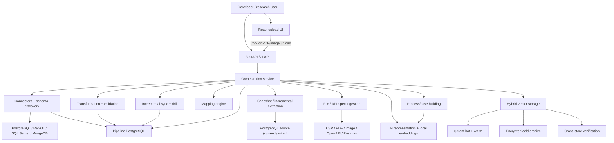
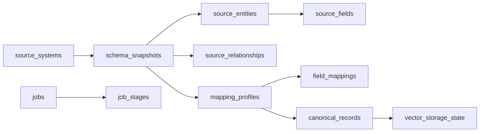

# ERP-Aware Data Transformation Pipeline

Research project `R26-SE-034` · package version `0.13.0`
**Member 4 · IT22267290 · frozen at Phase 12 (2026-08-25)**

> ## Start here
>
> These four documents are authoritative. Where anything below disagrees with
> them, they win.
>
> | Document | Read it for |
> |---|---|
> | [`docs/FINAL_COMPONENT_TECHNICAL_REPORT.md`](docs/FINAL_COMPONENT_TECHNICAL_REPORT.md) | The complete technical description of the frozen component |
> | [`docs/FINAL_MEMBER4_HANDOFF.md`](docs/FINAL_MEMBER4_HANDOFF.md) | Integrating with this component (Members 1, 2, 3) |
> | [`docs/IT22267290_FINAL_COMPONENT_COMPLIANCE_AUDIT.md`](docs/IT22267290_FINAL_COMPONENT_COMPLIANCE_AUDIT.md) | Requirement-by-requirement status · readiness **91.5 / 100** |
> | [`docs/IT22267290_FINAL_RESEARCH_EVALUATION.md`](docs/IT22267290_FINAL_RESEARCH_EVALUATION.md) | Metrics, corpora, threats to validity |
>
> **Status at freeze:** 24 REST operations · 7 job types · 13 filterable fields
> · 3 content kinds · 384-D local embeddings, no LLM. Regression 3730 collected
> / 3667 passed / 0 failed / 63 skipped (all skips are unavailable local
> infrastructure). Final end-to-end evaluation 30/30, 16 hard gates at zero.
>
> **This component never** calls an ERP business API, holds ERP credentials,
> selects MCP tools, makes user authorization decisions, or generates final
> answers. Those belong to Members 1 and 2.

## Overview

This repository is a Python-based data integration and retrieval system for turning heterogeneous ERP data into one traceable, AI-ready representation. Its phase modules connect to or parse relational databases, MongoDB, CSV files, PDFs/images, OpenAPI documents, and Postman collections; discover or infer their structure; map records to canonical ERP fields; validate and store them; create local embeddings; and route vectors across hot, warm, and encrypted cold storage. The deployable runtime currently completes database extraction and incremental jobs only for PostgreSQL; the other connectors are not yet wired through those stages.

The intended users are researchers and developers who need to integrate ERP data without writing an unrelated ETL pipeline for every source technology.

There is **one** implementation:

| Path | Purpose |
|---|---|
| `src/erp_pipeline/` | The generic, source-independent framework and deployable REST API. The single authoritative production package. |
| `data/bpi2020/`, `examples/bpi2020/` | BPI Challenge 2020 as a **research/demonstration dataset** — inputs plus the configuration describing them. Not code. |
| `scripts/demos/run_bpi2020_demo.py` | Runs that dataset through the generic framework. Implements no pipeline logic of its own. |

> **Architecture note.** Earlier revisions carried two parallel implementations — `src/bpi2020/` (a dataset-specific prototype) and `src/erp_integrations/` (adapters between the two). Both were consolidated into `src/erp_pipeline/` on 2026-08-21. Process/case modelling, cross-store verification and document classification were generalized rather than deleted; BPI Challenge 2020 is now one dataset the framework is demonstrated against. See `docs/architecture/ARCHITECTURE_CONSOLIDATION_REPORT.md`.

The project is a substantial research prototype, not a production-ready multi-tenant platform. It has no user accounts, role system, Docker deployment, or CI configuration.

## Problem the Project Solves

ERP information normally arrives in incompatible forms: vendor-specific SQL schemas, schemaless collections, exported CSVs, scanned documents, and API contracts. Directly embedding or querying those sources creates duplicated ingestion logic, unstable identities, weak provenance, and inconsistent results.

This project provides one staged path:

```text
Source-specific structure/content
        -> generic source schema
        -> explainable field mapping
        -> validated canonical ERP record/document
        -> deterministic AI representation
        -> local embedding
        -> policy-routed vector storage
```

Every cross-layer business record uses deterministic identity and content hashing. PostgreSQL sequence values and request/job UUIDs are not used as business identifiers.

## Main Features

- Connectors for PostgreSQL, MySQL, SQL Server, and MongoDB.
- Declared relational schema discovery and bounded MongoDB observed-schema inference.
- CSV ingestion with streaming, delimiter/encoding handling, and conservative type inference.
- PDF and image extraction with page provenance and optional Tesseract OCR.
- OpenAPI 3.x, Swagger 2.0, and Postman collection parsing without calling documented endpoints.
- Explainable source-to-canonical mapping with confidence, ambiguity, and collision reporting.
- Deterministic transformation, type conversion, normalization, validation, and quality thresholds.
- Incremental synchronization with watermarks, drift detection, affected-record propagation, and durable state.
- Local `all-MiniLM-L6-v2` embeddings; no remote AI or LLM fallback.
- Hot/warm Qdrant storage plus gzip/AES-256-GCM encrypted cold archives.
- FastAPI orchestration, durable jobs, idempotency keys, readiness checks, and structured errors.
- A deliberately small React frontend for CSV and document uploads.
- Generic process/case modelling: event logs become process cases with an observed current state and directly-follows next states.
- Generic cross-store integrity verification between canonical records, tier state, and the vector index.
- Configurable ERP document classification (policy, invoice, receipt, purchase order, contract, claim, ...).
- ERP-aware adaptive transformation of already-executed API responses into LLM-ready context: envelope unwrapping, canonical field mapping, deterministic query-relevance selection, mandatory identity preservation, explicit budgets, and SSRF-protected multimodal asset handling.

## Technology Stack

### Backend and data processing

| Technology | Use |
|---|---|
| Python 3.11+ | Main runtime |
| FastAPI, Uvicorn, Pydantic | REST API, validation, OpenAPI generation |
| SQLAlchemy, psycopg2 | PostgreSQL access and persistence |
| PyMySQL, pyodbc, pymongo | MySQL, SQL Server, and MongoDB connectors |
| PyMuPDF, Pillow, pytesseract | PDF/image inspection, extraction, and OCR |
| PyYAML | OpenAPI YAML parsing |
| sentence-transformers | Local embedding model |
| qdrant-client | Vector storage and similarity search |
| cryptography | AES-256-GCM cold-archive encryption |
| pytest | Backend and integration tests |

### Frontend

| Technology | Use |
|---|---|
| React 18 | Single upload screen |
| TypeScript | Typed API client and UI |
| Vite 5 | Development server and production build |
| Vitest | Frontend tests |
| Plain CSS | Styling; no component or CSS framework |

### Storage and infrastructure

- PostgreSQL is the authoritative generic metadata, state, job, and canonical-record store.
- Qdrant provides online hot and warm vector indexes.
- The filesystem stores uploads and encrypted cold-vector archives.
- Research datasets under `data/` are inputs only; the framework writes its own outputs to the stores above.
- No Docker, Docker Compose, Kubernetes, or CI/CD configuration was found.

## System Architecture



Important boundaries enforced by the code and tests:

- No module in `erp_pipeline` contains dataset-specific knowledge. Where a source puts its case id, activity column or document vocabulary is configuration supplied by the caller.
- API specifications are parsed as documents. Their endpoints, scripts, and credentials are never executed.
- Embeddings run locally. There is no OpenAI, Gemini, Anthropic, or other remote inference client.
- The browser talks only to FastAPI and never connects directly to PostgreSQL or Qdrant.
- Storage-tier selection belongs to the Phase 12 policy, not to API/orchestration code.

## Repository Structure

```text
erp-data-transformation-pipeline/
├── artifacts/                 # Generated OpenAPI and measured benchmark evidence
├── data/                      # Local dataset inputs/outputs; ignored from version control
│   └── bpi2020/               # BPI Challenge 2020 research dataset (not redistributed)
├── docs/                      # Phase design notes
│   ├── architecture/          # Consolidation report
│   └── history/               # Superseded audits, kept for research history
├── examples/
│   └── bpi2020/               # Dataset CONFIGURATION for the demo (tracked)
├── frontend/                  # React/Vite upload client
│   └── src/
│       ├── api/               # Shared HTTP client and response types
│       └── pages/Upload.tsx   # The only screen
├── scripts/
│   ├── benchmark_tiered_storage.py   # Storage research benchmark
│   └── demos/
│       └── run_bpi2020_demo.py    # Dataset demo, built entirely on erp_pipeline
├── src/
│   └── erp_pipeline/          # THE production package - see Main Modules below
├── tests/                     # Unit, boundary, benchmark, and live integration tests
├── .env.example               # Configuration template
├── pyproject.toml             # Package metadata and console scripts
└── requirements.txt           # Python runtime/test dependencies
```

Generated or machine-local directories such as `.venv/`, `frontend/node_modules/`, `frontend/dist/`, `var/`, caches, raw datasets, and BPI-generated JSON/JSONL under `data/` are intentionally not part of the source tree delivered through Git. The small evidence files under `artifacts/` are tracked.

## Main Modules

| Module | Responsibility | Main implementation files | Main dependencies |
|---|---|---|---|
| `schemas` | Frozen source, canonical, mapping, run, quality, serialization, and identity contracts | `source_models.py`, `canonical_models.py`, `mapping_models.py`, `run_models.py`, `identity.py` | Python standard library only |
| `catalog` | Immutable/versioned source-schema snapshots and mapping-profile persistence | `schema.py`, `repository.py`, `versioning.py`, `service.py` | Schemas, SQLAlchemy, PostgreSQL |
| `connectors` | Safe connection settings, driver dispatch, capability reporting, and connection tests | `registry.py`, `relational.py`, vendor modules | SQLAlchemy/vendor drivers |
| `discovery` | Relational catalog discovery, aggregate-only profiling, and MongoDB observed-schema inference | `relational.py`, `mongodb.py`, `mongodb_inference.py`, `profiling.py` | Connectors, schemas, catalog |
| `ingestion` | CSV/PDF/image detection, bounded parsing, OCR, hashing, provenance, and document classification | `service.py`, `csv_ingestion.py`, `pdf_ingestion.py`, `image_ingestion.py`, `ocr.py`, `document_classification.py` | PyMuPDF, Pillow, Tesseract |
| `api_specs` | Safe OpenAPI/Swagger/Postman parsing, `$ref` handling, schema conversion, example-based inference | `openapi_parser.py`, `postman_parser.py`, `references.py`, `service.py` | PyYAML, schemas, catalog |
| `mapping` | Explainable candidates, compatibility scoring, ambiguity handling, overrides, and coverage | `engine.py`, `scoring.py`, `canonical_model.py`, `validation.py` | Source/canonical contracts, catalog |
| `transformation` | Transformation-rule execution, conversion, normalization, validation, and quality summaries | `transformer.py`, `rules.py`, `type_converter.py`, `validator.py`, `service.py` | Mapping and canonical contracts |
| `process` | Event logs to process cases: normalization, case assembly, observed directly-follows models, and the one-changed-event cascade | `models.py`, `event_normalizer.py`, `case_builder.py`, `cascade.py`, `service.py` | Schemas, ai, sync contracts |
| `sync` | Watermarks, changed-row extraction, schema drift/impact, propagation, checkpoints, and quarantine | `coordinator.py`, `extractor.py`, `drift.py`, `propagation.py`, `state.py` | Transformation and storage contracts |
| `ai` | Deterministic text representations, document chunking, local embeddings, evaluation, and Qdrant adapter | `representation.py`, `chunking.py`, `embedding.py`, `service.py`, `vector.py` | sentence-transformers, qdrant-client |
| `storage` | Policy-based HOT/WARM/COLD routing, migration, tier state, metrics, cost model, and search | `storage_policy.py`, `vector_router.py`, `hybrid_store.py`, `cold_tier.py`, `state.py` | Qdrant, cryptography, PostgreSQL |
| `verification` | Cross-store integrity between canonical records, tier state and vector index: identity, presence, agreement, orphans, staleness | `models.py`, `record_integrity.py`, `cross_store.py`, `service.py` | Schemas, ai, storage contracts |
| `orchestration` | Capability-aware job plans, stage execution, uploads, source registration, jobs, secrets, and record stores | `planner.py`, `stages.py`, `service.py`, `job_store.py`, `upload_store.py` | All phase service contracts |
| `api` | FastAPI factory, middleware, routes, request/response models, and error mapping | `main.py`, `routers.py`, `routers_data.py`, `security.py` | FastAPI, orchestration |
| `runtime` | Production composition, environment validation, database engine, bootstrap, and durable service wiring | `application.py`, `settings.py`, `services.py`, `persistence.py` | PostgreSQL, Qdrant, all runtime modules |

Detailed phase notes are under `docs/`. They are development records for individual phases; older documents may say that later phases were not yet implemented and should not be read as current whole-project status. `docs/architecture/ARCHITECTURE_CONSOLIDATION_REPORT.md` records how the former `bpi2020` and `erp_integrations` packages were folded into the modules above.

## Frontend Architecture

The frontend is intentionally a thin, single-page upload client:

```text
App.tsx
  -> Upload.tsx
      -> api/client.ts
          -> POST /v1/files/csv
          -> POST /v1/files/documents
```

- There is no router, navigation, global state library, login screen, dashboard, source manager, job monitor, or search UI.
- Files can be chosen or dropped with keyboard-accessible controls.
- CSV uploads show inferred column count and file size.
- PDF/image uploads show page count and file size.
- API/network errors are reduced to safe inline messages.
- The client does not use `localStorage` or `sessionStorage` and does not expose vectors.
- `VITE_API_BASE_URL` selects the backend, defaulting to `http://127.0.0.1:8000`.
- The TypeScript declaration includes `VITE_API_KEY`, but the current client does not read it or send `X-API-Key`. Use the UI only with loopback/no-key development until this is fixed.

The frontend accepts `.csv`, `.pdf`, `.png`, `.jpg`, and `.jpeg`. The backend accepts a wider set; see the API table.

## Backend Architecture

The production entry point is `erp_pipeline.runtime.application`. It validates configuration, opens one shared PostgreSQL engine, bootstraps owned schemas when enabled, constructs durable stores, creates a bounded worker pool, and passes those services into the FastAPI factory.

```text
HTTP request
  -> request-id and optional API-key middleware
  -> Pydantic request validation
  -> thin route handler
  -> OrchestrationService
  -> capability-aware stage plan
  -> existing phase service(s)
  -> PostgreSQL / Qdrant / filesystem
  -> typed response or sanitized error
```

Production uses PostgreSQL-backed jobs, source registrations, upload metadata, mapping drafts, canonical records, sync state, and tier state. Tests use in-memory implementations through the same contracts.

Job types and stage plans are:

| Job type | Stages |
|---|---|
| `structured_pipeline` | discover when applicable → map → extract → transform → validate → load → AI build → embed → tier route |
| `document_pipeline` | ingest → AI build/chunk → embed → tier route |
| `incremental_sync` | drift check → extract changed → Phase 10 propagation → reporting stages → tier update |
| `drift_check` | drift check only |
| `api_spec_preparation` | parse spec → create schema → map; never execute the API |

Jobs are accepted with HTTP `202`, executed by a bounded thread pool, persisted with stage history, and recover unfinished `pending`/`running` work as `interrupted` after an unclean restart. An `Idempotency-Key` may be supplied when creating a job; reusing it with a different request is a conflict.

## Authentication and Authorization

This project has API-key protection, not user authentication.

```text
Request
  -> route is always-public health/docs? allow
  -> ERP_API_KEY unset? allow (intended for loopback development)
  -> mutating method, or protected reads? compare X-API-Key in constant time
  -> valid key? continue
  -> otherwise 401
```

- `GET /v1/health/live`, `GET /v1/health/ready`, `/docs`, `/redoc`, and `/openapi.json` are always public.
- When `ERP_API_KEY` is set, `POST`, `PUT`, `PATCH`, and `DELETE` routes require `X-API-Key`.
- Set `ERP_API_PROTECT_READS=true` to protect other `GET` routes too.
- Binding to a non-loopback host without an API key is refused unless `ERP_ALLOW_INSECURE_BIND=true` is explicitly set.
- API keys are compared with `hmac.compare_digest` and are not logged or added to OpenAPI.
- Source passwords are represented by a `credential_ref`; production resolves `ERP_SECRET_<REF>` from the environment at connection time.
- There are no users, passwords for application login, JWTs, refresh tokens, sessions, roles, permissions, password resets, OTPs, or email verification.

## Database Architecture

### Generic framework PostgreSQL

One pipeline database, configured by `PIPELINE_DB_*`, contains separate schemas by responsibility:

| PostgreSQL schema | Main tables | Purpose |
|---|---|---|
| `erp_catalog` | `source_systems`, `schema_snapshots`, `source_entities`, `source_fields`, `source_relationships`, `mapping_profiles`, `field_mappings` | Versioned source structures and executable mappings |
| `erp_sync` | `sync_state` | Watermarks, schema/mapping binding, last run, status, and optimistic version |
| `erp_vector_storage` | `vector_storage_state`, `vector_tier_transitions`, `vector_access_stats` | Current tier, access counters, and movement audit |
| `erp_orchestration` | `jobs`, `job_stages` | Durable job requests, status, counters, outputs, and stage history |
| `erp_runtime` | `canonical_records`, `registered_sources`, `uploads`, `mapping_drafts` | Canonical JSON, source metadata, upload metadata, and unresolved mappings |

Conceptually:



Catalog snapshots are immutable and versioned. Canonical records are stored as their contract-defined JSON rather than a column-per-business-field table. Source registration rows intentionally have no password column, and upload rows store only metadata/path references, not file contents.

The generic bootstrap is create-if-missing DDL, not a full migration system. See the bootstrap limitation under Known Issues before disabling startup bootstrap.

### Identity across stores

One grammar covers every record the framework produces, including process cases:

| Record | Identifier |
|---|---|
| Canonical record | `erp:{source_system_id}:{entity_type}:{stable_source_key}` |
| Canonical document | `erp:{source_system_id}:document:{content_derived_id}` |
| Process case | `erp:{source_system_id}:{process_type}:{case_id}` |
| AI representation | `ai:{entity_type}:{normalized_canonical_id}` |
| Embedding | `emb.{hash of representation + model}` |
| Vector point | UUIDv5 derived from `erp_pipeline/{representation_id}` |

Every component is normalized, and normalization removes `:`, so a canonical id always parses back into its four components. Identity never comes from a database sequence: `require_business_key` refuses a bare integer at the point of construction, because identity taken from a `SERIAL` silently re-identifies every record when its table is rebuilt and orphans every stored vector.

## API Overview

The authoritative generated contract is `artifacts/openapi_contract_snapshot.json`. Interactive documentation is available at `/docs` while the API is running.

Authentication below means “required when `ERP_API_KEY` is configured”; without a key the loopback development API is open.

### Health and capabilities

| Method | Endpoint | Purpose | Authentication |
|---|---|---|---|
| `GET` | `/v1/health/live` | Process liveness only | Always public |
| `GET` | `/v1/health/ready` | Configured dependency readiness | Always public |
| `GET` | `/v1/capabilities` | Supported sources, jobs, storage, and limitations | Optional read protection |

### Sources and schemas

| Method | Endpoint | Purpose | Authentication |
|---|---|---|---|
| `POST` | `/v1/sources` | Register structural connection metadata and secret reference | Mutating-route key |
| `GET` | `/v1/sources` | List registered sources | Optional read protection |
| `GET` | `/v1/sources/{source_id}` | Get one source | Optional read protection |
| `POST` | `/v1/sources/{source_id}/test` | Test a real connector safely | Mutating-route key |
| `POST` | `/v1/sources/{source_id}/discover` | Run relational discovery or MongoDB inference | Mutating-route key |
| `GET` | `/v1/schemas/{schema_id}` | Return a schema snapshot, with both vendor and normalized field types and the full relationship graph | Optional read protection |

### Uploads and API specifications

| Method | Endpoint | Purpose | Authentication |
|---|---|---|---|
| `POST` | `/v1/files/csv` | Store CSV/TSV/text upload and infer a schema | Mutating-route key |
| `POST` | `/v1/files/documents` | Store and extract PDF/image content | Mutating-route key |
| `POST` | `/v1/api-specs/openapi` | Parse OpenAPI/Swagger as a contract | Mutating-route key |
| `POST` | `/v1/api-specs/postman` | Parse a Postman collection without executing it | Mutating-route key |

The file API has a default 64 MiB upload cap. Backend suffixes are `.csv`, `.tsv`, `.txt`, `.pdf`, `.png`, `.jpg`, `.jpeg`, `.tif`, `.tiff`, and `.bmp`; content detection still verifies the file instead of trusting its name.

### Mapping and jobs

| Method | Endpoint | Purpose | Authentication |
|---|---|---|---|
| `POST` | `/v1/mappings/suggest` | Generate explainable mapping suggestions | Mutating-route key |
| `PUT` | `/v1/mappings/{mapping_id}` | Apply human target overrides through the mapping engine | Mutating-route key |
| `POST` | `/v1/mappings/{mapping_id}/validate` | Check whether a mapping is executable | Mutating-route key |
| `POST` | `/v1/jobs` | Submit a background pipeline job | Mutating-route key |
| `GET` | `/v1/jobs` | List/filter jobs | Optional read protection |
| `GET` | `/v1/jobs/{job_id}` | Read status, counters, stages, and safe outputs | Optional read protection |
| `POST` | `/v1/jobs/{job_id}/retry` | Retry a supported terminal job | Mutating-route key |

### Retrieval

| Method | Endpoint | Purpose | Authentication |
|---|---|---|---|
| `POST` | `/v1/search` | Embed a query and retrieve hot/warm, optionally rehydrated cold, matches. Supports equality `filters`; each hit carries a resolvable `canonical_record_id` | Mutating-route key |
| `POST` | `/v1/responses/adapt` | Transform an already-executed ERP API response into LLM-ready context. Does not call any ERP system. Returns 200 with `partial: true` when part of the response could not be adapted | Mutating-route key |
| `GET` | `/v1/records/{record_id}` | Return canonical business data without vectors/credentials | Optional read protection |

Search returns retrieved records and scores, not an LLM-generated answer. Vectors are not returned by either retrieval endpoint.

## Main System Workflows

### Structured database source

This workflow is complete as currently wired for PostgreSQL. MySQL and SQL Server can be connected to and discovered, and MongoDB can be inferred, but their production extraction/incremental stages need vendor-specific runtime wiring.

1. Register a source with structural connection data and a `credential_ref`.
2. Provide the corresponding `ERP_SECRET_<REF>` environment variable.
3. Test the connection through the vendor connector.
4. Discover/infer the schema and publish a versioned snapshot.
5. Generate a mapping; resolve ambiguous fields manually when required.
6. Submit a structured job for one bounded entity snapshot.
7. Transform and validate records using the mapping profile.
8. Persist successful canonical records; rejected records remain reported, not silently repaired.
9. Build representations, embed locally, and let the storage policy select a tier.

### CSV upload

1. Upload a CSV through the UI or `POST /v1/files/csv`.
2. The upload store streams the file to disk, hashes it, and persists metadata.
3. Phase 6 infers a source schema and keeps rows available for later extraction.
4. The schema is cached and, when the catalog is available, published best-effort.
5. Use the returned `upload_id`/`schema_id` for mapping and a structured CSV job.

### PDF/image upload

1. Upload the document through the UI or API.
2. Phase 6 identifies content, extracts PDF text, or uses Tesseract for scanned pages/images.
3. The immediate upload response returns metadata only, not extracted text.
4. A document job chunks page-traced text, embeds the chunks, and routes them to storage.

### API specification

1. Upload OpenAPI/Swagger JSON/YAML or a Postman collection.
2. Phase 7 parses declared operations, parameters, bodies, responses, references, and security-scheme metadata.
3. Postman example shapes are explicitly marked inferred; their values and credentials are not persisted.
4. A generic source schema and optional mapping are created.
5. Processing stops. No documented endpoint or Postman script is called.

### Incremental synchronization

1. Load durable state and the previous source schema.
2. Discover the current schema and classify drift/impact.
3. Extract changed records using the configured watermark strategy.
4. Transform and apply canonical upserts/deletes.
5. Rebuild only affected AI representations.
6. Skip unchanged content; otherwise re-embed and update the vector through Phase 12.
7. Advance the checkpoint only after successful propagation; failed changes are reported/quarantined.

### Process/case pipeline

An ERP event log becomes process cases through the same generic stages:

```text
event-log rows (CSV, or any registered source)
  -> generic ingestion            (streaming, typed, provenance-carrying)
  -> ProcessEvent                 (normalized against an EventLogConfig)
  -> ProcessCase                  (ordered, timed, with a current state)
  -> ProcessModel                 (directly-follows -> allowed next states)
  -> CanonicalRecord(record_type=CASE)  and  AIRepresentation
  -> local MiniLM embedding
  -> policy-routed vector storage
```

Nothing in that path knows any dataset's column names. `EventLogConfig` says where the case id, activity and timestamp live; a new event log is a new configuration, not a code change.

A single changed event does not rebuild the log: `erp_pipeline.process.cascade` resolves the one affected case, rebuilds only that case, and the content hash decides whether it needs re-embedding at all.

## Data Flow and Identity

Generic structured records flow through `SourceSchema` → `MappingProfile` → `CanonicalRecord` → `AIRepresentation` → `EmbeddingRecord` → `StorageRecordMetadata`.

- Source identities describe where data came from.
- Canonical record IDs are deterministic from source system, entity, and stable source key.
- Content hashes change only when AI-relevant content changes.
- Representation, embedding, and vector IDs are deterministic and traceable.
- Job IDs and request IDs are operational UUIDs and never become record keys.
- Provenance, mapping/model versions, and transformation outcomes are retained separately from business values.
- API responses intentionally omit source rows, extracted document text, credentials, and vectors unless the specific record contract permits the business data.

### Resolving a search hit back to its record

The canonical reference is carried **forward** at every hop and never reconstructed:

```text
CanonicalRecord.record_id
   → AIRepresentation.metadata.canonical_record_id
   → EmbeddingRecord.metadata.canonical_record_id
   → StorageRecordMetadata.canonical_record_id   (and the vector payload)
   → SearchHit.canonical_record_id
   → GET /v1/records/{canonical_record_id}
```

A representation id is normalized (`:` becomes `_`), so `ai:invoice:erp_finance_erp_invoice_inv-001` cannot be parsed back into `erp:finance_erp:invoice:inv-001` — a source system id may itself contain underscores. That is why the reference travels explicitly rather than being derived.

`canonical_record_id` is `null` when a stored vector genuinely has none: it predates the field, or derives from no canonical record. That absence is reported honestly rather than filled with a guess.

### Retrieval filters

`POST /v1/search` accepts equality `filters` over a closed set of identity fields:

| Field | Example |
|---|---|
| `entity_type` | `invoice` |
| `source_system_id` | `finance_erp` |
| `source_entity` | `fin_invoice` |
| `sensitivity` | `restricted` |
| `document_id` | `doc:travel_claim_policy` |

Filters are pushed into Qdrant for the hot and warm tiers and applied to tier state before rehydration for the cold tier, so a query means the same thing online and in the archive. An unsupported field name is rejected with `422`, never ignored — a silently dropped filter returns a plausible-looking unfiltered result. The applied filters are echoed back as `filters_applied`.

### Sensitivity and storage placement

A canonical record's declared `sensitivity` reaches the storage policy rather than defaulting to `internal`:

```text
CanonicalRecord.sensitivity
   → AIRepresentation.metadata → EmbeddingRecord.metadata
   → StorageProfile.from_metadata(...)
   → StorageRoutingContext → StoragePolicyRouter → HOT / WARM / COLD
```

Orchestration supplies the metadata; it never names a tier. Where a record ends up remains entirely the policy's decision, and a sensitivity the policy restricts to on-premises removes every external tier from the candidate set **before** scoring, so no cost advantage can outvote it.

> **Note on the default policy.** `DEFAULT_POLICY` places all three tiers `ON_PREMISES`, so the on-premises constraint prohibits nothing in a default deployment. A deployment that puts a tier off-premises must set `tier_locations` accordingly; the constraint is tested against exactly that topology.

## Environment Variables

Copy `.env.example` to `.env`; never commit `.env`. Legacy BPI names (`BPI_OLD_DB_*`, `OLD_DB_*`, `AI_DB_*`, `QDRANT_*`, `EMBEDDING_MODEL`, `TESSERACT_PATH`) remain deprecated fallbacks, but canonical names below should be used.

| Variables | Purpose | Required |
|---|---|---|
| `PIPELINE_DB_HOST`, `PIPELINE_DB_PORT`, `PIPELINE_DB_NAME`, `PIPELINE_DB_USER`, `PIPELINE_DB_PASSWORD` | The pipeline's own PostgreSQL | Password is required by production runtime; other values have local defaults |
| `ERP_SOURCE_DB_HOST`, `ERP_SOURCE_DB_PORT`, `ERP_SOURCE_DB_NAME`, `ERP_SOURCE_DB_USER`, `ERP_SOURCE_DB_PASSWORD` | A source ERP database to read from | Only when registering that database as a source |
| `VECTOR_DB_URL`, `VECTOR_DB_API_KEY`, `VECTOR_DB_HOST`, `VECTOR_DB_PORT`, `VECTOR_COLLECTION`, `VECTOR_DB_TIMEOUT_SECONDS`, `VECTOR_DB_RECREATE_COLLECTION` | Legacy Qdrant block, retained as deprecated fallbacks | Superseded by the `ERP_QDRANT_*` block |
| `EMBEDDING_MODEL_ID`, `EMBEDDING_BATCH_SIZE` | Embedding model and batch size | Optional; MiniLM and batch 64 are defaults |
| `TESSERACT_CMD` | Tesseract executable path | Only when OCR is needed and Tesseract is not on `PATH` |
| `MONGO_PHASE5_HOST`, `MONGO_PHASE5_PORT`, `MONGO_PHASE5_DB`, `MONGO_PHASE5_AUTH_DB` | Isolated MongoDB live-test target | Live tests only |
| `MONGO_PHASE5_ADMIN_USER`, `MONGO_PHASE5_ADMIN_PASSWORD`, `MONGO_PHASE5_READONLY_USER`, `MONGO_PHASE5_READONLY_PASSWORD` | MongoDB fixture/admin and read-only inference accounts | Live tests only |
| `SYNC_POLL_INTERVAL_SECONDS`, `SYNC_BATCH_SIZE` | Polling interval and batch size | Optional |
| `ERP_API_HOST`, `ERP_API_PORT` | FastAPI bind address | Optional; defaults to `127.0.0.1:8000` |
| `ERP_API_KEY`, `ERP_API_PROTECT_READS` | Optional shared API key and read protection | Key required for non-loopback bind unless insecure override is enabled |
| `ERP_API_CORS_ORIGINS` | Comma-separated browser origins | Required for the frontend; normally `http://127.0.0.1:5173` |
| `ERP_API_MAX_UPLOAD_BYTES`, `ERP_API_UPLOAD_DIR` | Upload cap and storage directory | Optional |
| `ERP_SQL_SERVER_LIVE_VERIFIED` | Capability-report truth flag | Leave false until verified in the deployment |
| `ERP_BOOTSTRAP_ON_STARTUP` | Create missing owned schemas/tables at API startup | Optional; defaults true |
| `ERP_QDRANT_ENABLED`, `ERP_QDRANT_URL`, `ERP_QDRANT_HOST`, `ERP_QDRANT_PORT`, `ERP_QDRANT_API_KEY` | Generic Qdrant connection | Conditional when generic vector storage is enabled |
| `ERP_QDRANT_HOT_COLLECTION`, `ERP_QDRANT_WARM_COLLECTION`, `ERP_QDRANT_DIMENSION`, `ERP_QDRANT_TIMEOUT_SECONDS` | Generic vector collection details | Optional/conditional |
| `ERP_COLD_ENABLED`, `ERP_COLD_ARCHIVE_DIR`, `ERP_COLD_ARCHIVE_KEY` | Encrypted cold tier | Key is required when cold storage is enabled |
| `ERP_SECRET_<REF>` | Production source password resolved from `credential_ref` | Required for each credentialed registered source |
| `ERP_EXECUTOR_WORKERS`, `ERP_EMBEDDING_ENABLED` | Worker count and generic embedding toggle | Optional |
| `ERP_ALLOW_INSECURE_BIND` | Explicitly allow an unauthenticated non-loopback bind | Never use on an exposed deployment |
| `VITE_API_BASE_URL` | Frontend API origin | Optional; defaults to `http://127.0.0.1:8000` |
| `VITE_API_KEY` | Declared in frontend types/example but currently not used by the client | Do not rely on it until client header support is implemented |

Never place PostgreSQL, Qdrant, cold-archive, or source credentials in `frontend/.env`; every `VITE_*` value is shipped to the browser.

## Prerequisites

- Python 3.11 or newer.
- PostgreSQL for the production runtime.
- Node.js and npm for the frontend; the repository does not pin a Node version.
- Qdrant for vector search, unless generic Qdrant is disabled.
- Tesseract OCR for scanned documents/images.
- A compatible system ODBC driver when using SQL Server through `pyodbc`.
- Local model files or network access on first MiniLM use.

The repository creates tables/schemas but does not create PostgreSQL databases or database users.

## Installation

From the repository root on PowerShell:

```powershell
py -3.11 -m venv .venv
.\.venv\Scripts\Activate.ps1
python -m pip install --upgrade pip
python -m pip install -r requirements.txt
python -m pip install -e .
Copy-Item .env.example .env
```

Install the frontend from its lockfile:

```powershell
Set-Location frontend
npm ci
Copy-Item .env.example .env
Set-Location ..
```

Then edit the two `.env` files. At minimum, the generic production API needs a reachable pipeline PostgreSQL database and `PIPELINE_DB_PASSWORD`.

## Running the Project

### Minimal local upload API

For an upload-only development instance without Qdrant, cold archives, or embeddings, set the following in the root `.env` in addition to the pipeline database values:

```dotenv
ERP_API_HOST=127.0.0.1
ERP_API_CORS_ORIGINS=http://127.0.0.1:5173
ERP_QDRANT_ENABLED=false
ERP_COLD_ENABLED=false
ERP_EMBEDDING_ENABLED=false
ERP_BOOTSTRAP_ON_STARTUP=true
```

Start the API:

```powershell
python -m erp_pipeline.api
```

Equivalent installed console command:

```powershell
erp-api
```

The API starts at `http://127.0.0.1:8000`; Swagger is at `http://127.0.0.1:8000/docs`.

Start the frontend in a second terminal:

```powershell
Set-Location frontend
npm run dev
```

Open `http://127.0.0.1:5173`.

Leave `ERP_API_KEY` unset for this loopback UI workflow because the current browser client does not send the key. Use an HTTP client that sets `X-API-Key` for protected deployments.

### Full generic runtime

1. Configure pipeline PostgreSQL.
2. Configure Qdrant or set `ERP_QDRANT_ENABLED=false`.
3. Configure `ERP_COLD_ARCHIVE_KEY` or set `ERP_COLD_ENABLED=false`.
4. Keep `ERP_BOOTSTRAP_ON_STARTUP=true` for the first start so every runtime table is created.
5. Start `python -m erp_pipeline.api`.
6. Check `/v1/health/ready`, then use `/docs` or an HTTP client for sources, mappings, jobs, and search.

The model loads lazily on the first operation that embeds content.

### BPI 2020 demonstration

BPI Challenge 2020 is a **dataset**, not a code path. The demonstration proves that the generic framework can process the event log that originally motivated this research, using nothing but `erp_pipeline`.

The dataset is not redistributed with this repository. Download it and place the CSVs under `data/bpi2020/raw/`; optional PDFs/scans go under `data/bpi2020/documents/` and `data/bpi2020/images/`. The column and process names are described in `examples/bpi2020/event_log_config.json`, which **is** tracked.

```powershell
# Build process cases and classify documents. No database, no Qdrant, no model.
python scripts\demos\run_bpi2020_demo.py --limit 3000

# Also generate local embeddings and show the tier-routing decisions.
python scripts\demos\run_bpi2020_demo.py --limit 3000 --embed

# Also physically store vectors, retrieve, and verify cross-store integrity.
# Requires a configured vector store; reports plainly when one is unavailable.
python scripts\demos\run_bpi2020_demo.py --limit 3000 --store

# Machine-readable report.
python scripts\demos\run_bpi2020_demo.py --json var\bpi_demo.json
```

The script writes nothing to any database and creates no collections of its own. It exits non-zero if any case it built fails identity verification.

To point the same demonstration at a different event log, copy the configuration file, change the column names, and run it. That is the entire adaptation.

## Available Commands

### Backend

| Command | Purpose |
|---|---|
| `python -m erp_pipeline.api` or `erp-api` | Start the production-wired API |
| `uvicorn erp_pipeline.runtime.application:app` | Start the documented ASGI target |
| `python -m erp_pipeline.runtime.bootstrap` or `erp-bootstrap` | Create/verify the five owned schemas; see bootstrap caveat below |
| `python -m erp_pipeline.runtime.bootstrap --verify-only` | Report missing owned schemas without creating them |
| `python -m pytest -q` | Run the backend suite |
| `python scripts/benchmark_tiered_storage.py` | Re-run the storage benchmark against a configured local Qdrant |
| `python scripts/demos/run_bpi2020_demo.py` | Run the BPI Challenge 2020 dataset through the generic framework |

### Frontend

| Command | Purpose |
|---|---|
| `npm run dev` | Vite development server on `127.0.0.1:5173` |
| `npm run build` | Type-check and create `frontend/dist/` |
| `npm run preview` | Preview the production build |
| `npm test` | Run Vitest once |
| `npm run test:watch` | Run Vitest in watch mode |

There is no configured frontend lint command and no separate Python lint/type-check command.

## Docker and Infrastructure

No Dockerfile or Compose file exists. Local services must be installed/run separately or supplied by the developer. The API defaults to loopback, CORS defaults closed, uploads default to `var/uploads`, and cold archives default to `var/cold-archive`.

The measured Phase 12 research evidence is stored in `artifacts/tiered_storage_benchmark.json`. It distinguishes measured latency/archive bytes from proxy storage calculations and experimental cost multipliers; it does not claim production-scale performance or monetary savings.

## External Services

| Service | Use | Can be disabled? |
|---|---|---|
| PostgreSQL | Catalog, runtime state, jobs, canonical records, and any registered source database | Not for the production API |
| Qdrant | Hot and warm vector tiers, and semantic search | Can be disabled; search becomes unavailable |
| Hugging Face model distribution | First-time download of `all-MiniLM-L6-v2` | Use a complete local cache instead |
| Tesseract | OCR for scanned PDFs/images | Yes; OCR-required content reports unavailable/partial extraction |
| MySQL, SQL Server, MongoDB | Optional external ERP sources and live verification targets | Yes |

No payment, email, SMS, cloud-storage, or remote-LLM integration was found.

## Testing and Verification

Backend tests cover contracts, privacy boundaries, discovery, file/spec ingestion, mapping, transformation, synchronization, storage, orchestration, API behavior, benchmarks, and live dependencies. Live PostgreSQL, MySQL, MongoDB, Qdrant, OCR, and model tests either use isolated resources or are intended to skip when prerequisites are unavailable.

```powershell
python -m pytest -q
```

If the system temporary directory has restrictive ACLs, give pytest a new writable base directory:

```powershell
python -m pytest -q --basetemp var\pytest-run
```

Frontend verification:

```powershell
Set-Location frontend
npm test
npm run build
```

Repository verification performed while preparing this README:

- Frontend: 26 tests passed; production build succeeded.
- Backend: 2,514 tests passed and 66 skipped.
- Thirteen real-MiniLM tests failed because a partial local model cache caused Transformers to attempt a blocked Hugging Face metadata request. The failures were model-availability failures, not assertion mismatches in the offline phases.

## Current Implementation Status

| Area | Status | Evidence/notes |
|---|---|---|
| Generic contracts and deterministic identity | ✅ Implemented | Frozen models, a pinned normalization corpus, and a surrogate-key guard |
| Process/case modelling | ✅ Implemented | Configuration-driven event normalization, case assembly, observed process models, and the one-changed-event cascade |
| Cross-store integrity verification | ✅ Implemented | Identity, presence, agreement, orphan and staleness scans over protocol-reached stores |
| Document classification | ✅ Implemented | Configurable weighted rules with reported evidence; generic ERP vocabulary only |
| BPI 2020 demonstration | ✅ Implemented | `scripts/demos/run_bpi2020_demo.py` builds cases and classifies documents entirely through `erp_pipeline` |
| Process-cascade runtime wiring | 🟡 Partially implemented | Library and tests exist; no CLI or job type composes it with a live poller yet |
| Schema catalog and durable generic runtime | 🟡 Partially implemented | PostgreSQL repositories/stores exist; bootstrap and mapping/spec durability caveats remain |
| PostgreSQL/MySQL discovery | ✅ Implemented | Unit and live test coverage exists |
| MongoDB observed-schema inference | ✅ Implemented | Bounded, value-private inference and live-test path |
| SQL Server connector/discovery | ⚠️ Needs review | Implemented and mock-tested, not live-verified |
| CSV/PDF/image ingestion and OCR | ✅ Implemented | Real-file tests; OCR depends on Tesseract |
| OpenAPI/Swagger/Postman ingestion | ✅ Implemented | Real fixtures; no endpoint execution |
| Mapping and transformation | ✅ Implemented | Explainable mapping, overrides, rules, validation, quality thresholds |
| Incremental sync and drift | 🟡 Partially implemented | Durable propagation core exists; production extractor is currently PostgreSQL-only |
| Local embeddings | ✅ Implemented | Complete model cache/network is an operational prerequisite |
| Hybrid vector storage | ✅ Implemented | Hot/warm Qdrant and encrypted cold archives |
| Orchestration and REST API | ✅ Implemented | Durable jobs, stages, retries, health, errors, and OpenAPI artifact |
| API-key protection | ✅ Implemented | Shared key only; not a user/role system |
| React frontend | 🟡 Partially implemented | Upload-only by design; no protected-key support |
| Docker/CI/deployment automation | 🔴 Not implemented | No matching files found |

## Known Issues and Technical Debt

1. **Production extraction is PostgreSQL-only despite broader discovery support.** Both `_sqlalchemy_factory` and `_incremental_engine` in `orchestration/service.py` hard-code `postgresql+psycopg2`. MySQL and SQL Server sources can pass connector/discovery paths but are not extracted with their own drivers, while MongoDB incremental sync is explicitly rejected.
2. ~~**Standalone bootstrap is incomplete for `erp_runtime`.**~~ **FIXED 2026-08-21.** `bootstrap_all` now creates all four `erp_runtime` tables (`canonical_records`, `registered_sources`, `uploads`, `mapping_drafts`). `erp-bootstrap` followed by a start with `ERP_BOOTSTRAP_ON_STARTUP=false` is now a supported sequence, and is covered by live tests.
3. **Executable mappings and API-spec results are not fully durable through the API.** Mapping drafts use PostgreSQL, but generated/approved profiles are kept in `mapping_cache` rather than saved to `erp_catalog`; generated mappings are therefore lost on restart. Direct spec uploads cache their schema in memory, and API-spec job outputs are not published to the catalog.
4. **The frontend cannot use protected mutating routes.** `VITE_API_KEY` is declared but `api/client.ts` never reads it and never adds `X-API-Key`.
5. **Inline source passwords are not usable with the production secret provider.** `POST /v1/sources` can place a password only into providers exposing `put`; `EnvironmentSecretProvider` is read-only. In production, send `credential_ref` and preconfigure `ERP_SECRET_<REF>`.
6. **The process cascade is not wired to a runtime entry point.** `erp_pipeline.process.cascade` implements the Phase 10 propagation protocols for process cases and is covered by tests, but no CLI or job type composes it with a live incremental poller yet. Case propagation is therefore available as a library, not as a runnable service.
7. **SQL Server remains unverified against a live server.** Connector and discovery code are present, with mock coverage only.
8. **Model-cache detection is too optimistic.** Tests check that the MiniLM cache directory exists, but a partial cache can still trigger a Hugging Face request and fail in an offline/restricted environment.
9. **Some phase documents are historical.** `src/erp_pipeline/__init__.py` was corrected during the 2026-08-21 consolidation, but the per-phase documents under `docs/` are development records and may still describe later phases as unimplemented. Treat this README, current code, and the generated OpenAPI artifact as current status.
10. **Python dependency reproducibility is limited.** Most requirements are unpinned and there is no Python lockfile; only the Phase 13 packages have exact versions. The frontend does have `package-lock.json`.
11. **There is no schema migration framework.** Generic bootstrap uses create-if-missing DDL and will not evolve existing tables like Alembic migrations would.
12. **Advertised and accepted upload types are not fully aligned.** The capability response, backend suffix lists, Phase 6 formats, and narrower frontend accept lists differ.
13. **`GET /v1/schemas/{schema_id}` accepts a `version` query parameter but currently retrieves by `schema_id` without using that parameter.**
14. **Research datasets are intentionally ignored by Git.** A new developer must obtain the BPI Challenge 2020 dataset separately; the repository ships its configuration (`examples/bpi2020/`) but not its data, and includes no download script.
15. **No license file was identified.** Clarify redistribution terms before sharing beyond the intended collaborators.

## Important Files

| File | Purpose |
|---|---|
| `pyproject.toml` | Python package metadata, Python version, and `erp-api`/`erp-bootstrap` scripts |
| `requirements.txt` | Python dependencies |
| `.env.example` | Canonical backend, storage, and test configuration names |
| `src/erp_pipeline/runtime/application.py` | Deployable API composition and entry point |
| `src/erp_pipeline/runtime/settings.py` | Runtime defaults and safety validation |
| `src/erp_pipeline/runtime/bootstrap.py` | Owned-schema bootstrap/verification |
| `src/erp_pipeline/api/routers.py` | Health, capabilities, and source endpoints |
| `src/erp_pipeline/api/routers_data.py` | Upload, spec, schema, mapping, job, search, and record endpoints |
| `src/erp_pipeline/orchestration/planner.py` | Job capability rules and stage graphs |
| `src/erp_pipeline/orchestration/stages.py` | Delegation from stages to phase services |
| `src/erp_pipeline/schemas/canonical_models.py` | Canonical record/document contract |
| `src/erp_pipeline/catalog/schema.py` | Catalog PostgreSQL schema |
| `src/erp_pipeline/storage/storage_policy.py` | Versioned tier constraints, scoring, and hysteresis |
| `artifacts/openapi_contract_snapshot.json` | Generated REST contract |
| `artifacts/tiered_storage_benchmark.json` | Measured/proxy storage evidence |
| `frontend/src/api/client.ts` | Browser-to-API boundary |
| `frontend/src/pages/Upload.tsx` | Complete current UI workflow |
| `src/erp_pipeline/schemas/identity.py` | Deterministic identity rules and the surrogate-key refusal |
| `src/erp_pipeline/process/case_builder.py` | Event log to process case, and the observed process model |
| `src/erp_pipeline/verification/cross_store.py` | Cross-store integrity scans |
| `src/erp_pipeline/response_adaptation/relevance.py` | Deterministic, explainable query-to-field relevance scoring |
| `src/erp_pipeline/response_adaptation/service.py` | Response adaptation entry point |
| `src/erp_pipeline/api/routers_adaptation.py` | `POST /v1/responses/adapt` |
| `artifacts/response_adaptation_evaluation.json` | Measured response-adaptation evidence |
| `docs/adaptive_response_transformation.md` | Phase 14 design and results |
| `examples/bpi2020/event_log_config.json` | The only BPI-specific knowledge in the repository |
| `scripts/demos/run_bpi2020_demo.py` | Dataset demonstration over the generic framework |
| `docs/architecture/ARCHITECTURE_CONSOLIDATION_REPORT.md` | How the former `bpi2020`/`erp_integrations` packages were folded in |

## How to Continue Development

1. Read `runtime/application.py`, `orchestration/planner.py`, and `orchestration/stages.py` to understand the executable system.
2. Read the relevant package `__init__.py` and matching document under `docs/` before changing a phase boundary.
3. Add/modify HTTP routes only in `api/routers.py`, `api/routers_data.py`, or `api/routers_adaptation.py`; keep business logic in the owning phase service.
4. Preserve deterministic IDs, content hashes, provenance, and the rule that no module carries dataset-specific knowledge. Dataset vocabulary belongs in `examples/`, in a fixture, or in a demo script - never in a generic module.
5. Keep source credentials behind `credential_ref` and never add secret columns or browser-side backend secrets.
6. Wire each advertised database type to the correct snapshot/incremental extractor and persist executable mappings/spec schemas before treating the deployment path as complete.
7. Fix the bootstrap gap and API-key frontend support, then add real SQL Server verification, a Python lock strategy, schema migrations, CI, and container/service setup.
8. Run the affected module tests plus the API/frontend safety suites; run live tests only against their isolated schemas/collections.

## Project Summary

The repository implements one generic path from heterogeneous ERP sources to canonical, validated, AI-ready data and policy-managed vector retrieval. Its strongest areas are explicit phase boundaries, deterministic identity, privacy-focused parsing, explainable mapping, process-aware case modelling, cross-store integrity verification, durable job orchestration, and extensive tests. BPI Challenge 2020 is one dataset used to demonstrate and evaluate that framework, not a second implementation of it. The main remaining work is completing cross-source runtime wiring and closing the durability and deployment gaps listed above.
