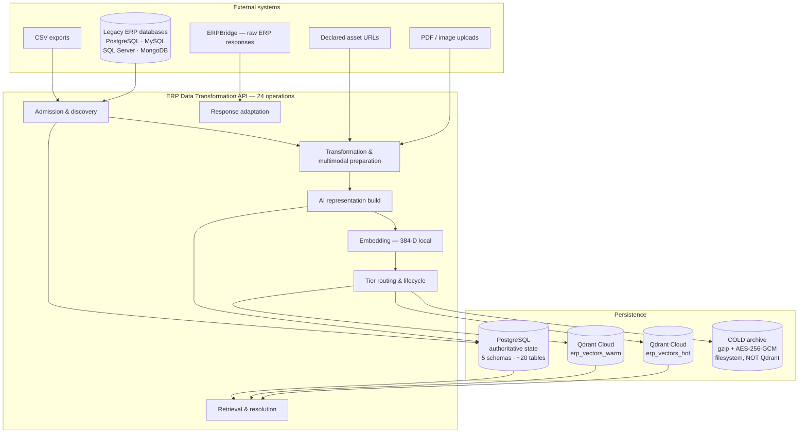
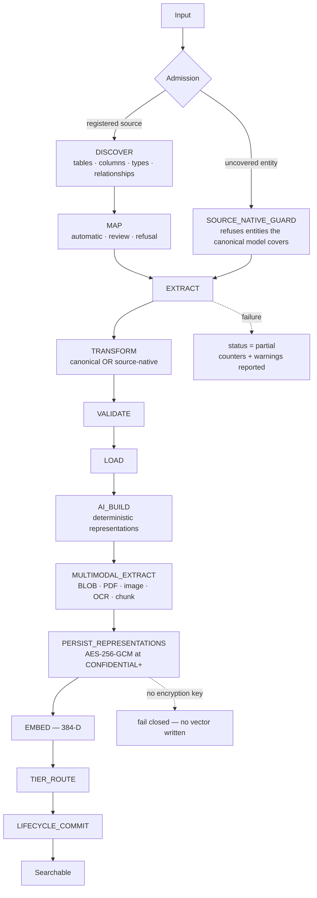
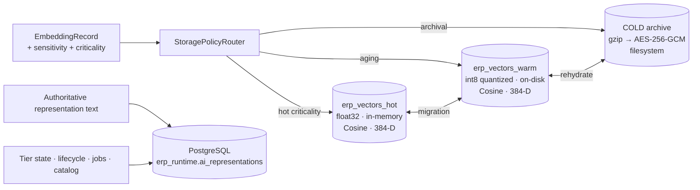
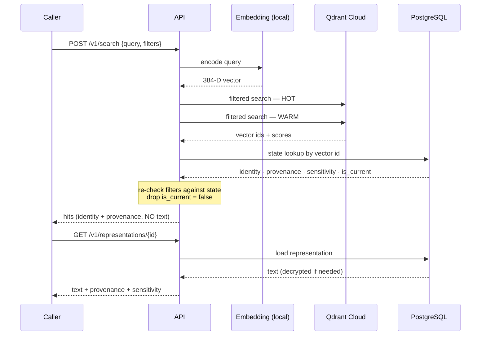
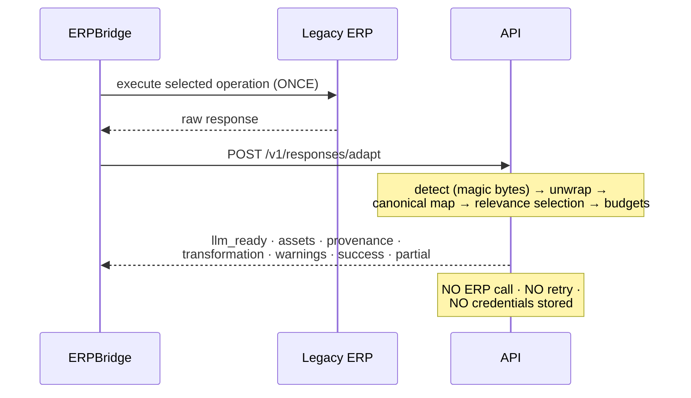
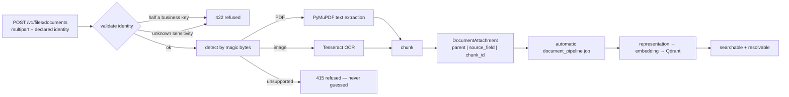
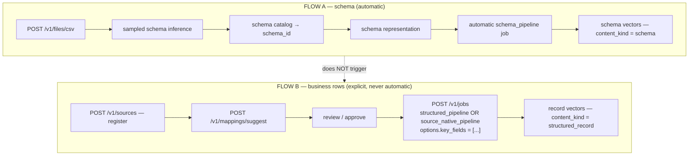
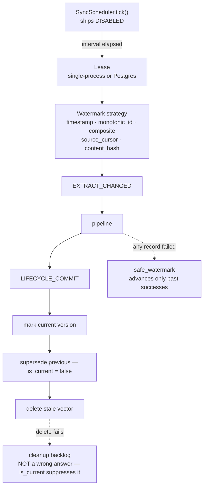
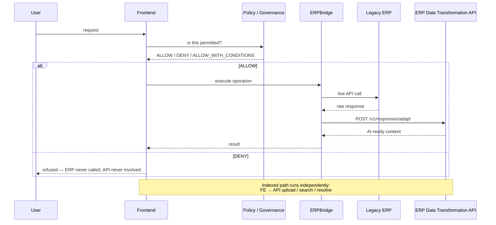

# ERP Data Transformation Pipeline — Architecture

**Service:** ERP Data Transformation API · **Audited:** 2026-08-29

Diagrams show only stages, tiers and endpoints that exist in the current
implementation.

---

## 1. High-level system architecture

**Reading the diagram:** authoritative text goes to PostgreSQL; only vectors and
filterable metadata go to Qdrant. Retrieval consults both — Qdrant for
similarity, PostgreSQL for the authoritative answer.

---

## 2. Complete internal pipeline

`MULTIMODAL_EXTRACT` runs after `AI_BUILD` because `AI_BUILD` *assigns*
`context.representations`; producing document representations earlier would have
them overwritten.

---

## 3. Storage architecture

**Physical collections = storage tiers. Logical data kinds = metadata.**

There is no `employee_vectors`, `schema_vectors`, `document_vectors` or
per-dataset collection. Separation is achieved by 13 filterable metadata fields.

| | Filterable (13) | Provenance-only (3) |
|---|---|---|
| Identity | `business_key_name`, `business_key_value`, `parent_record_id`, `document_id` | |
| Classification | `content_kind`, `document_type`, `entity_type`, `entity_kind`, `sensitivity` | |
| Origin | `source_system_id`, `source_entity`, `source_field`, `schema_name` | |
| Document position | | `page_start`, `page_end`, `chunk_index` |

---

## 4. Search flow

Two calls, deliberately. That separation is what keeps raw content out of the
vector store.

---

## 5. Response adaptation flow

For **binary** bodies `llm_ready` is `{}`, `partial` is `true`, and the text is
in `assets[0].text`. For **collections**, only the first record is adapted and a
warning names the total.

---

## 6. Document / OCR flow

Extraction is **entirely in memory** — no temporary files are written.

---

## 7. CSV flows — two different things

**A CSV upload never indexes business rows.** Structure is not business data,
and schema indexing must not become a backdoor around mapping review.

Rows also require a **declared key**: an inferred CSV schema has no primary key,
and the extractor's fallback is the row *number* — a position, not an identity.
Rows are refused with `"no usable record identity"` until `key_fields` is
supplied.

---

## 8. Synchronisation and lifecycle

**Polling, not change-data-capture.** Freshness is bounded by the configured
interval plus processing latency — measured at 5.0 s + 0.877 ms median.

---

## 9. Four-component runtime flow

The governance component does **not** call this service at runtime. It may read
`GET /v1/capabilities` and `GET /v1/schemas/{id}` at design time.

---

## 10. Package responsibilities

| Package | Responsibility |
|---|---|
| `api/` | FastAPI control plane: routers, request/response models, API-key middleware, OpenAPI security scheme |
| `runtime/` | Composition root — settings, service assembly, schema bootstrap, ASGI application |
| `connectors/` | Database drivers: PostgreSQL, MySQL, SQL Server, MongoDB |
| `discovery/` | Relational introspection, MongoDB structure inference, profiling |
| `catalog/` | Schema catalog persistence and versioned snapshots |
| `mapping/` | Explainable source-to-canonical field mapping with refusal |
| `transformation/` | Canonical and source-native record transformation |
| `ingestion/` | CSV, PDF, image, OCR, binary assets, remote assets, content detection |
| `ai/` | Representations, chunking, schema representations, embedding service |
| `orchestration/` | Jobs, stages, planner, representation store, lifecycle, scheduler, multimodal coordination |
| `storage/` | HOT/WARM/COLD tiers, policy router, filters, tier state, migration |
| `sync/` | Incremental synchronisation, drift detection, watermarks, propagation |
| `response_adaptation/` | Live ERP response adaptation for ERPBridge |
| `schemas/` | Canonical models, enums, identity, sensitivity resolution |
| `api_specs/` | OpenAPI and Postman collection parsing (design-time) |
| `process/` | Process and case modelling support |
| `verification/` | Cross-store verification helpers |
