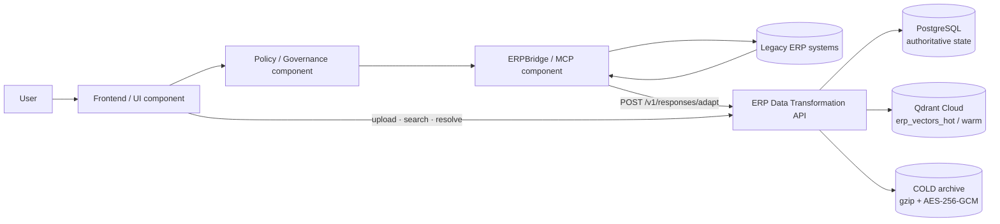
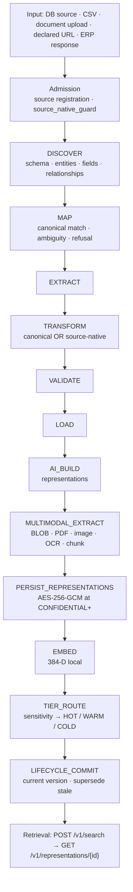
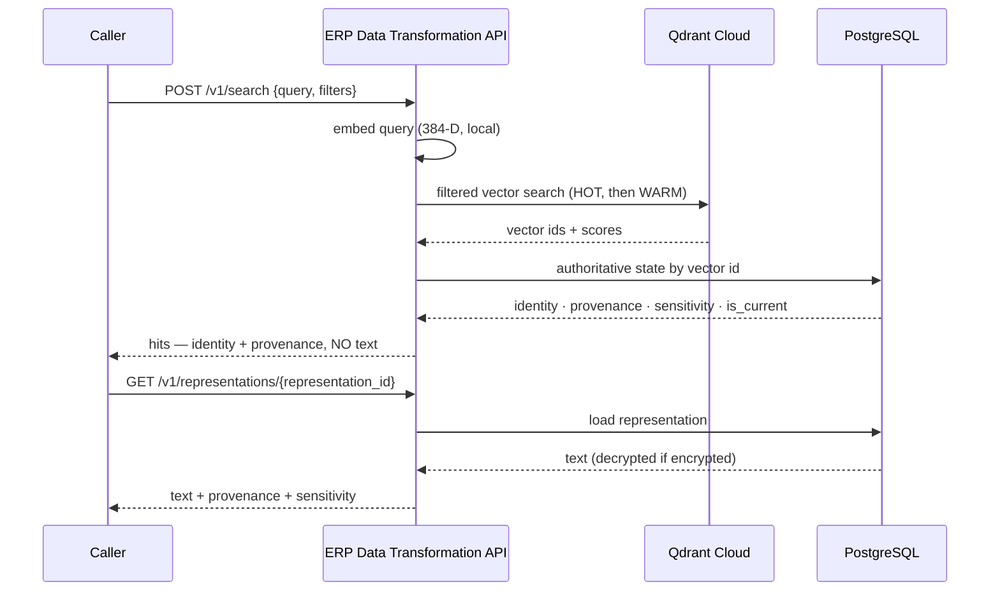
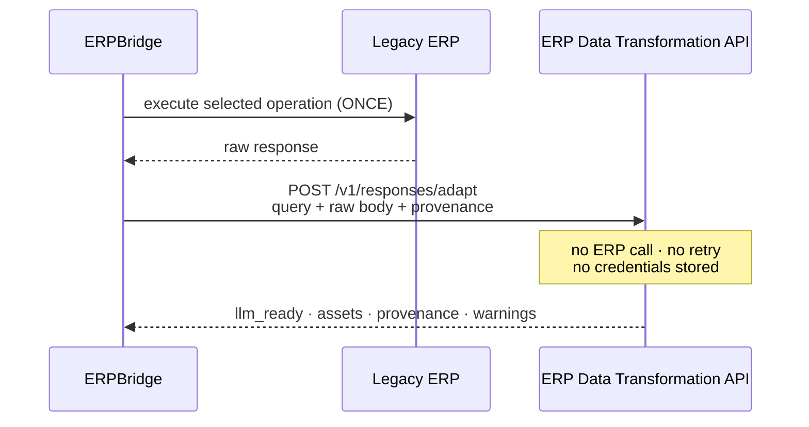

# ERP Data Transformation Pipeline — Complete Audit and Handoff

**Component:** ERP-Aware Multimodal Data Transformation, Vector Indexing and
Retrieval Pipeline for Legacy ERP Systems
**Service:** ERP Data Transformation API
**Audit date:** 2026-08-29 · **Type:** read-only audit · **Nothing was modified**

Every figure below was measured from the current repository or the live
deployment during this audit. Where a claim could not be verified, the document
says so instead of asserting it.

---

## 1. Executive summary

### What this service is

Legacy ERP systems hold information an AI assistant needs, in forms it cannot
consume: relational rows under vendor-specific column names, scanned
certificates stored as database BLOBs, PDFs behind signed URLs, table structures
documented only in their own vocabulary, and JSON responses from ERP APIs.

This service converts those heterogeneous forms into **deterministic,
identity-preserving, sensitivity-classified text representations**, generates
384-dimensional embeddings locally, stores them across a tiered vector
architecture, and exposes retrieval and response-adaptation over a
24-operation REST API.

### What it does not do

It contains **no LLM**. It executes **no ERP business API**. It holds **no ERP
credentials**. It makes **no end-user authorization decision**. It generates
**no final answers**. These are not omissions — they are boundaries, and §5
shows the structural test that enforces them.

### Status

| | |
|---|---|
| Implementation | **COMPLETE** for the declared scope |
| Deployment | **DEPLOYED AND VERIFIED** on Azure (Southeast Asia) |
| Tests | **3762 collected · 3699 passed · 0 failed · 0 errors · 63 skipped** (10:40) |
| Frontend tests | 26 passed (2 files, vitest) |
| API | 24 operations, OpenAPI 3.1.0, Swagger auth working |
| Open issues | **3 findings** — see §14, one of which is a security consistency issue |

---

## 2. Repository inventory

Measured 2026-08-29:

| | |
|---|---|
| Production Python files | **193** |
| Production LOC | **66,816** |
| Test files | **165** |
| Test LOC | **59,302** |
| Packages under `src/erp_pipeline/` | **17** |
| Evaluation scripts | 12 |
| Evaluation artifacts | 13 |
| Documentation files | 30 |

### Package responsibilities

```
src/erp_pipeline/
├── api/                  FastAPI control plane, routers, schemas, auth middleware, OpenAPI
├── api_specs/            OpenAPI / Postman collection parsing (design-time only)
├── ai/                   Representations, chunking, embedding service
├── catalog/              Schema catalog persistence (erp_catalog)
├── connectors/           PostgreSQL, MySQL, SQL Server, MongoDB connectors
├── discovery/            Relational introspection, MongoDB inference, profiling
├── ingestion/            CSV, PDF, image, OCR, binary assets, remote assets, detection
├── mapping/              Explainable source-to-canonical field mapping
├── orchestration/        Jobs, stages, planner, lifecycle, representation store, scheduler
├── process/              Process/case modelling support
├── response_adaptation/  Live ERP response adaptation (Member 2 runtime path)
├── runtime/              Composition root: settings, services, bootstrap, application
├── schemas/              Canonical models, enums, identity, sensitivity
├── storage/              HOT/WARM/COLD tiers, policy router, filters, tier state
├── sync/                 Incremental synchronisation, drift, watermarks, propagation
├── transformation/       Canonical and source-native transformation
└── verification/         Cross-store verification helpers
```

---

## 3. System context



Two distinct information paths, and the distinction matters for integration:

| Question | Answered by | Why |
|---|---|---|
| *"Is invoice INV-204 paid right now?"* | **ERPBridge**, live ERP call | The vector index is a snapshot bounded by a poll interval |
| *"What does EMP002's certificate say?"* | **This service**, search + resolve | Documents and structure are indexed here |
| *"Make this raw ERP response AI-ready"* | **This service**, `/v1/responses/adapt` | After ERPBridge has already executed the call |

---

## 4. Complete internal pipeline

Only stages that exist in `PipelineStage` are shown. All **19** are listed in §8.



**Ordering note.** `MULTIMODAL_EXTRACT` runs *after* `AI_BUILD` because
`AI_BUILD` assigns `context.representations`; producing document
representations first would have them overwritten. Evidence:
`src/erp_pipeline/orchestration/stages.py` — `run_multimodal_extract`.

---

## 5. Component boundaries — verified, not asserted

| Responsibility | Owner | This service |
|---|---|---|
| Authorization / governance decision | Policy component | **never** |
| ERP API execution, ERP credentials, MCP tool selection | ERPBridge | **never** |
| User interface, uploads UX | Frontend | **never** |
| Data preparation, indexing, retrieval, adaptation | **this service** | owns |

**Structural evidence.** An AST scan asserts that no module under
`src/erp_pipeline` imports `requests`, `httpx`, `aiohttp`, `mcp` or `fastmcp`,
and that no class named `PolicyGateClient`, `McpClient` or similar exists:
`tests/erp_pipeline/integration/test_integration_security.py` —
`TestPNoCrossMemberClients`.

**Characterise this correctly.** That is *structural* evidence — the capability
to call an ERP API is absent from the codebase. It is **not** a runtime counter
observing that zero calls were made.

---

## 6. Supported input types — audited

| Input | Status | Evidence |
|---|---|---|
| PostgreSQL | **IMPLEMENTED** | `connectors/postgresql.py`; the deployed runtime uses it for its own state |
| MySQL | **IMPLEMENTED** | `connectors/mysql.py`; lazy `pymysql` import |
| SQL Server | **IMPLEMENTED, live verification deferred** | `connectors/sqlserver.py`; lazy `pyodbc` import |
| MongoDB | **IMPLEMENTED** | `connectors/mongodb.py`, `discovery/mongodb_inference.py`; sampling-based, no declared schema |
| CSV | **IMPLEMENTED** | `ingestion/csv_ingestion.py`, `csv_inference.py` |
| PDF | **IMPLEMENTED** | `ingestion/pdf_ingestion.py` (PyMuPDF) |
| Images (png/jpg/jpeg/tiff) | **IMPLEMENTED** | `ingestion/image_ingestion.py` + OCR |
| Database BLOB / binary fields | **IMPLEMENTED** | `ingestion/binary_assets.py`, `orchestration/multimodal.py` |
| Declared remote asset URLs | **IMPLEMENTED, CONFIGURATION-DEPENDENT** | `ingestion/remote_assets.py`; **ships disabled**, no HTTP client bundled |
| ERP API responses | **IMPLEMENTED** | `response_adaptation/` |
| Schemas (as indexable content) | **IMPLEMENTED** | `ai/schema_representation.py` |
| OpenAPI / Postman specs | **IMPLEMENTED** (design-time parsing) | `api_specs/` |
| **XLSX** | **NOT SUPPORTED** | No xlsx/openpyxl reader exists anywhere in `src/` |

`SourceType` enum (9): `postgresql, mysql, sql_server, mongodb, csv, pdf, image,
openapi, postman`.

---

## 7. Identity, provenance and the data model

### Why identity is the hard part

A birth certificate attached to the wrong employee is worse than one not
indexed at all: it is confidently, plausibly wrong. The identity model exists
to make that impossible rather than unlikely.

| Field | Meaning |
|---|---|
| `representation_id` | The addressable unit of AI-ready text; what search returns and `GET /v1/representations/{id}` resolves |
| `canonical_record_id` | `erp:{system}:{entity}:{key}` for a canonically-mapped record |
| `source_system_id` | Which ERP system it came from |
| `source_entity` | Which table / collection |
| `source_field` | Which column (for BLOB and document attachments) |
| `entity_type` / `entity_kind` | Canonical entity classification |
| `business_key_name` + `business_key_value` | **One declaration in two fields.** Half of it is refused with 422 |
| `document_id` | Content hash of the extracted document |
| `parent_record_id` | The ERP record a document hangs off, when declared |
| `schema_id` / `schema_name` | Schema snapshot identity |
| `content_kind` | `structured_record` · `document_chunk` · `schema` |
| `sensitivity` | `public` · `internal` · `confidential` · `restricted` |
| `is_current` / `logical_key` | Version lifecycle state |
| `page_start` / `page_end` / `chunk_index` | Document provenance (provenance-only, not filterable) |

### Why a row number is not an identity

Still the implementation rule. An inferred CSV schema declares no primary key,
and the extractor's fallback record key is the row *number*. A position changes
the moment a row is inserted above it, so a vector keyed on it would silently
point at different data after any edit. Rows are therefore **refused** with
`"no usable record identity"` unless the job declares `options.key_fields`.

Evidence: `src/erp_pipeline/transformation/source_native.py`; behaviour pinned by
`tests/erp_pipeline/integration/test_member3_contracts.py` —
`test_rows_without_a_declared_key_are_refused_not_indexed_by_position`.

### Attachment identity

A document's identity is its **attachment**, not its content:
`parent | source_field | chunk_id`. Content identity alone would give two
employees' copies of an identical certificate the same chunk id, the same
vector, and one would overwrite the other. Evidence:
`src/erp_pipeline/ai/attached_documents.py` — `DocumentAttachment.attachment_key`.

Measured: **0 association collisions** across 7 indexed documents, including two
documents deliberately shared across three employee records each
(`artifacts/phase3_multimodal_evaluation.json`).

---

## 8. Job system

**7 JobTypes**, **19 PipelineStages**, **6 JobStatus values** — all verified from
`src/erp_pipeline/orchestration/models.py`.

| JobType | Trigger | Output | Typical caller |
|---|---|---|---|
| `structured_pipeline` | `POST /v1/jobs` after mapping approval | Canonical records → representations → vectors | Frontend backend |
| `source_native_pipeline` | `POST /v1/jobs` with `key_fields` | Source-native records → vectors | Frontend backend |
| `document_pipeline` | **Automatic** on `POST /v1/files/documents` | Document chunks → vectors | Frontend (implicit) |
| `schema_pipeline` | **Automatic** on `POST /v1/files/csv`, or `index_schema` | Schema representations → vectors | Frontend (implicit) |
| `incremental_sync` | Scheduler tick or explicit job | Changed records re-indexed | Scheduler |
| `drift_check` | Scheduler or explicit job | Schema drift report | Scheduler / operator |
| `api_spec_preparation` | `POST /v1/api-specs/*` | Parsed API specification | Design-time tooling |

**Stages (19):** `discover, map, source_native_guard, multimodal_extract,
persist_representations, lifecycle_commit, extract, transform, validate, load,
ai_build, embed, tier_route, drift_check, extract_changed, tier_update, ingest,
parse_spec, schema`.

**Statuses (6):** `pending, running, succeeded, failed, partial, interrupted`.
A job whose records partially failed is `partial` — never `succeeded`.

### Asynchronous contract

```
POST /v1/jobs            → 202 Accepted, { job_id, status: "pending", status_url }
GET  /v1/jobs/{job_id}   → { status, stages[], counters{}, warnings[] }
```

**202, not 201.** The job is accepted, not finished. Callers must poll.

---

## 9. Storage architecture

### Physical vs logical

> **Physical collections are storage tiers. Logical data kinds are metadata.**

There is deliberately **no** `employee_vectors`, `schema_vectors`,
`document_vectors`, `bpi_vectors` or per-dataset collection. Tiers separate
vectors by *access economics* — the only axis on which a vector store's physical
layout pays. Modality, entity and dataset are carried as filterable metadata.

Why one-collection-per-modality would be worse: a cross-modal query
("everything about EMP002") would need N searches and a client-side merge; tier
migration would have to move vectors *between* modality collections; adding a
modality would become a migration rather than a new enum value.

### Tiers

| Tier | Backing | Format | Status |
|---|---|---|---|
| **HOT** | Qdrant Cloud, `erp_vectors_hot` | float32, in-memory, Cosine, 384-D | **DEPLOYED AND VERIFIED** |
| **WARM** | Qdrant Cloud, `erp_vectors_warm` | int8 quantized, on-disk, Cosine, 384-D | **DEPLOYED AND VERIFIED** |
| **COLD** | Filesystem archive (Azure Files in deployment) | gzip → AES-256-GCM | **DEPLOYED**, mount verified |

**COLD is not a Qdrant collection.** It is an encrypted archive on a filesystem.
Evidence: `src/erp_pipeline/storage/cold_tier.py` — `ColdArchiveTier`.

### AES-256-GCM, explained for other teams

AES-256 is the encryption; GCM is the mode that also **authenticates**. A COLD
archive that has been altered or truncated fails to decrypt rather than
returning plausible garbage. Each encryption uses a fresh random 96-bit nonce,
so archiving identical content twice produces different ciphertext.

### Filterable fields — exactly 13

`business_key_name`, `business_key_value`, `content_kind`, `document_id`,
`document_type`, `entity_kind`, `entity_type`, `parent_record_id`,
`schema_name`, `sensitivity`, `source_entity`, `source_field`,
`source_system_id`.

**Provenance-only (3, returned but not filterable):** `chunk_index`,
`page_end`, `page_start`.

An unknown filter is **rejected**, not silently ignored — measured: 7 unknown
filters refused, 0 accepted (`artifacts/phase4_identity_retrieval_evaluation.json`).

### Filter limitations (current)

Exact-match equality only, combined with AND. Evidence:
`src/erp_pipeline/storage/filters.py` builds only
`FieldCondition(key=…, match=MatchValue(…))` inside `must=[…]`. There is **no**
range, **no** OR (`should`), and **no** negation (`must_not`).

---

## 10. PostgreSQL responsibilities

**Qdrant is not this system's only database, and it is not the authoritative
one.**

| Store | Role |
|---|---|
| **PostgreSQL** | Authoritative structured and application state |
| **Qdrant** | Semantic vector index — vectors and filterable metadata only |
| **COLD** | Encrypted archival tier |

**5 schemas, ~20 tables**, derived from the table-name constants in
`src/erp_pipeline/runtime/database.py`, `catalog/`, `storage/state.py`,
`orchestration/` and `sync/state.py`:

| Schema | Tables |
|---|---|
| `erp_catalog` | `source_systems`, `source_entities`, `source_fields`, `source_relationships`, `schema_snapshots`, `mapping_profiles`, `field_mappings` |
| `erp_orchestration` | `jobs`, `job_stages` |
| `erp_runtime` | `ai_representations`, `canonical_records`, `registered_sources`, `uploads`, `mapping_drafts`, `representation_lifecycle`, `scheduler_lease` |
| `erp_vector_storage` | `vector_storage_state`, `vector_tier_transitions`, `vector_access_stats` |
| `erp_sync` | `sync_state` |

Bootstrapped by the application's own mechanism —
`ERP_BOOTSTRAP_ON_STARTUP` defaults to true; also available as
`python -m erp_pipeline.runtime.bootstrap`.

**Live-count caveat.** The table count above is derived from code constants. It
could **not** be confirmed against the deployed database from this workstation:
the Azure PostgreSQL firewall admits Azure services only, and a direct
connection timed out. That restriction is a desirable security property, not a
fault. Indirect confirmation that PostgreSQL is working:
`/v1/health/ready` reports `postgresql: ready` and `job_store: PostgresJobStore`,
and three jobs persisted across a container restart.

---

## 11. AI representations, embeddings and retrieval

### What a representation is

A deterministic text rendering of one unit of ERP information plus its metadata.
Deterministic matters: the same input always produces the same text, which is
what makes `content_hash` meaningful and re-runs idempotent. There is **no
generative summarisation** anywhere.

Three kinds: `structured_record`, `document_chunk`, `schema`.

### Embeddings

| | |
|---|---|
| Model | `sentence-transformers/all-MiniLM-L6-v2` |
| Dimension | **384** |
| Distance | Cosine |
| Execution | **Local**, in-process. No API calls, no LLM |
| Measured window | 256 tokens ≈ 1024 characters |
| Loading | Lazy — `/v1/health/ready` reports *"configured; loads on first use"* |
| Deployment | **Baked into the container image**, so cold start does not depend on huggingface.co |

Verified live: the deployed `/v1/capabilities` reports
`embedding_model: sentence-transformers/all-MiniLM-L6-v2`, `dimension: 384`.

### Why embeddings are stored apart from the text

Qdrant holds vectors and filterable metadata. The authoritative text lives in
`erp_runtime.ai_representations`. That separation is what allows restricted text
to be encrypted at rest while remaining searchable, and it is why **search does
not return text**.

### The two-call retrieval contract



Filters are re-checked against authoritative state *after* the vector search, so
a vector whose payload disagrees with state cannot leak a non-matching hit.
Superseded vectors still physically present are suppressed by `is_current`.

Measured: **58/58 search hits resolved, 0 unresolvable**
(`artifacts/phase5_representation_resolution_evaluation.json`).

---

## 12. The CSV distinction — critical for integration

This is the single most misunderstood behaviour in the service.


**A CSV upload indexes the schema, never the rows.** Structure is not business
data, and using schema indexing as a backdoor around mapping review is precisely
what the design prevents. Measured: `csv_started_an_index_job: false` for
business rows (`artifacts/phase6_automatic_document_indexing_evaluation.json`).

**Document upload is the opposite** — `POST /v1/files/documents` *does*
automatically submit a `document_pipeline` job. One call in; a searchable,
resolvable document out. Measured: 6/6 automatic jobs, **0 manual job calls
required**.

---

## 13. Security

### Sensitivity model

Four levels: `public` < `internal` < `confidential` < `restricted`. Default
`internal`. The order is declared as an explicit tuple rather than inherited
from enum declaration order, so reordering the enum for readability cannot
silently reorder security decisions.

Resolution is **strictest wins** across artifact, job, source and inherited
declarations — never "most specific". Treating restricted data as internal is a
disclosure; the reverse is an inconvenience.

Classification is **declared, never inferred**. No PII classifier, no LLM.

### Encryption — two separate keys

| Key | Protects | Reused? |
|---|---|---|
| `ERP_COLD_ARCHIVE_KEY` | COLD tier archives (gzip + AES-256-GCM) | **Never reused** |
| `ERP_REPRESENTATION_ENCRYPTION_KEY` | Representation text at `confidential` and above | **Never reused** |

They are deliberately distinct: rotating one for either reason would otherwise
force both, and a compromise of one context would hand over the other. Both are
verified separate in `src/erp_pipeline/orchestration/representation_crypto.py`
(`REPRESENTATION_KEY_ENV`) and `src/erp_pipeline/runtime/settings.py`
(`COLD_KEY_VARIABLE`).

**Fail closed.** If a classification requires encryption and no key is
configured, persistence fails — there is no plaintext fallback. Because
persistence precedes embedding, the vector never becomes searchable either: the
document is *absent* rather than *exposed*.

### Measured security gates

From `artifacts/phase10_security_sensitivity_evaluation.json`:
7 sensitivity assignments, 7 correct, **0 wrong assignments, 0 silent
downgrades, 0 propagation failures, 0 restricted plaintext findings, 0 Qdrant
text findings, 0 secret leakage, 0 decryption mismatches**.

### The boundary

This service **reports** sensitivity; it does **not** enforce authorization. A
restricted document is returned with `sensitivity: "restricted"` attached so the
trusted upstream layer can decide. There is no `if restricted: deny(user)`
anywhere in the package — that decision belongs to the governance component.

---

## 14. Findings — three open issues

### FINDING 1 — Storage-location policy does not reflect the cloud deployment

**Severity: security consistency issue. Not previously documented.**

`src/erp_pipeline/storage/storage_policy.py` declares:

```python
DEFAULT_TIER_LOCATIONS = {
    StorageTier.HOT:  StorageLocation.ON_PREMISES,
    StorageTier.WARM: StorageLocation.ON_PREMISES,
    StorageTier.COLD: StorageLocation.ON_PREMISES,
}
on_premises_only_sensitivities = frozenset({SensitivityLevel.RESTRICTED})
```

`src/erp_pipeline/storage/vector_router.py` genuinely enforces the constraint —
it prohibits any tier whose declared location is not `ON_PREMISES` for
restricted data. But because **all three tiers are declared on-premises**, the
constraint excludes nothing.

In the current deployment HOT and WARM are **Qdrant Cloud** (third-party SaaS,
AWS `us-west-2`) and COLD is Azure Files. The source comment — *"All local
today"* — was true when written and is now false.

**Verified consequence.** A point carrying
`sensitivity: restricted`, `business_key_value: EMP002`,
`document_type: birth_certificate` is physically present in Qdrant Cloud right
now. Confirmed by direct inspection of the live collection during this audit.

**What is and is not exposed:**

| In Qdrant Cloud | Not in Qdrant Cloud |
|---|---|
| 384-dimensional embedding | The extracted document text — verified absent |
| Identity metadata (`business_key_value`, `document_type`) | |
| The `sensitivity: restricted` label itself | |
| Content hash, provenance | |

The text remains in Azure PostgreSQL, encrypted with AES-256-GCM. So this is
**not** a plaintext disclosure. It is a mismatch between a declared policy
guarantee and physical reality, and embeddings are not information-free.

**Additionally:** `tier_locations` is a dataclass field with no environment
variable behind it. A deployment cannot correct the map without editing code.

**Do not claim** restricted data is prevented from reaching the cloud. Under the
current configuration it demonstrably is not.

### FINDING 2 — Qdrant payload indexes are not durable in code

**Status: DEPLOYMENT CONFIGURATION LIMITATION.**

Managed Qdrant **rejects filtered search without payload indexes** with
`400 Bad Request` (local Qdrant merely runs slower). Both collections currently
carry **13 keyword indexes**, verified live.

However, **no production code creates them** — a grep for
`create_payload_index` across `src/` returns nothing, and
`storage/hot_tier.py` / `warm_tier.py` `ensure_collection()` sets only
`VectorParams`. The indexes were created by a one-off operational script during
deployment.

**Risk path:** `ensure_collection(recreate=True)` deletes and recreates the
collection, dropping the indexes. Every filtered search then fails with 400
until they are recreated manually.

### FINDING 3 — HTTPS is not enforced on the App Service

`az webapp show` reports **`httpsOnly: false`**. The service answers on both
HTTP and HTTPS. A client that used `http://` would transmit its `X-API-Key`
header in cleartext.

All verification during this audit used HTTPS, and Azure supplies a valid
certificate. This is a one-setting hardening gap, not a code defect.

---

## 15. API contract

**24 operations**, OpenAPI 3.1.0, service version 1.0, verified against the
**live deployment** at `/openapi.json`.

Full per-endpoint detail is in
[`ERP_DATA_TRANSFORMATION_PIPELINE_API_HANDOFF.md`](ERP_DATA_TRANSFORMATION_PIPELINE_API_HANDOFF.md).

| Domain | Ops | Endpoints |
|---|---|---|
| health | 2 | `GET /v1/health/live`, `GET /v1/health/ready` — **public** |
| capabilities | 1 | `GET /v1/capabilities` |
| sources | 5 | list, create, get, discover, test |
| files | 2 | `POST /v1/files/csv`, `POST /v1/files/documents` |
| api-specs | 2 | openapi, postman |
| schemas | 1 | `GET /v1/schemas/{schema_id}` |
| mappings | 3 | suggest, update, validate |
| jobs | 4 | list, create, get, retry |
| search | 1 | `POST /v1/search` |
| records | 1 | `GET /v1/records/{record_id}` |
| representations | 1 | `GET /v1/representations/{representation_id}` |
| responses | 1 | `POST /v1/responses/adapt` |

**There is no sync/lifecycle REST domain.** Synchronisation is a *JobType*
(`incremental_sync`, `drift_check`), not an endpoint. Any integration plan that
assumes a sync endpoint is mistaken.

### Authentication

`X-API-Key` header, constant-time comparison (`hmac.compare_digest`).
All mutating methods always require it; reads require it when
`ERP_API_PROTECT_READS=true` — which the deployment sets. Always public:
`/v1/health/live`, `/v1/health/ready`, `/docs`, `/redoc`, `/openapi.json`.

Verified live: no key **401** · wrong key **401** · valid key **200**.

### Swagger

FastAPI generates the OpenAPI contract; Swagger UI renders it at `/docs`. The
document declares an `apiKey` security scheme named `X-API-Key`, and each
protected operation carries the requirement — derived by calling the middleware's
own `requires_key()`, so the document cannot drift from enforcement.

Verified live from the rendered UI: **Authorize button present**, 22 operations
padlocked, only the two health endpoints open.

---

## 16. Response adaptation

Used by ERPBridge **after** it has executed the ERP call.



Pipeline: detect (magic bytes) → unwrap → canonical map → deterministic
relevance selection → budgets. Identity fields are preserved unconditionally, so
a reduced payload never loses the key identifying it.

**Binary responses read differently.** For PDF or image bodies, `llm_ready` is
`{}` and `partial` is `true`; the extracted text is in **`assets[0].text`**. A
PDF has no structured fields for field selection to select.

**Collection limitation — verified still present.** A response containing
several records adapts **the first record only**, and says so:
`"the response carried N records; the first was adapted and the rest were not"`.
Evidence: `src/erp_pipeline/response_adaptation/service.py`. Declared, not
silent.

**Never retries an ERP business request.** A 404 or 503 body is adapted as what
it is. Re-issuing is ERPBridge's decision — a retried write is a duplicated
write.

---

## 17. Synchronisation and lifecycle

**Polling, not CDC.** Freshness is bounded by *the configured interval plus
processing latency*. This is **not** change-data-capture and **not** database
replication, and must not be described as either.

Measured (`artifacts/phase9_sync_freshness_evaluation.json`): 8 source changes,
**0 permanently missed, 0 wrong current-version hits, 0 watermark regressions,
0 cross-parent deletion errors, 0 idempotence violations**; interval 5.0 s,
processing median 0.877 ms, p95 1.54 ms.

Five watermark strategies; `safe_watermark` only advances past successes, so a
failed index cannot cause a change to be skipped forever. The scheduler ships
**disabled**, uses an injected clock, and starts no threads.

`is_current` acts as a correctness backstop: a superseded vector still
physically present — because its delete failed or has not run — is never
returned as current. A failed delete becomes a cleanup backlog, not a wrong
answer.

**Hard-delete observability is connector-dependent:** a source that deletes rows
without a tombstone or timestamp cannot be observed by polling.

---

## 18. Deployment

| | |
|---|---|
| Region | **Southeast Asia** |
| Resource group | `rg-erp-data-transformation` |
| App Service | `erp-data-transformation-api-ju0h8k` (B1 Linux container) |
| Image | `crerpdatatransformju0h8k.azurecr.io/erp-data-transformation-api:v2` |
| Registry | `crerpdatatransformju0h8k` (Basic) |
| PostgreSQL | `psql-erp-data-transformation-ju0h8k` (B1ms, PG 16, Azure-services-only firewall) |
| Storage | `sterpdatatransformju0h8k`, share `erp-cold-archive`, mounted `/mnt/erp-cold` |
| Base URL | `https://erp-data-transformation-api-ju0h8k.azurewebsites.net` |
| Swagger | `https://erp-data-transformation-api-ju0h8k.azurewebsites.net/docs` |

**Container:** Python 3.13-slim · `tesseract-ocr` + `tesseract-ocr-eng` ·
`libgl1`, `libglib2.0-0`, `unixodbc` · CPU-only torch · **embedding model baked
into the image** · `ERP_API_HOST=0.0.0.0`, `WEBSITES_PORT=8000`.

**PostgreSQL TLS** is required via `PGSSLMODE=require` (libpq honours it), with
no change to the application's URL builder.

**Cold start:** `alwaysOn: false` on B1, so the first request after idle takes
roughly 2–3 minutes while torch and the model load.

### Verified deployment evidence

| Check | Result |
|---|---|
| Qdrant traffic | 42 requests to `cloud.qdrant.io`, **0 to localhost:6333** |
| Collections | `erp_vectors_hot`, `erp_vectors_warm` only, 384-D Cosine, 13 payload indexes each |
| OCR | image upload returned `ocr_used: true` |
| COLD mount | Azure Files share contains `archive/` and `uploads/` created by the container |
| PostgreSQL | `postgresql: ready`, `PostgresJobStore`, 3 jobs persisted across restart |
| Auth | 401 / 401 / 200 as expected |

### RULE 30 cross-check

The reported manual Swagger test (`Employee_HR_Finance.csv`, 17 columns, 1000
rows sampled, `sample_limited: true`, 2 representations) is **corroborated by
live deployment state**: `GET /v1/jobs` shows a `schema_pipeline` job with
`representations_built=2, persisted=2, embeddings_generated=2, vectors_stored=2,
vectors_failed=0`, and `erp_vectors_hot` holds 4 points across all three jobs.

The CSV filename, column count and sample size are **not** independently
verifiable from the job record and are reported as user-supplied.

**This demonstrates schema indexing, not indexing of CSV business rows** — the
distinction in §12.

---

## 19. Test evidence

**Measured 2026-08-29:**

```
collected : 3762
passed    : 3699
failed    : 0
errors    : 0
skipped   : 63
warnings  : 30
duration  : 640.94s (10:40)
```

Frontend: **26 passed** (2 files, vitest).

All 63 skips are infrastructure availability, none hides a failure:
37 Qdrant unreachable · 24 MongoDB unreachable · 1 live discovery · 1 live
pipeline stage.

### Coverage by subsystem (test files)

| Area | Files | Area | Files |
|---|---|---|---|
| api | 15 | discovery | 15 |
| ingestion | 13 | storage | 12 |
| mapping | 8 | api_specs | 7 |
| connectors | 7 | transformation | 7 |
| ai | 5 | orchestration | 5 |
| runtime | 5 | sync | 5 |
| **integration** | 5 | catalog | 4 |
| response_adaptation | 4 | process | 3 |
| verification | 2 | | |

---

## 20. Research evaluation results

Extracted verbatim from stored artifacts. **Not recomputed, not tuned.**

### Mapping — `tests/erp_pipeline/mapping/test_mapping_benchmark.py`

Corpus: 68 hand-labelled mappings (60 positive, 8 negative, 18 alias-independent).

| Metric | Result |
|---|---|
| Top-1 accuracy | **1.0** |
| Top-3 recall | **1.0** |
| Auto-selection precision | **1.0** (60/60) |
| Automatic coverage | **0.8824** |
| Correct refusal rate | **1.0** |
| Alias-independent top-1 | **1.0** (18/18) |

*Interpretation:* the 8 negatives mean a mapper that always guessed would score
0 on refusal. Coverage of 0.8824 is deliberate — 11.76% of fields route to human
review rather than being mapped automatically.
*Limitation:* author-labelled corpus; top-1 of 1.0 over 68 labels is a ceiling
effect that cannot discriminate between good and excellent matchers.

### Schema retrieval — `artifacts/phase7_schema_retrieval_evaluation.json`

Corpus: 4 source systems, 24 entities, 95 fields, 22 queries.

| Metric | Result |
|---|---|
| Recall@1 | **0.7273** |
| Recall@3 | **0.9091** |
| MRR | **0.8106** |

*Interpretation:* entity- and field-name queries rank well; **datatype-vocabulary
queries are measurably weaker** — two datatype queries did not rank the expected
entity at all ("Which employee field stores binary document data?", "table with
a VARBINARY column"). Cause: `all-MiniLM-L6-v2` is trained on general English,
where `VARBINARY` carries little semantic neighbourhood.
*Limitation:* 22 queries is a small denominator. **No post-hoc vocabulary
fitting was performed** — the failures are preserved.

### Response adaptation — `artifacts/phase14_response_adaptation_evaluation.json`

Corpus: 68 cases, 149 relevant + 225 irrelevant labelled fields, synthetic
payloads modelled on real ERP response shapes.

| Metric | ERP-aware adaptive | Generic | Raw |
|---|---|---|---|
| Relevant field recall | **0.979866** | 1.0 | 1.0 |
| Irrelevant removal | **0.608889** | 0.0 | 0.0 |
| Context reduction | **0.500405** | 0.143311 | 0.0 |
| Latency median / p95 | **15.8268 / 24.0542 ms** | — | — |

*Interpretation:* a quantified exchange rate, not a win — halving context costs
2.0% of relevant fields (3 fields across 68 cases). Three documented failures
are preserved unmodified: `sap-04` (BELNR), `po-05` (supplier_no), `proc-02`
(resource).
*Limitation:* **single annotator** (the component author). Context reduction is
measured in **bytes of canonical JSON, not tokens** — this project ships no
tokenizer.

### Storage fidelity — `artifacts/phase12_storage_benchmark.json`

Corpus: 500 records, 40 queries, 384-D, **live Qdrant**.

| Metric | Result |
|---|---|
| Cross-tier top-5 overlap | **1.0** |
| COLD round-trip | **lossless** |

*Interpretation:* **this is a FIDELITY measure, not retrieval accuracy.** It
shows that int8 quantization and encrypted archival do not change which vectors
come back. It says nothing about whether those vectors answer an information
need. Do not label it "retrieval accuracy".

### Synchronisation — `artifacts/phase9_sync_freshness_evaluation.json`

8 source changes · **0 missed · 0 wrong current-version · 0 watermark
regressions · 0 cross-parent deletion errors** · interval 5.0 s + 0.877 ms
median processing.
*Limitation:* polling, not CDC. Small corpus; zero-valued gates are informative
because one violation falsifies the claim.

### Security — `artifacts/phase10_security_sensitivity_evaluation.json`

7 assignments · **0 wrong · 0 silent downgrades · 0 propagation failures ·
0 restricted plaintext findings · 0 Qdrant text findings · 0 secret leakage**.

### Integration — `artifacts/phase11_group_integration_evaluation.json`

**21/21 scenarios passed**; 9 gates at zero including 0 ERP executions by this
service and 0 policy decisions.
*Limitation:* the other three components are **test doubles**, not real
implementations. This establishes contract coherence, not interoperability.

### Final consolidation — `artifacts/phase12_final_component_evaluation.json`

**30/30 scenarios**, 16 hard gates at zero, across 10 end-to-end cases.

**No single "system accuracy" is reported.** Mapping accuracy over 68 labels,
Recall@1 over 22 queries, relevance recall over 374 labelled fields and
zero-valued leakage counts are not commensurable; averaging them would produce a
number with no defensible definition.

---

## 21. Limitations register

Only limitations the current implementation or evidence supports.

**Response adaptation**
1. Collection responses adapt the **first record only**, with a warning naming
   the total. Verified present.
2. Three documented relevance failures (`sap-04`, `po-05`, `proc-02`) preserved.
3. **Business-payload content is not secret-scanned.** Transport metadata
   (headers, provenance, logs, persistence) is redacted; a `db_password` field
   inside an ERP *business* response passes through as content. No general
   semantic secret detection is claimed. *ERPBridge must not return credentials
   as business-payload fields.*

**Retrieval**
4. Schema Recall@1 = 0.727; datatype vocabulary measurably weaker.
5. **Exact-match filters only** — no ranges, no OR, no negation.

**Synchronisation**
6. Polling, **not CDC**.
7. Hard-delete observability is connector-dependent.

**Remote assets**
8. Ships **disabled**; no HTTP client bundled.
9. An unchanged URL is **not** re-fetched — content behind a stable URL can
   drift undetected.
10. DNS TOCTOU remains a deployment boundary.

**Storage**
11. **FINDING 1** — tier locations declare on-premises while HOT/WARM are Qdrant
    Cloud; the RESTRICTED constraint therefore excludes nothing.
12. **FINDING 2** — payload indexes are not created by code.
13. Tier state is loaded via `list_all()` and filtered in the query path — a
    full scan at production scale.

**Persistence**
14. Upload extraction cache is bounded (LRU, default 32) but **ephemeral**.
15. Pre-Phase-10 plaintext representations are **not retrospectively
    encrypted**; re-index to encrypt historic rows.
16. No key-rotation tooling ships.

**Deployment**
17. **FINDING 3** — `httpsOnly: false`.
18. Cold start ~2–3 minutes on B1 (`alwaysOn: false`).
19. CORS currently allows `http://localhost:5173` only — the production frontend
    origin must be added.
20. The service API key must never be embedded in browser JavaScript.

**Evaluation**
21. All corpora synthetic, author-constructed, small.
22. Single annotator for response adaptation; **no inter-annotator agreement**.
23. **No significance testing**; point estimates only.
24. **No downstream LLM answer-quality study** — the claim stops at *AI-ready
    content*.
25. Integration verified against **fakes**, not real components.
26. No concurrent-load or multi-tenant testing.

---

## 22. Operational guide

**Local start**
```bash
.\.venv\Scripts\python.exe -m erp_pipeline.api
```

**Full test suite**
```bash
.venv/Scripts/python.exe -m pytest tests/ -q
```

**Rebuild and redeploy**
```bash
az acr build --registry crerpdatatransformju0h8k --image erp-data-transformation-api:v2 --file Dockerfile . && az webapp restart -g rg-erp-data-transformation -n erp-data-transformation-api-ju0h8k
```

**View logs**
```bash
az webapp log tail -g rg-erp-data-transformation -n erp-data-transformation-api-ju0h8k
```

**Restart**
```bash
az webapp restart -g rg-erp-data-transformation -n erp-data-transformation-api-ju0h8k
```

**Check status**
```bash
az webapp show -g rg-erp-data-transformation -n erp-data-transformation-api-ju0h8k --query "{state:state,image:siteConfig.linuxFxVersion}" -o table
```

**Health**
```bash
curl https://erp-data-transformation-api-ju0h8k.azurewebsites.net/v1/health/ready
```

**Qdrant verification** — `GET /v1/health/ready` reports
`vector_storage: hot=up, warm=up, cold=up`.

**COLD archive verification**
```bash
az storage file list --share-name erp-cold-archive --account-name sterpdatatransformju0h8k --account-key <REDACTED> -o table
```

**Delete everything (stops all charges)**
```bash
az group delete --name rg-erp-data-transformation --yes --no-wait
```

---

## 23. Troubleshooting

| Symptom | Likely cause | Where to check | Safe fix |
|---|---|---|---|
| `401` | Missing/wrong `X-API-Key`, or `ERP_API_PROTECT_READS=true` on a GET | Response body `error.code` | Send the header; use Swagger **Authorize** |
| `422` | Half a business key, unknown sensitivity, unknown filter, source-native job with no registered source | `error.detail.fields` | Correct the request; declare both key fields |
| `500` + `UnexpectedResponse` | **Qdrant payload index missing** (FINDING 2) | App logs for `Index required but not found` | Recreate the 13 keyword indexes |
| `500` + `ValidationError` on search | Qdrant point with no authoritative state row | App logs; compare Qdrant point ids to tier state | Remove the orphan point, or re-index |
| Qdrant unavailable | Cloud unreachable / wrong `ERP_QDRANT_URL` | `/v1/health/ready` → `vector_storage` | Verify Cloud cluster; never fall back to localhost |
| PostgreSQL unavailable | Firewall, credentials, TLS | `/v1/health/ready` → `postgresql` | Check the Azure-services firewall rule |
| COLD key missing | `ERP_COLD_ARCHIVE_KEY` unset | Startup output names the variable | Set the key, or `ERP_COLD_ENABLED=false` |
| Representation key missing | `ERP_REPRESENTATION_ENCRYPTION_KEY` unset | Persistence fails closed | Set the key — **never reuse the COLD key** |
| CORS blocked | Origin not in `ERP_API_CORS_ORIGINS` | Browser console | Add the exact origin; never `*` |
| OCR unavailable | Tesseract missing | `ocr_used` false on image upload | Container installs it; check the image |
| Embedding model unavailable | Model not cached | Startup logs | Baked into the image; rebuild if changed |
| Job pending too long | Cold start, or OCR on a large scan | `GET /v1/jobs/{id}` | Wait; check `alwaysOn` |
| Job `failed` / `partial` | Per-record failures | `stages[]`, `counters`, `warnings` | Read the warnings — they name the record |
| Unresolvable representation | Hit with no representation row | Compare Qdrant vs `ai_representations` | Re-index the source |
| Stale vector | Superseded version, delete lagging | `is_current` | Suppressed automatically; cleanup is a backlog |
| Invalid business key | Only one of name/value supplied | 422 body | Supply both |
| Corrupt PDF | Malformed upload | `warnings` or 422 | Re-export the document |
| Remote asset rejected | SSRF policy refusal | Job warnings | Expected for private/loopback targets |

---

## 24. Completion matrix

| Area | Status | Evidence | Remaining limitation |
|---|---|---|---|
| DB discovery | **COMPLETE** | `discovery/`, `POST /v1/sources/{id}/discover` | SQL Server live verification deferred |
| Schema catalog | **COMPLETE** | `erp_catalog`, 7 tables, versioned snapshots | — |
| Canonical mapping | **COMPLETE** | top-1 1.0, refusal 1.0 over 68 labels | Author-labelled corpus |
| Source-native | **COMPLETE** | `transformation/source_native.py` | Requires declared `key_fields` |
| BLOB processing | **COMPLETE** | Phase 3: 7 indexed, 0 collisions, 0 leakage | — |
| Document OCR | **COMPLETE** | Tesseract in container; `ocr_used: true` live | — |
| Frontend uploads | **COMPLETE** | 6/6 automatic jobs, 0 manual calls | — |
| Schema indexing | **COMPLETE** | `schema_pipeline`; live job `vec=2` | Recall@1 0.727 |
| Structured indexing | **COMPLETE** | Phase 12 CASE 1 | Declared key required |
| Embeddings | **COMPLETE** | 384-D local, baked into image | 384-D vocabulary limits |
| Qdrant HOT | **COMPLETE** | Live, 384-D Cosine | — |
| Qdrant WARM | **COMPLETE** | Live, int8 on-disk | — |
| COLD | **COMPLETE** | AES-256-GCM; Azure Files mount verified | Not retrospectively applied |
| Search | **COMPLETE** | Live filtered search verified | Exact-match only |
| Representation resolution | **COMPLETE** | 58/58 resolved | Two-call contract |
| Sync | **PARTIAL by design** | Phase 9 gates all zero | Polling, not CDC |
| Lifecycle | **COMPLETE** | `is_current`, 0 wrong-version hits | Physical delete may lag |
| Security | **COMPLETE** | 12/12 security checks | **FINDING 3** (httpsOnly) |
| Sensitivity | **COMPLETE (metadata)** | 0 downgrades, 0 plaintext | **FINDING 1** — location policy stale |
| Response adaptation | **COMPLETE** | recall 0.980, live verified | First-record-only for collections |
| ERPBridge integration | **COMPLETE (contract)** | 21/21 scenarios | Verified against a fake |
| Frontend integration | **COMPLETE (contract)** | 114 contract tests | CORS origin pending |
| Azure deployment | **DEPLOYED AND VERIFIED** | All five resources live | B1 cold start |
| OpenAPI / Swagger auth | **COMPLETE** | Authorize button live, 22 padlocked | — |
| Testing | **COMPLETE** | 3762 / 3699 / 0 / 63 | Fakes for other components |
| Research evaluation | **COMPLETE WITH LIMITATIONS** | 13 artifacts | Synthetic, small, single annotator |
| Qdrant payload indexes | **CONFIGURATION DEPENDENT** | 13 live per collection | **FINDING 2** — not in code |

---

## 25. Conclusion

The ERP Data Transformation Pipeline is **functionally complete for its declared
scope, deployed, and verified end-to-end on Azure**. Its architecture is
coherent, its boundaries are enforced structurally rather than by convention,
and its research claims are supported by evidence at the strength each claim
states.

Three findings are open. Two (payload index durability, HTTPS enforcement) are
operational hardening items with known fixes. One — the storage-location policy
declaring on-premises while HOT and WARM are Qdrant Cloud — is a **security
consistency issue** that should be resolved or formally accepted before
restricted production data is indexed. It does not expose plaintext, but it does
mean a declared guarantee is not being delivered.

For the integration verdict and its conditions, see
[`ERP_DATA_TRANSFORMATION_PIPELINE_CURRENT_STATUS.md`](ERP_DATA_TRANSFORMATION_PIPELINE_CURRENT_STATUS.md).
