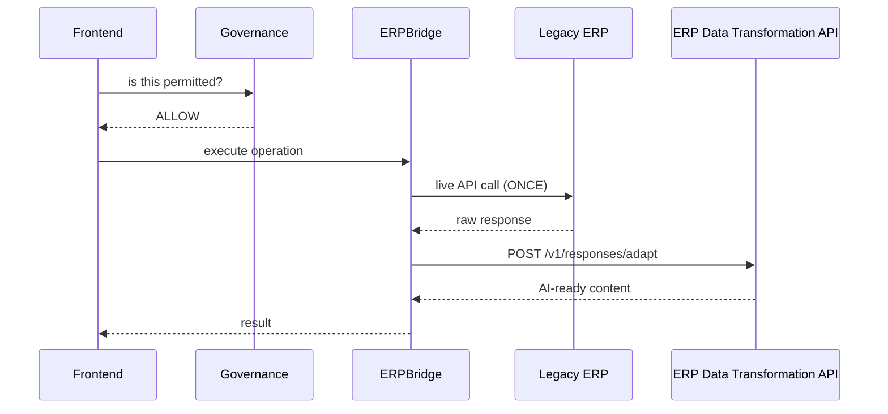

# ERP Data Transformation Pipeline — Integration Guide

**For:** ERPBridge, Frontend and Governance developers
**Service:** ERP Data Transformation API
**Base URL:** `https://erp-data-transformation-api-ju0h8k.azurewebsites.net`
**Swagger:** `https://erp-data-transformation-api-ju0h8k.azurewebsites.net/docs`

Full endpoint reference:
[`ERP_DATA_TRANSFORMATION_PIPELINE_API_HANDOFF.md`](ERP_DATA_TRANSFORMATION_PIPELINE_API_HANDOFF.md)

---

## 1. What this service does

It turns heterogeneous ERP information into **AI-ready text with stable identity
and provenance**, indexes it as 384-dimensional vectors, and lets you retrieve
it exactly and semantically.

Concretely it accepts:

- relational and MongoDB sources (discovery, extraction, transformation)
- CSV files (schema inference and cataloguing)
- PDFs and images (extraction and OCR)
- database BLOB columns (binary detection → document → text)
- explicitly declared remote asset URLs (SSRF-guarded, ships disabled)
- **raw ERP API responses** (relevance selection and context reduction)

and it produces searchable representations plus an adapted, AI-ready form of a
live ERP response.

## 2. What this service does NOT do

| It does not | That belongs to |
|---|---|
| Call ERP business APIs | ERPBridge |
| Hold ERP credentials | ERPBridge |
| Select MCP tools | ERPBridge |
| Decide whether a user may see something | Governance |
| Generate final natural-language answers | Your LLM layer |
| Render UI | Frontend |

These are enforced structurally: an AST scan asserts no `requests`/`httpx`/
`aiohttp`/`mcp` import and no policy-client class exists anywhere in the
production package.

---

## 3. Authentication — read this first

```
Header:  X-API-Key: <YOUR_VALUE>
```

- **Every** endpoint requires it except `/v1/health/live`, `/v1/health/ready`,
  `/docs`, `/redoc`, `/openapi.json`.
- In Swagger, click **Authorize**, paste the key once, done.

> ### The key must never reach a browser
>
> It is a **server-to-server secret**. Do not put it in Vite/React env vars,
> bundled JavaScript, or static frontend config — a `VITE_*` variable is inlined
> into the published bundle and is readable by anyone.
>
> ```
> Browser  ──user session──▶  Your trusted backend / BFF  ──X-API-Key──▶  This API
> ```
>
> This is **separate from CORS**. CORS controls which origins a browser may call
> from; it does nothing to protect a key that is already in the bundle.

**CORS status:** currently `http://localhost:5173` only. Send the production
frontend origin and it will be added. It is never `*`.

---

## 4. ERPBridge integration

### When to call

**After** you have executed the ERP call. Never before, and never instead.



### Your endpoints

```
POST /v1/responses/adapt          ← the runtime integration
GET  /v1/capabilities             ← discover what is enabled
GET  /v1/schemas/{schema_id}      ← structural context
```

### What to send

| Field | Notes |
|---|---|
| `query` | The original user question — drives relevance selection |
| `source_system_id` | Which ERP |
| `endpoint` | Provenance only. This service never calls it |
| `http_status` | Pass the real status, including 404/503 |
| `content_type` | Must match the body |
| `body` **or** `body_base64` | JSON object, or base64 for PDF/image |

**Do not send** ERP credentials, `Authorization` headers or cookies. They are
redacted if they arrive, but the production contract excludes them.

### How to read the response

| Body type | Where the content is |
|---|---|
| JSON | `llm_ready` — the selected, canonically-mapped fields |
| **PDF / image** | **`assets[0].text`** — `llm_ready` is `{}` and `partial` is `true` |

Always check `warnings` and `partial`.

### Three behaviours to design around

1. **Collections adapt the first record only.** A multi-record response returns
   the first, with a warning naming the total (*"the response carried 3 records;
   the first was adapted and the rest were not"*). If you need all records,
   call per-record or handle the warning explicitly.
2. **This service never retries an ERP request.** A 404 or 503 body is adapted as
   what it is. Re-issuing is your decision — a retried write is a duplicated
   write.
3. **Business-payload content is not secret-scanned.** Transport metadata is
   redacted; a field named `db_password` inside an ERP *business* response passes
   through as content. Do not return credentials in business payloads.

---

## 5. Frontend integration

### Your endpoints

```
POST /v1/files/csv                            upload CSV → schema
POST /v1/files/documents                      upload PDF/image → auto-indexed
GET  /v1/jobs/{job_id}                        poll async work
GET  /v1/schemas/{schema_id}                  read an inferred schema
POST /v1/search                               semantic + exact search
GET  /v1/representations/{representation_id}  resolve a hit to its text
GET  /v1/capabilities                         discover what is enabled
```

Also available: `POST /v1/sources`, `POST /v1/mappings/suggest`,
`PUT /v1/mappings/{id}`, `POST /v1/jobs`, `GET /v1/records/{id}`.

### Document workflow — one call in, searchable out

```
POST /v1/files/documents  (multipart)
   file, source_system_id, source_entity,
   business_key_name, business_key_value, document_type, sensitivity
→ 201 { upload_id, document_id, page_count, ocr_used,
        index_job_id, indexing_status, warnings }

GET  /v1/jobs/{index_job_id}   → poll until status == "succeeded"
POST /v1/search                → find it
GET  /v1/representations/{id}  → read the text
```

Indexing is **automatic**. No second call to start it.

### CSV workflow — the one thing people get wrong

```
POST /v1/files/csv → schema_id  ← the SCHEMA is indexed automatically
```

**Business rows are NOT indexed by the upload.** To index rows:

```
POST /v1/sources                → register the source
POST /v1/mappings/suggest       → review / approve
POST /v1/jobs                   → 202
     { "job_type": "source_native_pipeline",
       "source_id": "...", "schema_id": "...", "upload_id": "...",
       "options": { "key_fields": ["employee_id"] } }
GET  /v1/jobs/{job_id}          → poll
```

**Rows need a declared key.** An inferred CSV schema has no primary key, and the
fallback record key is the *row number* — a position that changes the moment a
row is inserted above it. Without `options.key_fields` every row is refused with
`"no usable record identity"`. This is deliberate, not a bug.

### Search → resolve — always two calls

```
POST /v1/search   → hits with representation_id, score, tier, metadata
                    (identity · provenance · sensitivity)   NO TEXT
GET  /v1/representations/{representation_id}  → the text
```

Do not build a UI that expects text inside a search hit. Qdrant holds no raw
content by design, and this two-call shape is the mechanism that keeps it that
way.

### Things that will bite you

- `POST /v1/jobs` returns **202**, not 201. Poll the job.
- `business_key_name` and `business_key_value` are **one declaration in two
  fields** — sending one is **422**.
- `sensitivity` must be `public`, `internal`, `confidential` or `restricted`;
  anything else is **422**.
- An unknown search filter is **422**, not ignored.
- Filters are **exact-match only** — no ranges, no OR, no negation.
- First request after idle can take **2–3 minutes** (cold start, model load).
- A `restricted` document **is returned**, tagged `sensitivity: "restricted"`.
  This service does not deny — that is Governance's call.

---

## 6. Governance integration

**No runtime call to this service is required.** The normal flow is
Frontend → Governance → ERPBridge → ERP → this service (adaptation only).

You may consume, at **design time**:

```
GET /v1/capabilities            what the deployment supports and has enabled
GET /v1/schemas/{schema_id}     structural metadata
```

### What this service gives you to decide with

Every search hit and every resolved representation carries:

| Field | Use |
|---|---|
| `sensitivity` | `public` / `internal` / `confidential` / `restricted` |
| `source_system_id`, `source_entity`, `source_field` | Where it came from |
| `business_key_name`, `business_key_value` | Which business record |
| `document_type`, `content_kind` | What kind of thing it is |
| `parent_record_id`, `document_id` | Attachment identity |

### The boundary

This service **classifies and reports**. It **never denies**. There is no
`if restricted: deny(user)` anywhere in the package. A restricted birth
certificate is returned with its classification attached so that you — the
trusted upstream layer — can make an informed decision.

**Do not read fresh transactional facts from this service.** Its index is a
snapshot bounded by a polling interval. Current facts come from ERPBridge's live
execution.

---

## 7. Known limitations you must design around

1. **Collection responses** adapt the first record only (declared, with a count).
2. **Business-payload content is not secret-scanned.**
3. **CSV upload indexes the schema, not the rows.**
4. **Rows require declared `key_fields`.**
5. **Search returns no text** — resolve separately.
6. **Exact-match filters only.**
7. **Sync is polling, not CDC** — freshness is bounded by the interval.
8. **Remote asset fetching ships disabled** — no HTTP client is bundled.
9. **Cold start** of 2–3 minutes after idle.
10. **CORS** must be extended with your production origin.
11. **Restricted data cannot be indexed on the current Azure deployment.**
    The storage policy restricts `sensitivity: restricted` to on-premises
    tiers, and the Azure deployment has none — HOT and WARM are Qdrant Cloud
    and COLD is Azure Files. An upload declaring `restricted` is accepted and
    extracted, but the indexing job completes **`partial`** with
    `vectors_stored = 0` and `vectors_failed = 1`, and **no vector is created**.
    This is deliberate fail-closed behaviour, not an error to route around.
    Use `confidential` or lower for cloud-indexed content, or provide an
    on-premises tier. See
    [`..._POST_AUDIT_REMEDIATION.md`](ERP_DATA_TRANSFORMATION_PIPELINE_POST_AUDIT_REMEDIATION.md).

---

## 8. Quick test procedure

```bash
curl https://erp-data-transformation-api-ju0h8k.azurewebsites.net/v1/health/ready
```

```bash
curl -H "X-API-Key: <YOUR_VALUE>" https://erp-data-transformation-api-ju0h8k.azurewebsites.net/v1/capabilities
```

```bash
curl -X POST https://erp-data-transformation-api-ju0h8k.azurewebsites.net/v1/responses/adapt -H "X-API-Key: <YOUR_VALUE>" -H "Content-Type: application/json" -d '{"query":"employment status","source_system_id":"legacy_hr","endpoint":"/api/hr/employees/EMP002","http_status":200,"content_type":"application/json","body":{"employee_id":"EMP002","employment_status":"ACTIVE"}}'
```

Or open **Swagger**, click **Authorize**, paste the key, and use *Try it out* on
any operation.

**Expected auth behaviour:** no key → 401 · wrong key → 401 · valid key → 200 ·
health endpoints → 200 without a key.
