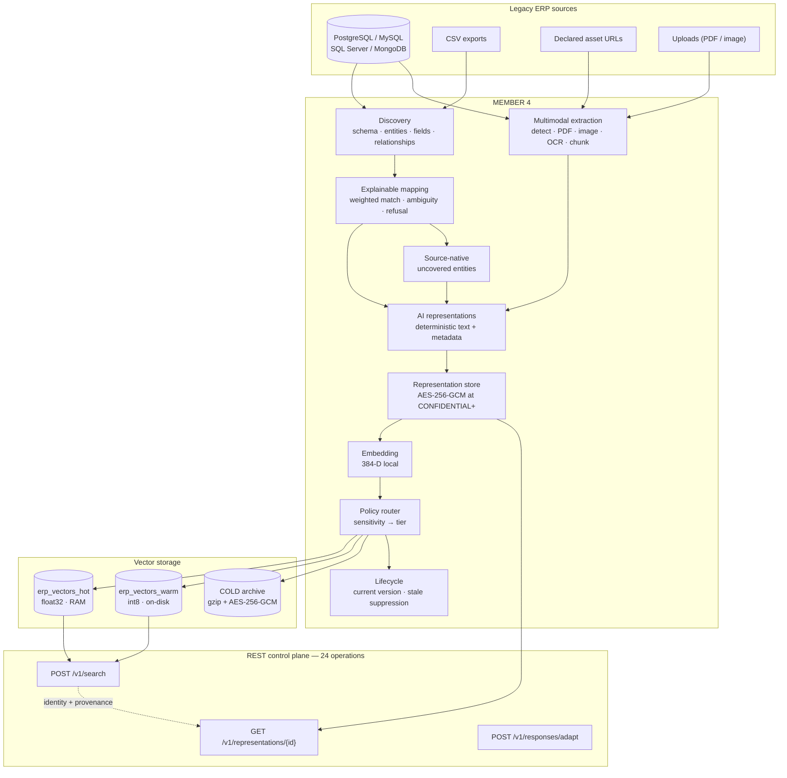
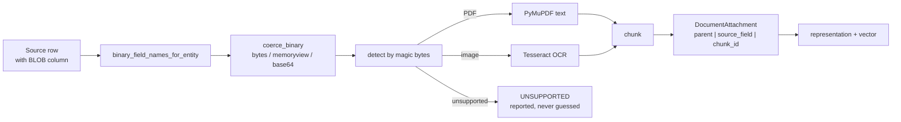
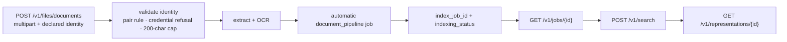
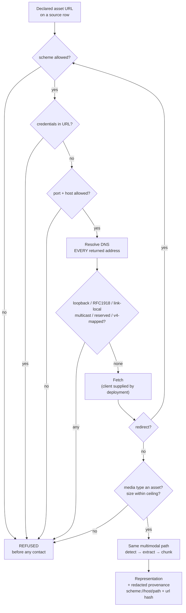
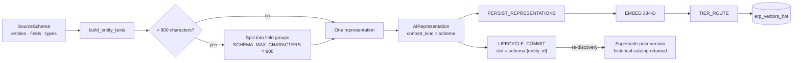
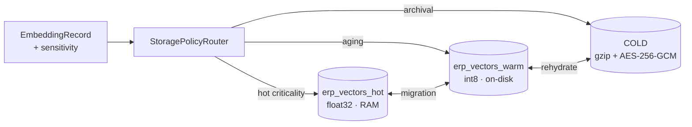
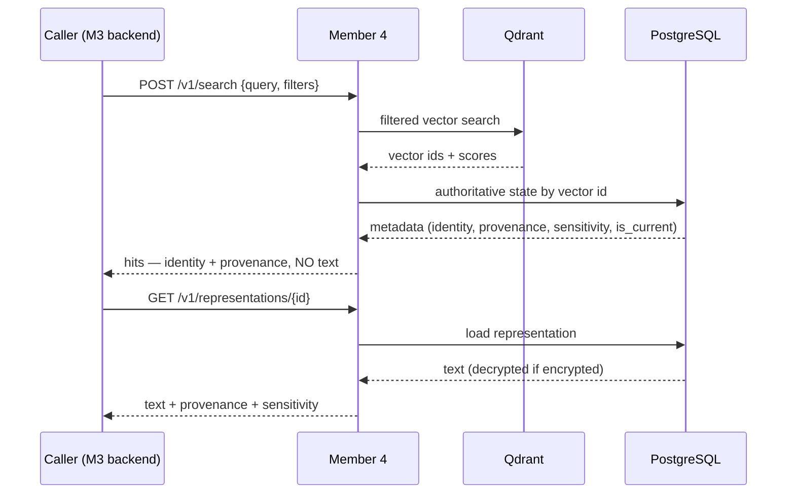
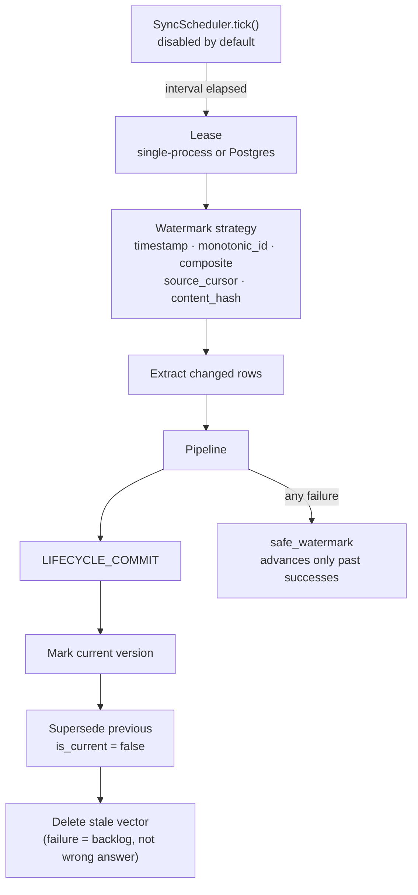
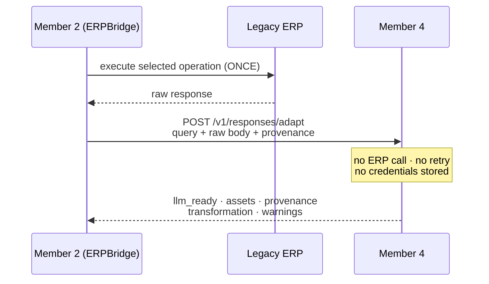

# Final Component Technical Report — Member 4

**ERP-Aware Multimodal Data Transformation, Vector Indexing and Retrieval
Pipeline for Legacy ERP Systems**

**Student:** IT22267290 · **Project:** R26-SE-034 · **Member:** 4
**Status:** frozen at Phase 12 · **Date:** 2026-08-25

---

## 1. Executive summary

Legacy ERP systems hold the information an AI assistant needs, in forms an AI
assistant cannot use: normalised relational rows under vendor-specific column
names, scanned certificates in BLOB columns, PDFs behind signed URLs, and
schemas that document themselves only in their own vocabulary. This component
turns that heterogeneous material into deterministic, identity-preserving,
sensitivity-classified representations, indexes them as 384-dimensional
vectors, and serves exact-plus-semantic retrieval and live response adaptation
over a 24-operation REST contract.

It contains no LLM, executes no ERP business API, and makes no authorization
decision. Those belong to other members, and the boundaries are enforced by
structural tests rather than promised in prose.

**Final readiness: 91.5 / 100.** Full regression: 3730 collected, 3667 passed,
0 failed, 0 errors, 63 skipped. Final end-to-end evaluation: 30/30 scenarios,
16 hard gates at zero.

## 2. Research problem

An ERP-aware AI assistant needs three things the ERP does not provide:

1. **Vocabulary translation with an audit trail.** `cust_ref`, `KUNNR` and
   `customer_id` may mean the same thing. A mapping that is confidently wrong
   is worse than one that refuses, because nothing downstream can tell the
   difference.
2. **Multimodal preparation that preserves identity.** A birth certificate in
   a BLOB is useless until extracted — and dangerous if attached to the wrong
   employee. Identical bytes filed against two employees must not collapse into
   one vector.
3. **Retrieval that separates *exact* from *similar*.** "EMP002's birth
   certificate" is an exact identity constraint; "what does it say about place
   of birth" is a semantic one. Answering the first with similarity produces
   confident, plausible, wrong answers.

## 3. Final scope

**In scope:** ERP connectivity and discovery · structured extraction ·
explainable canonical mapping · source-native entities · multimodal preparation
(DB BLOB, PDF, image, OCR, declared remote URLs) · frontend document ingestion ·
schema representation · AI-ready deterministic representations · local
embedding · sensitivity-aware tiered vector storage · exact + semantic
retrieval · representation resolution · near-real-time scheduled sync ·
current-version lifecycle · sensitivity propagation and encrypted persistence ·
adaptive transformation of Member 2's live ERP responses.

**Out of scope:** LLM training, fine-tuning, or answer generation · ERP business
API execution · MCP execution · ERP credentials · end-user authorization, policy
decisions, RBAC · Member 3's UI · web/HTML crawling · true CDC replication ·
stream-processing platforms.

## 4. Member boundaries

| Member | Question it answers | Never does |
|---|---|---|
| 1 — Policy Gate | *Is this operation permitted?* | Execute ERP operations |
| 2 — ERPBridge / MCP | *Which ERP operation runs — and run it.* | Prepare or index data |
| 3 — Frontend | *How does the user interact?* | Hold Member 4's service key in the browser |
| **4 — this component** | *How is heterogeneous ERP data prepared, indexed, retrieved and adapted for AI?* | Call ERP APIs · select MCP tools · hold ERP credentials · authorize users · generate answers |

Enforced structurally: no `PolicyGateClient`, no MCP import, and no
`requests`/`httpx`/`aiohttp` import anywhere in `src/erp_pipeline` — asserted by
AST scan in `tests/erp_pipeline/integration/test_integration_security.py`.

## 5. Technology stack

Python 3.13.9 · FastAPI 0.141.1 · Pydantic 2.13.4 · SQLAlchemy 2.0.51 ·
PostgreSQL · Qdrant (client 1.18.0) · sentence-transformers 5.6.1 (`all-MiniLM-L6-v2`,
384-D) · torch 2.13.0 · PyMuPDF 1.28.0 · Pillow 12.3.0 · Tesseract 5.5.0 ·
cryptography 50.0.0 · pytest 9.1.1 · React 18 + Vite 5 + vitest 2 (developer UI).

**Zero LLM calls in every phase.**

## 6. Complete architecture



## 7. Database discovery

`discovery/relational.py` inspects tables, columns, primary keys and foreign
keys; `discovery/mongodb_inference.py` infers structure by sampling documents,
because a collection has no declared schema. Results are catalogued in
`erp_catalog` (`source_systems`, `source_entities`, `source_fields`,
`source_relationships`, `schema_snapshots`) with versioned snapshots, so history
is never destroyed by a re-discovery.

Exposed by `POST /v1/sources/{id}/discover` and `GET /v1/schemas/{schema_id}`.

## 8. Structured transformation


19 pipeline stages, 7 job types. Every job reports per-stage status, counters
and warnings; a job whose records partially failed is `partial`, never
`succeeded`.

## 9. Explainable mapping

Weighted matching over field name, alias registry, entity context and datatype
compatibility. Three outcomes: **automatic** (confident and unambiguous),
**review** (ambiguous — two candidates too close to separate), and **refusal**
(no candidate clears the floor).

Measured: top-1 **1.0**, top-3 **1.0**, auto-selection precision **1.0**
(60/60), automatic coverage **0.8824**, correct refusal **1.0**,
alias-independent top-1 **1.0** (18/18).

The 11.76% not mapped automatically is the contribution, not a shortfall. A
mapper that mapped everything would score better on coverage and worse on
trust.

## 10. Source-native entities

Not every ERP table has a canonical equivalent. Rather than forcing a bad
mapping or dropping the table, `source_native_pipeline` indexes an uncovered
entity **under its own field names**, guarded by `SOURCE_NATIVE_GUARD` so an
entity the canonical model *does* cover cannot bypass mapping review.

Requires a real record identity. Where a schema declares no primary key, the
extractor's fallback key is the row *number* — a position, not an identity, that
changes when a row is inserted above it. Such rows are refused with `"no usable
record identity"`; the caller declares `options.key_fields` instead.

## 11. Multimodal DB BLOB processing



Extraction is entirely **in memory** — `FileSource.payload` carries bytes and no
temporary file is written, which is enforced by a read-only-filesystem
invariant test over the ingestion package.

The attachment key `parent | source_field | chunk_id` is what keeps two
employees' copies of an identical certificate apart. Content identity alone
would give both the same chunk id, the same vector, and one would silently
overwrite the other.

Measured: 7 documents indexed, **0 association collisions**, **0 binary/base64
leakage** across 12,731 audited surface bytes.

## 12. Uploaded document processing



One call in; a searchable, resolvable document out. Identity is **declared,
never inferred** — a filename saying `EMP002` proves nothing, and a guess stored
in the same field as a declared primary key would be indistinguishable from
fact.

Measured: 6/6 automatic jobs, **0 manual job calls**, upload→searchable median
28.765 ms (max 1142.399 ms when OCR runs).

## 13. Remote asset processing

Declared static asset URLs only. **Never** an ERP business API, never crawling,
never following hyperlinks, never an HTTP proxy, never a write.

SSRF policy: scheme allow-list · credentials-in-URL rejected · port allow-list ·
host allow-list · DNS resolution of **every** returned address · loopback,
RFC1918, link-local, multicast, reserved and IPv4-mapped rejection · redirect
re-validation · size ceilings.

The package **bundles no HTTP client**, so importing it can never cause a
request; a deployment must supply both a policy and a fetcher. Raw URLs never
reach AI text, Qdrant payloads, search responses, warnings, logs, exceptions or
job reports — provenance carries scheme/host/path plus a hash of the full URL,
so two rows referencing one signed URL correlate without either being readable.



Measured: **0 private or internal targets contacted**, **0 secret URL leakage**,
**0 HTML pages indexed**.

## 14. Schema-vector architecture

ERP *structure* is itself indexed, as `content_kind=schema`. Field groups are
chunked at `SCHEMA_MAX_CHARACTERS = 900` because the model's measured window is
256 tokens (≈1024 characters) — a whole 95-field schema in one representation
would be truncated mid-structure.



Schema representations carry entity, field names, source datatypes and
normalized types — never business values. Verified: **0 business-value
leakage**, **schema text in Qdrant: false**.

## 15. AI representations

Deterministic text plus metadata. Three content kinds:
`structured_record`, `document_chunk`, `schema`. No generative summarisation:
the same input always produces the same representation, which is what makes
`content_hash` meaningful and re-runs idempotent.

## 16. Representation persistence and encryption

`erp_runtime.ai_representations` is the authoritative store for AI-ready text.
Qdrant holds **no raw content** — only vectors and filterable metadata.

Text classified `CONFIDENTIAL` or above is encrypted with **AES-256-GCM**, a
fresh random 96-bit nonce per encryption, under a dedicated key
(`ERP_REPRESENTATION_ENCRYPTION_KEY`, separate from the cold-archive key). The
envelope is prefixed `encv1:` so pre-existing plaintext rows stay readable
without migration.

**Fail closed.** If a classification requires encryption and no key is
configured, persistence fails — there is no plaintext fallback. Because
persistence precedes embedding, that failure also means the vector never becomes
searchable: the document is *absent* rather than *exposed*.

## 17. Embeddings

`all-MiniLM-L6-v2`, 384-D, run locally. No API calls, no LLM. Measured window:
256 tokens. The dimensionality is a deliberate research-scale choice and is also
the cause of the datatype-vocabulary weakness in §27.

## 18. Qdrant tier architecture



**Physical collections are storage tiers; logical data kinds are metadata.**
Modality and entity are filterable fields, not separate collections — see the
compliance audit §2 for why one-collection-per-modality would be worse.

Measured: cross-tier top-5 overlap **1.0**, cold round-trip **lossless**.

## 19. Exact and semantic retrieval

`POST /v1/search` combines **exact** Qdrant filters over 13 fields with
**semantic** cosine ranking. Filters are exact-match; an unknown filter is
rejected rather than ignored. After the vector search, filters are re-checked
against authoritative tier state, so a vector whose payload and state disagree
cannot leak a non-matching hit.

Phase 9's `is_current` backstop means a superseded vector still physically
present — because its delete failed or has not run — is never returned as
current. A failed delete becomes a cleanup backlog, not a wrong answer.

## 20. Representation resolution



**Search never returns document text.** Two calls, deliberately: it is the
mechanism that keeps raw content out of the vector store.

Measured: 58/58 hits resolved, **0 unresolvable**, **0 wrong text resolutions**.

## 21. Synchronisation and lifecycle



**Near-real-time, not CDC.** Freshness is bounded by *the configured interval
plus processing latency* — measured at **5.0 s + 0.877 ms median**. The
scheduler ships disabled, uses an injected clock, and starts no threads.

Measured: 8 source changes, **0 permanently missed**, **0 wrong current-version
hits**, **0 watermark regressions**, **0 cross-parent deletion errors**.

## 22. Sensitivity and security

Four levels — `public` < `internal` < `confidential` < `restricted`, default
`internal`. The order is declared explicitly as a tuple, not inherited from enum
declaration order, so reordering the enum for readability cannot silently
reorder security decisions.

Resolution is **strictest wins** across artifact, job, source and inherited
declarations. Never "most specific": treating restricted data as internal is a
disclosure; the reverse is an inconvenience.

Classification is **declared, never inferred**. No PII classifier, no LLM. A
classifier that guessed `birth_certificate → RESTRICTED` would also guess
wrongly, and a wrong classification is worse than an absent one because it looks
authoritative.

**The boundary:** Member 4 owns sensitivity *metadata*. Member 1 owns
*authorization*. A restricted document is returned with
`sensitivity: "restricted"` attached so the trusted upstream layer can decide.
There is no `if restricted: deny(user)` anywhere in the package.

## 23. Response adaptation



Detect (magic bytes) → unwrap → canonical map → deterministic relevance
selection → budgets. Identity fields are preserved unconditionally, so a
reduced payload never loses the key that identifies it.

Measured over 68 cases: relevant recall **0.980**, irrelevant removal **0.609**,
context reduction **0.500**, success **1.0**, median **15.83 ms**, p95 **24.05 ms**.

**Binary responses:** `llm_ready` is `{}` and `partial` is `true`; the extracted
text is in `assets[0].text`. A PDF has no structured fields for field-selection
to select.

**Collection responses adapt the first record only**, and say so with the total
count.

## 24. API contract

24 operations, OpenAPI 3.1.0, service version 1.0, snapshot at
`artifacts/openapi_contract_snapshot.json`.

Authentication: `X-API-Key`, constant-time comparison. All mutating methods
require it; reads require it when `protect_reads` is enabled (default off).
Health and docs are always public.

CORS: closed by default; explicit origins only; no wildcard — enforced by an
AST-level test.

Errors are stable JSON (`{success, error:{code, message, request_id}}`) with no
traceback, no dataclass `repr`, no enum `repr`, and no internal module path.

## 25. Member integration

Full contract:
[`group_integration_contract.md`](group_integration_contract.md).

- **Member 3** → uploads, jobs, search, resolve. Its trusted backend holds the
  API key; the browser must never.
- **Member 2** → `POST /v1/responses/adapt`, after executing the ERP itself.
- **Member 1** → no runtime call required; may read capabilities and schema
  metadata at design time.

Measured: 21/21 scenarios, Member 4 ERP executions **0**, policy decisions
**0**, denied operations executed **0**.

## 26. Evaluation methodology

Twelve artifacts across eleven evaluation scripts, each with its own corpus and
its own gates. Design principles held throughout:

- **Failures are kept and reported, never tuned away.** The three Phase 14
  relevance failures and the Phase 7 datatype weaknesses stand unmodified.
- **No post-hoc vocabulary fitting.** Adding synonyms after seeing which queries
  failed would measure the author's memory, not the system.
- **Prior artifacts are never overwritten.** Where an old evaluator had to be
  re-run, it was backed up, diffed and restored byte-for-byte.
- **Measurement environments are labelled.** In-process latency is never
  presented as production latency.

## 27. Results

| Dimension | Headline metrics |
|---|---|
| Mapping | top-1 1.0 · top-3 1.0 · auto precision 1.0 · coverage 0.8824 · refusal 1.0 |
| Storage fidelity | top-5 overlap 1.0 · cold lossless · 500 records / 40 queries |
| Multimodal | 7 indexed · 0 collisions · 0 leakage |
| Identity retrieval | 14 queries · 0 wrong identities · median 0.229 ms |
| Resolution | 58/58 resolved · 0 unresolvable |
| Automatic indexing | 6/6 jobs · 0 manual calls · median 28.8 ms (max 1142 ms with OCR) |
| Schema retrieval | R@1 0.727 · R@3 0.909 · MRR 0.811 |
| Remote assets | 0 private contacts · 0 URL leakage |
| Synchronisation | 0 missed · 0 wrong-version · 5 s + 0.877 ms |
| Sensitivity | 0 downgrades · 0 plaintext findings · AES-256-GCM |
| Integration | 21/21 · 9 gates zero |
| Response adaptation | recall 0.980 · context −50.0% · p95 24.05 ms |
| Final end-to-end | 30/30 · 16 gates zero |

### Consolidated performance table

Separated by environment, because these are not one benchmark.

| Measurement | Median | p95 / max | Environment |
|---|---|---|---|
| Response adaptation | 15.83 ms | p95 24.05 ms | in-process, no I/O |
| Identity search + filter merge | 0.229 ms | p95 0.844 ms | **in-process tier, not Qdrant** |
| Representation lookup | 0.251 ms | p95 0.513 ms | SQLite-attached runtime schema |
| Upload → searchable | 28.77 ms | max 1142.40 ms | **max is the OCR path** |
| Schema query | 22.46 ms | p95 29.95 ms | in-process tier |
| Schema index per source | 238.56 ms | — | includes embedding |
| Sync processing | 0.877 ms | p95 1.54 ms | inline executor, injected clock |
| Representation encrypt / decrypt | 0.047 / 0.022 ms | — | in-process crypto only |
| WARM → COLD movement | 2.15 ms/vector | — | **live Qdrant** |
| COLD → WARM movement | 33.48 ms/vector | — | **live Qdrant** |

No figure here is a production ERP latency; every ERP round trip is on Member
2's side of the boundary.

## 28. Research contributions

| Contribution | Classification | Basis |
|---|---|---|
| **Explainable ERP-aware schema mapping** | **PRIMARY RESEARCH CONTRIBUTION** | Weighted matching with confidence, ambiguity detection and *principled refusal*; measured against 68 labels including 8 negatives and 18 alias-independent cases. The refusal behaviour is the novel part — most mapping work optimises coverage |
| **ERP-aware adaptive response transformation** | **PRIMARY RESEARCH CONTRIBUTION** | Deterministic, LLM-free relevance selection with mandatory identity preservation; three-arm ablation over 68 cases quantifying the recall/context exchange rate (−2.0% recall for −50.0% context) |
| **Sensitivity-aware tiered vector storage** | **SUPPORTING RESEARCH MECHANISM** | HOT/WARM/COLD with policy routing and selective AES-256-GCM. Tiering itself is established practice; binding it to *declared* sensitivity with fail-closed persistence is the contribution. Fidelity measured (top-5 overlap 1.0), not retrieval accuracy |
| **Attachment-identity multimodal preparation** | **SUPPORTING CONTRIBUTION / ENGINEERING INTEGRATION** | The `parent \| source_field \| chunk_id` identity model is a real design result (0 collisions where content identity would collide). The extraction itself — PyMuPDF, Tesseract — is standard technology |
| **Schema semantic retrieval** | **SUPPORTING RESEARCH CAPABILITY** | Indexing ERP *structure* as vectors; R@1 0.727 with an honestly reported vocabulary weakness |
| **Identity-aware retrieval filters and REST contract** | **ENGINEERING INTEGRATION** | Filtered vector search is ordinary. The identity *model* and its zero-valued gates are the evidence; the API is engineering |
| FastAPI · Qdrant · PostgreSQL · PyMuPDF · Tesseract · MiniLM | **STANDARD TECHNOLOGY** | Used as intended; no novelty claimed |

## 29. Limitations register

**Response adaptation**
1. A collection response adapts the **first record only**, with a warning naming
   the total. Declared, not silent. Not redesigned in Phase 11 or 12.
2. Three documented relevance failures — `po-05` (`supplier_no`), `proc-02`
   (`resource`), `sap-04` (`BELNR`). Preserved unmodified.
3. **Business-payload content is not secret-scanned.** Transport metadata
   (headers, provenance, logs, persistence) *is* redacted; a field named
   `db_password` inside an ERP business response is application data to Member 4
   and passes through as content. No general semantic secret detection is
   claimed. *Guidance: Member 2 must not send credentials as business-payload
   fields.*

**Schema retrieval**
4. Recall@1 = 0.727 over 22 queries; datatype-vocabulary queries measurably
   weaker than entity/field-name queries. Cause: 384-D MiniLM has little
   semantic neighbourhood for tokens like `VARBINARY`. Not repaired.

**Remote assets**
5. An unchanged URL is **not** automatically re-fetched — content behind a
   stable URL can drift without detection.
6. DNS TOCTOU remains a deployment boundary: addresses are validated at
   resolution time, and a resolver that changes between validation and connect
   is outside what the policy can close.

**Synchronisation**
7. Polling, **not CDC**. Freshness bounded by interval + processing latency.
8. Hard-delete observability is connector-dependent — a source that deletes
   without a tombstone or timestamp cannot be observed by polling.

**Storage**
9. All three tiers are currently configured on-premises, so the
   `on_premises_only_sensitivities = {RESTRICTED}` constraint is enforced but
   **not currently binding**. It would bind if COLD moved off-premises.
10. **No Qdrant payload indexes.** Filtering is research-scale; nothing here
    predicts filter performance on a production corpus.
11. Tier state is loaded via `list_all()` and filtered in the query path — fine
    at research scale, a full scan at production scale.

**Persistence and caching**
12. The upload extraction cache is bounded (LRU, default 32,
    `ERP_UPLOAD_CACHE_MAX_ENTRIES`, cannot be unlimited) but **ephemeral** — it
    does not survive a restart, by design.
13. Representation encryption assumes the deployment protects the database and
    manages `ERP_REPRESENTATION_ENCRYPTION_KEY` outside this component. No key
    rotation tooling ships.
14. Pre-Phase-10 plaintext rows remain readable via the `encv1:` prefix
    convention; there is **no migration job** that retrospectively encrypts
    them. A deployment wanting historic rows encrypted must re-index them.

**API and deployment**
15. `protect_reads` defaults to `False`, so GET routes are unauthenticated
    unless a deployment enables it.
16. Search filters are exact-match only — no ranges, no negation, no OR.

**Boundaries (not defects)**
17. **Member 1** owns authorization. Member 4 classifies and reports; it never
    denies.
18. **Member 2** owns ERP execution and credentials. Member 4 never calls an
    ERP business API and never retries one.
19. Members 1–3 are represented by **test doubles**. Contract coherence is
    proven; real interoperability is not.

**Evaluation**
20. All corpora are synthetic, author-constructed, and small. Single annotator
    for Phase 14. No significance testing. No downstream LLM answer-quality
    study. See the research evaluation §17.

## 30. Demo scenarios

| | Scenario | Status |
|---|---|---|
| A | Legacy DB → EMP002 structured data → Qdrant → retrieval | **READY** |
| B | Legacy DB → EMP002 `birth_certificate` BLOB → OCR → exact retrieval | **READY** |
| C | Member 3 upload → automatic index → retrieval | **READY** |
| D | *"Which table contains birth certificates?"* → schema retrieval | **READY** |
| E | Declared remote certificate URL → safe fetch → retrieval | **PARTIAL** — policy proven with an injected recorder; ships disabled and no real network fetch has been demonstrated |
| F | Source certificate changes → scheduled sync → only new version returned | **READY** |
| G | Restricted certificate → encrypted persistence → sensitivity preserved | **READY** |
| H | M3 → M1 ALLOW → M2 ERP → M4 adapt | **READY** |
| I | M1 DENY → M2 executes 0 times → M4 adapts 0 times | **READY** |

Suggested demo order: A → B → C → D → G → F → H → I, with E described rather
than executed unless a fetcher is configured.

## 31. Deployment and configuration

| Variable | Purpose | Default |
|---|---|---|
| `ERP_API_KEY` | Service key for `X-API-Key` | unset (open) |
| `ERP_PROTECT_READS` | Require the key on GETs | `false` |
| `ERP_CORS_ORIGINS` | Explicit browser origins | empty (closed) |
| `ERP_REPRESENTATION_ENCRYPTION_KEY` | base64 AES-256 for CONFIDENTIAL+ text | unset → fails closed |
| `ERP_COLD_ARCHIVE_KEY` | base64 AES-256 for the COLD archive | unset |
| `ERP_SYNC_SCHEDULER_ENABLED` | Scheduled sync | `false` |
| `ERP_UPLOAD_CACHE_MAX_ENTRIES` | Bounded LRU | `32` |
| `AI_DB_*` | PostgreSQL connection | unset |
| `QDRANT_HOST` / `QDRANT_PORT` | Vector store | `localhost` / `6333` |
| `TESSERACT_CMD` / `TESSERACT_PATH` | OCR binary | PATH lookup |

Secure defaults throughout: loopback binding, CORS closed, uploads capped,
remote fetching disabled, scheduler disabled.

## 32. Reproducibility

```bash
.venv/Scripts/python.exe -m pytest tests/ -q
```

```bash
.venv/Scripts/python.exe -m pytest tests/erp_pipeline/mapping/test_mapping_benchmark.py -q -s
```

```bash
.venv/Scripts/python.exe scripts/evaluate_consolidated_component.py
```

```bash
.venv/Scripts/python.exe scripts/evaluate_response_adaptation.py
```

```bash
.venv/Scripts/python.exe scripts/benchmark_tiered_storage.py
```

```bash
cd frontend && npm test
```

Per-phase evaluators are `scripts/evaluate_phase{3..11}_*.py`. No internet
access is required by any of them; the remote-asset evaluator uses an injected
recorder and opens no sockets.

**Note:** `evaluate_response_adaptation.py` and
`benchmark_tiered_storage.py` **overwrite their own artifacts**. Back up, run,
compare, restore if the original must be preserved.

## 33. Final readiness

| Dimension | Status |
|---|---|
| Implementation | **READY** |
| Research evidence | **READY WITH LIMITATIONS** |
| Member 3 integration | **READY** |
| Member 2 integration | **READY** |
| Member 1 architecture compatibility | **READY** |
| Four-member demo | **READY** |
| Production hardening | **PARTIAL** — no payload indexes, `list_all()` scan in the query path, `protect_reads` off by default, no key-rotation tooling, research-scale corpus only |

**Final component readiness: 91.5 / 100.**

**FINAL MEMBER 4 STATUS: COMPLETE WITH DOCUMENTED LIMITATIONS.**
