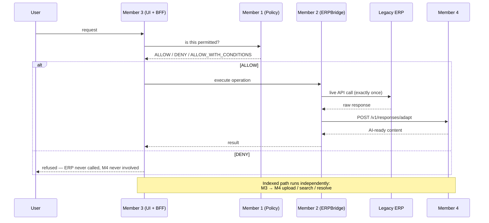

# Member 4 — Final Handoff

**Audience:** Members 1, 2 and 3 · supervisor / examiner · future developer
**Component:** ERP-Aware Multimodal Data Transformation, Vector Indexing and
Retrieval Pipeline for Legacy ERP Systems
**Student:** IT22267290 · **Project:** R26-SE-034 · **Frozen:** 2026-08-25

---

## 1. What this component is for

It answers one question: **how is heterogeneous ERP information prepared,
indexed, retrieved and adapted so an AI system can use it?**

Two paths, and the difference matters:

| You need | Ask | Why |
|---|---|---|
| A **current transactional fact** ("is INV-204 paid?") | **Member 2** — live ERP | The index is a snapshot bounded by a poll interval |
| **Indexed knowledge** ("what does EMP002's certificate say?") | **Member 4** — search + resolve | Documents and structure are indexed here |
| A **raw ERP response made AI-ready** | **Member 4** — `/v1/responses/adapt` | After Member 2 has executed it |

## 2. Runtime architecture



## 3. What is ready

| Capability | Status |
|---|---|
| DB discovery (PostgreSQL, MySQL, SQL Server, MongoDB) | READY |
| Structured transformation + explainable mapping | READY |
| Source-native entities | READY |
| DB BLOB → PDF/image/OCR → vector | READY |
| Uploaded document → automatic index | READY |
| Declared remote asset ingestion | READY, **ships disabled** |
| Schema → vector → semantic retrieval | READY |
| Exact identity + semantic search | READY |
| Representation content resolution | READY |
| Scheduled incremental sync + version lifecycle | READY, **ships disabled** |
| Sensitivity propagation + AES-256-GCM at rest | READY |
| Live ERP response adaptation | READY |

Full regression 3667 passed / 0 failed. Final evaluation 30/30, 16 gates zero.

## 4. Member 3 — integration steps

**Your backend holds the API key. The browser never does.**

1. **Discover** what is enabled: `GET /v1/capabilities` → read
   `integration_capabilities[name].enabled`, not just `supported`.
2. **Upload a document:**
   ```
   POST /v1/files/documents        multipart/form-data
     file, source_system_id, source_entity,
     business_key_name, business_key_value, document_type, sensitivity
   → 201 {upload_id, document_id, page_count, ocr_used,
          index_job_id, indexing_status, warnings}
   ```
3. **Poll:** `GET /v1/jobs/{index_job_id}` until `status == "succeeded"`.
4. **Search:** `POST /v1/search` with `query` + `filters`.
5. **Resolve:** `GET /v1/representations/{representation_id}` for the text.

**CSV is different:**

```
POST /v1/files/csv  → schema_id (the SCHEMA indexes automatically)
GET  /v1/schemas/{schema_id}
POST /v1/mappings/suggest        → review / approve
POST /v1/sources                 → register the source
POST /v1/jobs {job_type: "source_native_pipeline", source_id, schema_id,
                upload_id, options:{key_fields:["employee_id"]}}   → 202
```

### What not to expect

- **Search does not return text.** Hits carry identity, provenance and
  `sensitivity`. Resolve for the text.
- **CSV upload does not index rows.** Only the schema. Rows need mapping or a
  source-native job.
- **Document upload *does* index automatically.** No second call.
- **`POST /v1/jobs` returns 202**, not 201 — accepted, not finished.
- **Rows need a declared key.** An inferred CSV schema has no primary key, and
  row position is not identity. Without `options.key_fields` every row is
  refused with `"no usable record identity"`.
- **Half a business key is 422.** `business_key_name` and `business_key_value`
  are one declaration in two fields.
- **A restricted document is returned**, tagged `sensitivity: "restricted"`.
  Member 4 does not deny — that is Member 1's call.

## 5. Member 2 — integration steps

**Execute the ERP first. Then call Member 4.**

```
POST /v1/responses/adapt
{
  "query": "What is EMP002's employment status?",
  "source_system_id": "legacy_hr",
  "endpoint": "/api/hr/employees/EMP002",
  "http_status": 200,
  "content_type": "application/json",
  "body": { ...raw ERP response... }
}
```

Use `body_base64` + matching `content_type` for PDF or image responses.

**Send:** the original user query · the raw body · the correct content type ·
`source_system_id` · endpoint provenance · sensitivity where you know it.

**Do NOT send:** ERP credentials · `Authorization` headers · cookies. They are
redacted if they arrive, but the production contract excludes them.

### Reading the response

- **JSON:** the selected fields are in `llm_ready`.
- **Binary:** `llm_ready` is `{}` and `partial` is `true` — **the text is in
  `assets[0].text`**, with `page_count`, `content_hash` and
  `extraction_status`.
- **Collections:** only the **first record** is adapted. The warning names the
  total (`"the response carried 3 records; the first was adapted..."`).
- Always check `warnings` and `partial`.

### What Member 4 will never do

Choose the endpoint · execute an ERP API · **retry** an ERP business request ·
store an `Authorization` header · hold ERP credentials · call MCP.

A 404 or 503 body is adapted as what it is. Re-issuing is your decision — a
retried write is a duplicated write.

## 6. Member 1 — boundary

**No runtime Member 1 → Member 4 call is required.** The normal flow is
M3 → M1 → M2 → ERP → M4.

You may read at **design time**: `GET /v1/capabilities`, `GET /v1/schemas/{id}`.

Do **not** read fresh transactional facts from Member 4 — the index is bounded
by the sync interval. Those come from Member 2's live execution.

Member 4 contains no `PolicyGateClient` and no `Member1Client`, and an AST scan
in the test suite keeps it that way. It reports `sensitivity` on every hit and
resolution so you can decide; it never decides.

## 7. Environment variables

| Variable | Purpose | Default |
|---|---|---|
| `ERP_API_KEY` | Service key (`X-API-Key`) | unset (open) |
| `ERP_PROTECT_READS` | Require the key on GETs too | `false` |
| `ERP_CORS_ORIGINS` | Explicit browser origins | empty (closed) |
| `ERP_REPRESENTATION_ENCRYPTION_KEY` | base64 AES-256, CONFIDENTIAL+ text | unset → fails closed |
| `ERP_COLD_ARCHIVE_KEY` | base64 AES-256, COLD archive | unset |
| `ERP_SYNC_SCHEDULER_ENABLED` | Scheduled sync | `false` |
| `ERP_UPLOAD_CACHE_MAX_ENTRIES` | Bounded LRU | `32` |
| `AI_DB_*` | PostgreSQL | unset |
| `QDRANT_HOST` / `QDRANT_PORT` | Qdrant | `localhost` / `6333` |
| `TESSERACT_CMD` / `TESSERACT_PATH` | OCR binary | PATH |

## 8. API key and CORS

```
Browser / Member 3 UI
   │  user session auth        (Member 3's concern)
   ▼
Member 3 trusted backend / BFF
   │  X-API-Key                (the service key lives HERE)
   ▼
Member 4
```

- All mutating methods require `X-API-Key`; comparison is constant-time.
- Health and docs are always public.
- CORS is closed by default. Configure explicit origins; never a wildcard.
- **Never put the service key in browser JavaScript.** A Vite `VITE_*` variable
  is inlined into the published bundle. If a local demo calls Member 4 directly
  from the browser, label it **DEMO-ONLY / NOT PRODUCTION**.

## 9. Critical endpoints

| Purpose | Operation |
|---|---|
| Capabilities | `GET /v1/capabilities` |
| Health | `GET /v1/health/live`, `/v1/health/ready` |
| Upload document | `POST /v1/files/documents` |
| Upload CSV | `POST /v1/files/csv` |
| Read schema | `GET /v1/schemas/{schema_id}` |
| Suggest mapping | `POST /v1/mappings/suggest` |
| Register source | `POST /v1/sources` |
| Submit job | `POST /v1/jobs` → 202 |
| Poll job | `GET /v1/jobs/{job_id}` |
| Search | `POST /v1/search` |
| Resolve text | `GET /v1/representations/{representation_id}` |
| Adapt ERP response | `POST /v1/responses/adapt` |

24 operations total; contract snapshot at `artifacts/openapi_contract_snapshot.json`.

## 10. Demo order

1. **A** — Legacy DB → EMP002 structured data → retrieval
2. **B** — EMP002 `birth_certificate` BLOB → OCR → exact retrieval
3. **C** — Member 3 upload → automatic index → retrieval
4. **D** — *"Which table contains birth certificates?"* → schema retrieval
5. **G** — restricted certificate → encrypted persistence → sensitivity preserved
6. **F** — source certificate changes → sync → only the new version returned
7. **H** — M3 → M1 ALLOW → M2 ERP → M4 adapt
8. **I** — M1 DENY → M2 executes 0 times → M4 adapts 0 times

**E** (remote URL fetch) is **PARTIAL** — the policy is proven against an
injected recorder that opens no sockets, and the feature ships disabled.
Describe it rather than running it, unless a fetcher is configured.

Reproduce the whole set deterministically:

```bash
.venv/Scripts/python.exe scripts/evaluate_consolidated_component.py
```

## 11. Known limitations

1. **Collection responses adapt the first record only** (declared, with a count).
2. **Business-payload content is not secret-scanned.** Transport metadata is
   redacted; a `db_password` field inside an ERP business response passes
   through as content. *Do not send credentials as business-payload fields.*
3. **Schema retrieval R@1 = 0.727**; datatype-vocabulary queries are weaker.
4. **Sync is polling, not CDC.** Freshness = interval + processing latency.
5. **An unchanged remote URL is not re-fetched**; content can drift silently.
6. **No Qdrant payload indexes** — research-scale filtering only.
7. **Upload cache is bounded but ephemeral** (LRU 32, lost on restart).
8. **Pre-Phase-10 plaintext representations are not retrospectively encrypted**;
   re-index to encrypt historic rows.
9. **`protect_reads` defaults off** — GETs are unauthenticated unless enabled.
10. **All evaluation corpora are synthetic and small**; Members 1–3 are fakes.

## 12. Do-not-do list

**Do not:**

- ...put Member 4's service API key in browser JavaScript.
- ...set `allow_origins=["*"]`, especially with credentials.
- ...ask Member 4 to call an ERP business API, choose an MCP tool, or hold ERP
  credentials.
- ...ask Member 4 to make an authorization decision. It reports `sensitivity`;
  Member 1 decides.
- ...expect document text inside a search hit. Resolve it.
- ...assume a CSV upload indexed its rows. It did not.
- ...treat the vector index as a source of current transactional facts.
- ...send ERP credentials in the adapt payload.
- ...retry a write by re-calling `/v1/responses/adapt` and expecting Member 4 to
  re-execute — it never executed anything.
- ...tune the evaluation corpora to improve a metric. The failures
  (`po-05`, `proc-02`, `sap-04`, the datatype queries) are results, not bugs.
- ...run `evaluate_response_adaptation.py` or
  `benchmark_tiered_storage.py` casually — they overwrite their own artifacts.
  Back up, run, compare, restore.

## 13. Reference documents

| Document | Purpose |
|---|---|
| [`FINAL_COMPONENT_TECHNICAL_REPORT.md`](FINAL_COMPONENT_TECHNICAL_REPORT.md) | Authoritative technical description |
| [`IT22267290_FINAL_COMPONENT_COMPLIANCE_AUDIT.md`](IT22267290_FINAL_COMPONENT_COMPLIANCE_AUDIT.md) | 38 requirements, readiness 91.5/100 |
| [`IT22267290_FINAL_RESEARCH_EVALUATION.md`](IT22267290_FINAL_RESEARCH_EVALUATION.md) | Evidence, metrics, threats to validity |
| [`group_integration_contract.md`](group_integration_contract.md) | Full cross-member API contract |
| `artifacts/openapi_contract_snapshot.json` | OpenAPI snapshot, 24 operations |

**Status: COMPLETE WITH DOCUMENTED LIMITATIONS.**
